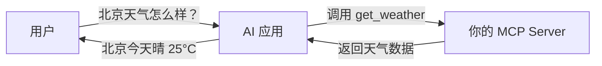
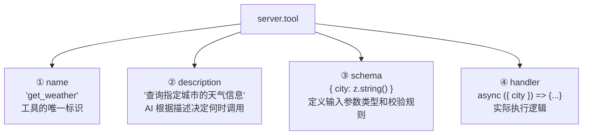

# MCP 实战开发（Building MCP Server）

> 阅读本文之前，建议先阅读 [MCP概述](./MCP概述.md) 和 [MCP工作原理](./MCP工作原理.md)。

## 我们要做什么？

这篇文档将带你从零实现一个 MCP Server，让 AI 能够通过它查询城市的天气信息。

最终效果：用户对 AI 说"北京天气怎么样"，AI 通过你写的 MCP Server 获取天气数据并回答。



## 技术选型

MCP 官方提供了两个 SDK：

| SDK | 语言 | 包名 |
|-----|------|------|
| TypeScript SDK | TypeScript/Node.js | `@modelcontextprotocol/sdk` |
| Python SDK | Python | `mcp` |

本文使用 **TypeScript SDK**，因为它文档最完善、社区最活跃。

## 第一步：初始化项目

```bash
# 创建项目目录
mkdir my-weather-mcp && cd my-weather-mcp

# 初始化 Node.js 项目
npm init -y

# 安装依赖
npm install @modelcontextprotocol/sdk zod
npm install -D typescript @types/node tsx
```

各依赖的作用：

| 包名 | 作用 |
|------|------|
| `@modelcontextprotocol/sdk` | MCP 官方 SDK，核心库 |
| `zod` | 参数校验库，定义工具的输入参数类型 |
| `typescript` | TypeScript 编译器 |
| `tsx` | 直接运行 TypeScript 文件 |

## 第二步：创建 MCP Server

创建 `src/index.ts`，这是我们 Server 的入口文件：

```typescript
import { McpServer } from "@modelcontextprotocol/sdk/server/mcp.js";
import { StdioServerTransport } from "@modelcontextprotocol/sdk/server/stdio.js";
import { z } from "zod";

// 1️⃣ 创建 MCP Server 实例
const server = new McpServer({
  name: "weather-server",
  version: "1.0.0",
});
```

这段代码做了什么？

- 导入 SDK 提供的 `McpServer` 类
- 导入 `StdioServerTransport`——我们用 stdio 方式通信（本地运行）
- 创建一个 Server 实例，给它起个名字和版本号

## 第三步：注册 Tool（工具）

这是最核心的部分——定义 AI 可以调用的工具：

```typescript
// 模拟天气数据（实际项目中会调用真实 API）
const weatherData: Record<string, { temp: number; condition: string }> = {
  "北京": { temp: 25, condition: "晴" },
  "上海": { temp: 28, condition: "多云" },
  "广州": { temp: 32, condition: "阵雨" },
  "深圳": { temp: 30, condition: "晴转多云" },
};

// 2️⃣ 注册一个"查询天气"的工具
server.tool(
  "get_weather",                          // 工具名称
  "查询指定城市的天气信息",                   // 工具描述（AI 靠这个判断何时调用）
  { city: z.string().describe("城市名称") }, // 参数定义（Zod Schema）
  async ({ city }) => {                    // 处理函数
    const weather = weatherData[city];

    if (!weather) {
      return {
        content: [{ type: "text", text: `抱歉，暂不支持查询「${city}」的天气` }],
      };
    }

    return {
      content: [{
        type: "text",
        text: `${city}天气：${weather.condition}，温度 ${weather.temp}°C`,
      }],
    };
  }
);
```

### 工具注册的四个参数



> **重点**：`description` 非常关键！AI 模型就是靠这段描述来判断什么时候应该调用这个工具的。描述写得越清晰、越准确，AI 的工具选择就越精准。

## 第四步：注册 Resource（资源）

除了工具，我们还可以提供资源——让 AI 能读取的数据：

```typescript
// 3️⃣ 注册一个资源：支持的城市列表
server.resource(
  "supported-cities",                     // 资源标识
  "weather://cities",                     // 资源 URI
  async (uri) => ({
    contents: [{
      uri: uri.href,
      mimeType: "application/json",
      text: JSON.stringify({
        cities: Object.keys(weatherData),
        description: "当前支持查询天气的城市列表"
      }),
    }],
  })
);
```

## 第五步：启动 Server

```typescript
// 4️⃣ 连接传输层并启动
async function main() {
  const transport = new StdioServerTransport();
  await server.connect(transport);
  console.error("Weather MCP Server 已启动"); // stderr 输出日志
}

main();
```

> 注意：日志输出用 `console.error`（stderr），因为 stdout 被 MCP 协议通信占用了。

## 完整代码

把上面的代码片段合在一起，就是完整的 `src/index.ts`：

```typescript
import { McpServer } from "@modelcontextprotocol/sdk/server/mcp.js";
import { StdioServerTransport } from "@modelcontextprotocol/sdk/server/stdio.js";
import { z } from "zod";

const server = new McpServer({
  name: "weather-server",
  version: "1.0.0",
});

const weatherData: Record<string, { temp: number; condition: string }> = {
  "北京": { temp: 25, condition: "晴" },
  "上海": { temp: 28, condition: "多云" },
  "广州": { temp: 32, condition: "阵雨" },
  "深圳": { temp: 30, condition: "晴转多云" },
};

server.tool(
  "get_weather",
  "查询指定城市的天气信息",
  { city: z.string().describe("城市名称") },
  async ({ city }) => {
    const weather = weatherData[city];
    if (!weather) {
      return {
        content: [{ type: "text", text: `抱歉，暂不支持查询「${city}」的天气` }],
      };
    }
    return {
      content: [{
        type: "text",
        text: `${city}天气：${weather.condition}，温度 ${weather.temp}°C`,
      }],
    };
  }
);

server.resource(
  "supported-cities",
  "weather://cities",
  async (uri) => ({
    contents: [{
      uri: uri.href,
      mimeType: "application/json",
      text: JSON.stringify({
        cities: Object.keys(weatherData),
        description: "当前支持查询天气的城市列表",
      }),
    }],
  })
);

async function main() {
  const transport = new StdioServerTransport();
  await server.connect(transport);
  console.error("Weather MCP Server 已启动");
}

main();
```

## 第六步：配置到 AI 应用中

### 在 Claude Desktop 中使用

编辑 Claude Desktop 的配置文件 `claude_desktop_config.json`：

```json
{
  "mcpServers": {
    "weather": {
      "command": "npx",
      "args": ["tsx", "/你的项目路径/src/index.ts"]
    }
  }
}
```

### 在 Cursor 中使用

在项目根目录创建 `.cursor/mcp.json`：

```json
{
  "mcpServers": {
    "weather": {
      "command": "npx",
      "args": ["tsx", "/你的项目路径/src/index.ts"]
    }
  }
}
```

配置完成后，重启 AI 应用，它就能发现并使用你的天气查询工具了。

## 进阶：添加 HTTP 传输支持

如果你想让 Server 支持远程访问，可以使用 Streamable HTTP 传输：

```typescript
import { StreamableHTTPServerTransport } from "@modelcontextprotocol/sdk/server/streamableHttp.js";
import express from "express";

const app = express();
app.use(express.json());

app.post("/mcp", async (req, res) => {
  const transport = new StreamableHTTPServerTransport({
    sessionIdGenerator: () => crypto.randomUUID(),
  });
  await server.connect(transport);
  await transport.handleRequest(req, res);
});

app.listen(3000, () => {
  console.log("MCP HTTP Server 运行在 http://localhost:3000");
});
```

## 开发调试技巧

### 1. 使用 MCP Inspector

MCP 官方提供了一个调试工具 `@modelcontextprotocol/inspector`，可以可视化地测试你的 Server：

```bash
npx @modelcontextprotocol/inspector npx tsx src/index.ts
```

它会打开一个 Web 界面，让你：
- 查看 Server 暴露的所有工具和资源
- 手动调用工具并查看返回结果
- 查看完整的 JSON-RPC 消息日志

### 2. 日志调试

始终使用 `console.error()` 输出调试日志，因为 `console.log()` 的输出会干扰 MCP 协议通信。

## 常见问题

### Q：工具的 description 怎么写才好？
**A**：像给同事写接口文档一样——说清楚这个工具**做什么**、**什么时候该用**、**参数是什么含义**。AI 模型完全依赖描述来理解工具的用途。

### Q：一个 Server 可以注册多少个工具？
**A**：没有硬性限制，但建议按职责拆分——一个 Server 聚焦一个领域。比如 GitHub Server 只做 GitHub 相关操作，天气 Server 只做天气查询。

### Q：Tool 和 Resource 有什么区别？
**A**：Tool 是"动作"（做某事），Resource 是"数据"（读某物）。Tool 可能有副作用（比如创建文件），Resource 是只读的。

## 总结

| 步骤 | 内容 |
|------|------|
| ① 初始化 | `npm install @modelcontextprotocol/sdk zod` |
| ② 创建 Server | `new McpServer({ name, version })` |
| ③ 注册工具 | `server.tool(name, desc, schema, handler)` |
| ④ 注册资源 | `server.resource(name, uri, handler)` |
| ⑤ 启动传输 | `new StdioServerTransport()` + `server.connect()` |
| ⑥ 配置使用 | 在 AI 应用中配置 Server 路径 |

> 想了解 MCP 面试常见问题？请阅读 [MCP面试指南](./MCP面试指南.md)

---
_本文档将持续更新，添加更多相关内容_
