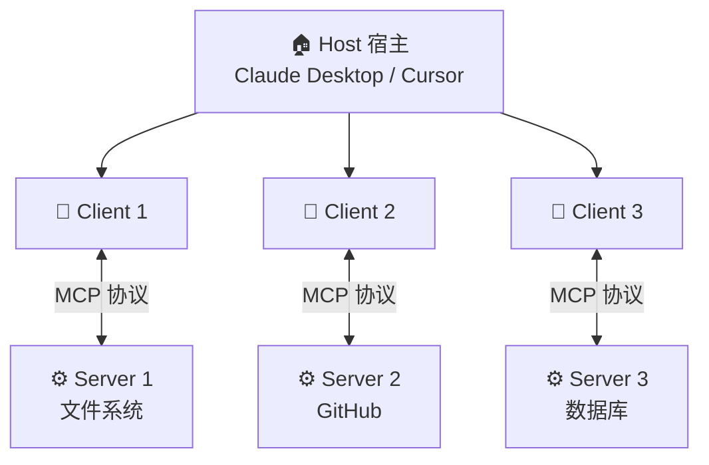
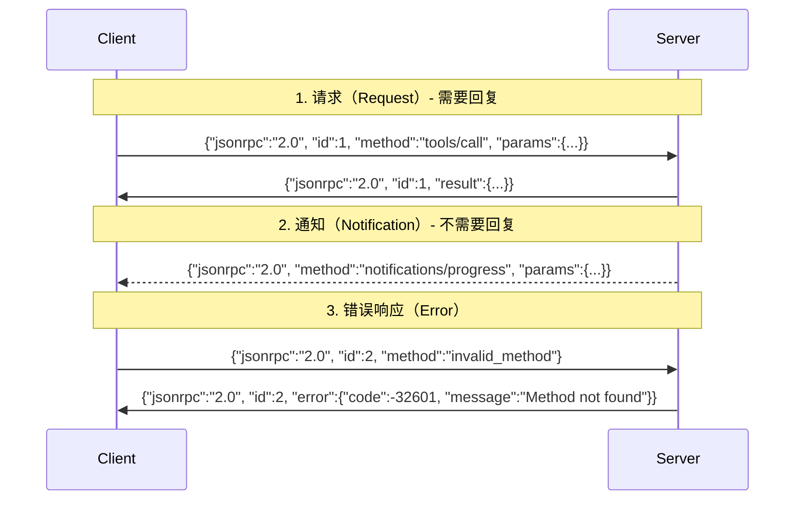
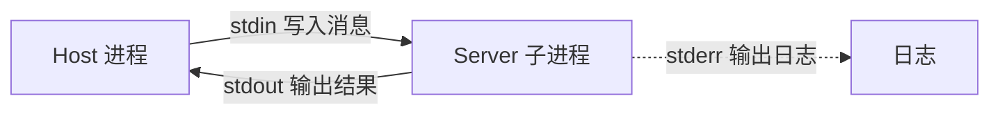
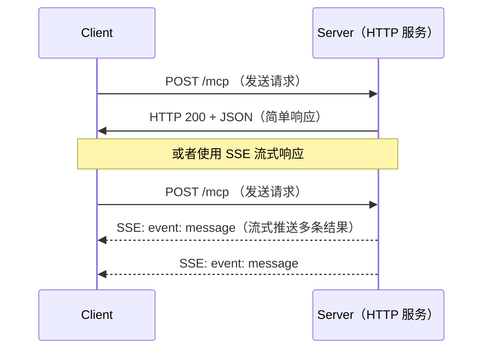
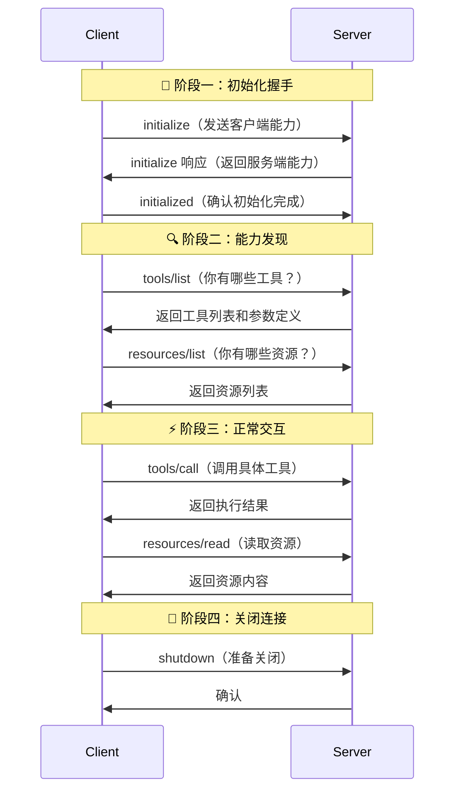
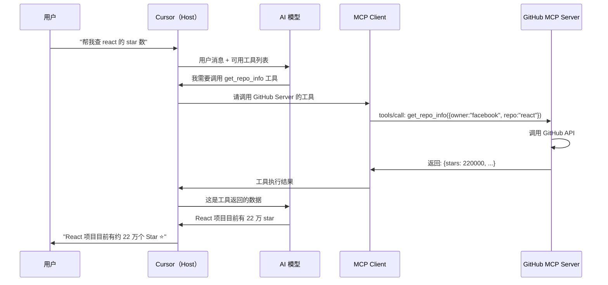

# MCP 工作原理（How MCP Works）

> 阅读本文之前，建议先阅读 [MCP概述](./MCP概述.md) 了解基本概念。

## 核心架构：三个角色

MCP 的架构非常清晰，就像一个**餐厅的运作模式**：

| MCP 角色 | 餐厅类比 | 职责 |
|----------|----------|------|
| **Host（宿主）** | 餐厅经理 | AI 应用本身，比如 Claude Desktop、Cursor |
| **Client（客户端）** | 服务员 | 宿主内部的组件，负责与 Server 通信 |
| **Server（服务端）** | 厨师 | 独立的程序，提供具体的工具和数据 |

### 关键关系

- 一个 Host 可以连接**多个** Server（餐厅可以有多个厨师）
- 每个 Server 对应**一个** Client（每个厨师配一个专属服务员）
- Client 和 Server 之间是 **1:1 的连接**



## 通信协议：JSON-RPC 2.0

MCP 底层使用 **JSON-RPC 2.0** 作为消息格式。这是一个轻量级的远程过程调用协议。

### 什么是 JSON-RPC？

你可以把它理解为**写信的格式规范**：

- 每封信必须有固定的格式（信封、地址、正文）
- 发信人写"请求信"，收信人回"响应信"
- 每封信都有唯一编号，确保一一对应

### 三种消息类型



### 实际消息示例

当 AI 想调用一个"查询天气"的工具时，完整的消息交互如下：

**Client → Server（请求调用工具）：**
```json
{
  "jsonrpc": "2.0",
  "id": 1,
  "method": "tools/call",
  "params": {
    "name": "get_weather",
    "arguments": {
      "city": "北京"
    }
  }
}
```

**Server → Client（返回结果）：**
```json
{
  "jsonrpc": "2.0",
  "id": 1,
  "result": {
    "content": [
      {
        "type": "text",
        "text": "北京今天晴，气温 25°C，空气质量良好"
      }
    ]
  }
}
```

## 传输层：消息如何传递？

MCP 协议支持两种主要的传输方式，适用于不同场景：

### 1. stdio（标准输入输出）

> 适用场景：**本地工具**

原理非常简单——Host 把 Server 作为**子进程**启动，通过进程的标准输入（stdin）和标准输出（stdout）传递消息。



**生活类比**：就像你在家里对着隔壁房间的人喊话。人就在旁边，直接喊就行，不需要打电话。

**特点**：
- 启动快，延迟低
- 不需要网络
- Server 的生命周期由 Host 管理
- 消息以**换行符**分隔

### 2. Streamable HTTP（可流式 HTTP）

> 适用场景：**远程服务**

Server 作为独立的 HTTP 服务运行，Client 通过 HTTP 请求与之通信。支持 SSE（Server-Sent Events）实现服务端推送。



**生活类比**：就像打电话给远方的朋友。你需要拨号（HTTP 请求），朋友可以一句话回答你（普通响应），也可以一直跟你聊（SSE 流式推送）。

**特点**：
- 支持远程访问
- 可以处理多个客户端
- 支持身份认证
- 需要考虑网络安全

### 两种传输方式对比

| 特性 | stdio | Streamable HTTP |
|------|-------|-----------------|
| 部署方式 | 本地子进程 | 独立 HTTP 服务 |
| 网络需求 | 不需要 | 需要 |
| 延迟 | 极低 | 取决于网络 |
| 多客户端 | 不支持 | 支持 |
| 安全性 | 进程隔离 | 需要认证 |
| 适用场景 | 本地开发工具 | 云端服务、团队共享 |

## 完整生命周期

一次 MCP 连接从建立到结束，经历以下阶段：



### 各阶段详解

#### 阶段一：初始化握手

就像两个人初次见面先自我介绍：
- Client 告诉 Server："我是 Cursor，我支持这些功能……"
- Server 回应："我是 GitHub Server，我能提供这些工具……"
- 双方确认彼此的**能力（Capabilities）**，协商好后续的交互规则

#### 阶段二：能力发现

Client 询问 Server 具体有哪些可用的工具和资源：
- 每个工具都有**名称、描述、参数定义**（JSON Schema）
- AI 模型根据这些描述来判断什么时候该调用哪个工具

#### 阶段三：正常交互

这是核心的工作阶段，AI 根据用户的需求调用工具、读取资源。

#### 阶段四：关闭连接

任务结束后优雅地关闭连接，释放资源。

## 一次完整的工具调用流程

让我们用一个具体例子来走一遍完整流程：

> 场景：用户在 Cursor 中说"帮我查一下 GitHub 上 react 项目的 star 数量"



### 关键点

1. **AI 模型决定是否调用工具**——不是用户直接指定的
2. **Host 负责编排**——协调 AI 模型和 MCP Client 之间的交互
3. **Server 只负责执行**——接收请求，返回结果，不关心上层逻辑
4. **结果回传给 AI 模型**——由模型整合数据后生成自然语言回复

## 总结

| 要点 | 内容 |
|------|------|
| **架构模型** | Host → Client → Server（三层） |
| **消息格式** | JSON-RPC 2.0 |
| **传输方式** | stdio（本地） / Streamable HTTP（远程） |
| **连接生命周期** | 初始化 → 能力发现 → 正常交互 → 关闭 |
| **核心流程** | 用户 → Host → AI 模型 → Client → Server → 原路返回 |

> 想动手实现一个 MCP Server？请阅读 [MCP实战开发](./MCP实战开发.md)

---
_本文档将持续更新，添加更多相关内容_
