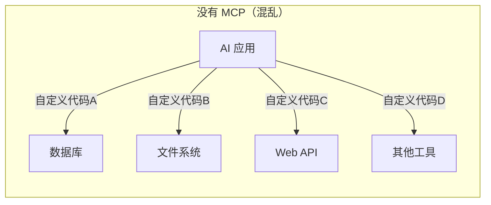
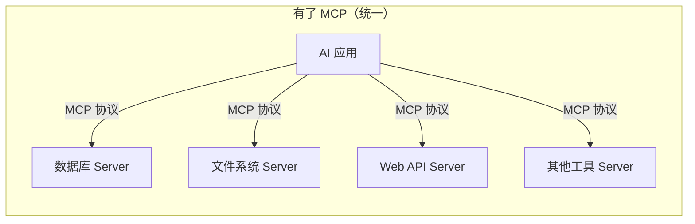
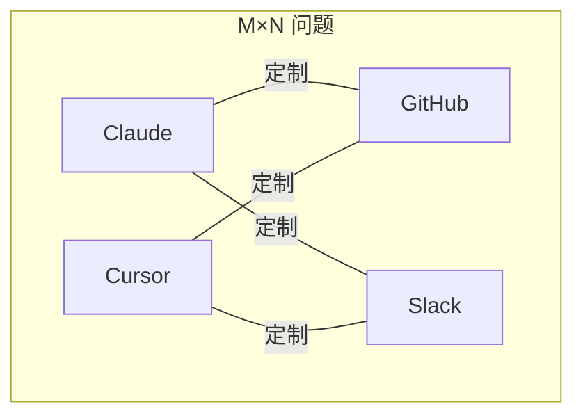
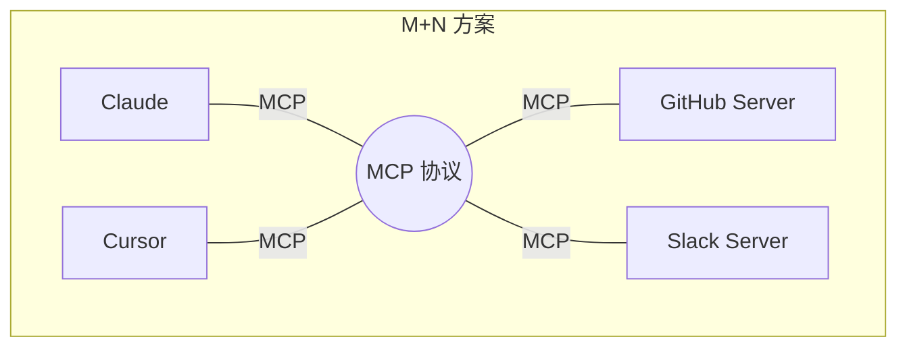
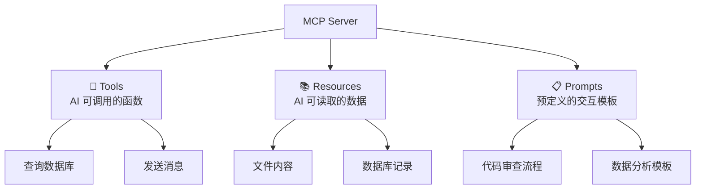

# MCP 概述（Model Context Protocol，模型上下文协议）

## 什么是 MCP？

### 定义

MCP（Model Context Protocol，模型上下文协议）是由 Anthropic 在 2024 年 11 月发布的一个**开放标准协议**，它定义了 AI 应用与外部工具、数据源之间的通信规范。

简单来说：**MCP 就是 AI 世界的"USB-C 接口"**。

### 通俗理解

想象一下这个场景：

你有一台笔记本电脑（AI 模型），你想让它连接显示器、键盘、U 盘、手机……

- **没有 USB-C 之前**：每个设备都有自己独特的接口——HDMI、VGA、Lightning、Micro USB……你需要一堆不同的转接头。
- **有了 USB-C 之后**：一个接口搞定所有设备，统一标准，即插即用。

MCP 做的就是同样的事情，只不过对象从硬件变成了软件：

- **没有 MCP 之前**：AI 想调用数据库？写一套代码。想读文件？再写一套。想调 API？又写一套。每个集成都是定制的，维护成本极高。
- **有了 MCP 之后**：所有工具和数据源都按同一个协议接入，AI 应用只需要"懂 MCP"就能连接任何工具。

## MCP 解决了什么问题？

### 痛点：AI 集成的 "M×N 问题"

假设市场上有 **M 个 AI 应用**（Claude、ChatGPT、Cursor、各种 Agent 框架……），有 **N 个外部工具**（GitHub、数据库、Slack、日历……）。

- **没有统一协议**：需要 M × N 个定制集成，每个 AI 应用都要为每个工具单独开发适配器。
- **有了 MCP**：只需要 M + N 个实现——每个 AI 应用实现一次 MCP Client，每个工具实现一次 MCP Server。

### MCP 带来的核心价值

| 价值 | 说明 |
|------|------|
| **标准化** | 一套协议通吃所有集成，告别碎片化 |
| **可复用** | 一个 MCP Server 写好后，所有支持 MCP 的 AI 应用都能用 |
| **安全性** | 协议层面内置权限控制，工具调用需要明确授权 |
| **生态效应** | 开放标准意味着社区可以共建丰富的工具生态 |

## MCP 的三大核心能力

MCP Server 可以向 AI 暴露三种能力：

### 1. Tools（工具）
> AI **可以调用**的函数

类比：遥控器上的按钮——AI 按下按钮，触发一个动作。

- 查询数据库
- 发送消息
- 创建文件
- 调用第三方 API

### 2. Resources（资源）
> AI **可以读取**的数据

类比：书架上的书——AI 可以翻阅查找信息，但不能修改。

- 文件内容
- 数据库记录
- 实时数据流
- 配置信息

### 3. Prompts（提示模板）
> 预定义的**交互模板**

类比：菜谱——预先设计好的操作流程，AI 按步骤执行。

- 代码审查流程
- 数据分析报告模板
- 多步骤工作流

## MCP 生态现状

### 谁在用 MCP？

| 类别 | 产品 |
|------|------|
| **AI 助手** | Claude Desktop、Cursor、Windsurf |
| **开发工具** | Zed、Replit、Codeium、Sourcegraph |
| **企业应用** | Block、Apollo 等 |

### 社区生态

MCP 发布后，社区迅速涌现了大量 MCP Server 实现，覆盖了：
- 文件系统操作
- Git / GitHub 集成
- 数据库查询（PostgreSQL、MySQL、SQLite）
- 搜索引擎（Brave Search、Google Search）
- 消息平台（Slack、Discord）
- 更多……

## 总结

| 要点 | 内容 |
|------|------|
| **是什么** | AI 应用连接外部工具的开放标准协议 |
| **核心比喻** | AI 世界的 USB-C 接口 |
| **解决的问题** | M×N 集成问题 → M+N |
| **三大能力** | Tools（工具）、Resources（资源）、Prompts（提示模板） |
| **协议基础** | 基于 JSON-RPC 2.0 |
| **发起者** | Anthropic（2024 年 11 月） |

> 想深入了解 MCP 的架构和通信机制？请阅读 [MCP工作原理](./MCP工作原理.md)

---
_本文档将持续更新，添加更多相关内容_
