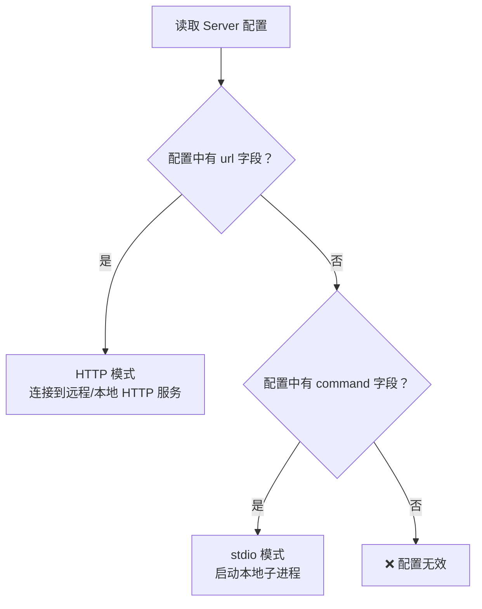
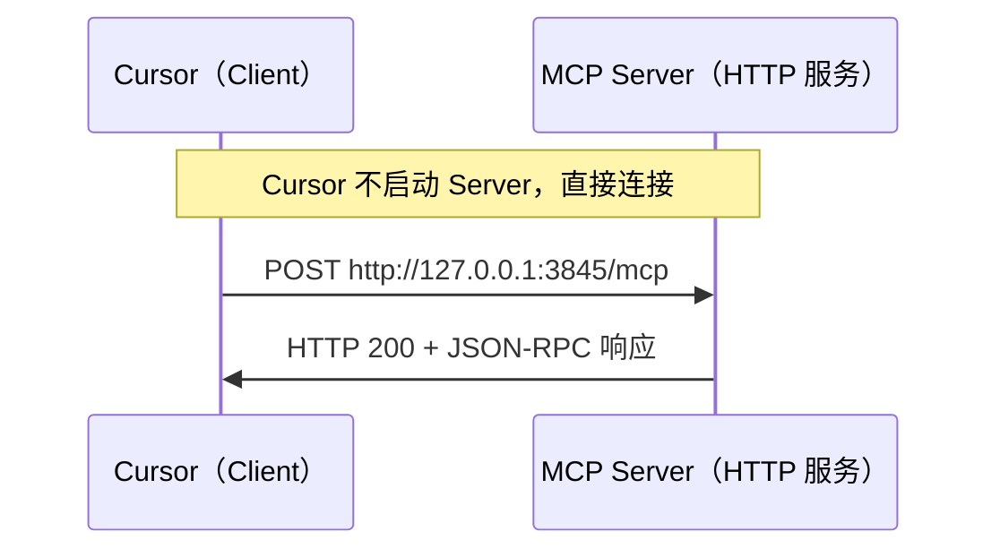
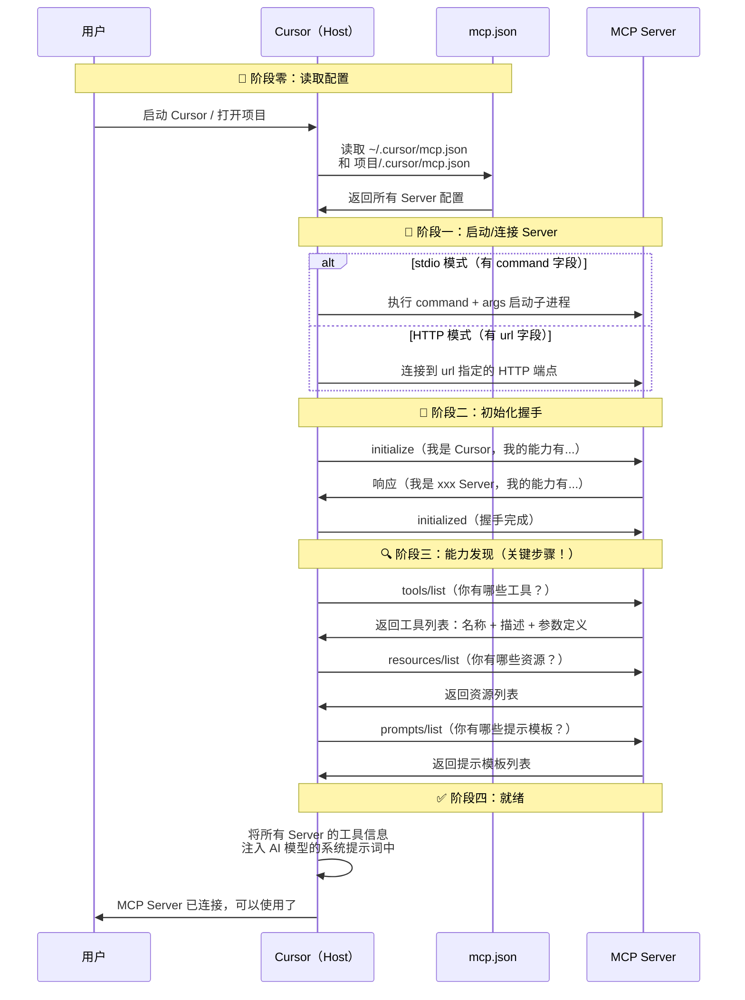

# MCP 配置指南（MCP Configuration Guide）

> 阅读本文之前，建议先阅读 [MCP概述](./MCP概述.md) 和 [MCP工作原理](./MCP工作原理.md)。

## 这篇文档解决什么问题？

当你在 Cursor（或 Claude Desktop）中配置好 `mcp.json` 后，可能会有这些疑问：

- `command`、`args`、`env` 这些字段到底是干啥的？
- 我没写是 stdio 还是 HTTP，Cursor 怎么知道用哪种传输方式？
- 配置完之后，Cursor 是怎么自动发现 MCP Server 有哪些能力的？

本文将逐一解答。

## 配置文件在哪？

MCP 配置文件有两个可能的位置：

| 位置 | 路径 | 作用范围 |
|------|------|----------|
| **全局配置** | `~/.cursor/mcp.json` | 所有项目通用 |
| **项目配置** | `项目根目录/.cursor/mcp.json` | 仅当前项目生效 |

两者格式完全一样，项目级配置会和全局配置**合并**使用。如果同名 Server 冲突，项目级配置优先。

## 配置文件整体结构

```json
{
  "mcpServers": {
    "server名称": {
      // 具体配置...
    },
    "另一个server": {
      // 具体配置...
    }
  }
}
```

`mcpServers` 是唯一的顶层字段，它是一个对象，**key 是你给 Server 起的名字**（随便起，用于标识），**value 是该 Server 的具体配置**。

## 两种配置模式（传输方式自动推断）

这是很多人困惑的核心点：**你不需要显式声明传输方式（stdio 或 HTTP），Cursor 根据你写了哪些字段来自动判断。**

### 判断规则



简单来说：
- **写了 `url`** → HTTP 模式（连接到一个已经在运行的服务）
- **写了 `command`** → stdio 模式（Cursor 帮你启动一个子进程）

两种模式不会同时存在，一个 Server 配置只能选其一。

## 模式一：stdio 模式（本地子进程）

### 适用场景

本地安装的 MCP Server，Cursor 帮你启动，用完自动关闭。

### 可用字段

| 字段 | 类型 | 必填 | 说明 |
|------|------|------|------|
| `command` | string | ✅ | 要执行的命令（可执行文件路径或命令名） |
| `args` | string[] | ❌ | 传给命令的参数列表 |
| `env` | object | ❌ | 注入的环境变量（key-value 形式） |

### 工作原理

Cursor 拿到这个配置后，相当于在终端执行了：

```bash
ENV_KEY1=value1 ENV_KEY2=value2 command arg1 arg2 arg3
```

然后通过这个子进程的 **stdin**（标准输入）和 **stdout**（标准输出）进行 MCP 协议通信。

### 生活类比

就像你在手机上点开一个 App：

- `command` = 点开哪个 App（可执行文件）
- `args` = 打开时带的参数（比如"打开微信并跳转到扫一扫"）
- `env` = App 运行时需要的配置（比如登录凭证、服务器地址）

### 用你的配置举例

#### 例子 1：torna-mcp

```json
{
  "torna-mcp": {
    "command": "torna-mcp",
    "args": ["start"],
    "env": {
      "NODE_ENV": "production",
      "TORNA_API_URL": "https://torna.hewa.cn/api",
      "TORNA_API_TOKEN": "WL2ya2mA:eyJhbGci...",
      "TORNA_PROJECT_ID": "p58pNvz3"
    }
  }
}
```

Cursor 实际执行的等效操作：

```bash
NODE_ENV=production \
TORNA_API_URL=https://torna.hewa.cn/api \
TORNA_API_TOKEN=WL2ya2mA:eyJhbGci... \
TORNA_PROJECT_ID=p58pNvz3 \
torna-mcp start
```

各字段解读：

| 字段 | 值 | 含义 |
|------|-----|------|
| `command` | `"torna-mcp"` | 执行系统中安装的 `torna-mcp` 命令（需要全局安装或在 PATH 中） |
| `args` | `["start"]` | 给命令传递 `start` 参数，表示启动服务 |
| `env.NODE_ENV` | `"production"` | 告诉程序以生产模式运行 |
| `env.TORNA_API_URL` | `"https://..."` | Torna API 的服务器地址 |
| `env.TORNA_API_TOKEN` | `"WL2ya2mA:..."` | 访问 Torna API 的认证令牌 |
| `env.TORNA_PROJECT_ID` | `"p58pNvz3"` | 指定要操作的 Torna 项目 |

#### 例子 2：context7（用 npx 临时安装并运行）

```json
{
  "context7": {
    "command": "npx",
    "args": ["-y", "@upstash/context7-mcp@latest"]
  }
}
```

Cursor 实际执行：

```bash
npx -y @upstash/context7-mcp@latest
```

| 字段 | 值 | 含义 |
|------|-----|------|
| `command` | `"npx"` | 使用 Node.js 的 npx 工具 |
| `args[0]` | `"-y"` | 自动确认安装提示（yes），跳过交互 |
| `args[1]` | `"@upstash/context7-mcp@latest"` | 要运行的 npm 包名及版本 |

> **小知识**：`npx` 是 Node.js 自带的工具，它会**临时下载并运行**一个 npm 包，不需要你手动全局安装。这就是为什么很多 MCP Server 配置都用 `npx` 作为 command —— 方便，不污染全局环境。

#### 例子 3：memory（用绝对路径指定命令）

```json
{
  "memory": {
    "command": "/Users/mac/.local/bin/uv",
    "args": [
      "run",
      "--directory", "/Users/mac/Desktop/AI/Mcp/mcp-memory-service",
      "memory", "server"
    ],
    "env": {
      "MCP_MEMORY_STORAGE_BACKEND": "sqlite_vec"
    }
  }
}
```

Cursor 实际执行：

```bash
MCP_MEMORY_STORAGE_BACKEND=sqlite_vec \
/Users/mac/.local/bin/uv run \
  --directory /Users/mac/Desktop/AI/Mcp/mcp-memory-service \
  memory server
```

| 字段 | 值 | 含义 |
|------|-----|------|
| `command` | `"/Users/mac/.local/bin/uv"` | 使用绝对路径指定 Python 包管理工具 `uv` |
| `args` | `["run", "--directory", "...", "memory", "server"]` | 在指定目录下运行 memory 的 server 子命令 |
| `env` | `{ "MCP_MEMORY_STORAGE_BACKEND": "sqlite_vec" }` | 告诉程序使用 sqlite_vec 作为存储后端 |

### command 的三种写法

| 写法 | 示例 | 说明 |
|------|------|------|
| **命令名** | `"torna-mcp"` | 系统 PATH 中能找到的命令（需已安装） |
| **工具命令** | `"npx"` | 借助 npx/uvx 等工具来运行包 |
| **绝对路径** | `"/Users/mac/.local/bin/uv"` | 直接指定可执行文件的完整路径 |

## 模式二：HTTP 模式（连接远程/本地 HTTP 服务）

### 适用场景

MCP Server 已经作为一个 HTTP 服务在运行（可能在本机，也可能在远程服务器），你只需要告诉 Cursor 去哪里连它。

### 可用字段

| 字段 | 类型 | 必填 | 说明 |
|------|------|------|------|
| `url` | string | ✅ | MCP Server 的 HTTP 端点地址 |
| `headers` | object | ❌ | 自定义 HTTP 请求头（用于认证等） |

### 用你的配置举例

#### 例子：Figma

```json
{
  "Figma": {
    "url": "http://127.0.0.1:3845/mcp",
    "headers": {}
  }
}
```

| 字段 | 值 | 含义 |
|------|-----|------|
| `url` | `"http://127.0.0.1:3845/mcp"` | Figma MCP Server 运行在本机 3845 端口，路径是 `/mcp` |
| `headers` | `{}` | 无需额外请求头（该服务不需要认证） |

这种模式下 Cursor **不会帮你启动服务**，你需要自己确保 Figma MCP Server 已经在运行。Cursor 只是去连接它。

### HTTP 模式的通信流程



### 两种模式对比总结

| 对比项 | stdio 模式 | HTTP 模式 |
|--------|-----------|-----------|
| **关键字段** | `command` + `args` | `url` |
| **谁启动 Server** | Cursor 自动启动 | 你手动启动（或后台服务） |
| **Server 生命周期** | 跟随 Cursor，Cursor 关了 Server 也关 | 独立运行，Cursor 关了 Server 还在 |
| **需要网络吗** | 不需要 | 需要（哪怕是 localhost） |
| **典型场景** | npm 包、本地脚本 | Docker 服务、远程 API、已有 HTTP 服务 |

## Cursor 如何自动发现 MCP 能力？（核心机制）

这是你问的最关键的问题：**配置好 mcp.json 之后，Cursor 怎么就知道能用哪些函数了？**

答案是：**MCP 协议本身就定义了"能力发现"机制，Cursor 会在连接时主动询问。**

### 完整流程图



### 各阶段详细说明

#### 阶段零：读取配置文件

Cursor 在启动时（或配置文件变更时）会：
1. 读取全局配置 `~/.cursor/mcp.json`
2. 读取项目配置 `项目/.cursor/mcp.json`
3. 合并两份配置，遍历每个 Server

#### 阶段一：启动或连接

根据配置字段判断传输方式：
- 有 `command` → 执行命令，启动子进程，通过 stdin/stdout 通信
- 有 `url` → 直接发 HTTP 请求去连接

#### 阶段二：初始化握手

双方交换"名片"，报告各自的协议版本和支持的能力。

#### 阶段三：能力发现（这就是"自动知道有哪些函数"的秘密）

这一步是关键。Cursor 发送 `tools/list` 请求，Server 会返回类似这样的数据：

```json
{
  "tools": [
    {
      "name": "get_weather",
      "description": "查询指定城市的天气信息",
      "inputSchema": {
        "type": "object",
        "properties": {
          "city": {
            "type": "string",
            "description": "城市名称"
          }
        },
        "required": ["city"]
      }
    },
    {
      "name": "search_repo",
      "description": "在 GitHub 上搜索代码仓库",
      "inputSchema": {
        "type": "object",
        "properties": {
          "query": { "type": "string", "description": "搜索关键词" },
          "language": { "type": "string", "description": "编程语言筛选" }
        },
        "required": ["query"]
      }
    }
  ]
}
```

每个工具都有三个关键信息：
- **name**：工具名称（调用时的标识）
- **description**：功能描述（AI 模型靠这个判断什么时候用）
- **inputSchema**：参数定义（JSON Schema 格式，告诉 AI 要传什么参数）

#### 阶段四：注入 AI 模型

Cursor 拿到所有 Server 的工具信息后，将这些信息**拼接到发给 AI 模型的系统提示词中**。

所以当你和 AI 对话时，AI 模型实际上看到的是类似这样的上下文：

```
你有以下工具可以使用：

1. [torna-mcp] get_api_list - 获取项目的 API 接口列表
2. [torna-mcp] get_api_detail - 获取指定 API 的详细信息
3. [GitHub] search_repos - 在 GitHub 上搜索仓库
4. [GitHub] create_issue - 创建 GitHub Issue
5. [context7] resolve_library - 解析第三方库文档
...
```

AI 模型根据**用户的问题**和**工具的描述**，自主判断是否需要调用某个工具。这就是你没有手动告诉 AI"去用哪个函数"，它却能自动调用的原因。

### 一句话总结这个机制

> **配置文件告诉 Cursor "去哪里找 Server"，MCP 协议让 Cursor "问 Server 能做什么"，AI 模型自己判断 "什么时候该用"。**

## 你的 mcp.json 完整解读

把你的配置文件完整标注一遍：

```json
{
  "mcpServers": {

    "Figma": {
      // 🔵 HTTP 模式：连接本地已运行的 Figma MCP 服务
      "url": "http://127.0.0.1:3845/mcp",
      "headers": {}
    },

    "task-master-ai": {
      // 🟢 stdio 模式：用 npx 临时安装并运行 task-master-ai
      "command": "npx",
      "args": ["-y", "task-master-ai"],
      "env": {
        "OPENROUTER_API_KEY": "sk-or-v1-..."  // AI 路由服务的 API 密钥
      }
    },

    "context7": {
      // 🟢 stdio 模式：用 npx 运行 context7 文档查询服务
      "command": "npx",
      "args": ["-y", "@upstash/context7-mcp@latest"]
      // 无需环境变量
    },

    "torna-mcp": {
      // 🟢 stdio 模式：运行本地安装的 torna-mcp 命令
      "command": "torna-mcp",
      "args": ["start"],
      "env": {
        "NODE_ENV": "production",               // 运行模式
        "TORNA_API_URL": "https://torna.hewa.cn/api",  // API 地址
        "TORNA_API_TOKEN": "WL2ya2mA:eyJ...",   // 认证令牌
        "TORNA_PROJECT_ID": "p58pNvz3"          // 项目 ID
      }
    },

    "GitHub": {
      // 🟢 stdio 模式：用 npx 运行官方 GitHub MCP Server
      "command": "npx",
      "args": ["-y", "@modelcontextprotocol/server-github@latest"],
      "env": {
        "GITHUB_PERSONAL_ACCESS_TOKEN": "ghp_..."  // GitHub 个人访问令牌
      }
    },

    "Chrome DevTools": {
      // 🟢 stdio 模式：Chrome 开发者工具 MCP
      "command": "npx chrome-devtools-mcp@latest",
      "env": {},
      "args": []
    },

    "memory": {
      // 🟢 stdio 模式：使用 uv (Python 工具) 运行记忆服务
      "command": "/Users/mac/.local/bin/uv",
      "args": [
        "run",
        "--directory", "/Users/mac/Desktop/AI/Mcp/mcp-memory-service",
        "memory", "server"
      ],
      "env": {
        "MCP_MEMORY_STORAGE_BACKEND": "sqlite_vec"  // 存储引擎选择
      }
    }
  }
}
```

## env 字段的作用和安全注意事项

`env` 中的环境变量会在 Server 进程启动时注入，常见用途：

| 常见用途 | 示例 |
|----------|------|
| **API 密钥** | `GITHUB_PERSONAL_ACCESS_TOKEN`、`OPENROUTER_API_KEY` |
| **服务地址** | `TORNA_API_URL` |
| **运行模式** | `NODE_ENV` |
| **功能配置** | `MCP_MEMORY_STORAGE_BACKEND` |

> ⚠️ **安全提醒**：`mcp.json` 中通常包含 API 密钥等敏感信息。如果你把项目级的 `.cursor/mcp.json` 放在 Git 仓库里，**务必将其添加到 `.gitignore`**，避免密钥泄露。全局配置（`~/.cursor/mcp.json`）因为不在项目目录中，相对安全一些。

## 常见问题

### Q：command 写的命令找不到怎么办？

确保命令在系统 PATH 中可用。可以在终端中先手动执行一下：

```bash
which torna-mcp    # 看看命令装在哪
npx -y @upstash/context7-mcp@latest  # 看看能否正常运行
```

如果命令不在 PATH 中，使用**绝对路径**（像 memory 那个例子那样）。

### Q：配置完后 Cursor 没有识别到 Server？

1. 保存 `mcp.json` 后，需要**重新加载** Cursor（`Cmd+Shift+P` → `Developer: Reload Window`）
2. 检查 Cursor 设置页面中的 MCP 状态指示灯（绿色 = 正常连接）
3. 确认 JSON 格式正确（多余逗号、缺少引号等都会导致解析失败）

### Q：stdio 和 HTTP 模式怎么选？

| 情况 | 推荐模式 |
|------|----------|
| npm 包、本地脚本 | stdio（`command` + `args`） |
| Docker 容器中运行的服务 | HTTP（`url`） |
| 远程服务器上的 MCP Server | HTTP（`url`） |
| 已经在运行的后台服务 | HTTP（`url`） |
| 需要团队共享同一个 Server | HTTP（`url`） |

### Q：一个 MCP Server 挂了会影响其他的吗？

不会。Cursor 为每个 Server 创建独立的 Client 连接，一个 Server 崩溃不会影响其他 Server 正常工作。

## 总结

| 要点 | 内容 |
|------|------|
| **配置文件位置** | `~/.cursor/mcp.json`（全局）或 `项目/.cursor/mcp.json`（项目级） |
| **传输方式** | 自动推断：有 `command` → stdio，有 `url` → HTTP |
| **stdio 核心字段** | `command`（命令）、`args`（参数）、`env`（环境变量） |
| **HTTP 核心字段** | `url`（端点地址）、`headers`（请求头） |
| **能力发现机制** | 连接后 Cursor 自动调用 `tools/list` 等接口获取工具列表 |
| **AI 如何使用** | 工具信息注入系统提示词，AI 根据描述自主判断调用时机 |

> 想深入了解 MCP 如何开发一个 Server？请阅读 [MCP实战开发](./MCP实战开发.md)

---
_本文档将持续更新，添加更多相关内容_
