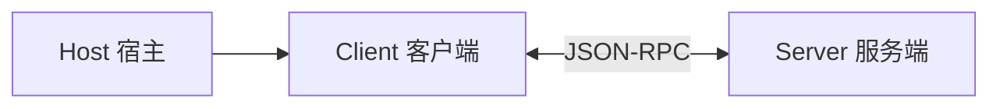
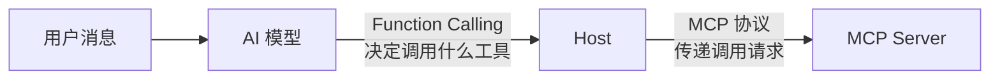
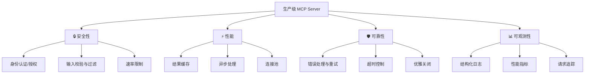

# MCP 面试指南（MCP Interview Guide）

> 本文整理了 MCP 相关的常见面试问题，从基础到进阶，帮你系统地准备面试。

## 基础概念类

### Q1：什么是 MCP？用一句话解释

**参考回答：**

MCP（Model Context Protocol）是 Anthropic 发布的开放标准协议，它为 AI 应用连接外部工具和数据源提供了统一的接口规范——就像 USB-C 统一了硬件接口一样。

**加分点：**
- 提到它解决了 M×N 集成问题
- 提到它基于 JSON-RPC 2.0
- 提到它是开源的开放标准

---

### Q2：MCP 的三大核心能力是什么？

**参考回答：**

| 能力 | 英文 | 说明 | 类比 |
|------|------|------|------|
| 工具 | Tools | AI 可以调用的函数，可能有副作用 | 遥控器按钮 |
| 资源 | Resources | AI 可以读取的数据，只读 | 书架上的书 |
| 提示模板 | Prompts | 预定义的交互模板和工作流 | 菜谱 |

**加分点：**
- 能说清 Tool 和 Resource 的区别（一个是动作，一个是数据）
- 提到 Tool 的参数使用 JSON Schema 定义

---

### Q3：MCP 的架构中有哪些角色？它们的关系是什么？

**参考回答：**

三个核心角色：



- **Host（宿主）**：AI 应用本身，如 Claude Desktop、Cursor。负责管理 Client 的生命周期。
- **Client（客户端）**：Host 内部的通信组件，每个 Client 与一个 Server 保持 1:1 连接。
- **Server（服务端）**：独立的程序，对外暴露 Tools、Resources、Prompts。

**关键点**：一个 Host 可以同时连接多个 Server，但每个连接都是通过独立的 Client 维护的。

---

### Q4：MCP 使用什么通信协议？为什么选它？

**参考回答：**

MCP 使用 **JSON-RPC 2.0**，原因：

1. **轻量级**：JSON 格式人类可读，调试方便
2. **双向通信**：支持请求-响应和通知两种模式
3. **成熟稳定**：业界广泛使用的 RPC 协议标准
4. **传输无关**：可以跑在 stdio、HTTP、WebSocket 等任何传输层之上

---

## 原理机制类

### Q5：MCP 支持哪些传输方式？各自适用什么场景？

**参考回答：**

| 传输方式 | 适用场景 | 原理 |
|----------|----------|------|
| **stdio** | 本地工具 | Host 以子进程方式启动 Server，通过 stdin/stdout 通信 |
| **Streamable HTTP** | 远程服务 | Server 作为 HTTP 服务运行，支持 SSE 流式推送 |

**深入讲解：**
- **stdio**：Client 把消息写入 Server 的 stdin，Server 把结果输出到 stdout，日志走 stderr。消息用换行符分隔。
- **Streamable HTTP**：Client 发 POST 请求到 Server 的 MCP endpoint，Server 可以返回普通 JSON 响应或 SSE 流。

**面试关键**：能说出"为什么 stdio 下日志要走 stderr"——因为 stdout 被协议通信占用了。

---

### Q6：MCP 连接的生命周期是怎样的？

**参考回答：**

四个阶段：

```
初始化握手 → 能力发现 → 正常交互 → 关闭连接
```

1. **初始化握手（Handshake）**：
   - Client 发送 `initialize` 请求，携带自身能力信息
   - Server 返回自身能力信息
   - Client 发送 `initialized` 通知确认

2. **能力发现（Discovery）**：
   - Client 调用 `tools/list` 获取工具列表
   - Client 调用 `resources/list` 获取资源列表
   - 每个工具都包含名称、描述、参数 Schema

3. **正常交互（Operation）**：
   - `tools/call` 调用工具
   - `resources/read` 读取资源

4. **关闭连接（Shutdown）**：
   - 优雅关闭，释放资源

---

### Q7：一次完整的工具调用流程是什么？

**参考回答：**

以"用户让 AI 查天气"为例：

1. 用户发送消息："北京天气怎么样？"
2. Host 将用户消息 + **可用工具列表** 发送给 AI 模型
3. AI 模型分析后决定：需要调用 `get_weather` 工具
4. Host 通知 Client 调用对应 Server 的工具
5. Client 通过 JSON-RPC 发送 `tools/call` 请求给 Server
6. Server 执行逻辑（查询天气 API），返回结果
7. 结果沿原路返回给 AI 模型
8. AI 模型根据返回数据生成自然语言回复给用户

**关键理解**：
- **AI 模型决定是否调用工具**，不是用户直接触发的
- AI 根据工具的 **description** 来判断该不该调用
- 结果需要**回传给 AI 模型**做二次处理，而不是直接展示给用户

---

## 实践开发类

### Q8：如何实现一个 MCP Server？核心步骤是什么？

**参考回答：**

五步走：

```
安装 SDK → 创建 Server → 注册工具 → 选择传输层 → 启动连接
```

核心代码框架：

```typescript
import { McpServer } from "@modelcontextprotocol/sdk/server/mcp.js";
import { StdioServerTransport } from "@modelcontextprotocol/sdk/server/stdio.js";
import { z } from "zod";

const server = new McpServer({ name: "my-server", version: "1.0.0" });

server.tool("tool_name", "工具描述", { param: z.string() }, async ({ param }) => {
  return { content: [{ type: "text", text: "结果" }] };
});

const transport = new StdioServerTransport();
await server.connect(transport);
```

**加分点**：提到参数校验用 Zod、日志走 stderr、用 MCP Inspector 调试。

---

### Q9：Tool 的 description 为什么重要？怎么写好？

**参考回答：**

Tool 的 description 是**AI 模型选择工具的唯一依据**。模型不会看你的代码实现，它只看描述文字。

**写好 description 的原则：**

| 原则 | 好的例子 | 差的例子 |
|------|----------|----------|
| 说清楚做什么 | "查询指定城市的实时天气，包括温度、湿度和天气状况" | "天气工具" |
| 说清楚何时该用 | "当用户询问某个城市的天气信息时使用" | "查天气" |
| 说清楚参数含义 | city: "中国城市名称，如北京、上海" | city: "string" |

**实际影响**：description 写得差 → AI 调错工具或不调用 → 功能失效。

---

### Q10：MCP Server 开发中有哪些常见陷阱？

**参考回答：**

| 陷阱 | 说明 | 解决方案 |
|------|------|----------|
| stdout 被占用 | 日志用 console.log 输出到 stdout，干扰协议通信 | 所有日志用 `console.error()` |
| description 写得差 | AI 无法正确识别工具用途 | 详细描述功能、适用场景、参数含义 |
| 缺少错误处理 | 工具执行出错时返回不了有意义的信息 | 在 handler 中 try-catch 并返回友好错误提示 |
| 工具粒度不当 | 一个工具塞了太多功能 | 遵循单一职责，拆分为多个小工具 |
| 没有参数校验 | 无效参数导致运行时错误 | 使用 Zod Schema 严格定义参数类型 |

---

## 架构设计类

### Q11：MCP 和 Function Calling 有什么区别和联系？

**参考回答：**

这是一个**高频面试题**，很多人会混淆。

| 维度 | Function Calling | MCP |
|------|-----------------|-----|
| **层级** | AI 模型的能力 | 通信协议标准 |
| **定义** | 模型识别用户意图后生成函数调用参数 | AI 应用与外部工具之间的通信规范 |
| **关注点** | "AI 决定调用什么" | "调用的消息怎么传递" |
| **类比** | 大脑决定"我要拿杯子" | 手臂和杯子之间的连接方式 |

**关系**：MCP **依赖** Function Calling。AI 模型通过 Function Calling 能力决定调用哪个工具，然后通过 MCP 协议把调用请求传递给对应的 Server。



---

### Q12：MCP 和传统 REST API 有什么区别？

**参考回答：**

| 维度 | REST API | MCP |
|------|----------|-----|
| **服务对象** | 人类开发者 | AI 模型 |
| **接口描述** | 需要人阅读文档 | 工具描述供 AI 自动理解 |
| **发现机制** | 手动查文档 | 自动化能力发现（tools/list） |
| **传输方式** | 仅 HTTP | stdio / HTTP / 自定义 |
| **协议层** | 应用层协议 | 基于 JSON-RPC 的领域协议 |
| **使用方式** | 开发者写代码调用 | AI 自主决定是否调用 |

**核心区别**：REST API 是给**程序员**用的，MCP 是给 **AI** 用的。MCP 多了"能力发现"和"AI 可理解的描述"这两层。

---

### Q13：如果要设计一个生产级的 MCP Server，你会考虑哪些方面？

**参考回答：**



**重点展开：**

1. **安全性**：HTTP 传输必须加认证；校验所有输入参数；限制调用频率
2. **性能**：高频查询加缓存；耗时操作走异步；合理管理连接池
3. **可靠性**：完善的错误处理，返回有意义的错误信息；设置合理超时
4. **可观测性**：结构化日志便于排查；关键指标（调用次数、延迟、错误率）可监控

---

## 综合场景类

### Q14：如果让你为一个电商平台设计 MCP 集成方案，你会怎么设计？

**参考回答思路：**

按**业务领域**拆分 MCP Server，每个 Server 聚焦一个领域：

| MCP Server | 工具（Tools） | 资源（Resources） |
|-----------|---------------|-------------------|
| 商品 Server | 搜索商品、查看详情 | 商品分类列表、热销榜单 |
| 订单 Server | 创建订单、查询订单状态、取消订单 | 用户订单历史 |
| 用户 Server | 更新用户信息、查看积分 | 用户基本信息 |
| 客服 Server | 创建工单、转人工 | FAQ 知识库 |

**设计原则**：
- **单一职责**：一个 Server 只负责一个领域
- **最小权限**：每个 Server 只暴露必要的能力
- **安全优先**：涉及支付、隐私的操作需要额外授权确认

---

### Q15：MCP 的未来发展趋势是什么？

**参考回答：**

1. **生态扩展**：更多 AI 应用和工具支持 MCP，形成类似 npm 的工具生态
2. **协议演进**：从当前的工具调用扩展到更复杂的 Agent 协作（与 A2A 协议互补）
3. **安全增强**：企业级的认证、授权、审计能力
4. **性能优化**：工具语义路由、缓存策略等生产级优化方案
5. **标准化推进**：可能成为 AI 行业事实标准，类似 HTTP 对 Web 的意义

**MCP vs A2A**：
- MCP 解决的是 **AI 与工具**之间的连接
- A2A（Agent-to-Agent）解决的是 **AI 与 AI**之间的协作
- 两者是互补关系，而非竞争关系

## 面试答题技巧

### 回答框架

1. **先给结论**：一句话回答核心问题
2. **再做类比**：用通俗的比喻帮助面试官理解
3. **展开细节**：按层次展开技术细节
4. **举个例子**：用实际场景说明

### 加分项

- 提到你实际开发过 MCP Server
- 能对比 MCP 与其他方案的优劣
- 了解 MCP 的最新进展和社区生态
- 能从架构层面思考 MCP 的设计决策

## 总结

| 题目类型 | 考察重点 | 准备建议 |
|----------|----------|----------|
| 基础概念 | 是否理解 MCP 的本质 | 记住核心定义和三大能力 |
| 原理机制 | 是否了解底层实现 | 搞清楚架构、协议、传输、生命周期 |
| 实践开发 | 是否有动手能力 | 自己写一个简单的 MCP Server |
| 架构设计 | 是否有系统思维 | 思考生产环境的完整方案 |
| 综合场景 | 是否能融会贯通 | 多做场景设计练习 |

---
_本文档将持续更新，添加更多相关内容_
