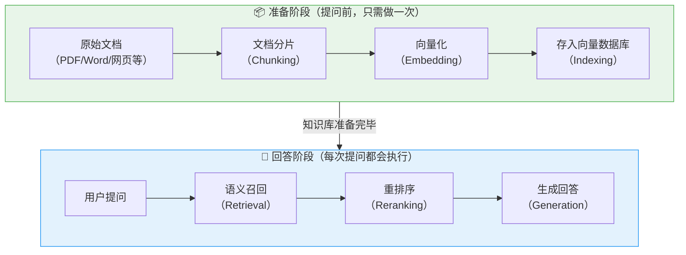

# RAG 技术全景介绍（Retrieval-Augmented Generation）

## 1. 什么是 RAG？

### 核心定义

RAG（Retrieval-Augmented Generation，检索增强生成）是一种让大语言模型（LLM）在回答问题之前，先从外部知识库中检索相关资料，再基于这些资料生成回答的技术方案。

### 通俗理解

> 想象你是一个开卷考试的学生。**闭卷考试**时你只能靠自己脑子里记住的东西回答（这就是纯 LLM）——可能记错、可能过时、可能瞎编。但**开卷考试**时，你可以先翻书找到相关内容，再组织语言回答（这就是 RAG）。
>
> RAG = 先查资料，再回答。就这么简单。

### 为什么需要 RAG？

大语言模型有三个致命问题：

| 问题 | 表现 | 例子 |
|------|------|------|
| **幻觉（Hallucination）** | 一本正经地编造不存在的信息 | 问公司报销政策，模型编出一个不存在的流程 |
| **知识过时（Knowledge Cutoff）** | 训练数据有截止日期 | 模型不知道上个月新发布的产品文档 |
| **缺乏私有知识** | 无法获取企业内部资料 | 模型无法回答"我们公司的 API 接口文档是什么" |

RAG 的核心价值就是解决这三个问题——让模型能够**引用真实的、最新的、私有的知识**来回答问题。

---

## 2. RAG 的整体流程

RAG 分为两个阶段：**准备阶段**（提问前）和 **回答阶段**（提问后）。



### 每一步在做什么？

| 阶段 | 步骤 | 做什么 | 生活类比 |
|------|------|--------|---------|
| 准备 | ① 分片（Chunking） | 把长文档切成小段落 | 把一本书拆成一张张知识卡片 |
| 准备 | ② 索引（Indexing） | 把文本转成向量，存入数据库 | 给每张卡片编号，放进索引柜 |
| 回答 | ③ 召回（Retrieval） | 根据问题找出最相关的几个片段 | 根据问题去索引柜里翻出相关卡片 |
| 回答 | ④ 重排（Reranking） | 对召回结果精细排序，挑出最优的 | 从翻出的卡片中挑出最切题的几张 |
| 回答 | ⑤ 生成（Generation） | 把问题+相关片段交给 LLM 生成回答 | 参考最切题的卡片，组织语言写答案 |

---

## 3. 一个完整的例子

假设我们要搭建一个 **公司内部知识库问答系统**，员工可以用自然语言问："年假有多少天？"

### 准备阶段

```
原始文档：《员工手册.pdf》（200页）

↓ 分片

片段1: "新员工入职流程：..."
片段2: "年假规定：入职满1年的员工享有5天年假，满5年享有10天年假，满10年享有15天年假..."
片段3: "报销流程：..."
... (共拆分出 500 个片段)

↓ 向量化 + 索引

每个片段 → 转成一个 768 维的向量 → 存入向量数据库
```

### 回答阶段

```
用户提问: "年假有多少天？"

↓ 召回（从 500 个片段中找出最相关的 Top 10）

命中片段:
  #1 "年假规定：入职满1年的员工享有5天年假..." (相似度: 0.92)
  #2 "请假审批流程：年假需提前3天申请..." (相似度: 0.85)
  #3 "节假日安排：..." (相似度: 0.78)
  ...

↓ 重排序（精细排序，选出 Top 3）

  #1 "年假规定：入职满1年的员工享有5天年假..."
  #2 "请假审批流程：年假需提前3天申请..."

↓ 生成（把问题 + 相关片段交给 LLM）

Prompt:
  "根据以下参考资料回答用户问题。
   参考资料：[年假规定：入职满1年享有5天年假...]
   用户问题：年假有多少天？"

LLM 回答:
  "根据公司规定，年假天数与入职年限有关：
   - 入职满1年：5天
   - 入职满5年：10天
   - 入职满10年：15天
   年假需要提前3天提交申请。"
```

---

## 4. RAG vs 微调：如何选择？

很多人会问：我用微调（Fine-tuning）把知识"喂"给模型不行吗？

| 维度 | RAG | 微调（Fine-tuning） |
|------|-----|-------------------|
| **适合场景** | 知识库问答、文档检索 | 调整模型风格、行为模式 |
| **知识更新** | 改文档即可，实时生效 | 需要重新训练模型 |
| **可解释性** | 能标注引用来源 | 无法追溯答案出处 |
| **成本** | 低（只需向量数据库） | 高（需要 GPU 训练） |
| **幻觉控制** | 强（有据可查） | 弱（仍可能编造） |
| **知识量** | 可检索海量文档 | 受限于模型参数容量 |

> **经验法则**：
> - 想让模型"知道新知识" → 用 **RAG**
> - 想让模型"改变行为方式" → 用 **微调**
> - 两者可以结合使用：先微调让模型学会特定格式和风格，再用 RAG 提供实时知识

---

## 5. RAG 技术栈全景

```mermaid
flowchart LR
    subgraph 分片["文档分片"]
        A1["LangChain\nTextSplitter"]
        A2["LlamaIndex\nNodeParser"]
    end

    subgraph 向量化["Embedding 模型"]
        B1["OpenAI\ntext-embedding-3"]
        B2["BGE / M3E\n（开源中文）"]
        B3["Cohere\nembed-v3"]
    end

    subgraph 向量库["向量数据库"]
        C1["Chroma\n（轻量级）"]
        C2["FAISS\n（Facebook）"]
        C3["Milvus\n（分布式）"]
        C4["Pinecone\n（云服务）"]
    end

    subgraph 重排["重排序模型"]
        D1["BGE-Reranker"]
        D2["Cohere Rerank"]
        D3["Cross-Encoder"]
    end

    subgraph 生成["生成模型"]
        E1["GPT-4 / Claude"]
        E2["Qwen / DeepSeek\n（国产）"]
        E3["LLaMA\n（开源）"]
    end

    分片 --> 向量化 --> 向量库 --> 重排 --> 生成
```



### 推荐组合（快速上手）

| 场景 | 推荐方案 |
|------|---------|
| **个人学习/Demo** | LangChain + Chroma + OpenAI Embedding + GPT-4 |
| **企业落地（国内）** | LlamaIndex + Milvus + BGE Embedding + Qwen/DeepSeek |
| **低成本方案** | LangChain + FAISS + M3E Embedding + 开源模型 |

---

## 6. RAG 的常见挑战

| 挑战 | 表现 | 解决方向 |
|------|------|---------|
| **召回质量差** | 检索到的内容和问题不相关 | 优化分片策略、使用混合检索 |
| **分片粒度不当** | 片段太长丢失精度，太短丢失上下文 | 调整 chunk_size，使用语义分片 |
| **跨文档推理** | 答案分散在多个文档中 | 增大召回数量，使用多跳检索 |
| **长上下文溢出** | 召回内容太多超过模型 Context 窗口 | 重排序 + 截断，压缩上下文 |
| **幻觉仍然存在** | 模型没有忠实于参考资料回答 | 优化 Prompt，要求引用原文 |

---

## 7. 接下来学什么？

本系列文档将按照 RAG 的流程，逐一深入讲解每个环节：

| 文档 | 内容 | 阶段 |
|------|------|------|
| [2-文档分片策略](./2-文档分片策略.md) | 如何将文档切分为合适的片段 | 准备阶段 |
| [3-向量索引构建](./3-向量索引构建.md) | Embedding 原理与向量数据库选型 | 准备阶段 |
| [4-语义召回](./4-语义召回.md) | 如何从海量片段中找到最相关的内容 | 回答阶段 |
| [5-重排序优化](./5-重排序优化.md) | 如何对召回结果精细排序 | 回答阶段 |
| [6-生成与回答](./6-生成与回答.md) | 如何让 LLM 基于参考资料生成高质量回答 | 回答阶段 |

---

_本文档持续更新，最后更新：2026年3月_
