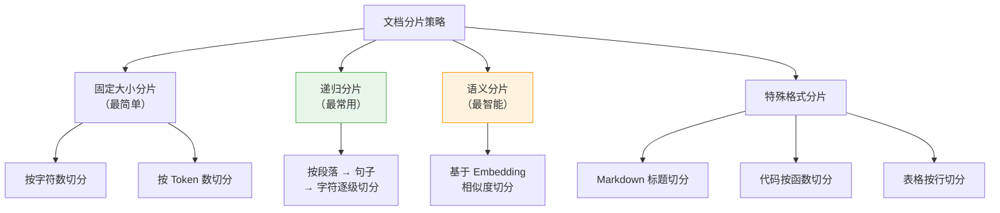
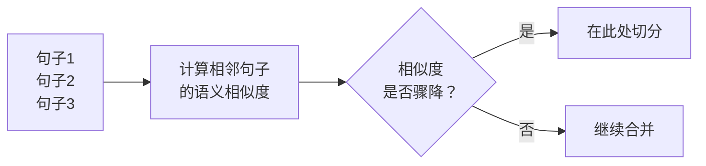
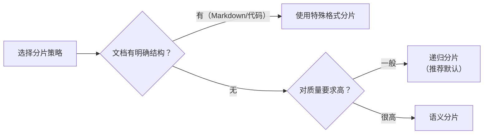

# 文档分片策略（Document Chunking）

## 1. 什么是文档分片？

### 核心定义

文档分片（Chunking）是将长文档切分成小段落（称为 chunk）的过程。它是 RAG 流程的**第一步**，也是对最终回答质量影响最大的一步。

### 通俗理解

> 想象你有一本 500 页的《员工手册》。如果有人问"年假怎么算"，你不可能把整本书塞给他——你需要先把书拆成一张张**知识卡片**，每张卡片记录一个独立的知识点。然后当有人提问时，只需要找到最相关的那几张卡片就行了。
>
> **分片 = 把大书拆成小卡片**。卡片拆得好不好，直接决定后面能不能找到正确答案。

### 为什么分片如此重要？

| 分片质量 | 后续影响 |
|---------|---------|
| 分片太大（比如整章节） | 向量化时语义被稀释，检索时"命中了但找不到重点" |
| 分片太小（比如单个句子） | 丢失上下文，检索到的内容不完整，LLM 无法理解 |
| 分片切断了关键信息 | 年假规定被切成两半，一半说"满1年5天"，另一半说"满5年10天"，检索只找到一半 |
| 分片恰到好处 | 每个片段包含一个完整的知识点，检索精准，回答准确 |

> **一句话：垃圾分片 = 垃圾召回 = 垃圾回答。** 分片是 RAG 的地基。

---

## 2. 分片策略全景



---

## 3. 策略一：固定大小分片

### 原理

最简单粗暴的方法：每 N 个字符（或 Token）切一刀。

### 示例

```python
from langchain.text_splitter import CharacterTextSplitter

splitter = CharacterTextSplitter(
    chunk_size=500,       # 每个片段 500 字符
    chunk_overlap=50,     # 相邻片段重叠 50 字符
    separator="\n"        # 优先在换行符处切分
)

chunks = splitter.split_text(document_text)
```

### 切分效果示意

```
原文（共 1200 字符）:
┌──────────────────────────────────────────┐
│ 第一部分：公司简介...(400字)...           │
│ 第二部分：年假规定...(350字)...           │
│ 第三部分：报销流程...(450字)...           │
└──────────────────────────────────────────┘

固定 500 字符切分（overlap=50）:
┌─────── chunk 1 ──────┐
│ 公司简介...(400字)    │
│ 年假规定开头...(100字) │ ← 年假规定被切断了！
└──────────────────────┘
         ┌─────── chunk 2 ──────┐
         │ ...年假规定(50字重叠)  │
         │ 年假规定剩余...(250字) │
         │ 报销流程开头...(200字) │ ← 报销流程也被切断了！
         └──────────────────────┘
                  ┌─────── chunk 3 ──────┐
                  │ ...报销流程(50字重叠)  │
                  │ 报销流程剩余...(250字) │
                  └──────────────────────┘
```

### 优缺点

| 优点 | 缺点 |
|------|------|
| 实现简单，速度快 | 不关心语义边界，可能切断完整段落 |
| 片段大小均匀 | 关键信息可能被分到两个 chunk 中 |

> **适用场景**：文档结构不明显、对质量要求不高的快速原型。

---

## 4. 策略二：递归分片（推荐）

### 原理

这是 LangChain 默认推荐的方法。它按照**分隔符优先级**逐级尝试切分：

```
优先级: 段落(\n\n) > 换行(\n) > 句号(。) > 空格( ) > 逐字符
```

意思是：先尝试按段落切，如果段落太大就按换行切，还是太大就按句号切......直到每个 chunk 都在目标大小以内。

### 核心思想

> 尽量保持语义完整——能按段落分就不按句子分，能按句子分就不逐字符分。

### 示例

```python
from langchain.text_splitter import RecursiveCharacterTextSplitter

splitter = RecursiveCharacterTextSplitter(
    chunk_size=500,
    chunk_overlap=50,
    separators=["\n\n", "\n", "。", "；", "，", " ", ""]
)

chunks = splitter.split_text(document_text)
```

### 切分过程示意

```
原文:
┌──────────────────────────────────────────┐
│ ## 年假规定                               │
│                                          │
│ 入职满1年的员工享有5天年假。               │
│ 入职满5年的员工享有10天年假。              │
│ 入职满10年的员工享有15天年假。             │
│                                          │
│ ## 报销流程                               │
│                                          │
│ 员工需要在OA系统提交报销申请...            │
└──────────────────────────────────────────┘

递归分片:
第1步: 尝试用 "\n\n"（段落）分割
  → chunk 1: "## 年假规定\n入职满1年...15天年假。"  ✅ 完整！
  → chunk 2: "## 报销流程\n员工需要..."              ✅ 完整！

如果某个段落超过 500 字:
第2步: 对超长段落用 "\n"（换行）再分割
第3步: 还是太长，用 "。"（句号）再分割
...以此类推
```

### 为什么推荐递归分片？

1. **语义保持好**：尽量按自然段落边界切分
2. **通用性强**：适合绝大多数文档格式
3. **可控性好**：通过调整 separators 适配不同语言/格式
4. **实现成熟**：LangChain/LlamaIndex 都有现成实现

---

## 5. 策略三：语义分片

### 原理

使用 Embedding 模型计算相邻句子的语义相似度，当相似度出现**断崖式下降**时，说明话题发生了转换，就在这里切分。



### 示例

```python
from langchain_experimental.text_splitter import SemanticChunker
from langchain_openai import OpenAIEmbeddings

splitter = SemanticChunker(
    embeddings=OpenAIEmbeddings(),
    breakpoint_threshold_type="percentile",  # 基于百分位数判断断点
    breakpoint_threshold_amount=95           # 相似度低于95%分位数时切分
)

chunks = splitter.split_text(document_text)
```

### 切分效果示意

```
句子序列与相邻相似度:
  "年假规定如下。"                              │
  "入职满1年享有5天年假。"        ← 相似度 0.91  │ chunk 1 (年假主题)
  "入职满5年享有10天年假。"       ← 相似度 0.95  │
  "年假需提前3天申请。"           ← 相似度 0.87  │
  ─────────────────── 相似度骤降 0.32 ──────────
  "报销需要在OA系统提交。"        ← 话题转换！   │ chunk 2 (报销主题)
  "报销金额超过5000需总监审批。"   ← 相似度 0.89  │
```

### 优缺点

| 优点 | 缺点 |
|------|------|
| 语义边界最精准 | 需要调用 Embedding 模型，有额外成本 |
| 自动适应不同文档结构 | 处理速度较慢 |
| 不依赖特定格式标记 | 阈值需要调参 |

> **适用场景**：对召回质量要求高、文档结构不规律、预算充足的场景。

---

## 6. 策略四：特殊格式分片

不同格式的文档需要专门的分片策略：

### Markdown 文档 → 按标题切分

```python
from langchain.text_splitter import MarkdownHeaderTextSplitter

splitter = MarkdownHeaderTextSplitter(
    headers_to_split_on=[
        ("#", "一级标题"),
        ("##", "二级标题"),
        ("###", "三级标题"),
    ]
)

chunks = splitter.split_text(markdown_text)
# 每个 chunk 自动携带标题层级信息作为元数据
```

### 代码文档 → 按函数/类切分

```python
from langchain.text_splitter import Language, RecursiveCharacterTextSplitter

splitter = RecursiveCharacterTextSplitter.from_language(
    language=Language.PYTHON,
    chunk_size=1000,
    chunk_overlap=100
)
# 自动识别 def/class 边界，不会切断一个函数
```

### 表格数据 → 按行切分，保留表头

```
原始表格:
| 姓名 | 部门 | 年假天数 |
|------|------|---------|
| 张三 | 研发 | 10天    |
| 李四 | 产品 | 5天     |

每个 chunk 都保留表头:
chunk 1: "姓名:张三, 部门:研发, 年假天数:10天"
chunk 2: "姓名:李四, 部门:产品, 年假天数:5天"
```

---

## 7. 关键参数调优

### chunk_size（片段大小）

这是最重要的参数。

| chunk_size | 效果 | 适用场景 |
|-----------|------|---------|
| 200~300 字 | 精确匹配，适合短问题 | FAQ、问答对 |
| 500~800 字 | **平衡推荐**，适合大多数场景 | 通用文档 |
| 1000~2000 字 | 保留更多上下文，适合复杂问题 | 技术文档、法律条文 |

### chunk_overlap（重叠大小）

相邻片段之间的重叠部分，用于防止关键信息被切断。

```
chunk_overlap = 0（无重叠）:
┌─── chunk 1 ───┐┌─── chunk 2 ───┐
│ ...年假满1年5天 ││ 满5年10天...   │  ← 如果切分点不好，信息断裂
└───────────────┘└───────────────┘

chunk_overlap = 50（有重叠）:
┌─── chunk 1 ──────┐
│ ...年假满1年5天。满 │
└─────────────┬────┘
              │ 重叠区域
         ┌────┴─────────┐
         │ 天。满5年10天... │
         └──────────────┘
```

> **经验值**：`chunk_overlap` 设为 `chunk_size` 的 **10%~20%**。

### 实战参数推荐

```python
# 通用文档（中文）推荐配置
splitter = RecursiveCharacterTextSplitter(
    chunk_size=500,
    chunk_overlap=80,
    separators=["\n\n", "\n", "。", "；", "，", " ", ""],
    length_function=len,
)
```

---

## 8. 分片质量评估

如何判断分片效果好不好？

### 检查清单

- [ ] **完整性**：每个 chunk 是否包含完整的知识点？有没有被切断的句子？
- [ ] **独立性**：每个 chunk 单独阅读是否能理解？还是必须结合前后文？
- [ ] **粒度**：chunk 大小是否均匀？有没有特别大或特别小的异常值？
- [ ] **覆盖度**：原文的关键信息是否都被覆盖？有没有遗漏？

### 快速调试方法

```python
# 打印分片结果，人工检查
for i, chunk in enumerate(chunks):
    print(f"--- Chunk {i+1} ({len(chunk)} chars) ---")
    print(chunk[:200] + "..." if len(chunk) > 200 else chunk)
    print()
```

---

## 9. 实战建议

| 建议 | 说明 |
|------|------|
| **先用递归分片打底** | 80% 的场景递归分片就够了，不用一上来就用语义分片 |
| **中文场景调整 separators** | 加入 `"。"、"；"、"，"` 等中文标点 |
| **保留元数据** | 每个 chunk 应携带来源文件名、页码、章节等信息 |
| **chunk_size 先大后小** | 先用大 chunk_size 跑通流程，再逐步调小看效果 |
| **一定要人工抽检** | 自动分片后，随机抽 20~30 个 chunk 人工检查质量 |

---

## 10. 总结



**核心记忆点**：
1. 分片是 RAG 的地基，地基不牢，后面全白搭
2. 递归分片是默认最佳选择，覆盖 80% 场景
3. chunk_size 500 字 + overlap 10~20% 是好的起点
4. 一定要人工抽检分片质量

> 📖 下一篇：[3-向量索引构建](./3-向量索引构建.md) — 如何把文本片段转成向量并建立索引

---

_本文档持续更新，最后更新：2026年3月_
