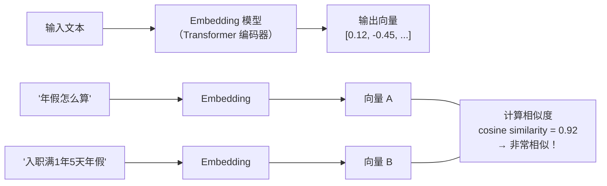
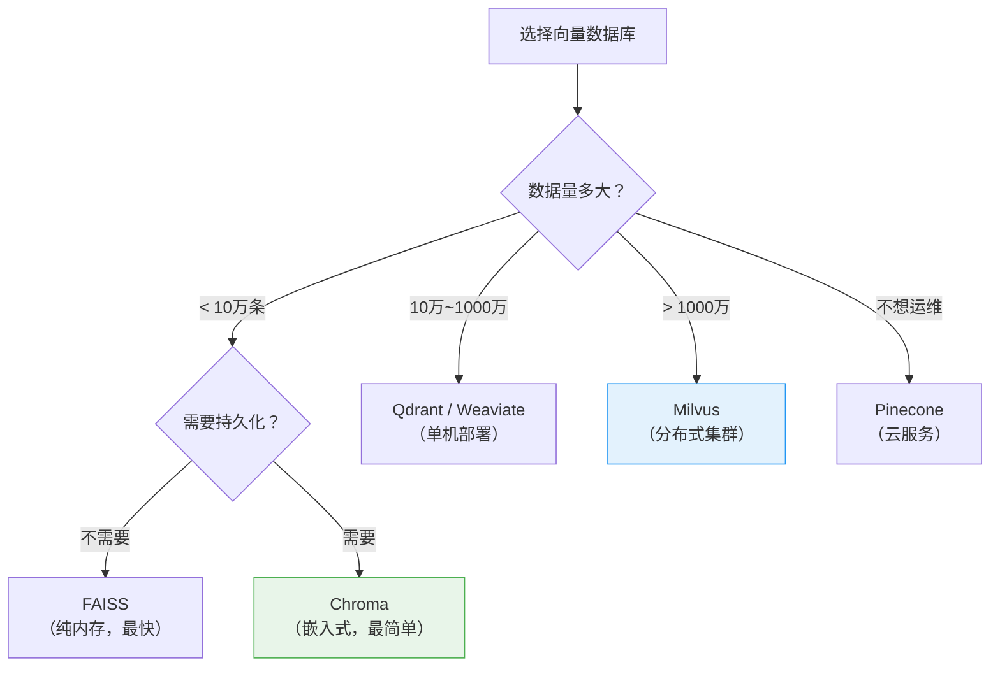
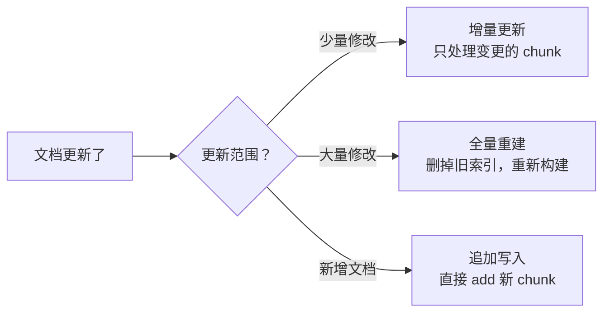

# 向量索引构建（Embedding & Indexing）

## 1. 什么是向量索引？

### 核心定义

向量索引构建分为两步：
1. **Embedding（向量化）**：用模型把文本片段转换成一组数字（向量），让计算机能"理解"文本的语义
2. **Indexing（索引）**：把这些向量存入专门的数据库，建立高效的检索结构

### 通俗理解

> 想象你有 500 张知识卡片（分片后的文档），现在需要建一个"图书馆检索系统"。
>
> **Embedding** 就是给每张卡片打上一个"语义指纹"——两张卡片讨论的内容越相似，它们的指纹就越接近。
>
> **Indexing** 就是把这些带指纹的卡片放进一个智能档案柜——当有人来查找时，档案柜能瞬间根据指纹找到最相似的卡片。

---

## 2. Embedding：把文字变成数字

### 2.1 什么是 Embedding？

Embedding 是一种将文本映射到高维数字空间的技术。每段文本变成一个**固定长度的数字数组（向量）**。

```
"年假规定：入职满1年享有5天年假" → [0.12, -0.45, 0.78, ..., 0.33]  (768个数字)
"员工休假政策包括年假和病假"     → [0.15, -0.42, 0.71, ..., 0.29]  (768个数字)
"今天中午食堂吃红烧肉"          → [-0.67, 0.23, -0.11, ..., 0.88] (768个数字)
```

注意看：前两个句子的向量很接近（都在讨论休假），第三个句子的向量差异很大（话题完全不同）。

### 2.2 Embedding 的核心原理



**关键概念**：向量之间的距离 = 语义之间的距离

| 两段文本 | 余弦相似度 | 含义 |
|---------|-----------|------|
| "年假怎么算" vs "入职满1年5天年假" | 0.92 | 高度相关 |
| "年假怎么算" vs "出差补贴标准" | 0.45 | 有一定关联 |
| "年假怎么算" vs "今天天气不错" | 0.08 | 完全无关 |

### 2.3 Embedding 模型选型

| 模型 | 维度 | 中文效果 | 成本 | 推荐场景 |
|------|------|---------|------|---------|
| **OpenAI text-embedding-3-small** | 1536 | 良好 | 付费（便宜） | 快速上手、海外部署 |
| **OpenAI text-embedding-3-large** | 3072 | 很好 | 付费（较贵） | 对精度要求高 |
| **BGE-large-zh-v1.5** | 1024 | **优秀** | 免费开源 | 国内企业首选 |
| **M3E-base** | 768 | 优秀 | 免费开源 | 低资源环境 |
| **BGE-M3** | 1024 | **顶级** | 免费开源 | 多语言场景 |
| **Cohere embed-v3** | 1024 | 很好 | 付费 | 多语言商用 |

> **推荐**：
> - 中文场景首选 **BGE-large-zh-v1.5** 或 **BGE-M3**（免费、效果好）
> - 快速验证用 **OpenAI text-embedding-3-small**（最省心）

### 2.4 Embedding 实战代码

#### 使用 OpenAI

```python
from openai import OpenAI

client = OpenAI()

def get_embedding(text: str) -> list[float]:
    response = client.embeddings.create(
        model="text-embedding-3-small",
        input=text
    )
    return response.data[0].embedding

# 计算两段文本的相似度
import numpy as np

vec1 = get_embedding("年假有多少天？")
vec2 = get_embedding("入职满1年享有5天年假")

similarity = np.dot(vec1, vec2) / (np.linalg.norm(vec1) * np.linalg.norm(vec2))
print(f"相似度: {similarity:.4f}")  # 约 0.85+
```

#### 使用开源模型（BGE）

```python
from sentence_transformers import SentenceTransformer

model = SentenceTransformer("BAAI/bge-large-zh-v1.5")

texts = [
    "年假规定：入职满1年享有5天年假",
    "报销流程：在OA系统提交申请",
    "年假怎么算？"
]

embeddings = model.encode(texts, normalize_embeddings=True)

# 计算查询与文档的相似度
query_vec = embeddings[2]    # "年假怎么算？"
doc1_vec = embeddings[0]     # 年假规定
doc2_vec = embeddings[1]     # 报销流程

print(f"与年假规定的相似度: {query_vec @ doc1_vec:.4f}")  # 高
print(f"与报销流程的相似度: {query_vec @ doc2_vec:.4f}")  # 低
```

---

## 3. 向量数据库：存储和检索向量

### 3.1 为什么需要向量数据库？

普通数据库（MySQL、MongoDB）擅长精确匹配：`WHERE name = '张三'`。

但 RAG 需要的是**语义匹配**：找到和"年假怎么算"意思最接近的文档片段。这需要在成千上万个向量中快速计算相似度——这正是向量数据库的专长。

```
传统数据库: SELECT * FROM docs WHERE content = '年假怎么算'   → 精确匹配，找不到
向量数据库: 找到与 [0.12, -0.45, ...] 最近的 Top 5 向量      → 语义匹配，命中！
```

### 3.2 主流向量数据库对比

| 数据库 | 类型 | 特点 | 适用场景 | 上手难度 |
|--------|------|------|---------|---------|
| **Chroma** | 嵌入式 | 轻量、开箱即用、支持持久化 | 本地开发、小项目 | ★☆☆ |
| **FAISS** | 库（非数据库） | Facebook出品，速度极快 | 大规模向量检索 | ★★☆ |
| **Milvus** | 分布式数据库 | 支持亿级向量、高可用 | 企业级生产环境 | ★★★ |
| **Pinecone** | 云服务 | 全托管、零运维 | 快速上线、不想运维 | ★☆☆ |
| **Weaviate** | 分布式数据库 | 支持混合检索 | 需要向量+关键词混合检索 | ★★☆ |
| **Qdrant** | 分布式数据库 | Rust编写，高性能 | 高性能需求 | ★★☆ |

### 3.3 选型决策树



---

## 4. 实战：用 Chroma 构建索引

Chroma 是上手最快的向量数据库，非常适合学习和小型项目。

### 4.1 安装

```bash
pip install chromadb langchain langchain-openai
```

### 4.2 完整示例：从文档到可检索的索引

```python
import chromadb
from chromadb.utils import embedding_functions

# 1. 创建 Chroma 客户端（数据持久化到本地）
client = chromadb.PersistentClient(path="./chroma_db")

# 2. 选择 Embedding 函数
ef = embedding_functions.SentenceTransformerEmbeddingFunction(
    model_name="BAAI/bge-large-zh-v1.5"
)

# 3. 创建集合（类似于数据库的"表"）
collection = client.get_or_create_collection(
    name="company_docs",
    embedding_function=ef,
    metadata={"hnsw:space": "cosine"}  # 使用余弦相似度
)

# 4. 添加文档片段
collection.add(
    documents=[
        "年假规定：入职满1年享有5天年假，满5年享有10天年假",
        "报销流程：员工在OA系统提交报销申请，需附发票原件",
        "考勤制度：上班时间为9:00-18:00，迟到超过30分钟扣半天工资",
    ],
    ids=["chunk_1", "chunk_2", "chunk_3"],
    metadatas=[
        {"source": "员工手册.pdf", "page": 12},
        {"source": "员工手册.pdf", "page": 25},
        {"source": "员工手册.pdf", "page": 8},
    ]
)

# 5. 检索
results = collection.query(
    query_texts=["年假有多少天？"],
    n_results=2
)

print(results["documents"])
# [['年假规定：入职满1年享有5天年假，满5年享有10天年假', ...]]
```

### 4.3 使用 LangChain 简化流程

```python
from langchain_community.vectorstores import Chroma
from langchain_openai import OpenAIEmbeddings
from langchain.text_splitter import RecursiveCharacterTextSplitter
from langchain_community.document_loaders import PyPDFLoader

# 1. 加载文档
loader = PyPDFLoader("员工手册.pdf")
documents = loader.load()

# 2. 分片
splitter = RecursiveCharacterTextSplitter(
    chunk_size=500, chunk_overlap=80
)
chunks = splitter.split_documents(documents)

# 3. 一行代码完成 Embedding + 索引构建
vectorstore = Chroma.from_documents(
    documents=chunks,
    embedding=OpenAIEmbeddings(model="text-embedding-3-small"),
    persist_directory="./chroma_db"
)

# 4. 检索
results = vectorstore.similarity_search("年假有多少天？", k=3)
for doc in results:
    print(f"[来源: {doc.metadata['source']} P{doc.metadata['page']}]")
    print(doc.page_content[:100])
```

---

## 5. 实战：用 FAISS 构建索引

FAISS 适合对性能要求高、数据量中等的场景。

```python
from langchain_community.vectorstores import FAISS
from langchain_openai import OpenAIEmbeddings

# 构建索引
vectorstore = FAISS.from_documents(
    documents=chunks,
    embedding=OpenAIEmbeddings(model="text-embedding-3-small")
)

# 保存到本地
vectorstore.save_local("./faiss_index")

# 后续加载使用（无需重新 Embedding）
loaded_store = FAISS.load_local(
    "./faiss_index",
    OpenAIEmbeddings(model="text-embedding-3-small"),
    allow_dangerous_deserialization=True
)

results = loaded_store.similarity_search_with_score("年假有多少天？", k=3)
for doc, score in results:
    print(f"相似度分数: {score:.4f}")
    print(doc.page_content[:100])
```

---

## 6. 索引优化技巧

### 6.1 元数据（Metadata）很重要

每个 chunk 入库时应携带元数据，方便后续**过滤检索**。

```python
# 存储时附带元数据
collection.add(
    documents=["年假规定：..."],
    metadatas=[{
        "source": "员工手册.pdf",       # 来源文件
        "page": 12,                     # 页码
        "chapter": "休假制度",           # 章节
        "updated_at": "2026-01-15",     # 更新时间
        "doc_type": "policy"            # 文档类型
    }],
    ids=["chunk_001"]
)

# 检索时可以用元数据过滤
results = collection.query(
    query_texts=["年假有多少天？"],
    n_results=5,
    where={"doc_type": "policy"}  # 只在"制度类"文档中检索
)
```

### 6.2 索引更新策略



### 6.3 Embedding 注意事项

| 注意点 | 说明 |
|--------|------|
| **查询和文档用同一个模型** | 不同模型生成的向量不在同一个空间，无法比较 |
| **中文选中文优化模型** | BGE-zh 系列远好于通用英文模型处理中文 |
| **控制文本长度** | 超过模型最大长度的文本会被截断，确保 chunk_size 在限制内 |
| **归一化向量** | 使用余弦相似度时，建议对向量做 L2 归一化 |

---

## 7. 常见问题

**Q1：向量维度越高越好吗？**

> 不一定。高维度（3072维）捕捉的语义更丰富，但存储成本更高、检索更慢。768~1024 维在大多数场景下已经足够。选择维度时要平衡精度和成本。

**Q2：已经建好的索引，能换 Embedding 模型吗？**

> 不能直接换。不同模型生成的向量空间完全不同，必须用新模型对所有文档重新 Embedding，重建索引。所以**一开始就选好模型很重要**。

**Q3：数据量很大时怎么加速 Embedding？**

> - 使用 GPU 加速（开源模型）
> - 批量处理（batch encoding）而非逐条处理
> - 使用异步并发调用（API 模型）
> - 增量更新：只对新增/修改的文档做 Embedding

---

## 8. 总结

```
文档分片 → [Embedding 模型] → 向量 → [向量数据库] → 可检索的索引
            把文字变成数字      ↑         存储和检索
                               │
                 模型选择决定了语义理解的质量
```

**核心记忆点**：
1. Embedding 是 RAG 的"翻译器"——把人类语言翻译成计算机能比较的数字
2. 中文场景优先选 BGE 系列开源模型
3. 小项目用 Chroma，大项目用 Milvus
4. 元数据很重要，入库时一定要带上来源信息
5. 查询和文档必须用同一个 Embedding 模型

> 📖 上一篇：[2-文档分片策略](./2-文档分片策略.md) — 如何将文档切分为合适的片段
> 📖 下一篇：[4-语义召回](./4-语义召回.md) — 如何从索引中检索最相关的内容

---

_本文档持续更新，最后更新：2026年3月_
