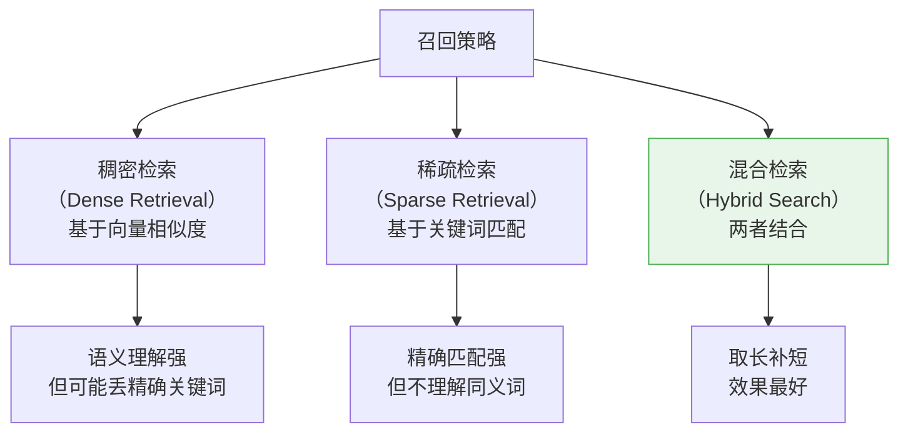
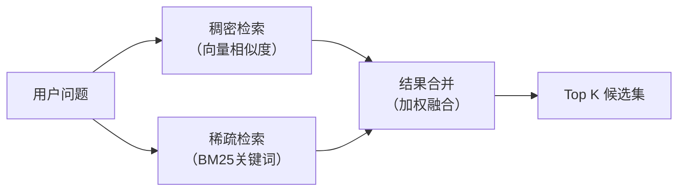
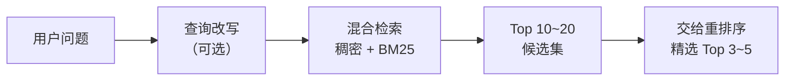

# 语义召回（Retrieval）

## 1. 什么是语义召回？

### 核心定义

语义召回（Retrieval）是 RAG 回答阶段的第一步——当用户提出问题后，从向量数据库中找到与问题**语义最相关**的文档片段。

### 通俗理解

> 你去图书馆问管理员："年假怎么算？"
>
> 管理员不是按照"年假怎么算"这几个字去书架上一本本翻（那是关键词搜索）。而是**理解你的意思**——你想知道休假政策，然后从档案柜里找出所有跟"员工休假、年假天数、假期规定"相关的资料卡片递给你。
>
> 这就是语义召回：**理解意思，找相关内容**，而不是匹配字面关键词。

### 召回为什么重要？

> **你找不到的信息，LLM 就用不上。**

无论生成模型多强大，如果召回阶段没把正确答案找出来，后面的一切都是白搭。

```
召回阶段的目标：用"宽网"捞出候选集（尽量不遗漏正确答案）
重排阶段的目标：从候选集中精选最优的（提高精度）
```

---

## 2. 三种召回策略



---

## 3. 稠密检索（Dense Retrieval）

### 原理

把查询和文档都转成向量，然后计算向量之间的距离，距离越近 = 语义越相关。

```
用户问题: "年假有多少天？"
    ↓ Embedding
查询向量: [0.12, -0.45, 0.78, ...]
    ↓ 与数据库中所有向量计算距离
    ↓ 返回距离最近的 Top K 个

Top 1: "年假规定：入职满1年享有5天年假..."  (距离: 0.08)  ✅
Top 2: "请假审批：年假需提前3天申请..."    (距离: 0.15)  ✅
Top 3: "节假日安排：春节放假7天..."        (距离: 0.25)  △
```

### 实战代码

```python
from langchain_community.vectorstores import Chroma
from langchain_openai import OpenAIEmbeddings

vectorstore = Chroma(
    persist_directory="./chroma_db",
    embedding_function=OpenAIEmbeddings(model="text-embedding-3-small")
)

# 基础检索：返回最相关的 Top 5
results = vectorstore.similarity_search(
    query="年假有多少天？",
    k=5
)

# 带分数的检索：可以看到每个结果的相似度
results_with_scores = vectorstore.similarity_search_with_score(
    query="年假有多少天？",
    k=5
)

for doc, score in results_with_scores:
    print(f"[相似度: {score:.4f}] {doc.page_content[:80]}")
```

### 优缺点

| 优点 | 缺点 |
|------|------|
| 理解语义，"年假"能匹配"休假天数" | 对精确关键词不敏感（如"ISO-27001"） |
| 多语言通用 | 依赖 Embedding 模型质量 |
| 效果好，是 RAG 的主流方案 | 对专业术语、编号等表现不佳 |

---

## 4. 稀疏检索（Sparse Retrieval / BM25）

### 原理

BM25 是经典的关键词检索算法（Elasticsearch 底层就是它）。它不理解语义，而是统计**关键词的匹配程度**：一个词在文档中出现得越多、同时在其他文档中出现得越少，匹配分越高。

```
用户问题: "ISO-27001 认证流程"

BM25 检索:
  ✅ "公司已通过 ISO-27001 安全认证，认证流程如下..."   ← 精确命中关键词
  ❌ "公司安全管理体系符合国际标准..."                  ← 语义相关但没有关键词

稠密检索:
  ✅ "公司安全管理体系符合国际标准..."                  ← 理解了语义
  △  "公司已通过 ISO-27001 安全认证..."               ← 也能找到，但不一定排第一
```

### 实战代码

```python
from langchain_community.retrievers import BM25Retriever
from langchain.schema import Document

documents = [
    Document(page_content="年假规定：入职满1年享有5天年假"),
    Document(page_content="ISO-27001认证流程：首先进行差距分析..."),
    Document(page_content="报销制度：发票需在30天内提交"),
]

bm25_retriever = BM25Retriever.from_documents(
    documents,
    k=3  # 返回 Top 3
)

results = bm25_retriever.invoke("ISO-27001")
for doc in results:
    print(doc.page_content[:80])
```

### 适用场景

- 用户查询中包含**精确关键词、编号、专有名词**
- 文档中有大量**专业术语**
- 作为稠密检索的补充

---

## 5. 混合检索（Hybrid Search）— 推荐方案

### 原理

把稠密检索和稀疏检索的结果合并，取长补短。



### 为什么混合检索效果最好？

| 查询类型 | 稠密检索表现 | 稀疏检索表现 | 混合检索表现 |
|---------|------------|------------|------------|
| "年假怎么算" | ★★★★★ | ★★★ | ★★★★★ |
| "ISO-27001" | ★★ | ★★★★★ | ★★★★★ |
| "安全认证怎么做" | ★★★★ | ★★ | ★★★★★ |

> **任何单一方法都有盲区，混合检索几乎没有盲区。**

### 实战代码

```python
from langchain.retrievers import EnsembleRetriever
from langchain_community.retrievers import BM25Retriever
from langchain_community.vectorstores import Chroma
from langchain_openai import OpenAIEmbeddings

# 稠密检索器
vectorstore = Chroma(
    persist_directory="./chroma_db",
    embedding_function=OpenAIEmbeddings(model="text-embedding-3-small")
)
dense_retriever = vectorstore.as_retriever(search_kwargs={"k": 10})

# 稀疏检索器（BM25）
bm25_retriever = BM25Retriever.from_documents(all_documents, k=10)

# 混合检索器（加权融合）
hybrid_retriever = EnsembleRetriever(
    retrievers=[dense_retriever, bm25_retriever],
    weights=[0.6, 0.4]  # 稠密检索权重 60%，稀疏检索权重 40%
)

results = hybrid_retriever.invoke("ISO-27001 认证流程")
```

### 权重如何调？

| 场景 | 稠密权重 | 稀疏权重 | 理由 |
|------|---------|---------|------|
| 通用问答 | 0.7 | 0.3 | 大部分问题靠语义理解 |
| 技术文档 | 0.5 | 0.5 | 专业术语多，关键词很重要 |
| 法律/合规文档 | 0.4 | 0.6 | 精确条款号、法条编号很关键 |

---

## 6. 召回数量（Top K）如何设置？

### K 值的影响

```
K 太小（如 K=1）:
  → 容易遗漏正确答案
  → 如果唯一的结果不对，直接翻车

K 太大（如 K=50）:
  → 引入大量噪声
  → 超过 LLM 的上下文窗口
  → 干扰 LLM 的回答质量

K 合适（如 K=5~10，配合重排序）:
  → 撒大网不遗漏
  → 后续重排序精选 Top 3 给 LLM
```

### 推荐的 K 值

| 场景 | 召回 K 值 | 重排后保留 | 说明 |
|------|----------|-----------|------|
| 简单问答 | 5~10 | 3 | 答案通常在 Top 5 以内 |
| 复杂问题 | 10~20 | 3~5 | 答案可能分散在多个片段 |
| 多文档综合 | 20~30 | 5~8 | 需要综合多个来源 |

> **经验法则**：先召回多一些（10~20），然后用重排序精选（3~5），最终喂给 LLM。

---

## 7. 提升召回质量的技巧

### 7.1 查询改写（Query Rewriting）

用户的原始问题可能不够好，改写后检索效果更佳。

```python
from langchain.chat_models import ChatOpenAI
from langchain.prompts import PromptTemplate

rewrite_prompt = PromptTemplate.from_template(
    "将以下用户问题改写为更适合检索的查询（简洁、关键词明确）：\n"
    "原始问题：{question}\n"
    "改写后的查询："
)

llm = ChatOpenAI(model="gpt-4o-mini")

original = "我想问一下就是那个如果我入职还不到一年的话是不是没有年假啊"
rewritten = llm.invoke(rewrite_prompt.format(question=original))
# 改写结果: "入职不满一年 年假规定"  → 更适合检索
```

### 7.2 多查询策略（Multi-Query）

一个问题生成多个不同角度的查询，合并检索结果。

```python
from langchain.retrievers.multi_query import MultiQueryRetriever

multi_retriever = MultiQueryRetriever.from_llm(
    retriever=vectorstore.as_retriever(search_kwargs={"k": 5}),
    llm=ChatOpenAI(model="gpt-4o-mini")
)

# 原始问题: "年假怎么算？"
# 自动生成:
#   查询1: "员工年假天数规定"
#   查询2: "入职年限与年假关系"
#   查询3: "年假计算方式"
# → 三次检索结果合并去重

results = multi_retriever.invoke("年假怎么算？")
```

### 7.3 元数据过滤

利用入库时存储的元数据缩小检索范围。

```python
# 只在"制度类"文档中检索
results = vectorstore.similarity_search(
    query="年假有多少天？",
    k=5,
    filter={"doc_type": "policy"}
)

# 只检索最近更新的文档
results = vectorstore.similarity_search(
    query="最新的报销标准",
    k=5,
    filter={"updated_at": {"$gte": "2026-01-01"}}
)
```

---

## 8. 召回质量评估

### 核心指标

| 指标 | 含义 | 计算方式 |
|------|------|---------|
| **召回率（Recall@K）** | Top K 结果中包含正确答案的比例 | 命中的正确答案数 / 总正确答案数 |
| **命中率（Hit Rate@K）** | 正确答案至少出现一次的查询比例 | 命中的查询数 / 总查询数 |
| **MRR（Mean Reciprocal Rank）** | 正确答案排名的倒数的均值 | 排名第1得1分，第2得0.5分... |

### 简单评估方法

```python
def evaluate_retrieval(queries, ground_truths, retriever, k=5):
    """
    queries: 测试问题列表
    ground_truths: 每个问题对应的正确 chunk id 列表
    """
    hits = 0
    for query, truth_ids in zip(queries, ground_truths):
        results = retriever.invoke(query)
        result_ids = [doc.metadata.get("id") for doc in results[:k]]
        if any(tid in result_ids for tid in truth_ids):
            hits += 1

    hit_rate = hits / len(queries)
    print(f"Hit Rate@{k}: {hit_rate:.2%}")
    return hit_rate
```

---

## 9. 总结



**核心记忆点**：
1. 稠密检索理解语义，稀疏检索精确匹配——**混合检索取长补短，效果最好**
2. 先多召回（10~20），再重排精选（3~5），宽进严出
3. 查询改写和多查询策略能显著提升召回质量
4. 元数据过滤能缩小检索范围，提高精度和速度
5. 召回是 RAG 的核心环节——**找不到就答不对**

> 📖 上一篇：[3-向量索引构建](./3-向量索引构建.md) — Embedding 与向量数据库
> 📖 下一篇：[5-重排序优化](./5-重排序优化.md) — 如何对召回结果精细排序

---

_本文档持续更新，最后更新：2026年3月_
