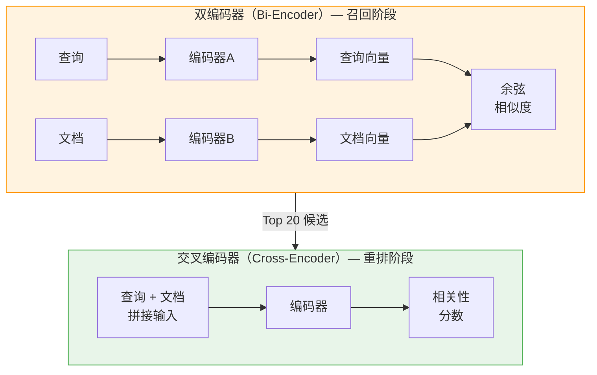
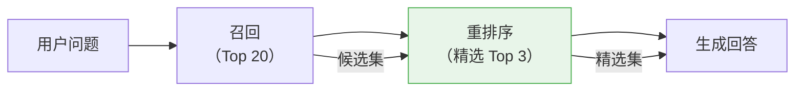

# 重排序优化（Reranking）

## 1. 什么是重排序？

### 核心定义

重排序（Reranking）是在召回阶段之后，使用更精细的模型对候选文档片段进行**二次排序**，从中筛选出与用户问题最相关的 Top N 结果，再交给 LLM 生成回答。

### 通俗理解

> 你让图书管理员帮你找关于"年假"的资料，她快速扫了一遍档案柜，抱来了 20 份材料（召回阶段）。
>
> 但这 20 份里有的非常切题，有的只是沾边。于是你（重排序模型）仔细阅读每一份，按照**与问题的相关程度**重新排个序，最后只留下最好的 3 份来写答案。
>
> **召回 = 快速粗选（求全），重排 = 仔细精选（求准）。**

### 为什么需要重排序？

| 问题 | 说明 |
|------|------|
| 召回模型精度有限 | Embedding 是双编码器（Bi-Encoder），查询和文档分别编码，交互不够深入 |
| 排名不够精确 | 向量距离排序可能把"沾边"的排在"精准"的前面 |
| 噪声干扰 LLM | 如果把不相关的内容喂给 LLM，反而会降低回答质量 |

---

## 2. 重排序的工作原理

### 双编码器 vs 交叉编码器

这是理解重排序的关键。



| 对比 | 双编码器（Bi-Encoder） | 交叉编码器（Cross-Encoder） |
|------|----------------------|--------------------------|
| 用于 | 召回（从百万文档中快速筛选） | 重排（对几十个候选精细排序） |
| 输入 | 查询和文档分别编码 | 查询和文档拼接后一起编码 |
| 交互深度 | 浅（只在最后计算距离） | 深（每个 token 都能互相关注） |
| 速度 | 极快（可预计算文档向量） | 较慢（每对都要重新计算） |
| 精度 | 中等 | **高** |

> **简单理解**：
> - 双编码器像是"看了一眼标题就给分"——快但不够准
> - 交叉编码器像是"仔细读完全文再给分"——慢但精准

---

## 3. 重排序模型选型

| 模型 | 类型 | 中文效果 | 成本 | 推荐指数 |
|------|------|---------|------|---------|
| **BGE-Reranker-v2-m3** | Cross-Encoder | **优秀** | 免费开源 | ★★★★★ |
| **BGE-Reranker-large** | Cross-Encoder | 优秀 | 免费开源 | ★★★★ |
| **Cohere Rerank** | API 服务 | 很好 | 付费 | ★★★★ |
| **bge-reranker-v2-gemma** | Cross-Encoder | 优秀 | 免费开源 | ★★★★ |
| **ms-marco-MiniLM** | Cross-Encoder | 一般 | 免费开源 | ★★（仅英文） |

> **中文场景首选 BGE-Reranker 系列**。

---

## 4. 实战代码

### 4.1 使用 BGE-Reranker（开源方案）

```python
from sentence_transformers import CrossEncoder

reranker = CrossEncoder("BAAI/bge-reranker-v2-m3", max_length=512)

query = "年假有多少天？"
documents = [
    "年假规定：入职满1年享有5天年假，满5年享有10天年假",
    "请假审批：年假需提前3天在OA系统申请",
    "考勤制度：上班时间为9:00-18:00",
    "报销流程：发票需在30天内提交",
    "节假日安排：春节放假7天，国庆放假7天",
]

# 计算每个文档与查询的相关性分数
pairs = [[query, doc] for doc in documents]
scores = reranker.predict(pairs)

# 按分数排序
ranked = sorted(zip(documents, scores), key=lambda x: x[1], reverse=True)

for doc, score in ranked:
    print(f"[{score:.4f}] {doc}")

# 输出（示意）：
# [0.9856] 年假规定：入职满1年享有5天年假，满5年享有10天年假
# [0.7234] 请假审批：年假需提前3天在OA系统申请
# [0.1523] 节假日安排：春节放假7天，国庆放假7天
# [0.0312] 考勤制度：上班时间为9:00-18:00
# [0.0089] 报销流程：发票需在30天内提交
```

### 4.2 使用 Cohere Rerank（API 方案）

```python
import cohere

co = cohere.Client("your-api-key")

results = co.rerank(
    model="rerank-multilingual-v3.0",
    query="年假有多少天？",
    documents=documents,
    top_n=3,
    return_documents=True
)

for item in results.results:
    print(f"[{item.relevance_score:.4f}] {item.document.text}")
```

### 4.3 集成到 LangChain

```python
from langchain.retrievers import ContextualCompressionRetriever
from langchain.retrievers.document_compressors import CrossEncoderReranker
from langchain_community.cross_encoders import HuggingFaceCrossEncoder

# 基础检索器（召回 Top 20）
base_retriever = vectorstore.as_retriever(search_kwargs={"k": 20})

# 重排序模型
reranker_model = HuggingFaceCrossEncoder(model_name="BAAI/bge-reranker-v2-m3")
compressor = CrossEncoderReranker(model=reranker_model, top_n=3)

# 组合：召回 + 重排
reranking_retriever = ContextualCompressionRetriever(
    base_compressor=compressor,
    base_retriever=base_retriever
)

# 使用：自动完成 召回20 → 重排 → 返回Top3
results = reranking_retriever.invoke("年假有多少天？")
```

---

## 5. 重排序的效果对比

### 未使用重排 vs 使用重排

```
用户问题: "出差补贴标准是什么？"

=== 未使用重排（直接用向量检索 Top 3）===
#1 "出差审批流程：需提前3天提交申请..."          ← 沾边但不对
#2 "出差补贴标准：市内50元/天，省外200元/天..."   ← 正确答案
#3 "差旅报销需提供完整票据..."                   ← 相关但不是答案

=== 使用重排后的 Top 3 ===
#1 "出差补贴标准：市内50元/天，省外200元/天..."   ← 正确答案排到第一！
#2 "差旅报销需提供完整票据..."
#3 "出差审批流程：需提前3天提交申请..."
```

> 重排序能把"沾边但不对"的结果压下去，把真正相关的结果提上来。

---

## 6. 重排序参数调优

### 6.1 召回数量 vs 重排数量

```
流程: 向量检索 Top K₁ → 重排序 → 保留 Top K₂ → 给 LLM

K₁（召回数量）: 建议 10~20
  → 太少可能遗漏正确答案
  → 太多重排速度变慢

K₂（重排后保留）: 建议 3~5
  → 太少信息不充分
  → 太多引入噪声
```

### 6.2 推荐配置

| 场景 | 召回 K₁ | 重排保留 K₂ | 重排模型 |
|------|---------|------------|---------|
| 简单问答 | 10 | 3 | BGE-Reranker-v2-m3 |
| 复杂分析 | 20 | 5 | BGE-Reranker-v2-m3 |
| 对延迟敏感 | 10 | 3 | BGE-Reranker-large（更小更快） |
| 不想部署模型 | 10 | 3 | Cohere Rerank API |

### 6.3 相关性分数阈值

除了固定保留 Top K，还可以设置分数阈值：

```python
# 只保留分数 > 0.5 的结果
filtered = [(doc, score) for doc, score in ranked if score > 0.5]

# 这样可以避免：所有召回结果都不相关时，仍然强行返回 Top 3
# 如果所有分数都 < 0.5，可以回复"未找到相关信息"
```

---

## 7. 什么时候可以不用重排？

重排序不是必须的，以下场景可以跳过：

| 场景 | 理由 |
|------|------|
| 知识库很小（< 100 条） | 向量检索已经足够精准 |
| 对延迟要求极高 | 重排增加 100~300ms 延迟 |
| 已经使用了混合检索 | 混合检索本身有一定纠偏能力 |
| 快速原型阶段 | 先跑通流程再优化 |

> **但在生产环境中，强烈建议使用重排序**——它是性价比最高的优化手段。

---

## 8. 重排序在 RAG 流程中的位置



---

## 9. 总结

**核心记忆点**：

1. 重排序 = 对召回结果做二次精排，**召回求全，重排求准**
2. 交叉编码器（Cross-Encoder）是重排的核心——查询和文档深度交互，精度远高于双编码器
3. 中文场景首选 **BGE-Reranker-v2-m3**
4. 典型流程：召回 Top 20 → 重排 → 保留 Top 3~5 → 给 LLM
5. 重排是 RAG 中**性价比最高**的优化手段——改动小、效果显著

> 📖 上一篇：[4-语义召回](./4-语义召回.md) — 检索策略与混合检索
> 📖 下一篇：[6-生成与回答](./6-生成与回答.md) — 如何让 LLM 生成高质量回答

---

_本文档持续更新，最后更新：2026年3月_
