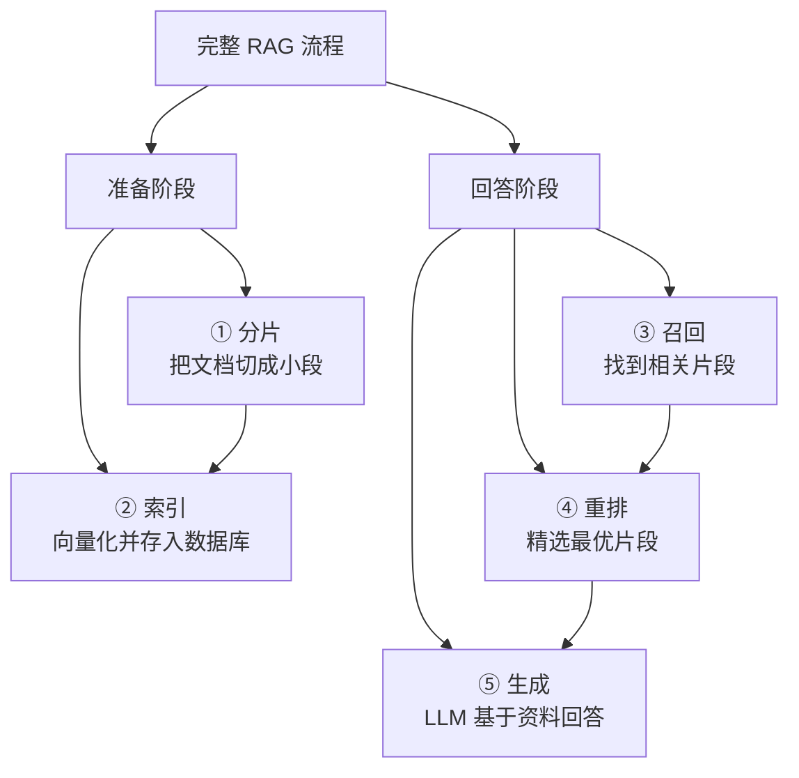

# 生成与回答（Generation）

## 1. 什么是 RAG 的生成阶段？

### 核心定义

生成阶段是 RAG 流程的最后一步——将用户的问题和召回+重排后的参考文档片段**一起交给 LLM**，让 LLM 基于这些参考资料生成最终回答。

### 通俗理解

> 考试时你从参考书里找到了最相关的几页（召回+重排）。现在你要做的是：**读懂这些参考资料，用自己的话组织出一个准确的回答**——既要忠于参考资料，又要回答到点子上。
>
> 这一步就是 LLM 在做的事情。

### 这一步的关键挑战

| 挑战 | 表现 |
|------|------|
| **不忠实于参考资料** | LLM 无视参考内容，用自己的"记忆"回答（可能是错的） |
| **答非所问** | 参考资料给了，但 LLM 没有提取出关键信息 |
| **信息遗漏** | 答案分散在多个片段中，LLM 只用了其中一个 |
| **无法回答时硬答** | 参考资料中没有答案，LLM 仍然编造一个 |

---

## 2. Prompt 设计：RAG 的核心

生成质量 80% 取决于 Prompt 设计。

### 2.1 基础 Prompt 模板

```python
RAG_PROMPT = """你是一个专业的问答助手。请根据以下参考资料回答用户的问题。

## 规则
1. 只根据参考资料中的信息回答，不要使用自己的知识
2. 如果参考资料中没有相关信息，直接说"根据现有资料，无法回答该问题"
3. 回答时引用信息来源（如"根据《员工手册》第12页..."）
4. 回答要简洁、准确、结构清晰

## 参考资料
{context}

## 用户问题
{question}

## 回答
"""
```

### 2.2 为什么 Prompt 规则这么重要？

```
❌ 没有规则的 Prompt:
  "根据以下内容回答问题：{context}。问题：{question}"
  → LLM 可能忽略参考资料，用自己的知识回答
  → 找不到答案时会编造

✅ 有明确规则的 Prompt:
  "只根据参考资料回答，找不到就说不知道"
  → LLM 被约束在参考资料范围内
  → 大幅减少幻觉
```

---

## 3. 实战：构建完整的 RAG 生成链

### 3.1 使用 LangChain 构建

```python
from langchain_openai import ChatOpenAI
from langchain.prompts import ChatPromptTemplate
from langchain_core.output_parsers import StrOutputParser
from langchain_core.runnables import RunnablePassthrough

# 1. 定义 Prompt
prompt = ChatPromptTemplate.from_template("""你是一个专业的问答助手。
请严格根据以下参考资料回答问题，不要使用自己的知识。
如果资料中没有相关信息，请回答"根据现有资料，无法回答该问题"。

参考资料：
{context}

用户问题：{question}

请用简洁准确的语言回答：""")

# 2. 定义 LLM
llm = ChatOpenAI(model="gpt-4o", temperature=0)

# 3. 定义检索器（假设已构建好向量索引）
retriever = vectorstore.as_retriever(search_kwargs={"k": 5})

def format_docs(docs):
    return "\n\n".join(
        f"【来源: {d.metadata.get('source', '未知')}】\n{d.page_content}"
        for d in docs
    )

# 4. 组装 RAG 链
rag_chain = (
    {"context": retriever | format_docs, "question": RunnablePassthrough()}
    | prompt
    | llm
    | StrOutputParser()
)

# 5. 使用
answer = rag_chain.invoke("年假有多少天？")
print(answer)
```

### 3.2 带重排序的完整版本

```python
from langchain.retrievers import ContextualCompressionRetriever
from langchain.retrievers.document_compressors import CrossEncoderReranker
from langchain_community.cross_encoders import HuggingFaceCrossEncoder

# 召回 + 重排
base_retriever = vectorstore.as_retriever(search_kwargs={"k": 20})
reranker = HuggingFaceCrossEncoder(model_name="BAAI/bge-reranker-v2-m3")
compressor = CrossEncoderReranker(model=reranker, top_n=3)

reranking_retriever = ContextualCompressionRetriever(
    base_compressor=compressor,
    base_retriever=base_retriever
)

# 替换检索器即可
rag_chain = (
    {"context": reranking_retriever | format_docs, "question": RunnablePassthrough()}
    | prompt
    | llm
    | StrOutputParser()
)
```

---

## 4. Prompt 进阶技巧

### 4.1 引用来源

让 LLM 在回答中标注信息来源，增加可信度。

```python
CITE_PROMPT = """请根据参考资料回答问题，并在每个要点后标注来源编号。

参考资料：
[1] {doc_1}
[2] {doc_2}
[3] {doc_3}

用户问题：{question}

回答格式要求：
- 每个要点后面用 [编号] 标注出处
- 如果多个来源提到同一信息，标注所有来源
"""

# 生成示例：
# "根据公司规定，年假天数与入职年限有关：
#  - 入职满1年：5天年假 [1]
#  - 入职满5年：10天年假 [1]
#  年假需提前3天在OA系统申请 [2]"
```

### 4.2 处理"找不到答案"的情况

```python
NO_ANSWER_PROMPT = """请根据参考资料回答问题。

重要规则：
- 如果参考资料中包含答案，请据实回答
- 如果参考资料中 **完全没有** 相关信息，请回答：
  "抱歉，根据现有知识库资料，未找到相关信息。建议您联系 HR 部门获取帮助。"
- **绝对不要** 编造参考资料中不存在的信息

参考资料：
{context}

用户问题：{question}
"""
```

### 4.3 多步推理（答案分散在多个片段时）

```python
MULTI_HOP_PROMPT = """请根据参考资料回答问题。
答案可能分散在多段资料中，请综合所有相关信息后再回答。

参考资料：
{context}

用户问题：{question}

思考步骤：
1. 先找出所有与问题相关的信息片段
2. 将这些信息整合起来
3. 给出完整的回答
"""
```

---

## 5. 上下文窗口管理

### 5.1 问题：参考资料太长怎么办？

LLM 的上下文窗口是有限的（GPT-4o 是 128K tokens，但并不是越长越好）。

```
                    LLM 上下文窗口
┌───────────────────────────────────────┐
│ System Prompt     (约 200 tokens)     │
│ ──────────────────                    │
│ 参考资料 chunk 1  (约 500 tokens)     │
│ 参考资料 chunk 2  (约 500 tokens)     │
│ 参考资料 chunk 3  (约 500 tokens)     │
│ ──────────────────                    │
│ 用户问题          (约 50 tokens)      │
│ ──────────────────                    │
│ 模型回答空间      (需要预留)           │
└───────────────────────────────────────┘
```

### 5.2 "Lost in the Middle" 问题

研究发现，LLM 对上下文的**开头和结尾**关注度高，**中间**的内容容易被忽略。

```
关注度:
  ████████░░░░░░░░░░░░░████████
  开头高     中间低         结尾高

对策: 把最相关的内容放在开头和结尾
```

### 5.3 最佳实践

```python
def format_context(docs, max_tokens=3000):
    """格式化上下文，控制总长度"""
    context_parts = []
    total_tokens = 0

    for i, doc in enumerate(docs):
        doc_tokens = len(doc.page_content) // 2  # 粗略估算
        if total_tokens + doc_tokens > max_tokens:
            break
        context_parts.append(
            f"【资料{i+1} | 来源: {doc.metadata.get('source', '未知')}】\n"
            f"{doc.page_content}"
        )
        total_tokens += doc_tokens

    return "\n\n---\n\n".join(context_parts)
```

---

## 6. 生成模型选择

| 模型 | 上下文长度 | 中文效果 | 成本 | 推荐场景 |
|------|-----------|---------|------|---------|
| **GPT-4o** | 128K | 优秀 | 较高 | 高质量回答、复杂推理 |
| **GPT-4o-mini** | 128K | 良好 | 便宜 | 性价比之选 |
| **Claude 3.5 Sonnet** | 200K | 优秀 | 较高 | 长文档理解 |
| **Qwen2.5-72B** | 128K | **优秀** | 免费开源 | 国内部署首选 |
| **DeepSeek-V3** | 128K | 优秀 | 极便宜 | 国内性价比首选 |

### Temperature 设置

| temperature | 效果 | RAG 推荐 |
|-------------|------|---------|
| 0 | 确定性最高，每次回答一样 | **推荐用于事实性问答** |
| 0.3 | 稍有变化，更自然 | 适合对话场景 |
| 0.7+ | 创造性高 | 不推荐用于 RAG |

> RAG 场景建议 **temperature=0**，因为我们要的是准确回答，不是创造性写作。

---

## 7. 完整 RAG Pipeline 代码

把前面 5 篇的所有环节串起来，一个完整的端到端示例：

```python
from langchain_community.document_loaders import PyPDFLoader
from langchain.text_splitter import RecursiveCharacterTextSplitter
from langchain_community.vectorstores import Chroma
from langchain_openai import OpenAIEmbeddings, ChatOpenAI
from langchain.prompts import ChatPromptTemplate
from langchain_core.output_parsers import StrOutputParser
from langchain_core.runnables import RunnablePassthrough

# ========== 准备阶段（只需执行一次）==========

# 1. 加载文档
loader = PyPDFLoader("员工手册.pdf")
documents = loader.load()

# 2. 分片
splitter = RecursiveCharacterTextSplitter(
    chunk_size=500,
    chunk_overlap=80,
    separators=["\n\n", "\n", "。", "；", "，", " ", ""]
)
chunks = splitter.split_documents(documents)
print(f"共切分为 {len(chunks)} 个片段")

# 3. 向量化 + 索引
vectorstore = Chroma.from_documents(
    documents=chunks,
    embedding=OpenAIEmbeddings(model="text-embedding-3-small"),
    persist_directory="./chroma_db"
)

# ========== 回答阶段（每次提问都执行）==========

# 4. 构建检索器
retriever = vectorstore.as_retriever(search_kwargs={"k": 5})

# 5. 定义 Prompt
prompt = ChatPromptTemplate.from_template(
    """你是一个专业的企业知识库问答助手。
请严格根据以下参考资料回答问题。

规则：
1. 只使用参考资料中的信息，不要编造
2. 在回答中标注信息来源
3. 如果资料中没有答案，请明确说明

参考资料：
{context}

用户问题：{question}"""
)

# 6. 定义 LLM
llm = ChatOpenAI(model="gpt-4o", temperature=0)

# 7. 组装 RAG 链
def format_docs(docs):
    return "\n\n".join(
        f"[来源: {d.metadata.get('source','未知')} "
        f"P{d.metadata.get('page','?')}]\n{d.page_content}"
        for d in docs
    )

rag_chain = (
    {"context": retriever | format_docs, "question": RunnablePassthrough()}
    | prompt
    | llm
    | StrOutputParser()
)

# 8. 开始对话
answer = rag_chain.invoke("年假有多少天？")
print(answer)
```

---

## 8. RAG 评估

### 8.1 评估维度

| 维度 | 含义 | 评估方式 |
|------|------|---------|
| **忠实度（Faithfulness）** | 回答是否忠实于参考资料 | 检查回答中是否有参考资料以外的信息 |
| **相关性（Relevance）** | 回答是否切题 | 回答是否直接针对用户问题 |
| **完整性（Completeness）** | 回答是否覆盖了所有关键信息 | 参考资料中的关键点是否都被提及 |
| **无害性（Harmlessness）** | 回答是否安全、无偏见 | 是否包含不当内容 |

### 8.2 使用 RAGAS 框架评估

```python
from ragas import evaluate
from ragas.metrics import (
    faithfulness,       # 忠实度
    answer_relevancy,   # 回答相关性
    context_precision,  # 上下文精确度（召回质量）
    context_recall      # 上下文召回率
)

# 准备评估数据
eval_data = {
    "question": ["年假有多少天？"],
    "answer": ["根据规定，入职满1年5天，满5年10天，满10年15天。"],
    "contexts": [["年假规定：入职满1年享有5天年假，满5年享有10天..."]],
    "ground_truth": ["入职满1年5天年假，满5年10天，满10年15天"]
}

result = evaluate(
    dataset=eval_data,
    metrics=[faithfulness, answer_relevancy, context_precision]
)

print(result)
# faithfulness: 0.95  (回答忠实于参考资料)
# answer_relevancy: 0.92  (回答切题)
# context_precision: 0.88  (召回的内容精准)
```

### 8.3 简单的人工评估模板

```
| 问题 | 期望回答 | 实际回答 | 忠实度 | 相关性 | 完整性 | 通过 |
|------|---------|---------|--------|--------|--------|------|
| 年假多少天 | 1年5天/5年10天/10年15天 | ... | ✅/❌ | ✅/❌ | ✅/❌ | Y/N |
```

> **初期建议人工评估 50~100 条**，找到主要问题后再针对性优化。

---

## 9. 常见问题与优化方向

| 问题 | 原因 | 优化方向 |
|------|------|---------|
| 回答编造了不存在的信息 | Prompt 约束不够强 | 强化"只用参考资料"的指令 |
| 回答太笼统，没有细节 | 召回的片段不够精确 | 优化分片 + 重排序 |
| 回答遗漏了重要信息 | 相关片段没被召回 | 增大召回 K 值 / 使用多查询 |
| 回答和参考资料矛盾 | LLM 的"记忆"干扰 | 降低 temperature / 强调以资料为准 |
| 回答了但不知道对不对 | 没有引用来源 | Prompt 要求标注来源编号 |

---

## 10. 总结



**RAG 全系列核心记忆点**：

| 步骤 | 一句话总结 | 关键技术 |
|------|-----------|---------|
| 分片 | 把大文档拆成语义完整的小段落 | RecursiveCharacterTextSplitter |
| 索引 | 把文本变成向量，存入向量数据库 | BGE Embedding + Chroma/Milvus |
| 召回 | 混合检索，先多捞一些候选 | 稠密+稀疏混合检索 |
| 重排 | 交叉编码器精选最优片段 | BGE-Reranker |
| 生成 | 好的 Prompt + 好的 LLM | temperature=0, 引用来源 |

> **最重要的优化优先级**：分片质量 > 召回策略 > 重排序 > Prompt 优化 > 模型选择

> 📖 上一篇：[5-重排序优化](./5-重排序优化.md) — 如何对召回结果精细排序
> 📖 全系列索引：[1-RAG技术全景介绍](./1-RAG技术全景介绍.md)

---

_本文档持续更新，最后更新：2026年3月_
