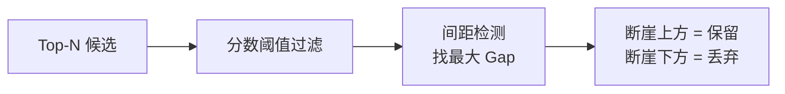
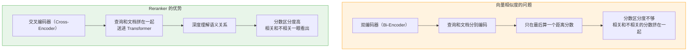
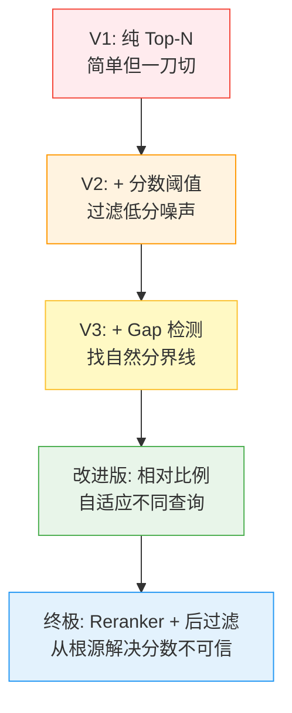

# 召回过滤策略演进（Result Filtering Strategy）

## 1. 为什么需要过滤？

召回阶段拿到 Top K 个候选结果后，**不能无脑全塞给 LLM**。

```
塞太多 → 噪声干扰，LLM 回答质量下降
塞太少 → 遗漏关键信息，LLM 答不全
```

> 你让管理员从档案柜里抱来了 20 份资料。但你不可能 20 份全读——有的非常切题，有的只是沾了个边。
>
> 你需要一套**筛选标准**，快速决定哪些留下、哪些扔掉。

问题是：**这套筛选标准怎么定？** 从简单到复杂，业界经历了多次迭代。

---

## 2. V1：纯 Top-N — 简单粗暴

### 思路

最简单的策略——固定取前 N 条结果。

```python
results = vectorstore.similarity_search(query="年假怎么算？", k=5)
```

### 问题

```
N=3（太少）:
  查询: "公司有哪些福利？"
  Top 3: 年假、体检、餐补
  遗漏: 交通补贴、住房公积金、培训基金...   ← 答案不完整

N=20（太多）:
  查询: "年假怎么算？"
  Top 20: 年假规定、请假流程、考勤制度、报销标准、出差补贴...
  实际相关的只有前 2 条，剩下 18 条全是噪声   ← 干扰 LLM
```

**核心缺陷：N 是写死的，无法适应不同查询的结果分布。** 有的问题只有 1-2 个相关片段，有的可能有 7-8 个，但 N 不会变。

---

## 3. V2：Top-N + 分数阈值 — 初步过滤

### 思路

在 Top-N 的基础上，加一道分数门槛——只保留相似度分数高于阈值的结果。

```python
results = vectorstore.similarity_search_with_score(query="年假怎么算？", k=20)

threshold = 0.80
filtered = [(doc, score) for doc, score in results if score >= threshold]
```

### 改善了什么？

```
Top 20 结果（分数从高到低）:
  0.95, 0.93, 0.88, 0.82, 0.60, 0.55, 0.42, ...

阈值 0.80 过滤后:
  保留: 0.95, 0.93, 0.88, 0.82  ✅
  过滤: 0.60, 0.55, 0.42, ...    ❌

→ 低分噪声被干掉了，比纯 Top-N 好很多
```

### 问题

考虑这组分数：`0.82, 0.81, 0.80, 0.91, 0.92`（排序后：`0.92, 0.91, 0.82, 0.81, 0.80`）

```
阈值 0.80，全部保留。
但实际上只有 0.92、0.91 是真正相关的，
0.82、0.81、0.80 只是"沾边"——分数刚好过线而已。
```

**核心缺陷：平坦的阈值无法区分"勉强过线"和"真正相关"。** 所有过线的结果被一视同仁，但它们的相关性差距可能很大。

---

## 4. V3：Top-N + 分数阈值 + 间距检测 — 找断崖

### 思路

在 V2 的基础上，增加**间距检测（Gap Detection）**：计算相邻结果之间的分数差，如果某个位置出现"断崖式下跌"，就在那里切一刀，只保留断崖上方的结果。




### 示意

```
排序后分数: 0.92, 0.91, 0.82, 0.81, 0.80
相邻间距:      0.01, 0.09, 0.01, 0.01

最大间距 = 0.09（在 0.91 和 0.82 之间）
如果 0.09 > 设定阈值（比如 0.05）→ 在此处切割

保留: 0.92, 0.91     ✅  断崖上方（真正相关）
丢弃: 0.82, 0.81, 0.80  ❌  断崖下方（勉强沾边）
```

### 改善了什么？

相比 V2，能识别出"高分群"和"低分群"之间的**自然分界线**，不再把所有过线的结果一视同仁。

### 仍然存在的问题

**问题 1：固定间距阈值不够鲁棒**

不同的 embedding 模型、不同类型的查询，分数分布差异很大：

```
查询 A 的分数: 0.92, 0.91, 0.88, 0.60, 0.55   ← 间距 0.28 才是断崖
查询 B 的分数: 0.75, 0.73, 0.71, 0.69, 0.40   ← 间距 0.29 才是断崖
查询 C 的分数: 0.95, 0.85, 0.84, 0.83, 0.82   ← 间距 0.10 就已经是断崖了
```

用固定阈值（比如 0.05 或 0.5），在有些查询上灵敏度过高，有些查询上又完全不触发。

**问题 2：多个 Gap 时选哪个？**

```
分数: 0.92, 0.91, [gap=0.06], 0.85, 0.84, [gap=0.14], 0.70
```

两个 Gap，取最大的（0.14）？但可能 0.06 那个才是"真正相关 vs 沾边"的分界线，0.14 只是"沾边 vs 不相关"的分界线。

**问题 3：全高分场景失效**

```
分数: 0.93, 0.92, 0.91, 0.90, 0.89
间距: 0.01, 0.01, 0.01, 0.01
```

所有间距都很小，Gap 检测不会触发，退化为 V2。但实际上可能只有前 2 个是真正相关的。

---

## 5. 更好的策略

### 策略 1：相对分数衰减（推荐）

核心思想：**不用绝对阈值，以最高分为锚点，用比例来判断。**

```python
def relative_decay_filter(scores, docs, decay_ratio=0.85):
    """
    保留分数 >= 最高分 × decay_ratio 的结果
    """
    if not scores:
        return []

    top_score = scores[0]
    threshold = top_score * decay_ratio

    return [
        (doc, score) for doc, score in zip(docs, scores)
        if score >= threshold
    ]
```

**效果演示**：

```
最高分: 0.95，衰减比例: 0.85
阈值 = 0.95 × 0.85 = 0.8075

分数: 0.95, 0.93, 0.88, 0.82, 0.60, 0.55
保留: 0.95, 0.93, 0.88, 0.82   ✅（>= 0.8075）
过滤: 0.60, 0.55               ❌

---

最高分: 0.72，衰减比例: 0.85
阈值 = 0.72 × 0.85 = 0.612

分数: 0.72, 0.70, 0.65, 0.45, 0.30
保留: 0.72, 0.70, 0.65    ✅
过滤: 0.45, 0.30           ❌
```

**优点**：不管分数的绝对值是高是低，都能自适应调整阈值。比例参数（0.85）比绝对阈值稳定得多。

### 策略 2：统计方法（均值 + 标准差）

用分数的统计特征自动确定阈值。

```python
import numpy as np

def statistical_filter(scores, docs, sigma_factor=0.5):
    """
    阈值 = 均值 + sigma_factor × 标准差
    分数高于阈值的保留
    """
    mean = np.mean(scores)
    std = np.std(scores)
    threshold = mean + sigma_factor * std

    return [
        (doc, score) for doc, score in zip(docs, scores)
        if score >= threshold
    ]
```

**效果演示**：

```
分数: 0.95, 0.93, 0.88, 0.82, 0.60, 0.55

均值 = 0.788
标准差 = 0.157
阈值 = 0.788 + 0.5 × 0.157 = 0.867

保留: 0.95, 0.93, 0.88   ✅
过滤: 0.82, 0.60, 0.55   ❌
```

**适用场景**：当分数呈"双峰分布"（一堆高分 + 一堆低分）时特别有效，标准差天然能捕捉到这种分裂。

### 策略 3：改进版 Gap 检测（相对间距）

如果你喜欢 Gap 的思路，可以把固定间距改成**相对间距**：

```python
def relative_gap_filter(scores, docs, min_gap_ratio=0.15):
    """
    间距 / 最高分 > min_gap_ratio 时，认为是断崖
    """
    if len(scores) <= 1:
        return list(zip(docs, scores))

    top_score = scores[0]

    for i in range(len(scores) - 1):
        gap = scores[i] - scores[i + 1]
        if gap / top_score > min_gap_ratio:
            return list(zip(docs[:i + 1], scores[:i + 1]))

    return list(zip(docs, scores))
```

**关键改进**：

- 间距阈值从绝对值变成**与最高分的比例**，不管分数是 0~~1 还是 0~~100 都能用
- 找到**第一个**超过比例的断崖就切割（而不是找最大间距），这通常更符合"真正相关 vs 沾边"的分界

---

## 6. 终极方案：Reranker + 后过滤（工程最佳实践）

### 为什么 Reranker 之后再过滤效果最好？

前面所有策略都有一个根源问题：**向量召回的分数本身不够可信**。




**直观对比**：

```
同一批候选，两种打分方式：

向量召回分数:   0.82, 0.81, 0.80, 0.79, 0.78   ← 全挤在一起，根本分不清
Reranker 分数:  0.95, 0.92, 0.45, 0.30, 0.12   ← 断崖自然出现，一目了然
```

Reranker 的分数本身就把"相关"和"不相关"拉开了，后续无论用哪种过滤策略（相对衰减、统计方法、Gap 检测），都能轻松生效。

### 完整流程


### 实战代码

```python
from sentence_transformers import CrossEncoder
import numpy as np

reranker = CrossEncoder("BAAI/bge-reranker-v2-m3", max_length=512)

query = "年假有多少天？"
candidates = retrieve_top_k(query, k=20)

pairs = [[query, doc.page_content] for doc in candidates]
scores = reranker.predict(pairs)

ranked = sorted(
    zip(candidates, scores), key=lambda x: x[1], reverse=True
)

docs = [item[0] for item in ranked]
scores_sorted = [item[1] for item in ranked]

# 方式一：相对衰减过滤
top_score = scores_sorted[0]
threshold = top_score * 0.85
final = [(d, s) for d, s in ranked if s >= threshold]

# 方式二：Reranker 分数上做 Gap 检测
# （Reranker 分数区分度高，Gap 检测效果好）
for i in range(len(scores_sorted) - 1):
    gap = scores_sorted[i] - scores_sorted[i + 1]
    if gap / scores_sorted[0] > 0.15:
        final = list(ranked[:i + 1])
        break

# 最终兜底：至少保留 1 条，最多不超过 5 条
final = final[:5] if len(final) > 5 else final
final = final or [ranked[0]]
```

---

## 7. 策略对比总结




| 策略             | 优点          | 缺点                | 适用场景               |
| -------------- | ----------- | ----------------- | ------------------ |
| V1 纯 Top-N     | 实现最简单       | N 无法自适应           | 快速原型               |
| V2 + 分数阈值      | 过滤了明显噪声     | 固定阈值不灵活           | 简单场景               |
| V3 + Gap 检测    | 找到自然分界线     | 固定间距不够鲁棒          | 分数分布差异大时不稳定        |
| 改进版（相对比例）      | 自适应不同查询     | 需要调一个比例参数         | 不用 Reranker 时的最佳选择 |
| Reranker + 后过滤 | 分数可信，过滤简单有效 | 多一步计算（约100~300ms） | **生产环境推荐**         |


### 选型建议

```
快速原型 / 验证阶段:
  → V1 或 V2 够用，先跑通流程

正式项目但不想引入 Reranker:
  → 改进版（相对分数衰减），稳定且易实现

生产环境追求效果:
  → Reranker + 后过滤，性价比最高的方案
```

---

## 8. 核心记忆点

1. **不要用固定的绝对阈值**——分数分布因查询而异，绝对值没有普适性
2. **一切阈值都应该"相对化"**——以最高分为锚点，用比例判断
3. **向量相似度分数天然区分度不够**——这是前几种策略效果有限的根源
4. **Reranker 从根源解决问题**——交叉编码器的分数区分度远高于双编码器
5. **召回阶段放宽，过滤阶段收紧**——宽进严出，先求全再求准

> 📖 前置阅读：[4-语义召回](./4-语义召回.md) — 三种召回策略与 Top K 设置
> 📖 前置阅读：[5-重排序优化](./5-重排序优化.md) — Reranker 的原理与实战

---

*本文档持续更新，最后更新：2026年3月*