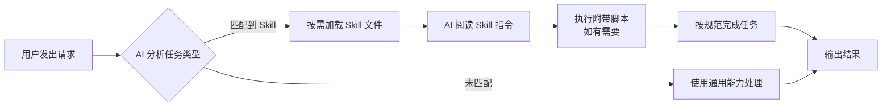
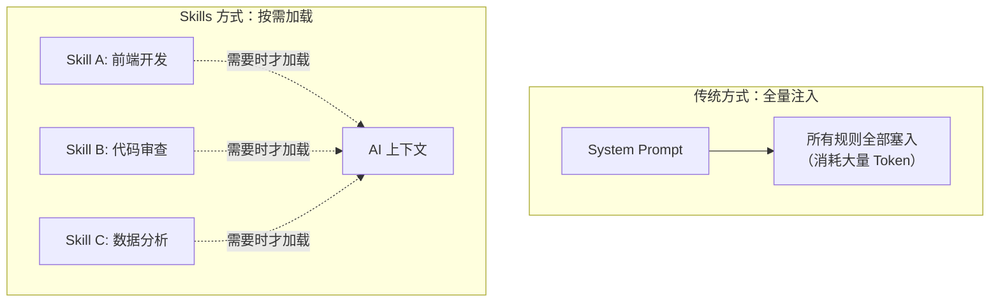
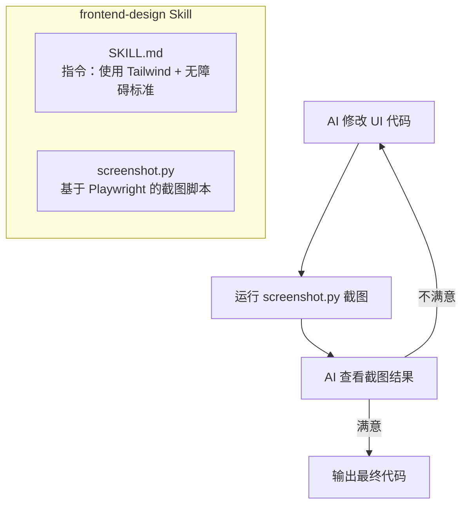
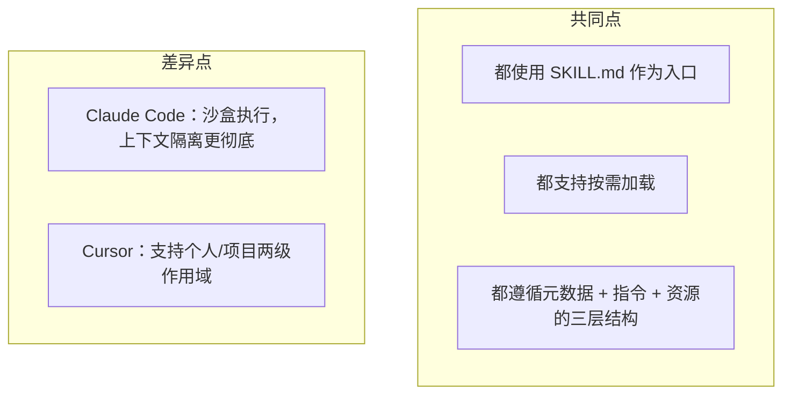
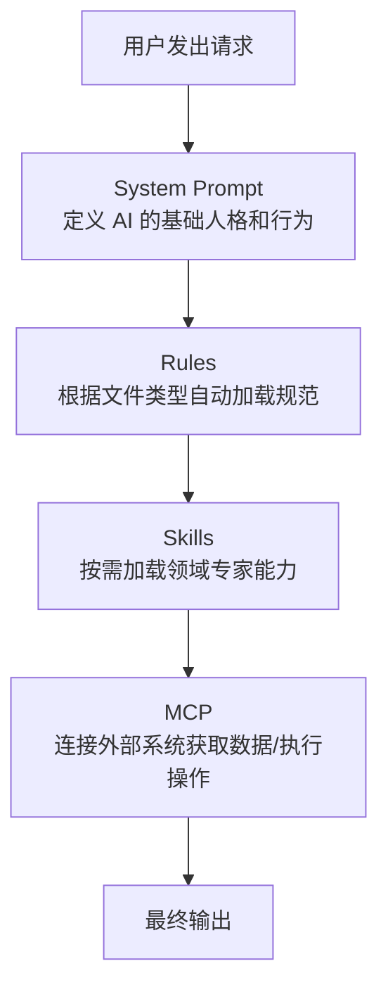
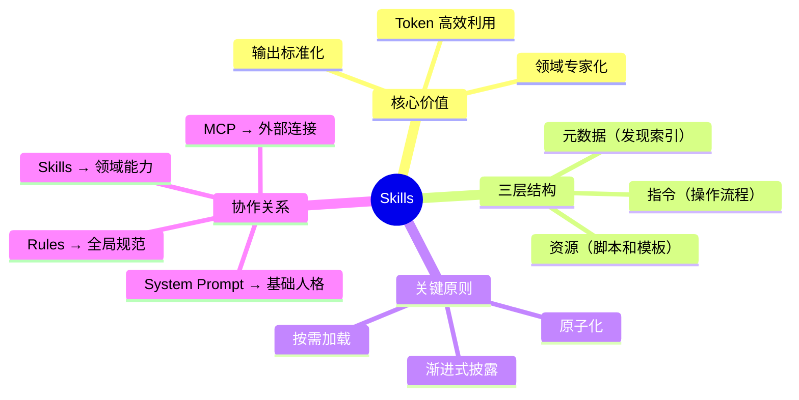

# Skills（AI 技能）

## 什么是 Skills？

### 定义

Skills 是一种**结构化的能力定义文件**，由指令（Instructions）、元数据（Metadata）和资源脚本（Resources）组成。AI 模型可以在需要时**动态加载**这些文件，从而在特定领域任务上获得"专家级"的表现。

简单来说：Skills 就是**写给 AI 看的操作手册**。

### 通俗理解

想象你是一家公司的新员工：

- **没有 Skills** → 你什么都得自己摸索，每次做任务全靠"通用常识"
- **有了 Skills** → 公司给你一本本《操作手册》，做财务就翻财务手册，做设计就翻设计手册

Skills 对 AI 来说就是这些操作手册。AI 平时是个"通用助手"，加载了某个 Skill 后，就变成了那个领域的"专家"。

### 为什么需要 Skills？

AI 模型有一个核心矛盾：

```
能力很强 ≠ 每次都做得对
```

大模型虽然"什么都知道一点"，但面对**具体的、有规范的、需要一致性的任务**时，往往会：

| 问题 | 举例 |
|------|------|
| 不知道你的规范 | 生成代码不符合团队编码规范 |
| 输出不稳定 | 同样的任务，每次做出来格式都不一样 |
| 缺少领域知识 | 不了解你公司内部 API 的调用方式 |
| 浪费 Token | 每次都要在 Prompt 里重复写一大堆要求 |

Skills 就是为了解决这些问题而生的。

## Skills 的工作原理

### 核心流程



### 关键机制：按需加载

Skills 最核心的设计理念是**"按需加载，不用不占"**：



这意味着：
- 你可以定义 100 个 Skills，但 AI 在某次对话中可能只加载 1-2 个
- **未被使用的 Skill 不会占用上下文窗口**，极大节省了 Token

## Skills 的三层结构

每个 Skill 本质上是一个**文件夹**，包含三层内容：

```
my-skill/
├── SKILL.md              ← 第一层：元数据 + 指令（必需）
├── reference.md          ← 第三层：补充资源（可选）
├── examples.md           ← 第三层：补充资源（可选）
└── scripts/              ← 第三层：补充资源（可选）
    ├── validate.py
    └── helper.sh
```

### 第一层：元数据（Frontmatter）

位于 `SKILL.md` 文件顶部的 YAML 区域，是 **AI 发现和匹配 Skill 的依据**：

```yaml
---
name: code-review
description: Review code for quality, security, and maintainability. Use when reviewing pull requests or code changes.
---
```

| 字段 | 作用 | 要求 |
|------|------|------|
| `name` | 唯一标识符 | 小写字母+连字符，最多 64 字符 |
| `description` | AI 判断"要不要加载这个 Skill"的依据 | 必须包含"做什么"和"什么时候用" |

> **关键点**：`description` 是 Skill 能否被 AI 正确匹配的**唯一索引**。写得模糊，AI 就找不到它。

### 第二层：正文指令（Instructions）

`SKILL.md` 的正文部分，定义 AI 应该**怎么做**。这是 Skill 的核心：

```markdown
# Code Review

## 审查步骤
1. 检查代码逻辑正确性
2. 检查安全漏洞
3. 检查代码可读性
4. 检查测试覆盖率

## 反馈格式
- 🔴 **严重**：必须修复
- 🟡 **建议**：建议改进
- 🟢 **优化**：可选优化
```

### 第三层：资源文件（Resources）

Skill 文件夹中的其他文件——脚本、配置、模板等：

```
scripts/
├── screenshot.py    ← 截图脚本，赋予 AI "看页面"的能力
├── validate.py      ← 验证脚本，检查输出是否合规
└── template.json    ← 模板文件，定义输出格式
```

资源文件有两种用法：
- **AI 执行它**：比如运行 Python 脚本来截图、验证
- **AI 阅读它**：比如参考模板文件来生成内容

## 实战案例拆解

### 案例：前端设计 Skill（Anthropic 官方）

这是 Anthropic 官方提供的 `frontend-design` Skill，非常经典：



这个 Skill 做了三件聪明的事：

| 设计 | 效果 |
|------|------|
| **能力补全** | 通过 `screenshot.py` 让 AI 获得了"看页面"的视觉能力 |
| **上下文剥离** | 浏览器的复杂日志留在沙盒里，AI 只拿到截图，保持上下文清晰 |
| **工程约束** | 在指令中强制 Tailwind + 无障碍，确保生成代码符合生产标准 |

### 案例：代码审查 Skill（通用模式）

一个简单但实用的 Skill 结构：

```
code-review/
├── SKILL.md          ← 审查流程 + 反馈格式
├── STANDARDS.md      ← 详细编码规范（按需阅读）
└── examples.md       ← 审查案例参考（按需阅读）
```

`SKILL.md` 中用**渐进式披露**的方式组织内容：

```markdown
## 快速开始
[核心审查步骤，必看]

## 详细规范
- 完整编码标准请参考 [STANDARDS.md](STANDARDS.md)
- 审查案例请参考 [examples.md](examples.md)
```

AI 先读核心指令，只有需要深入了解时才去读补充文件——这就是**渐进式披露**，精准控制 Token 消耗。

## 跨平台对比：Skills 在不同 AI 工具中的实现

Skills 的理念是通用的，但不同 AI 工具的实现方式有差异：

### Claude Code（Anthropic）

| 项目 | 说明 |
|------|------|
| 存放位置 | `.claude/skills/` |
| 核心文件 | `SKILL.md` |
| 特色 | 沙盒执行脚本，只保留执行结果到上下文 |
| 版本管理 | 随代码库 Git 提交，支持分支级别的能力版本化 |

### Cursor

| 项目 | 说明 |
|------|------|
| 个人级别 | `~/.cursor/skills/skill-name/` |
| 项目级别 | `.cursor/skills/skill-name/` |
| 核心文件 | `SKILL.md` |
| 特色 | 区分个人 Skills 和项目 Skills，灵活度更高 |

### 核心异同



## Skills vs 其他机制

初学者容易把 Skills 和其他几个概念搞混，下面做一个清晰的对比：

### Skills vs MCP（Model Context Protocol）

| 维度 | Skills | MCP |
|------|--------|-----|
| **定位** | 领域专家——教 AI "怎么做" | 连接器——让 AI "能连上" |
| **解决的问题** | AI 不知道你的规范和流程 | AI 无法访问外部系统和数据 |
| **Token 效率** | 极高，按需加载 | 中低，通常全量注入 Schema |
| **举例** | "按团队规范审查代码" | "连接 GitHub 读取 PR 信息" |

> **一句话区分**：MCP 让 AI "连得上"，Skills 让 AI "做得好"。

### Skills vs Rules（规则文件）

| 维度 | Skills | Rules |
|------|--------|-------|
| **加载方式** | 按需加载，AI 自行判断 | 根据配置（如文件匹配 glob）自动加载 |
| **组成** | 指令 + 脚本 + 资源文件 | 纯文本指令 |
| **粒度** | 针对特定任务的完整解决方案 | 通用性规范和约束 |
| **举例** | "前端设计 Skill（含截图脚本）" | "所有 .vue 文件使用 Vue 3 写法" |

> **一句话区分**：Rules 是"全局校规"，Skills 是"专业课教材"。

### Skills vs System Prompt

| 维度 | Skills | System Prompt |
|------|--------|---------------|
| **持久性** | 文件形式持久存在 | 每次对话需重新设定 |
| **复用性** | 可跨项目、跨团队共享 | 通常不方便复用 |
| **丰富度** | 可包含脚本和资源文件 | 纯文本 |
| **Token 消耗** | 按需加载，精准控制 | 每次对话都全量消耗 |

### 四者协作关系



它们是**互补关系**，不是替代关系。一个成熟的 AI 工作流通常会同时使用这四者。

## 编写高质量 Skills 的最佳实践

### 1. Description 是灵魂

```yaml
# ❌ 太模糊，AI 无法准确匹配
description: Helps with documents

# ✅ 明确"做什么"+"什么时候用"
description: Extract text and tables from PDF files, fill forms, merge documents. Use when working with PDF files or when the user mentions PDFs, forms, or document extraction.
```

### 2. 原子化——一个 Skill 只做一件事

```
# ❌ 一个 Skill 包罗万象
all-in-one/
├── SKILL.md  ← 前端、后端、测试、部署全写在一起

# ✅ 拆分成多个专注的 Skill
frontend-design/
├── SKILL.md  ← 只管前端设计

code-review/
├── SKILL.md  ← 只管代码审查

deploy/
├── SKILL.md  ← 只管部署流程
```

### 3. 渐进式披露——控制信息密度

```markdown
## 快速开始
[10 行核心指令，AI 必读]

## 详细参考
- 完整 API 文档：[reference.md](reference.md)
- 更多示例：[examples.md](examples.md)
```

核心信息放在 `SKILL.md` 中，详细内容拆到独立文件——**AI 需要时才去读**。

### 4. SKILL.md 控制在 500 行以内

上下文窗口是共享资源。Skill 太长 → 挤占其他信息的空间 → AI 表现反而下降。

### 5. 用脚本代替生成

```markdown
# ❌ 让 AI 每次现场生成代码
"请编写一个 PDF 解析脚本..."

# ✅ 提供预写好的脚本
"运行 `python scripts/parse_pdf.py input.pdf`"
```

预写脚本的优势：更可靠、更一致、节省 Token。

## 常见误区

| 误区 | 问题 | 正确做法 |
|------|------|----------|
| Description 写得太短 | AI 无法匹配到这个 Skill | 包含具体功能描述和触发场景 |
| 把所有内容塞进一个 Skill | Skill 臃肿，Token 浪费 | 原子化拆分 |
| 在 Skill 中写时间敏感信息 | "2025 年之前用旧 API" 会过时 | 用"当前方式/旧方式"替代 |
| 术语不一致 | 一会儿说"接口"一会儿说"端点" | 全文统一术语 |
| 引用文件嵌套过深 | AI 可能读不完 | 只从 SKILL.md 直接引用，保持一层深度 |
| 给 AI 过多选择 | "你可以用 A 或 B 或 C..." | 给出默认推荐，特殊情况再提备选 |

## 总结

Skills 的本质可以用一句话概括：

> **把"项目规范"转化为"AI 的本能"。**



**选型建议：**

- 需要 AI 连接外部系统？→ 选 **MCP**
- 需要对所有文件生效的通用规范？→ 选 **Rules**
- 需要 AI 深度参与特定任务、遵循特定流程、对 Token 敏感？→ 选 **Skills**

---

_本文档将持续更新，添加更多关于 Skills 的实践案例和平台发展动态_
