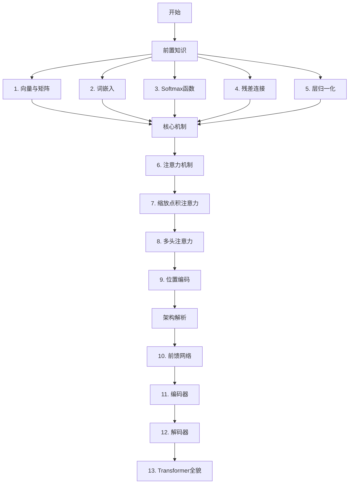

# Transformer 学习路径

> 本系列文档以论文《Attention is All You Need》为主线，帮助你从零开始彻底搞懂 Transformer。

---

## 为什么要学 Transformer？

Transformer 是当今几乎所有大语言模型（GPT、Claude、Gemini 等）的基础架构。理解它，就是理解现代 AI 的核心引擎。

但 Transformer 涉及的概念很多，直接啃论文会非常痛苦。本系列将它拆成 **13 个独立知识点**，按顺序学完，你会对整个架构有清晰的理解。

---

## 贯穿全系列的例子

我们用同一句话作为所有文档的演示示例：

> **"我 爱 北京 天安门"**

所有概念（向量、词嵌入、注意力计算……）都会用这句话来演示，方便你前后对照。

---

## 学习路线图

---

## 文档目录

### 第一阶段：前置知识

这一阶段的目标是把理解 Transformer 所需的数学和神经网络基础打牢。

| 序号 | 文档 | 核心问题 |
|------|------|----------|
| 1 | [向量与矩阵](./前置知识/1-向量与矩阵.md) | 词和句子怎么用数字表示？点积是什么意思？ |
| 2 | [词嵌入](./前置知识/2-词嵌入.md) | 为什么要把词变成向量？怎么变？ |
| 3 | [Softmax 函数](./前置知识/3-Softmax函数.md) | 怎么把一堆分数变成概率？ |
| 4 | [残差连接](./前置知识/4-残差连接.md) | 为什么深层网络难训练？残差如何解决？ |
| 5 | [层归一化](./前置知识/5-层归一化.md) | 为什么训练会不稳定？怎么归一化？ |

### 第二阶段：核心机制

这一阶段是整个 Transformer 最重要的部分，理解注意力机制是关键。

| 序号 | 文档 | 核心问题 |
|------|------|----------|
| 6 | [注意力机制](./核心机制/6-注意力机制.md) | 什么是"注意力"？Q、K、V 分别是什么？ |
| 7 | [缩放点积注意力](./核心机制/7-缩放点积注意力.md) | 注意力分数怎么计算？为什么要除以 √d？ |
| 8 | [多头注意力](./核心机制/8-多头注意力.md) | 为什么要用多个"头"并行计算？ |
| 9 | [位置编码](./核心机制/9-位置编码.md) | Transformer 怎么知道词的顺序？ |

### 第三阶段：架构解析

这一阶段将所有概念组装成完整的 Transformer 架构。

| 序号 | 文档 | 核心问题 |
|------|------|----------|
| 10 | [前馈网络](./架构解析/10-前馈网络.md) | 注意力层之后还有什么？ |
| 11 | [编码器](./架构解析/11-编码器.md) | 编码器如何理解输入句子？ |
| 12 | [解码器](./架构解析/12-解码器.md) | 解码器如何一步步生成输出？ |
| 13 | [Transformer 全貌](./架构解析/13-Transformer全貌.md) | 完整架构串联，对照论文 Figure 1 |

---

## 阅读建议

- **按顺序阅读**：前面的文档是后面的基础，跳读会遇到看不懂的概念
- **动手推算**：遇到公式时，拿纸笔跟着例子算一遍，效果翻倍
- **不懂就回头**：遇到不理解的概念，返回对应的前置文档查阅

---

_本系列文档基于《Attention is All You Need》（Vaswani et al., 2017）_
