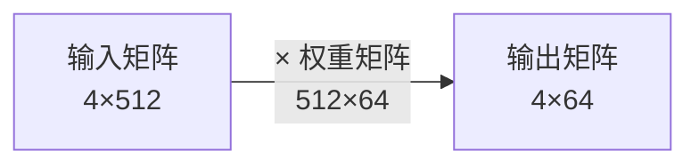
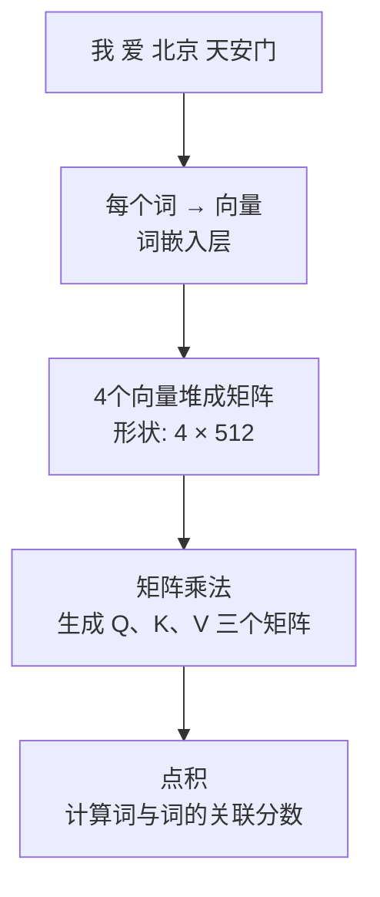

# 向量与矩阵（Vector & Matrix）

> 这是理解 Transformer 的数学基础。不需要你是数学专家，只需要理解几个核心操作。

---

## 1. 向量是什么？

### 直觉理解

向量就是**一组有序的数字**。

比如你描述一个城市的位置，需要两个数：经度和纬度。  
`北京 = [116.4, 39.9]`

这就是一个二维向量。在 AI 里，我们用同样的思路来描述词语的"位置"——只不过维度更高，比如 512 维。

### 在 Transformer 中

每个词最终都会被表示成一个向量，例如（简化示意）：

```
"我"    → [0.2, 0.8, 0.1, 0.5, ...]   （512个数字）
"爱"    → [0.9, 0.1, 0.7, 0.3, ...]
"北京"  → [0.4, 0.6, 0.2, 0.9, ...]
"天安门" → [0.3, 0.5, 0.8, 0.2, ...]
```

每个词用一个向量来"定位"它在语义空间中的位置。

---

## 2. 向量的核心操作：点积

### 什么是点积？

两个向量的**点积**就是：把对应位置的数字两两相乘，然后全部加起来。

```
a = [1, 2, 3]
b = [4, 5, 6]

点积 = 1×4 + 2×5 + 3×6
     = 4 + 10 + 18
     = 32
```

### 点积的含义

**点积的大小代表两个向量的相似程度。**

- 点积越大 → 两个词越"相关"
- 点积越小（接近0）→ 两个词越"无关"

举个例子：

```
"北京" 和 "天安门" 的点积 → 数值很大（它们语义相近）
"北京" 和 "爱" 的点积    → 数值较小（语义关联弱）
```

这正是 Transformer 计算"注意力"的核心操作：**用点积判断两个词之间的关联程度**。

---

## 3. 矩阵是什么？

### 直觉理解

矩阵就是**一张数字表格**，有行和列。

一个 4×512 的矩阵可以同时存储 4 个词的向量：

```
         维度1  维度2  维度3  ...  维度512
"我"    [ 0.2,  0.8,  0.1,  ...,  0.5 ]
"爱"    [ 0.9,  0.1,  0.7,  ...,  0.3 ]
"北京"  [ 0.4,  0.6,  0.2,  ...,  0.9 ]
"天安门" [ 0.3,  0.5,  0.8,  ...,  0.2 ]
```

整句话"我爱北京天安门"就变成了一个 **4 × 512 的矩阵**。

### 矩阵乘法

矩阵乘法可以理解为：**同时对很多向量做相同的变换**。



比如把每个词的 512 维向量压缩成 64 维，只需一次矩阵乘法就能批量处理所有词。

**这就是为什么 Transformer 运算速度快**——矩阵乘法可以并行计算，同时处理句子里的每个词。

---

## 4. 在 Transformer 中的实际应用



简单说：
- 词 → 向量（词嵌入）
- 多个向量 → 矩阵（句子表示）
- 矩阵乘法 → 生成查询/键/值（Q/K/V）
- 点积 → 计算注意力分数

这四步在后面的文档里会详细展开，先记住它们的形状和含义。

---

## 5. 关键总结

| 概念 | 是什么 | 在 Transformer 里的作用 |
|------|--------|------------------------|
| 向量 | 一组有序数字 | 表示单个词的语义 |
| 点积 | 对应元素相乘再求和 | 衡量两个词的相关性 |
| 矩阵 | 数字表格（多个向量） | 同时表示整句话 |
| 矩阵乘法 | 批量线性变换 | 并行处理所有词，生成 Q/K/V |

---

**下一篇**：[词嵌入](./2-词嵌入.md) — 词是怎么变成向量的？
