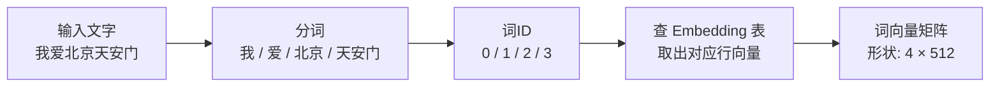

# 词嵌入（Word Embedding）

> 计算机只认识数字，不认识文字。词嵌入解决的就是这个问题：把词变成向量。

---

## 1. 核心问题：词怎么变成数字？

最简单的想法是给每个词编一个编号：

```
"我"    → 0
"爱"    → 1
"北京"  → 2
"天安门" → 3
```

但这样有个致命缺陷：编号本身没有任何语义信息。数字 2 和数字 3 之间的差值是 1，但"北京"和"天安门"之间的关系难道和"我"和"爱"一样？显然不是。

---

## 2. 词嵌入的核心思路

### 把词放进"语义空间"

词嵌入的思路是：**让语义相近的词，在数字空间中的位置也相近**。

想象一个二维平面（实际上是512维，但用2维方便画图）：

```
              ↑ 地点
              |
    天安门 ★  |  ★ 长城
              |  ★ 北京
    ─────────────────────→ 感情
         ★ 爱
    ★ 我      |
```

- "北京"和"天安门"在图上位置很近 → 它们的向量很相似
- "我"和"爱"距离较远 → 语义不同

### 经典例子

词嵌入有一个著名的现象：

```
"国王" - "男人" + "女人" ≈ "女王"
```

这说明词向量真的捕捉到了语义关系，可以做加减运算！

---

## 3. Embedding 表是怎么工作的？

### 本质就是一张查找表

训练好的模型内部有一张 **Embedding 表**：

```
词汇表大小 × 向量维度（512）

         dim1   dim2   dim3   ...  dim512
"我"   [ 0.21, -0.54,  0.88, ...,  0.12 ]
"爱"   [ 0.93,  0.07, -0.31, ..., -0.45 ]
"北京" [ 0.44,  0.61,  0.22, ...,  0.87 ]
"天安门"[ 0.35,  0.48,  0.79, ...,  0.23 ]
...（词汇表里所有词）
```

当输入一个词时，就去这张表里查对应的那一行，拿出来用。

### 流程示意



---

## 4. 这些向量是怎么来的？

### 不是人工设计的，是训练出来的

Embedding 表里的数值是模型在**大量文本上训练**时自动学习到的。

训练目标可以简单理解为：**如果两个词经常在相似的上下文中出现，它们的向量就应该相近**。

比如"北京"和"上海"都经常出现在"去\_\_旅游"、"\_\_的地铁"这样的句子里，训练后它们的向量就会比较接近。

---

## 5. 在 Transformer 中的位置

词嵌入是整个 Transformer 的**第一步**，输入文字必须先经过它才能进入后续计算：


注意：词嵌入只表示词的**语义**，不包含词在句子中的**位置**信息。  
位置信息由专门的「位置编码」来补充，见：[位置编码](../核心机制/9-位置编码.md)

---

## 6. 关键总结

| 概念 | 解释 |
|------|------|
| 词嵌入 | 把词映射成固定长度的向量 |
| Embedding 表 | 一张查找表，存储所有词的向量 |
| 向量的相似性 | 语义相近的词，向量点积更大 |
| 来源 | 通过训练自动学习，不是人工设计 |
| 维度 | Transformer 论文中使用 512 维 |

---

**上一篇**：[向量与矩阵](./1-向量与矩阵.md)  
**下一篇**：[Softmax 函数](./3-Softmax函数.md) — 怎么把分数变成概率？
