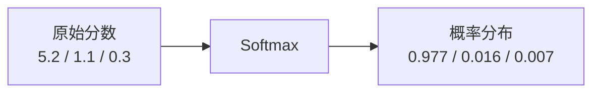
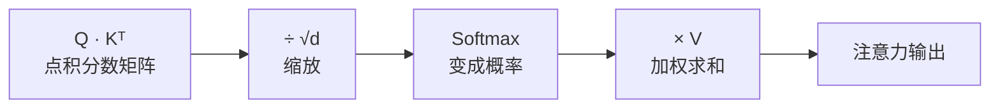

# Softmax 函数（Softmax Function）

> Softmax 把一组任意数字变成一组概率，让它们加起来等于 1。这是注意力机制计算权重的核心步骤。

---

## 1. 核心问题：为什么需要它？

在注意力机制里，我们需要计算"这个词应该对其他词付出多少注意力"。

比如处理"我爱北京天安门"时，对于"北京"这个词：
- 它和"天安门"的关联分数 = 5.2
- 它和"爱"的关联分数 = 1.1
- 它和"我"的关联分数 = 0.3

这些分数的范围和量纲不统一，我们需要把它们变成**加起来等于 1 的权重**，才能用来做加权求和。

这就是 Softmax 的作用。

---

## 2. Softmax 是怎么计算的？

### 公式

$$\text{Softmax}(x_i) = \frac{e^{x_i}}{\sum_j e^{x_j}}$$

看起来有点复杂，但实际上分三步：

**第一步**：对每个数字取 `e` 的幂次（让所有数变成正数）

```
5.2 → e^5.2 ≈ 181.3
1.1 → e^1.1 ≈ 3.0
0.3 → e^0.3 ≈ 1.3
```

**第二步**：把所有结果加起来

```
总和 = 181.3 + 3.0 + 1.3 = 185.6
```

**第三步**：每个数除以总和

```
天安门的权重 = 181.3 / 185.6 ≈ 0.977
爱的权重     =   3.0 / 185.6 ≈ 0.016
我的权重     =   1.3 / 185.6 ≈ 0.007
```

结果：0.977 + 0.016 + 0.007 = 1.0 ✓

---

## 3. Softmax 的两个关键特性

### 特性 1：突出最大值（赢者通吃）

由于用了指数函数，原来最大的那个数会被**大幅放大**，而小的数会被压得很小。



这让注意力机制能**聚焦**于最相关的词，而不是平均分配注意力。

### 特性 2：全部为正且和为 1

Softmax 的输出可以直接当概率用，非常适合做"加权求和"。

---

## 4. 生活化类比

想象你去餐厅，菜单上有三道菜，服务员问你"各点多少份"：

| 喜爱程度（原始分数） | 转成点菜比例（Softmax 后） |
|---------------------|--------------------------|
| 红烧肉：5.2分（非常喜欢） | 97.7% |
| 炒青菜：1.1分（一般喜欢） | 1.6% |
| 白米饭：0.3分（不太想要） | 0.7% |

Softmax 就像一个"偏好放大器"——原来的小差距，经过它之后会变成显著的差距，让你更"果断"地专注于最想要的那个选项。

---

## 5. 在 Transformer 中的位置

在注意力机制里，Softmax 处于这个位置：



Softmax 之前计算的是原始关联分数，Softmax 之后才是真正的注意力权重。

---

## 6. 关键总结

| 特点 | 说明 |
|------|------|
| 输入 | 任意一组实数（可正可负） |
| 输出 | 一组概率（全部正数，和为1） |
| 关键操作 | 取指数 → 求和 → 归一化 |
| 效果 | 放大最大值，压缩小值 |
| 在 Transformer 中的作用 | 把注意力分数变成注意力权重 |

---

**上一篇**：[词嵌入](./2-词嵌入.md)  
**下一篇**：[残差连接](./4-残差连接.md) — 为什么深层网络难以训练？
