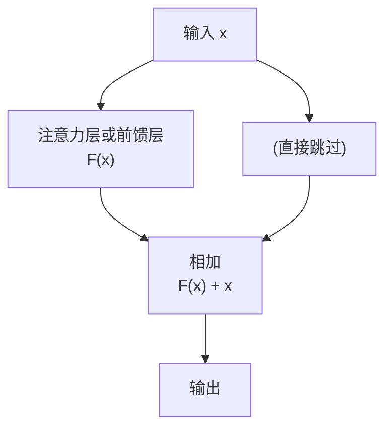
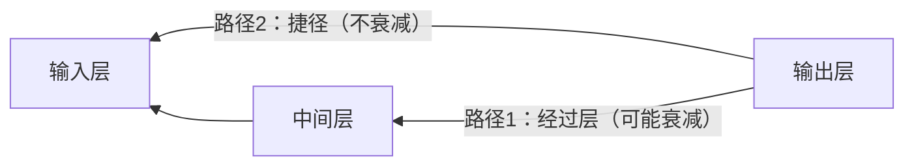
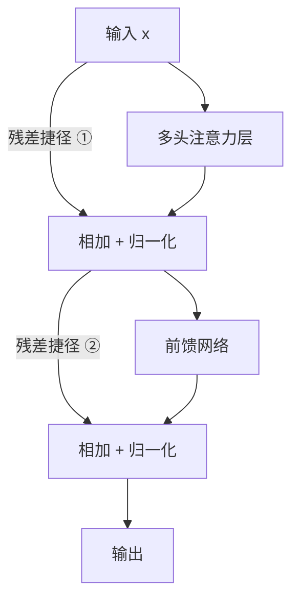

# 残差连接（Residual Connection）

> 残差连接解决的是深层神经网络训练难的问题，用一个极简的"捷径"让梯度能顺利流动。

---

## 1. 核心问题：深层网络为什么难训练？

神经网络通过"反向传播"来调整参数：从输出层往输入层逐层传递误差信号（梯度），告诉每一层"你需要怎么调整"。

但当网络层数很深（比如 Transformer 的 6 层编码器），梯度在经过每一层时都会**越来越小**，到了靠近输入的层，信号已经微弱得几乎是 0 了。

这就是**梯度消失**问题——靠近输入的层几乎学不到任何东西。


---

## 2. 残差连接的解决方案

### 核心思路：加一条"捷径"

残差连接的做法极其简单：**在每一层的输入和输出之间加一条直连通道**，把输入直接加到输出上。

```
普通连接：输出 = F(输入)

残差连接：输出 = F(输入) + 输入
                           ↑
                        这个"+ 输入"就是捷径
```

用图来理解：



这条跳过中间层的连接就叫**残差连接**，也叫**跳跃连接（Skip Connection）**。

---

## 3. 为什么这样就能解决梯度消失？

有了残差连接，梯度在反向传播时有**两条路可走**：

1. 通过中间层（可能会衰减）
2. **直接走捷径**（梯度不衰减，原封不动传回去）



哪怕路径1的梯度消失了，路径2的梯度仍然完好地传到了输入层。这样**每一层都能收到有效的训练信号**。

---

## 4. 生活化类比

想象你在爬楼梯（神经网络），需要把一个消息从顶楼传到底楼（梯度反向传播）。

- **没有残差连接**：消息只能口口相传，每传一层就衰减一点，传到底楼已经面目全非。
- **有残差连接**：除了口口相传，还有一部电话能直接从顶楼打到底楼，消息保真传递。

---

## 5. 在 Transformer 中的具体位置

Transformer 的编码器每一层都有两处残差连接：



在论文中，这个操作写作 **Add & Norm**：
- **Add** = 残差连接（把输入加到输出上）
- **Norm** = 层归一化（下一篇会介绍）

---

## 6. 残差连接的数学形式

$$\text{输出} = \text{LayerNorm}(x + \text{Sublayer}(x))$$

其中：
- `x` = 该层的输入
- `Sublayer(x)` = 注意力层或前馈层的计算结果
- `x + Sublayer(x)` = 残差相加
- `LayerNorm(...)` = 层归一化（稳定数值范围）

---

## 7. 关键总结

| 概念 | 说明 |
|------|------|
| 梯度消失 | 深层网络中梯度逐层衰减，导致训练困难 |
| 残差连接 | 把输入直接加到输出：`F(x) + x` |
| 解决原理 | 提供梯度不衰减的捷径通道 |
| 在 Transformer 中 | 每个子层（注意力层/前馈层）后都有一个 Add & Norm |

---

**上一篇**：[Softmax 函数](./3-Softmax函数.md)  
**下一篇**：[层归一化](./5-层归一化.md) — Add & Norm 中的 Norm 是什么？
