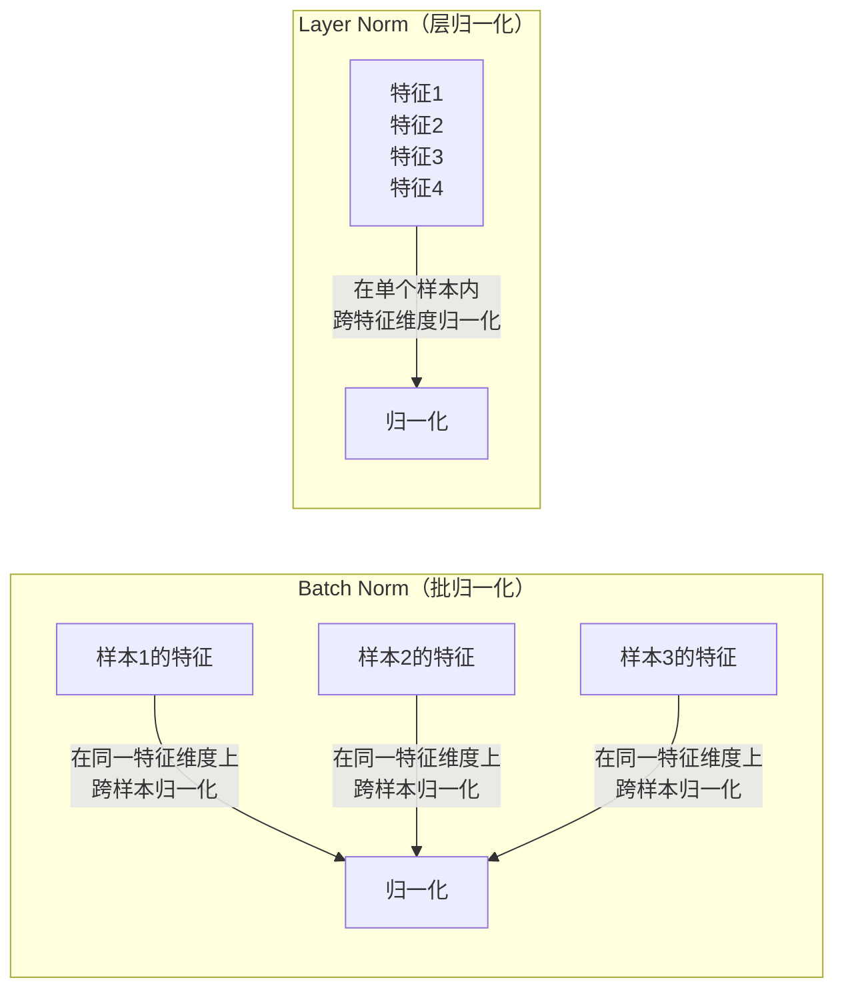
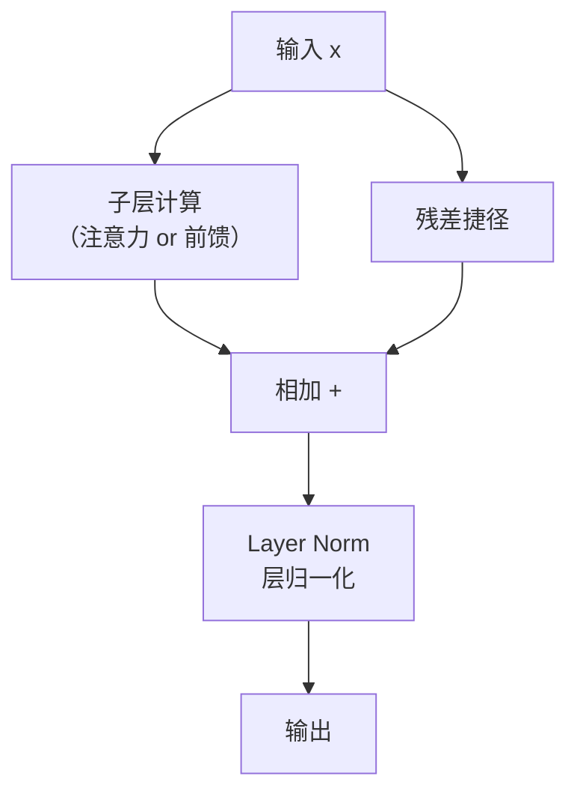

# 层归一化（Layer Normalization）

> 层归一化让每一层的输出数值保持在合理范围内，避免训练过程中数值爆炸或消失，让模型训练更稳定。

---

## 1. 核心问题：数值为什么会失控？

神经网络每一层都在做矩阵乘法和加法。随着层数加深，数值可能变得极大或极小：

```
第1层输出：0.5, -0.3, 1.2, 0.8
第3层输出：15.2, -8.4, 22.1, 0.03
第6层输出：1582.3, -940.2, 0.0001, 2871.4
```

**数值过大**（爆炸）：梯度也会爆炸，训练崩溃  
**数值过小**（消失）：梯度消失，层学不到东西

归一化就是把这些失控的数值**拉回到合理范围**。

---

## 2. 归一化的核心操作

归一化的目标是：把一组数字变成**均值为 0、方差为 1** 的标准形态。

操作分两步：

**第一步：计算均值和方差**

```
原始向量：[2, 4, 6, 8]
均值  μ = (2+4+6+8) / 4 = 5
方差  σ = sqrt(((2-5)² + (4-5)² + (6-5)² + (8-5)²) / 4) = sqrt(5) ≈ 2.24
```

**第二步：标准化**

```
归一化后：[(2-5)/2.24, (4-5)/2.24, (6-5)/2.24, (8-5)/2.24]
        = [-1.34, -0.45, 0.45, 1.34]
```

现在均值 ≈ 0，数值范围稳定了。

---

## 3. Layer Norm vs Batch Norm

归一化有两种常见方式，Transformer 用的是 **Layer Norm（层归一化）**：



| 对比项 | Batch Norm | Layer Norm |
|--------|-----------|-----------|
| 归一化方向 | 同一特征跨样本 | 同一样本跨特征 |
| 依赖 batch 大小 | 是 | 否 |
| 适合 NLP | 不太适合（序列长度不固定）| 非常适合 |

**Transformer 选 Layer Norm 的原因**：NLP 处理的句子长度不固定，Batch Norm 依赖固定的 batch 统计量会有问题，而 Layer Norm 只在单个样本内操作，不受影响。

---

## 4. 可学习的参数

层归一化不只是机械地标准化，它还有两个可训练的参数 `γ`（gamma）和 `β`（beta）：

$$\text{LayerNorm}(x) = \gamma \cdot \frac{x - \mu}{\sigma} + \beta$$

- 归一化后乘以 `γ`（缩放）
- 再加上 `β`（平移）

这两个参数通过训练学习，让模型**在需要时可以恢复部分原始的数值范围**，而不是强制把所有层都压成完全相同的分布。

---

## 5. 在 Transformer 中的位置

层归一化配合残差连接，构成了 Transformer 里随处可见的 **Add & Norm** 模块：



每次经过注意力层或前馈层之后，都会做一次 Add & Norm，确保数值始终处于健康范围。

---

## 6. 生活化类比

想象工厂流水线上，每道工序结束后都有一个**质检环节**：

- 工序（子层计算）加工完产品
- 质检（层归一化）把产品调整到标准规格（不能太大太小）
- 再送往下一道工序

没有质检，经过几十道工序后，产品的规格会越来越离谱，生产线崩溃。

---

## 7. 关键总结

| 概念 | 说明 |
|------|------|
| 归一化的目的 | 把数值稳定在合理范围，防止爆炸/消失 |
| 层归一化 | 在单个样本内跨特征维度做归一化 |
| 与 Batch Norm 的区别 | 不依赖 batch，适合 NLP 变长序列 |
| 可学习参数 γ、β | 允许模型灵活调整归一化后的分布 |
| 在 Transformer 中 | Add & Norm 的"Norm"部分，出现在每个子层之后 |

---

**上一篇**：[残差连接](./4-残差连接.md)  
**下一篇**：[注意力机制](../核心机制/6-注意力机制.md) — Transformer 最核心的创新
