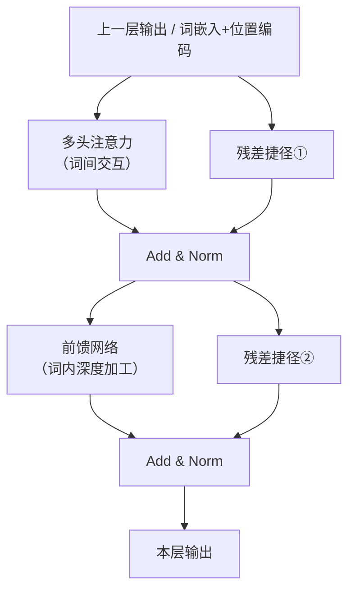

# 前馈网络（Feed-Forward Network）

> 前馈网络是 Transformer 编码器和解码器中每层的第二个子层，紧接在多头注意力之后。它对每个词独立地做深度加工。

---

## 1. 核心问题：注意力层之后还差什么？

多头注意力做的事情是：让每个词"收集"其他词的信息，融合上下文。

但融合信息之后，这些信息还需要被进一步**加工和提炼**——提取更高层次的特征。

这就是前馈网络的作用：对每个词的向量做一次独立的非线性变换，增强模型的表达能力。

---

## 2. 前馈网络的结构

非常简单：**两层线性变换，中间夹一个 ReLU 激活函数**。

$$\text{FFN}(x) = \max(0, xW_1 + b_1) W_2 + b_2$$

用流程图表示：


- **第一层**：把 512 维扩展到 **2048 维**（扩大 4 倍，增强表达能力）
- **ReLU**：非线性激活，过滤掉负值，引入非线性
- **第二层**：把 2048 维压回 **512 维**（恢复原始维度）

---

## 3. ReLU 是什么？

ReLU（Rectified Linear Unit）是最简单的非线性函数：

```
ReLU(x) = max(0, x)

ReLU(-3)  = 0
ReLU(-0.5)= 0
ReLU(0)   = 0
ReLU(1.5) = 1.5
ReLU(4.2) = 4.2
```

把负值变成 0，正值保持不变。

**为什么需要非线性？**  
如果没有 ReLU，两层线性变换合并后还是一层线性变换，网络深度就失去意义了。非线性激活让网络能表达更复杂的模式。

---

## 4. 与注意力层的关键区别

| 对比项 | 多头注意力 | 前馈网络 |
|--------|-----------|---------|
| 处理方式 | 词与词之间交互 | 每个词独立处理 |
| 作用 | 融合上下文信息 | 对每个词做深层加工 |
| 参数共享 | 不同位置的词共享 Q/K/V 权重 | 不同位置的词共享 FFN 权重 |

**关键点**：前馈网络对每个词是**完全独立**地处理的，"北京"的前馈计算和"天安门"的前馈计算互不影响。词间的交互只发生在注意力层。

---

## 5. 在编码器层中的位置

前馈网络是编码器每层的第二个子层：



---

## 6. 为什么要扩展到 2048 维？

论文选择把中间维度扩大 4 倍（512 → 2048），这是一种常见的设计直觉：

**先"打开"，再"压缩"**。中间的 2048 维提供了更大的"思考空间"，让网络可以在更高维度中挖掘和组合特征，然后再压缩回目标维度。

类比：解题时，先把问题展开铺到整张纸上（扩展），充分分析后再写出简洁的答案（压缩）。

---

## 7. 前馈网络的参数量

每层编码器中，前馈网络的参数量：

```
W₁：512 × 2048 = 1,048,576 个参数
b₁：2048 个偏置
W₂：2048 × 512 = 1,048,576 个参数
b₂：512 个偏置

共约 210 万参数（每层）
```

这是 Transformer 每层中参数量最大的部分（比注意力层的参数还多）。

---

## 8. 关键总结

| 概念 | 说明 |
|------|------|
| 作用 | 对每个词独立做非线性深度加工 |
| 结构 | 两层线性变换 + 中间 ReLU 激活 |
| 维度变化 | 512 → 2048（扩展）→ 512（压缩） |
| 与注意力的区别 | 不做词间交互，只处理单个词 |
| 位置 | 每层编码器/解码器中，注意力层之后 |

---

**上一篇**：[位置编码](../核心机制/9-位置编码.md)  
**下一篇**：[编码器](./11-编码器.md) — 把所有组件组装起来，完整的编码器长什么样？
