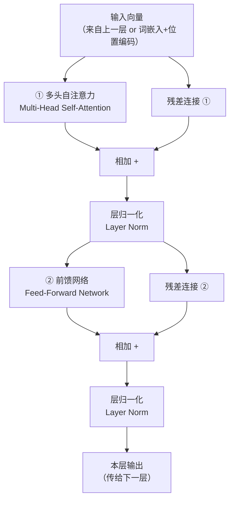
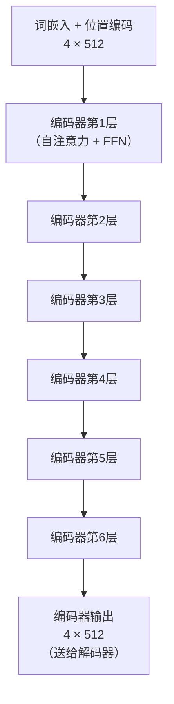

# 编码器（Encoder）

> 编码器的任务是"理解"输入句子——把一串词变成一组富含上下文信息的向量表示，供解码器使用。

---

## 1. 编码器的整体职责

把"我爱北京天安门"这句话，从原始词序列，转化成一个**充分理解了上下文的向量序列**。

```
输入：我  爱  北京  天安门
       ↓   ↓   ↓    ↓
输出：v₁  v₂  v₃   v₄
```

输出的每个向量都不是孤立的词义，而是**综合了整句话信息**的表示。比如 v₃（北京）已经"知道"它紧跟着"天安门"，v₁（我）已经"知道"它是这句话的主语。

---

## 2. 单层编码器的结构

每一层编码器由两个子层组成：



**子层 ①：多头自注意力**  
让每个词关注句子里的所有其他词，融合上下文信息。

**子层 ②：前馈网络**  
对每个词独立地做深度非线性加工。

**每个子层后都有 Add & Norm**：残差连接 + 层归一化，保证训练稳定。

---

## 3. 关键细节：为什么叫"自"注意力？

在编码器里，Q、K、V 全部来自同一个序列（输入句子本身），所以叫**自注意力（Self-Attention）**。

```
处理"我爱北京天安门"时：
- Q 来自这句话
- K 来自这句话  → 句子自己关注自己
- V 来自这句话
```

这让每个词都能直接"看到"句子里的所有其他词（包括距离很远的词），不像 RNN 那样只能依次读取。

---

## 4. 6 层堆叠

论文中编码器有 **6 层**，每层的结构相同但参数独立：



为什么要 6 层？**越深，越能理解抽象语义。**

- 第 1 层：捕捉基本的词汇关系（邻近词、同现词）
- 中间层：捕捉语法结构（主谓宾关系）
- 高层：捕捉抽象语义（指代关系、句子逻辑）

---

## 5. 用例子追踪数据流

输入"我爱北京天安门"，追踪数据从输入到编码器输出的完整流程：

**进入编码器之前：**
```
1. 分词：["我", "爱", "北京", "天安门"]
2. 词嵌入：4 × 512 的矩阵
3. 加位置编码：4 × 512 的矩阵（形状不变，但内容包含了位置信息）
```

**第 1 层编码器：**
```
① 多头自注意力：
   "北京" 开始关注 "天安门"（因为它们的点积分数高）
   每个词的向量融入了相关词的信息
   输出仍然是 4 × 512

② Add & Norm：残差相加，层归一化

③ 前馈网络：
   对每个词独立地做 512 → 2048 → 512 的变换
   输出仍然是 4 × 512

④ Add & Norm：残差相加，层归一化
```

**经过 6 层之后：**
```
输出：4 × 512 的矩阵
每个向量已深度融合了全局上下文
```

---

## 6. 编码器的输入输出形状

| | 形状 | 说明 |
|-|------|------|
| 输入 | `(序列长度, 512)` | 词嵌入 + 位置编码 |
| 每层输出 | `(序列长度, 512)` | 形状不变，但内容越来越丰富 |
| 最终输出 | `(序列长度, 512)` | 送给解码器的 K 和 V |

形状始终不变，变化的是每个向量所包含的语义深度。

---

## 7. 关键总结

| 概念 | 说明 |
|------|------|
| 编码器的职责 | 把词序列变成富含上下文的向量序列 |
| 每层结构 | 多头自注意力 → Add&Norm → 前馈网络 → Add&Norm |
| 注意力类型 | 自注意力（Q、K、V 全来自输入序列） |
| 层数 | 论文中 6 层堆叠 |
| 输出用途 | 作为解码器 Cross-Attention 的 K 和 V |

---

**上一篇**：[前馈网络](./10-前馈网络.md)  
**下一篇**：[解码器](./12-解码器.md) — 解码器如何一步步生成输出？
