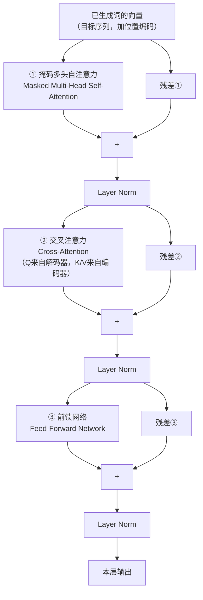
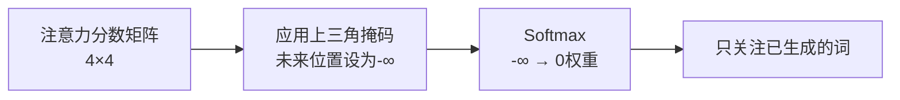
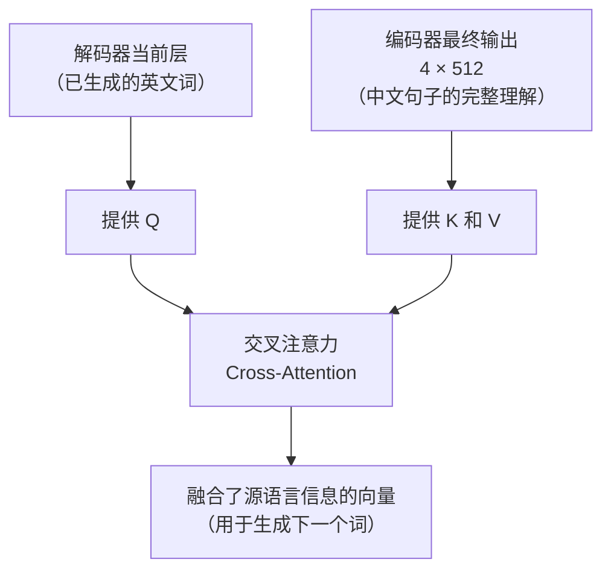
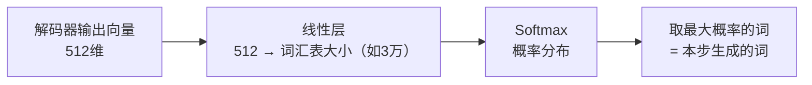

# 解码器（Decoder）

> 解码器的任务是"生成"输出——根据编码器对输入的理解，一个词一个词地生成目标序列。

---

## 1. 解码器的整体职责

以机器翻译为例，把中文"我爱北京天安门"翻译成英文：

```
编码器：理解输入 "我爱北京天安门"
                    ↓
           编码器输出（4 × 512 向量）
                    ↓
解码器：逐步生成 "I" → "love" → "Beijing" → "Tiananmen" → "<结束>"
```

解码器是**自回归（Auto-Regressive）**的：每次只生成一个词，并把已生成的词作为下一步的输入。

---

## 2. 解码器与编码器的核心区别

解码器比编码器多了一个子层，每层包含**三个子层**：



三个子层：
1. **掩码多头自注意力**（新增，有 Mask）
2. **交叉注意力**（新增，连接编码器和解码器）
3. **前馈网络**（与编码器相同）

---

## 3. 关键机制 ①：掩码自注意力

### 问题：解码器不能"偷看未来"

解码器在生成第 3 个词"Beijing"时，它不应该看到后面还没生成的词"Tiananmen"。

但自注意力默认会看到序列里的所有词——训练时目标序列是完整的，这就出现了"偷看答案"的问题。

### 解决方案：遮掩（Masking）

用一个**上三角遮掩矩阵**，把未来位置的注意力分数设为 `-∞`，Softmax 后变成 0：

```
生成到位置3（Beijing）时，注意力矩阵被遮掩后：

            I    love  Beijing  Tiananmen
I        [ 1.2,  -∞,    -∞,      -∞   ]  ← 只看自己
love     [ 0.8, 2.1,    -∞,      -∞   ]  ← 看前面的词
Beijing  [ 0.3, 0.6,   1.8,      -∞   ]  ← 看前面的词
```

`-∞` 经过 Softmax 变成 0，等于完全屏蔽了未来的词。



---

## 4. 关键机制 ②：交叉注意力（Cross-Attention）

### 解码器如何"参考"编码器的理解？

交叉注意力是编码器和解码器的**连接桥梁**：

- **Q（查询）**：来自解码器当前层（"我想找什么信息"）
- **K（键）和 V（值）**：来自编码器的最终输出（"源语言的所有信息"）



**直觉**：解码器的每个词在生成时，都会"回查"编码器对源句子的理解，从中提取最相关的信息。

生成"Beijing"时：解码器用"Beijing"的 Q 去查询编码器的 K，发现"北京"这个位置的 K 最匹配，于是主要从编码器"北京"位置的 V 中提取信息。

---

## 5. 解码过程（逐步生成）

翻译"我爱北京天安门"为英文，解码过程：

```
时间步 1：
  解码器输入：<开始>
  输出：I（概率最高的词）

时间步 2：
  解码器输入：<开始> I
  输出：love

时间步 3：
  解码器输入：<开始> I love
  输出：Beijing

时间步 4：
  解码器输入：<开始> I love Beijing
  输出：Tiananmen

时间步 5：
  解码器输入：<开始> I love Beijing Tiananmen
  输出：<结束>
```

每一步，解码器都通过**交叉注意力**"参考"编码器的输出，同时通过**掩码自注意力**处理已生成的词。

---

## 6. 最后一步：预测词汇

解码器最后一层的输出，经过一个**线性层 + Softmax**，变成词汇表上的概率分布：



---

## 7. 关键总结

| 概念 | 说明 |
|------|------|
| 解码器职责 | 逐步生成目标序列 |
| 第一子层 | 掩码自注意力——不能偷看未来的词 |
| 第二子层 | 交叉注意力——Q 来自解码器，K/V 来自编码器 |
| 第三子层 | 前馈网络（与编码器相同） |
| 自回归 | 每次生成一个词，已生成的词作为下一步输入 |
| 层数 | 论文中同样 6 层堆叠 |

---

**上一篇**：[编码器](./11-编码器.md)  
**下一篇**：[Transformer 全貌](./13-Transformer全貌.md) — 把所有组件串联起来，对照论文完整理解
