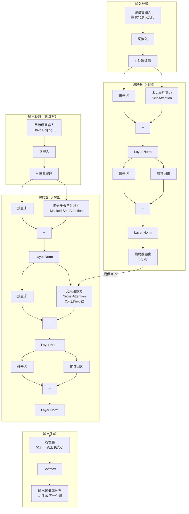
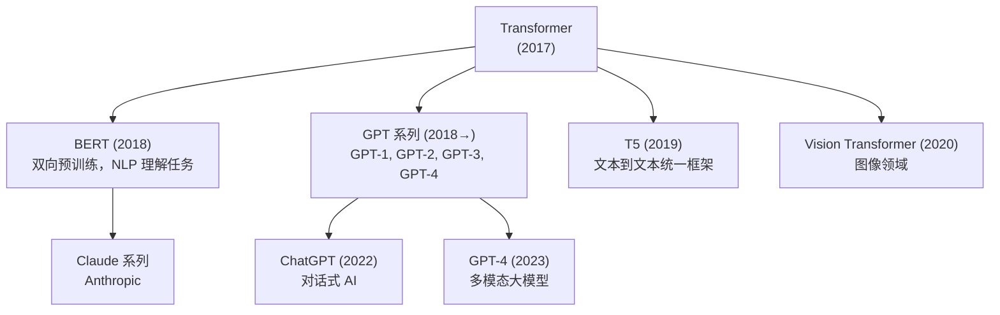

# Transformer 全貌

> 这是本系列的最后一篇。我们把前 12 篇学到的所有组件组装在一起，完整还原论文《Attention is All You Need》中的 Transformer 架构。

---

## 1. 回顾：我们已经学了什么

| 篇章 | 内容 |
|------|------|
| 向量与矩阵 | 词用向量表示，点积衡量相关性 |
| 词嵌入 | 词 → 向量的查找表 |
| Softmax | 把分数变成概率权重 |
| 残差连接 | `F(x) + x`，解决梯度消失 |
| 层归一化 | 稳定训练，防止数值失控 |
| 注意力机制 | Q/K/V 查字典，融合上下文 |
| 缩放点积注意力 | `Softmax(QKᵀ/√d)V`，为什么除以 √d |
| 多头注意力 | 8 个头并行，多角度理解 |
| 位置编码 | sin/cos 注入位置信息 |
| 前馈网络 | 512→2048→512，词内深度加工 |
| 编码器 | 6 层：自注意力 + FFN，理解输入 |
| 解码器 | 6 层：掩码自注意力 + 交叉注意力 + FFN，生成输出 |

---

## 2. 完整架构图



---

## 3. 数据流完整追踪

用"我爱北京天安门 → I love Beijing Tiananmen"翻译任务走一遍：

### 阶段一：编码

```
① 输入：["我", "爱", "北京", "天安门"]
② 词嵌入：4 × 512 矩阵
③ + 位置编码：4 × 512 矩阵（形状不变）
④ 经过 6 层编码器：
   每层 = 多头自注意力 + Add&Norm + 前馈网络 + Add&Norm
⑤ 编码器输出：4 × 512 矩阵
   （这 4 个向量深度融合了整句语义，作为 K, V 传给解码器）
```

### 阶段二：解码（逐步生成，以生成"Beijing"为例）

```
① 已生成：["<start>", "I", "love"]
② 词嵌入 + 位置编码：3 × 512 矩阵
③ 掩码自注意力：
   "love" 只能看 "<start>" 和 "I"，看不到未来
④ Add & Norm
⑤ 交叉注意力：
   Q 来自解码器（"love"的向量）
   K, V 来自编码器输出（中文句子的全部信息）
   "love" 此时主要关注编码器中 "爱" 的位置
⑥ Add & Norm
⑦ 前馈网络：词内深度加工
⑧ Add & Norm
⑨ 经过 6 层解码器
⑩ 线性层 + Softmax → 输出词汇表概率
⑪ 最高概率的词 = "Beijing" ✓
```

---

## 4. 论文中的关键超参数

| 参数 | 值 | 说明 |
|------|----|------|
| `N`（层数） | 6 | 编码器和解码器各 6 层 |
| `d_model` | 512 | 所有向量的维度 |
| `d_ff` | 2048 | 前馈网络中间层维度 |
| `h`（头数） | 8 | 多头注意力的头数 |
| `d_k = d_v` | 64 | 每个头的维度（512÷8） |
| 词汇表大小 | ~37000 | 英德翻译任务 |

---

## 5. Transformer 的三种注意力

在完整架构中，注意力机制出现了三次，每次扮演不同的角色：

| 位置 | 类型 | Q/K/V 来源 | 作用 |
|------|------|-----------|------|
| 编码器 | 自注意力 | Q/K/V 均来自编码器输入 | 理解源句内部关系 |
| 解码器（第1子层） | 掩码自注意力 | Q/K/V 均来自解码器输入（有掩码） | 理解已生成词的关系，不偷看未来 |
| 解码器（第2子层） | 交叉注意力 | Q 来自解码器，K/V 来自编码器 | 解码时参考源句信息 |

---

## 6. 为什么 Transformer 能替代 RNN？

| 对比项 | RNN/LSTM | Transformer |
|--------|---------|------------|
| 处理方式 | 顺序处理（逐词） | 并行处理（同时处理所有词） |
| 长距离依赖 | 难（信息需逐步传递） | 易（注意力直接连接任意两词） |
| 训练速度 | 慢（无法并行） | 快（GPU 并行计算矩阵乘法） |
| 可扩展性 | 受限 | 可扩展到极大规模（GPT-4 等） |

论文标题"Attention is All You Need"（你只需要注意力）正是在说：**可以完全抛弃 RNN，只用注意力机制就能构建更强大的序列模型**。

---

## 7. Transformer 的影响

这篇 2017 年的论文彻底改变了 AI 领域：



---

## 8. 学完本系列，你理解了什么

读完这 13 篇文档，你应该能够：

- 解释 Transformer 为什么需要词嵌入和位置编码
- 描述自注意力机制 Q/K/V 的计算过程
- 解释为什么注意力分数要除以 √d_k
- 说明多头注意力比单头注意力更强的原因
- 区分编码器的自注意力、解码器的掩码自注意力和交叉注意力
- 解释残差连接和层归一化在训练中的作用
- 对照论文 Figure 1，逐块说明每个组件的功能

---

**上一篇**：[解码器](./12-解码器.md)  
**返回起点**：[学习路径总览](../0-学习路径.md)

---

_基于《Attention is All You Need》，Vaswani et al., 2017_
