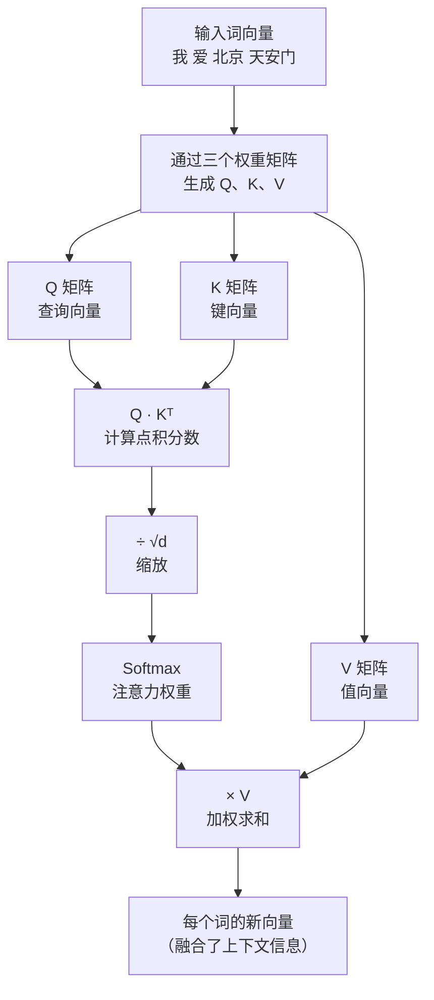

# 注意力机制（Attention Mechanism）

> 注意力机制让模型在处理每个词时，能"回望"句子里的其他词，判断哪些词对当前词最重要。这是 Transformer 的灵魂。

---

## 1. 核心问题：词需要理解上下文

考虑这句话：**"我爱北京天安门"**

当我们处理"天安门"这个词时：
- 它本身的词嵌入向量只代表这个词的"固有含义"
- 但它和"北京"搭配出现，语义上有更强的关联
- 理解"天安门"时，应该多关注"北京"，少关注"我"

**普通 RNN 的问题**：处理词时只记住前几个词，距离远的词的信息会丢失  
**注意力机制的解法**：每个词都可以直接"看到"句子里的所有其他词，并决定关注多少

---

## 2. 查字典的类比：Q、K、V

注意力机制用了三个概念：**Query（查询）、Key（键）、Value（值）**。

这三个概念可以用"查字典"来类比：

| 角色 | 字典类比 | 注意力机制 |
|------|---------|-----------|
| Query (Q) | 你要查的词 | 当前词"想知道什么" |
| Key (K) | 字典里每个词条的标题 | 其他词"提供了什么信息" |
| Value (V) | 字典里每个词条的内容 | 其他词实际贡献的语义信息 |

**流程**：
1. 用 Query 去逐个匹配所有 Key（计算相关程度）
2. 相关程度高的词，其 Value 贡献更大的权重
3. 把所有词的 Value 加权求和，得到当前词的新表示

---

## 3. 用例子走一遍流程

处理句子"我爱北京天安门"，关注"北京"这个词：

**第一步：计算"北京"与所有词的相关程度（Q·K 点积）**

```
Q（北京） · K（我）    = 0.3   → 相关性低
Q（北京） · K（爱）    = 1.1   → 相关性一般
Q（北京） · K（北京）  = 8.5   → 自身相关性高
Q（北京） · K（天安门）= 5.2   → 相关性强
```

**第二步：用 Softmax 变成权重**

```
Softmax([0.3, 1.1, 8.5, 5.2]) → [0.001, 0.004, 0.973, 0.022]
```

**第三步：用权重对 Value 加权求和**

```
"北京"的新向量 = 0.001 × V(我)
              + 0.004 × V(爱)
              + 0.973 × V(北京)   ← 主要来自自身
              + 0.022 × V(天安门) ← 带入了"天安门"的信息
```

结果："北京"的向量现在**融入了"天安门"的语义信息**，比原来更丰富。

---

## 4. 完整流程图



---

## 5. Q、K、V 从哪里来？

Q、K、V 不是直接用词嵌入向量，而是词嵌入向量经过三个不同的**线性变换**（矩阵乘法）得到的：

```
Q = 词嵌入 × W_Q   （W_Q 是可训练的权重矩阵）
K = 词嵌入 × W_K   （W_K 是可训练的权重矩阵）
V = 词嵌入 × W_V   （W_V 是可训练的权重矩阵）
```

这三个矩阵在训练中学习，让模型找到最合适的方式来表达"查询"、"被查询"和"提供内容"。

---

## 6. 为什么叫"自注意力"？

在 Transformer 编码器里，Q、K、V 全部来自**同一个序列**（输入句子），所以叫做**自注意力（Self-Attention）**：

- 每个词用自己的 Q 去查询
- 每个词用自己的 K 被查询
- 每个词用自己的 V 提供内容

整个句子中的每个词都在同时互相关注对方。

---

## 7. 关键总结

| 概念 | 说明 |
|------|------|
| 注意力机制 | 让每个词关注句子中其他词，融合上下文信息 |
| Q（Query） | 当前词"想查询什么" |
| K（Key） | 其他词"有什么可被查询" |
| V（Value） | 其他词实际提供的语义内容 |
| 自注意力 | Q、K、V 来自同一序列 |
| 计算步骤 | Q·Kᵀ → 缩放 → Softmax → ×V |

---

**上一篇**：[层归一化](../前置知识/5-层归一化.md)  
**下一篇**：[缩放点积注意力](./7-缩放点积注意力.md) — 注意力分数是怎么精确计算的？
