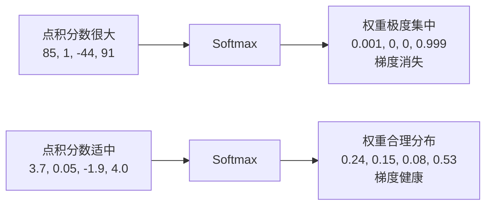
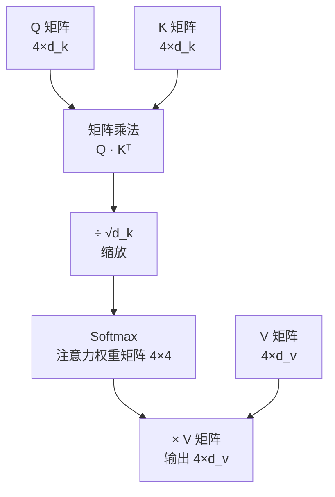

# 缩放点积注意力（Scaled Dot-Product Attention）

> 这是注意力机制的完整数学公式。它回答一个问题：注意力分数具体怎么算，为什么要"缩放"？

---

## 1. 完整公式

论文《Attention is All You Need》中给出的公式：

$$\text{Attention}(Q, K, V) = \text{Softmax}\left(\frac{QK^T}{\sqrt{d_k}}\right)V$$

拆开来看，共四步：

```
第一步：QKᵀ         → 计算每对词之间的原始相关分数
第二步：÷ √d_k      → 缩放（这篇文档的核心）
第三步：Softmax(…)  → 变成概率（注意力权重）
第四步：× V         → 加权求和，得到输出
```

前三步和最后一步在上一篇 [注意力机制](./6-注意力机制.md) 中已经解释了直觉，这篇聚焦**为什么要除以 √d_k**。

---

## 2. 问题：不除会怎样？

假设词向量维度是 `d_k = 512`，Q 和 K 的每个元素都是均值为 0、方差为 1 的随机数。

那么 Q·K 点积（512 个数相乘再相加）的方差会变成 **d_k = 512**，标准差是 **√512 ≈ 22.6**。

这意味着点积结果可能非常大，比如：

```
词对1的分数：  85.3
词对2的分数：   1.2
词对3的分数：  -43.7
词对4的分数：  91.0
```

把这组数字送进 Softmax：

```
Softmax([85.3, 1.2, -43.7, 91.0])
≈ [0.0009, 0.0, 0.0, 0.9991]
```

几乎所有权重都集中在最后一个词上，其他词的权重接近于零。

---

## 3. 为什么这是问题？

Softmax 对大数值极度敏感：某个数特别大，它就会"通吃"所有权重。

这导致：
1. **梯度消失**：Softmax 在极端值附近的梯度极小，训练停滞
2. **注意力退化**：变成"只关注一个词"，失去了关注多个词的能力



---

## 4. 解决方案：除以 √d_k

把点积分数除以 `√d_k` 后，方差从 `d_k` 变回 1，数值恢复到合理范围：

```
原始分数：[85.3, 1.2, -43.7, 91.0]
÷ √512 ≈ ÷ 22.6

缩放后：[3.77, 0.05, -1.93, 4.02]
```

这时 Softmax 的输出：

```
Softmax([3.77, 0.05, -1.93, 4.02]) ≈ [0.24, 0.15, 0.08, 0.53]
```

权重分布合理，梯度健康，训练顺利。

---

## 5. 完整的计算示例

用"我爱北京天安门"，计算"北京"的注意力输出（简化为 4 维向量）：

**设定（简化数值）：**
```
Q(北京) = [1.0, 0.5, -0.3, 0.8]
K(我)   = [0.1, 0.2,  0.4, 0.1]
K(爱)   = [0.5, 0.3, -0.1, 0.4]
K(北京) = [0.9, 0.6, -0.2, 0.7]
K(天安门)= [0.8, 0.5, -0.1, 0.6]
```

**第一步：计算 Q·K 点积**
```
Q(北京)·K(我)    = 1.0×0.1 + 0.5×0.2 + (-0.3)×0.4 + 0.8×0.1 = 0.1+0.1-0.12+0.08 = 0.16
Q(北京)·K(爱)    = 1.0×0.5 + 0.5×0.3 + (-0.3)×(-0.1) + 0.8×0.4 = 0.5+0.15+0.03+0.32 = 1.00
Q(北京)·K(北京)  = 1.0×0.9 + 0.5×0.6 + (-0.3)×(-0.2) + 0.8×0.7 = 0.9+0.3+0.06+0.56 = 1.82
Q(北京)·K(天安门)= 1.0×0.8 + 0.5×0.5 + (-0.3)×(-0.1) + 0.8×0.6 = 0.8+0.25+0.03+0.48 = 1.56
```

**第二步：除以 √4 = 2（这里 d_k=4）**
```
[0.16, 1.00, 1.82, 1.56] ÷ 2 = [0.08, 0.50, 0.91, 0.78]
```

**第三步：Softmax**
```
Softmax([0.08, 0.50, 0.91, 0.78]) ≈ [0.17, 0.26, 0.39, 0.33] / 1.15
                                   ≈ [0.148, 0.226, 0.339, 0.287]
```

（验证：0.148+0.226+0.339+0.287 ≈ 1.0 ✓）

**第四步：用权重对 V 加权求和，得到"北京"的新向量**

---

## 6. 整体流程图



---

## 7. 关键总结

| 步骤 | 操作 | 目的 |
|------|------|------|
| `Q · Kᵀ` | 点积 | 计算每对词的原始相关分数 |
| `÷ √d_k` | 缩放 | 防止数值过大导致 Softmax 梯度消失 |
| `Softmax` | 归一化 | 变成注意力权重（和为 1） |
| `× V` | 加权求和 | 融合上下文信息，输出新向量 |

`√d_k` 中的 `d_k` 是 Key 向量的维度，论文中每个头的 `d_k = 64`（总维度 512 ÷ 8 个头）。

---

**上一篇**：[注意力机制](./6-注意力机制.md)  
**下一篇**：[多头注意力](./8-多头注意力.md) — 为什么要同时用 8 个注意力头？
