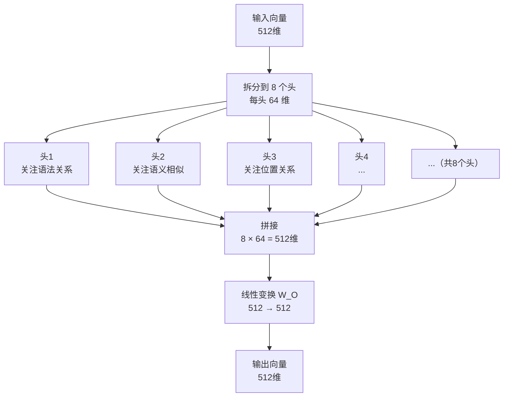

# 多头注意力（Multi-Head Attention）

> 单个注意力头只能从一个角度理解词之间的关系。多头注意力让模型同时从多个角度观察，最后综合所有视角的信息。

---

## 1. 核心问题：一个头不够用

用"我爱北京天安门"举例，处理"北京"这个词时需要同时理解：

- **语法角度**："北京"是名词，和"天安门"（也是名词）是并列关系
- **语义角度**："北京"是地名，和"天安门"（同属北京地标）语义相关
- **指代角度**："天安门"在某种程度上代表了"北京"

这三个视角是**不同类型**的关联，单一的注意力头很难同时捕捉所有这些关系。

多头注意力的思路：**同时跑多个注意力头，每个头负责从不同的角度理解关系，最后把所有头的结果合并**。

---

## 2. 多头注意力的工作方式

### 核心思路：分治

```
原始词向量维度：512

拆成 8 个头，每个头处理：512 ÷ 8 = 64 维
```

每个头都有自己独立的 W_Q、W_K、W_V 权重矩阵（维度 512×64），在 64 维的子空间里独立计算注意力。



---

## 3. 完整数学流程

**论文公式：**

$$\text{MultiHead}(Q,K,V) = \text{Concat}(\text{head}_1, ..., \text{head}_h) \cdot W^O$$

$$\text{其中 head}_i = \text{Attention}(QW_i^Q, KW_i^K, VW_i^V)$$

翻译成中文步骤：

**第一步：8 组独立的线性投影**
```
对每个头 i（共 8 个）：
Q_i = Q × W_Q_i   （512×64 权重矩阵，将 512 维压到 64 维）
K_i = K × W_K_i
V_i = V × W_V_i
```

**第二步：8 组独立的缩放点积注意力**
```
head_i = Attention(Q_i, K_i, V_i)   → 输出形状：序列长度 × 64
```

**第三步：拼接所有头的输出**
```
Concat(head_1, head_2, ..., head_8) → 形状：序列长度 × 512
（8 × 64 = 512）
```

**第四步：最终线性变换**
```
输出 = Concat(...) × W_O   （512×512 权重矩阵）
```

---

## 4. 生活化类比：评审团

想象一个翻译评审团，有 8 位评审员，每人从不同专业背景评审同一句话：

```
评审1（语法专家）：关注句子结构关系
评审2（词汇专家）：关注词义和同义词
评审3（文化专家）：关注文化背景含义
评审4（语境专家）：关注上下文语境
...
评审8（逻辑专家）：关注逻辑关系
```

最后把 8 位专家的意见**综合**，得出最全面的判断。

---

## 5. 为什么不直接用 512 维的单个注意力头？

理论上可以，但实际效果不如多头：

| 对比项 | 单头注意力（512维） | 多头注意力（8头×64维） |
|--------|-------------------|----------------------|
| 关注角度 | 单一视角 | 8个不同子空间视角 |
| 表达能力 | 较弱 | 更强，能捕捉多种关系 |
| 参数量 | 相近 | 相近（不会显著增加参数）|
| 实验结果 | 较差 | 论文验证效果更好 |

多头注意力在参数量几乎不增加的情况下，显著提升了模型的表达能力。

---

## 6. 论文中的超参数

| 参数 | 值 | 含义 |
|------|----|------|
| h | 8 | 头的数量 |
| d_model | 512 | 输入/输出总维度 |
| d_k = d_v | 64 | 每个头的维度（512÷8） |

---

## 7. 关键总结

| 概念 | 说明 |
|------|------|
| 多头注意力 | 并行运行多个注意力头 |
| 每个头 | 在低维子空间里独立计算注意力 |
| 不同头的作用 | 捕捉不同类型的词间关系 |
| 最终输出 | 所有头的结果拼接后做线性变换 |
| 参数数量 | 与单头注意力（d_model维）相近 |

---

**上一篇**：[缩放点积注意力](./7-缩放点积注意力.md)  
**下一篇**：[位置编码](./9-位置编码.md) — Transformer 怎么知道词的顺序？
