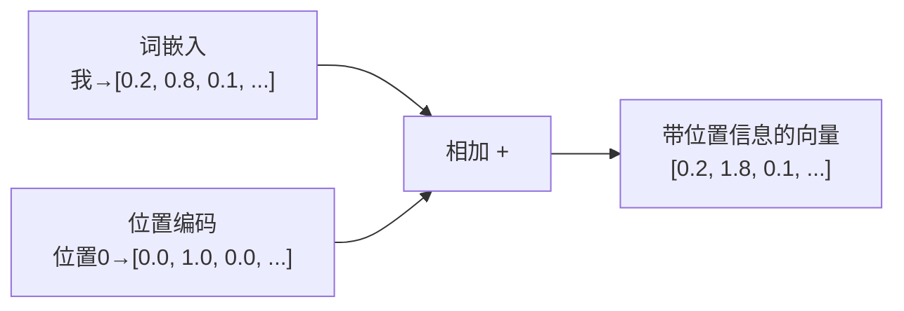
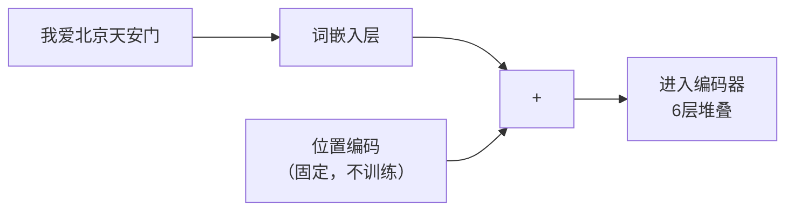

# 位置编码（Positional Encoding）

> Transformer 的注意力机制天生无序——它同时看所有词，不知道谁在前谁在后。位置编码解决的就是这个问题：告诉模型每个词在句子中的位置。

---

## 1. 核心问题：Transformer 不知道顺序

注意力机制在计算时，会让每个词"看"所有其他词，但这个过程是**并行的、无序的**。

对于"我爱北京天安门"，如果把顺序打乱成"天安门北京爱我"，注意力机制看到的其实是一模一样的——因为它只关心词与词之间的关联，不关心先后顺序。

但词序非常重要：
- "我爱你" ≠ "你爱我"
- "猫追狗" ≠ "狗追猫"

因此必须有一种方式把位置信息**注入**到词向量里。

---

## 2. 位置编码的思路

最简单的想法：给第 1 个词的向量加上 `[1, 0, 0, ...]`，给第 2 个词加上 `[2, 0, 0, ...]`…

但这样的问题是：不同位置的编码差异太简单，而且句子越长数值越大，影响训练稳定性。

论文的做法：用**正弦和余弦函数**来生成位置编码，让编码具有以下特性：
1. 每个位置有唯一的编码
2. 不同位置之间的距离在语义上是有规律的
3. 可以外推到比训练时更长的序列

---

## 3. 正弦位置编码公式

$$PE_{(pos, 2i)} = \sin\left(\frac{pos}{10000^{2i/d_{model}}}\right)$$

$$PE_{(pos, 2i+1)} = \cos\left(\frac{pos}{10000^{2i/d_{model}}}\right)$$

其中：
- `pos`：词在句子中的位置（0, 1, 2, 3...）
- `i`：向量的维度索引（0, 1, 2, ..., d/2）
- `d_model`：向量总维度（512）

**直觉理解**：不同维度的正弦/余弦以不同频率振荡，就像时钟的秒针、分针、时针——它们组合在一起，可以唯一表示任何一个时刻（位置）。

---

## 4. 直觉可视化

用简化的 8 维向量来理解，位置 0、1、2、3 的编码大概长这样：

```
位置0：[sin(0), cos(0), sin(0), cos(0), ...]  = [0.0, 1.0, 0.0, 1.0, ...]
位置1：[sin(1), cos(1), sin(0.1), cos(0.1),...] = [0.84, 0.54, 0.10, 0.99, ...]
位置2：[sin(2), cos(2), sin(0.2), cos(0.2),...] = [0.91, -0.42, 0.20, 0.98, ...]
位置3：[sin(3), cos(3), sin(0.3), cos(0.3),...] = [0.14, -0.99, 0.30, 0.96, ...]
```

每个位置的编码都不同，且变化有规律（高频振荡用于细粒度区分，低频振荡用于大范围区分）。

---

## 5. 位置编码如何加入词向量？

直接**相加**：



对"我爱北京天安门"整句话：

```
最终输入 = 词嵌入矩阵 + 位置编码矩阵

"我"    (位置0) = 词嵌入(我)    + PE(0)
"爱"    (位置1) = 词嵌入(爱)    + PE(1)
"北京"  (位置2) = 词嵌入(北京)  + PE(2)
"天安门" (位置3) = 词嵌入(天安门) + PE(3)
```

这样每个词的向量里同时包含了**语义信息**（词嵌入）和**位置信息**（位置编码）。

---

## 6. 为什么用 sin/cos 而不是可学习的编码？

论文中也对比了两种方式：

| 方式 | 优点 | 缺点 |
|------|------|------|
| 固定 sin/cos 编码 | 可外推到更长序列，不增加参数 | 不能根据任务微调 |
| 可学习的位置编码 | 可针对任务优化 | 只能处理训练时见过的序列长度 |

论文发现两者效果相近，最终选了固定的 sin/cos，因为更简单且可外推。

（注：后来很多模型如 BERT 选择了可学习的位置编码，各有取舍）

---

## 7. 在整体架构中的位置



位置编码只在最开始加一次，之后的 6 层编码器都不再重复添加。

---

## 8. 关键总结

| 概念 | 说明 |
|------|------|
| 为什么需要 | 注意力机制天生无序，需要注入位置信息 |
| 方式 | 位置编码向量 + 词嵌入向量（相加） |
| 编码公式 | sin/cos 函数，不同维度不同频率 |
| 特性 | 每个位置唯一，可外推到更长序列 |
| 添加时机 | 进入编码器之前，只做一次 |

---

**上一篇**：[多头注意力](./8-多头注意力.md)  
**下一篇**：[前馈网络](../架构解析/10-前馈网络.md) — 注意力层之后还有什么？
