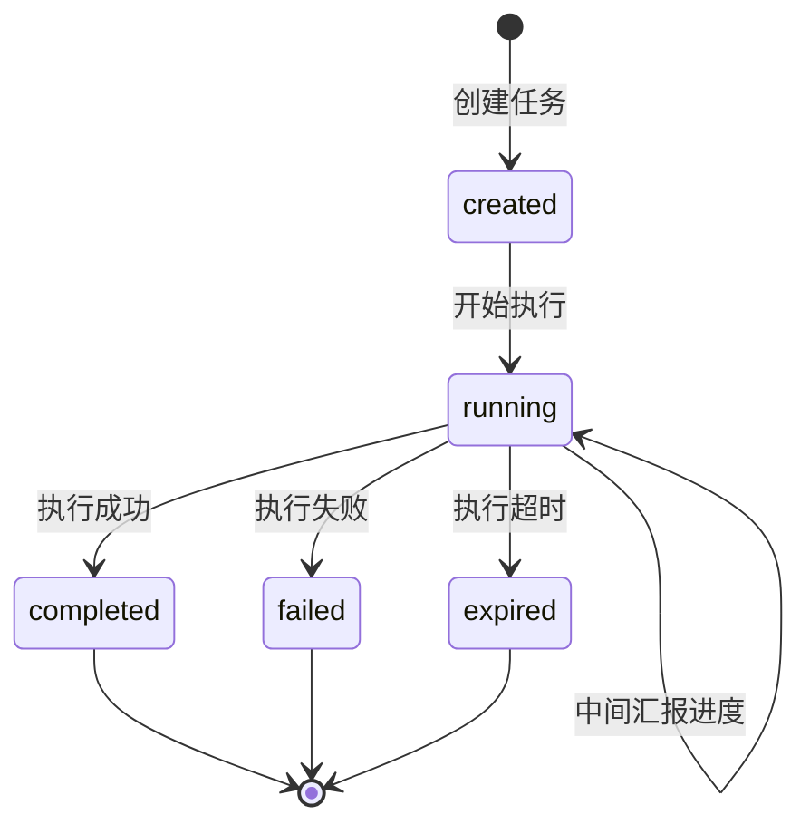
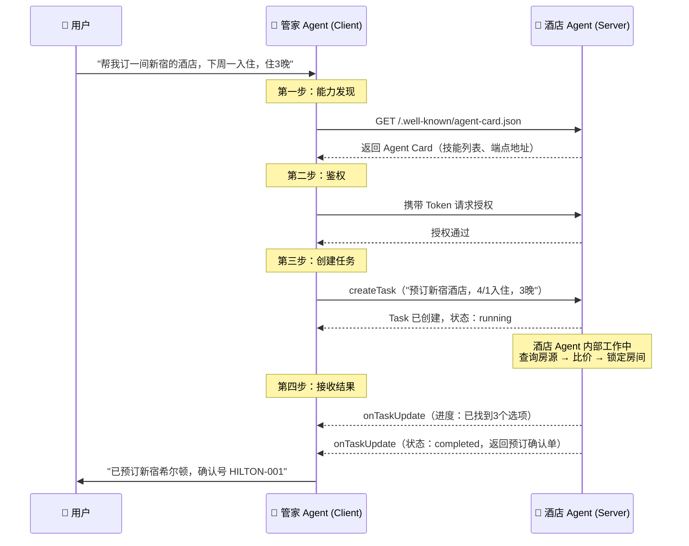
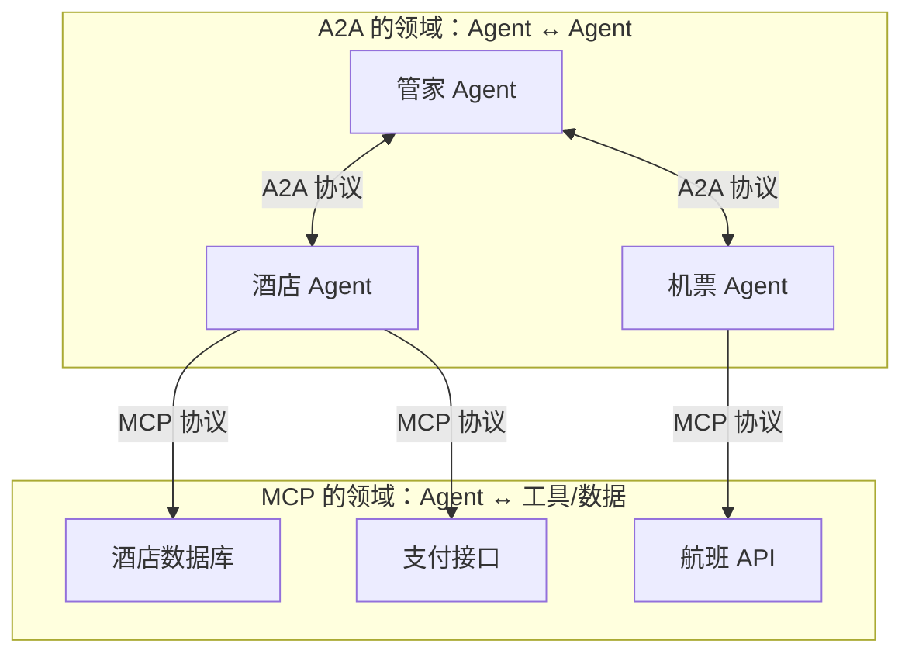

# A2A 协议（Agent-to-Agent Protocol）

## 什么是 A2A？

### 定义

A2A（Agent-to-Agent）是由 **Google 发起**、捐赠给 Linux 基金会的一套**开放通信标准**。

它解决的核心问题就一句话：**让不同公司、不同框架构建的 AI Agent 能互相"对话"和"协作"。**

目前 AI Agent 的生态非常碎片化 —— LangChain、CrewAI、AutoGen、Coze……每家都有自己的 Agent 框架，它们之间**互不相通**。A2A 就是要定一个"公共语言"，让这些 Agent 能跨平台协作。

### 通俗理解

想象一个场景：你要出国旅行，需要**订机票、订酒店、做签证、规划行程**。

在没有 A2A 之前，这就像你自己打了四个不同的电话，分别跟航空公司、酒店前台、签证中介、旅行社沟通，而且它们**互相不知道对方的存在**，你得当中间人来回传话。

有了 A2A 之后，你只需要跟一个"旅行管家 Agent"说需求，它会自动：

```
你："帮我安排下周去东京的旅行"
    │
    ├── 机票 Agent：查航班、比价、下单
    ├── 酒店 Agent：找酒店、对比评价、预订
    ├── 签证 Agent：准备材料、预约办理
    └── 行程 Agent：根据航班和酒店时间，自动排行程
```

这些 Agent 可能来自不同公司、用不同技术栈开发，但 A2A 让它们像同事一样**直接协作**，不需要你当传话筒。

> **一句话总结：A2A 是 AI Agent 世界的"普通话"，让不同 Agent 能互相听懂、互相配合。**

---

## A2A 要解决什么痛点？

| 痛点 | 没有 A2A | 有了 A2A |
| --- | --- | --- |
| **Agent 孤岛** | 每个 Agent 只能在自己的框架内工作 | Agent 跨框架、跨平台协作 |
| **重复造轮子** | 每个 Agent 都要自己实现所有能力 | Agent 只做自己擅长的，其余委托给别人 |
| **集成成本高** | 接入一个新 Agent 要写大量适配代码 | 遵循标准协议，即插即用 |
| **无法发现能力** | 不知道网络上有哪些可用的 Agent | 通过 Agent Card 自动发现能力 |

---

## 核心概念（只有三个）

A2A 的设计非常简洁，核心就围绕三个东西：

### 1. Agent Card —— "自我介绍名片"

每个 Agent 都会对外暴露一个 JSON 文件（类似网站的 `robots.txt`），告诉别人：

- 我是谁
- 我会什么技能
- 怎么联系我
- 需要什么权限

```json
{
  "name": "东京旅行专家",
  "description": "专注东京旅行规划，包括酒店预订、美食推荐、景点攻略",
  "endpoint": "https://api.travel-agent.ai/v1/a2a",
  "skills": [
    {
      "id": "hotel.booking",
      "description": "预订东京境内的酒店，支持按区域、价格、评分筛选"
    },
    {
      "id": "food.recommend",
      "description": "推荐东京当地美食和餐厅"
    }
  ],
  "auth_type": "oauth2"
}
```

别的 Agent 拿到这张"名片"后，就知道可以找它帮忙订酒店和推荐美食了。

**发现方式**：访问 `https://对方域名/.well-known/agent-card.json` 即可获取，和网站发现 favicon 的方式类似。

### 2. Task —— "工作任务单"

Agent 之间的协作以 **Task（任务）** 为单位。一个 Task 就像一张工单：

- 有唯一编号
- 有明确的状态（进行中/已完成/失败）
- 有输入和输出



### 3. Message & Parts —— "沟通内容"

Agent 之间传递的消息由 **Message** 承载，每条 Message 包含一个或多个 **Part**：

| Part 类型 | 用途 | 例子 |
| --- | --- | --- |
| `TextPart` | 自然语言文本 | "帮我预订新宿希尔顿" |
| `DataPart` | 结构化数据 | `{ "check_in": "2026-04-01", "nights": 3 }` |
| `FilePart` | 文件附件 | 护照扫描件、行程 PDF |

---

## 工作原理：一次完整的协作流程

用一个实际例子来走一遍完整流程——**用户让"管家 Agent"帮忙订酒店**：



**四步走**：

1. **能力发现**：管家 Agent 通过 Agent Card 发现酒店 Agent 有"订酒店"的技能
2. **身份验证**：确认对方是可信的 Agent（OAuth2 Token 交换）
3. **创建任务**：以 JSON-RPC 格式发送任务请求
4. **接收结果**：通过 SSE（服务端推送）实时接收进度和最终结果

---

## 真实应用场景

### 场景一：企业智能办公

```
员工："帮我安排下周三和客户的会议"
   │
   ├── 📅 日程 Agent：查看双方空闲时间，锁定时间段
   ├── 📧 邮件 Agent：发送会议邀请给客户
   ├── 🏢 会议室 Agent：预订合适的会议室
   └── 📋 文档 Agent：根据客户信息准备会议资料
```

每个 Agent 由不同的 SaaS 供应商提供（Google Calendar、Outlook、企业微信……），通过 A2A 实现无缝协作。

### 场景二：电商客服升级

```
客户："我买的手机屏幕碎了，想退货"
   │
   ├── 🎧 客服 Agent：理解用户意图，判断走售后流程
   ├── 📦 物流 Agent：生成退货快递单
   ├── 💰 财务 Agent：计算退款金额，发起退款
   └── 📊 质检 Agent：记录质量问题，反馈给供应商
```

### 场景三：软件开发协作

```
开发者："帮我排查线上这个报错"
   │
   ├── 📋 日志 Agent：搜索相关错误日志
   ├── 🔍 代码 Agent：定位可能的问题代码
   ├── 🧪 测试 Agent：跑相关的测试用例
   └── 📝 文档 Agent：生成排查报告
```

---

## 谁在用 A2A？—— 生态与采用情况

A2A 于 2024–2025 年由 Google 正式推出，目前处于**快速推广期**。采用情况大致分为以下几类。

### 官方与原生支持

| 产品/平台 | 说明 |
| --- | --- |
| **Google Agent Development Kit (ADK)** | 原生支持 A2A，可用 `adk api_server --a2a` 将 Agent 以 A2A 协议对外暴露 |
| **Vertex AI Agent Builder / Agent Engine** | Google Cloud 上的 Agent 部署与编排，支持开发、部署和调用 A2A Agent |
| **Python A2A SDK** | 官方 Python 实现，`pip install python-a2a`，可选 `[openai]`、`[anthropic]` 等依赖 |

### 主流 Agent 框架的接入方式

这些框架本身不一定“内置” A2A，但已有**官方文档或社区适配器**，可以较快接入 A2A 生态：

| 框架 | 支持方式 | 说明 |
| --- | --- | --- |
| **CrewAI** | 官方文档 + 官方 samples | [CrewAI 文档](https://docs.crewai.com/en/learn/a2a-agent-delegation) 有 A2A 委托说明，Google A2A 仓库有 CrewAI 示例 |
| **LangChain** | 社区适配器 | 如 [a2a-adapters](https://github.com/JeromeOvO/a2a-adapters) 等，用适配器把 LangChain runnable 暴露为 A2A 服务 |
| **Semantic Kernel** | 协议兼容 | 可基于 A2A 规范实现 Agent 间调用 |
| **BeeAI** | 生态支持 | 文档中列为可与 A2A 协作的框架之一 |

**a2a-adapters** 等库通常提供：自动生成 Agent Card、Task 管理、SSE 流式输出，几行代码即可把现有 LangChain/CrewAI Agent 变成 A2A 服务端。

### 企业与生态伙伴（公开信息）

Google 公开披露有 **150+ 组织**参与或采用 A2A，涵盖云厂商、技术公司、企业和咨询方，例如：

- **技术/产品**：Atlassian、Box、Cohere、Intuit、LangChain、MongoDB、PayPal、Salesforce、SAP、ServiceNow、Workday 等  
- **咨询/集成**：Accenture、Deloitte、McKinsey、PwC 等  

具体产品是否已上线 A2A 能力，需以各厂商最新公告为准。

### 已公开的落地案例

- **Tyson Foods、Gordon Food Service**：在供应链场景中使用基于 A2A 的协作 Agent，做实时数据共享与协同决策（Google Cloud 博客 2025 年提及）。

### 协议与工具现状（截至 2025 年）

- **协议版本**：v0.3.x，已支持 gRPC、Agent Card 签名等，向 v1.0 RC 演进  
- **开发体验**：ADK 内置 A2A 支持，可部署到 Agent Engine、Cloud Run、GKE 等  

**小结**：目前**已用上 A2A 的**主要是 Google 自家 ADK/Vertex AI 生态、以及通过适配器接入的 CrewAI/LangChain 等；大量企业处于**试点或规划阶段**。若你关心某个具体产品是否支持，建议查该产品的官方文档或发布说明。

---

## A2A vs MCP：它们是什么关系？

很多人容易把 A2A 和 MCP（Model Context Protocol）搞混。其实它们**不是竞争关系，而是互补关系**：



| 维度 | A2A | MCP |
| --- | --- | --- |
| **解决什么** | Agent 之间怎么协作 | Agent 怎么使用外部工具和数据 |
| **类比** | 同事之间的沟通协议 | 员工使用公司内部系统的规范 |
| **通信对象** | Agent ↔ Agent | Agent ↔ 工具/数据源 |
| **协议基础** | JSON-RPC 2.0 | MCP Protocol（也基于 JSON-RPC） |
| **典型场景** | 跨团队/跨公司的 Agent 协作 | 单个 Agent 调用数据库、API、文件系统 |

> **简单记忆**：A2A 管"Agent 之间的事"，MCP 管"Agent 和工具之间的事"。两者经常配合使用。

---

## 技术实现要点（给想深入了解的读者）

### 通信协议：JSON-RPC 2.0

A2A 的所有通信都基于 **JSON-RPC 2.0** 标准，走 HTTP 传输。一次任务请求长这样：

```json
{
  "jsonrpc": "2.0",
  "id": "req-123",
  "method": "createTask",
  "params": {
    "skill_id": "hotel.booking",
    "input": {
      "parts": [
        { "type": "text", "text": "预订新宿希尔顿，4月1日入住，住3晚" }
      ]
    }
  }
}
```

任务完成后，服务端通过通知推送结果：

```json
{
  "jsonrpc": "2.0",
  "method": "onTaskUpdate",
  "params": {
    "task_id": "task-456",
    "status": "completed",
    "artifacts": [
      {
        "type": "data",
        "data": { "booking_id": "HILTON-001", "hotel": "新宿希尔顿", "total": "¥45,000" }
      }
    ]
  }
}
```

### 协议栈总览

| 层级 | 技术实现 | 说明 |
| --- | --- | --- |
| **能力发现层** | Agent Card（JSON） | Agent 对外暴露的"名片"，支持自动发现 |
| **鉴权层** | OAuth2 / Token | 确保 Agent 之间的通信是安全可信的 |
| **应用协议层** | JSON-RPC 2.0 | 统一的请求/响应格式 |
| **传输层** | HTTP / SSE / WebSocket | 支持多种传输方式，按需选择 |
| **数据载体层** | Message + Parts | 灵活的消息结构，支持文本、数据、文件 |

### 语义路由：Agent 怎么知道该找谁帮忙？

这是 A2A 最巧妙的设计之一。Agent Card 中的 `description` 和 `skills` 是用**自然语言**描述的，上层 Agent 可以：

1. **读取** 多个 Agent Card 的技能描述
2. **用 LLM 理解** 当前任务需要什么能力
3. **智能匹配** 最合适的 Agent 去执行

这就实现了**基于语义的自动路由**，而不需要硬编码"任务 A 找 Agent B"的映射关系。

---

## 总结

| 要点 | 内容 |
| --- | --- |
| **是什么** | AI Agent 之间的开放通信标准 |
| **谁发起的** | Google 发起，Linux 基金会托管 |
| **解决什么** | 不同框架/公司的 Agent 无法互相协作 |
| **核心思路** | Agent Card 发现能力 → JSON-RPC 下发任务 → 实时接收结果 |
| **和 MCP 的关系** | 互补，A2A 管 Agent 间协作，MCP 管 Agent 用工具 |
| **最大价值** | 让 AI Agent 生态从"各自为战"走向"开放协作" |

---

## 资源与延伸

- **官方规范**：[A2A Protocol Specification](https://google.github.io/A2A/)
- **GitHub 仓库**：[google/A2A](https://github.com/google/A2A)
- **相关概念**：[MCP 协议](./MCP协议.md)、[Function Call](./Function%20Call.md)、[ReAct](./ReAct.md)

---
_本文档将持续更新，添加更多相关内容_
