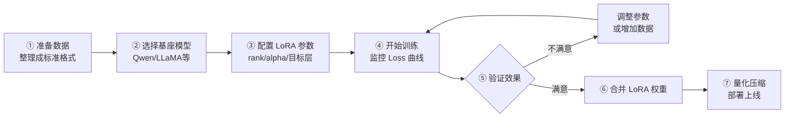

# 大模型微调（Fine-tuning）技术详解

## 1. 什么是微调？

### 核心定义

微调（Fine-tuning）是指在一个已经预训练好的大模型基础上，用特定领域的数据继续训练，让模型适应特定任务的过程。

### 通俗理解

> 想象你招了一个名校毕业生（预训练模型）——他知识渊博、逻辑清晰，但不懂你公司的业务规范。你需要给他做"岗前培训"（微调），让他学会公司特有的代码风格、业务术语和操作流程。

| 阶段 | 类比 | 数据量 | 计算量 |
|------|------|--------|--------|
| 预训练 | 读遍所有教材，建立世界观 | 万亿 token | 极大（烧钱） |
| 微调 | 岗前培训，学习具体业务 | 千～万条样本 | 可接受 |

### 为什么不直接用预训练模型？

预训练模型能"聊天"，但不能精准执行特定风格的任务，比如：

- 输出符合公司规范的代码注释格式
- 只用某种技术栈回答问题
- 拒绝回答与业务无关的内容

微调让模型从"万能但模糊"变成"专注且精准"。

---

## 2. 微调的分类

### 2.1 全量微调（Full Fine-tuning）

更新模型的**所有参数**，效果最好，但代价极高。

- 一个 7B 参数的模型，全量微调至少需要 **80GB 显存**
- 普通开发者基本无法负担

### 2.2 参数高效微调（PEFT）

只训练模型中**一小部分参数**，冻结其余参数，大幅降低显存和计算量。

| 方法 | 核心思想 | 显存需求（7B模型） | 效果 | 推荐指数 |
|------|---------|-----------------|------|---------|
| **LoRA** | 在权重旁注入低秩矩阵 | ~16GB | 接近全量 | ★★★★★ |
| **QLoRA** | LoRA + 4bit量化 | ~8GB | 略低于LoRA | ★★★★★ |
| Adapter | 在层间插入小型网络 | ~20GB | 良好 | ★★★ |
| Prefix Tuning | 在输入前加可训练前缀 | ~16GB | 一般 | ★★ |
| Prompt Tuning | 只训练软提示词 | 极低 | 较弱 | ★★ |

> **结论：实际项目中，LoRA 和 QLoRA 是首选方案。**

---

## 3. LoRA 简介

LoRA（Low-Rank Adaptation）是目前最流行的微调方法，核心思想一句话：

> 微调时权重的变化量是有规律的，可以用两个小矩阵来表示，从而将需要训练的参数从**数十亿**降到**几十万**。

```
全量微调：训练 70 亿参数 → 需要 80GB 显存
LoRA：    训练 ~700 万参数 → 需要 16GB 显存（节省 99%+）
QLoRA：   LoRA + 量化存储 → 需要 6-8GB 显存
```

LoRA 的原理非常巧妙，涉及矩阵分解和低秩近似的概念。

**详细的原理讲解、工作方式和参数说明请参考 → [3-LoRA 原理详解](./3-LoRA原理详解.md)**

---

## 4. 损失函数（Loss）

### 4.1 语言模型的 Loss 是什么

大语言模型使用**交叉熵损失（Cross-Entropy Loss）**，本质是：

> 模型预测下一个 token 的概率分布，与真实 token 之间的差距。

用一个例子来理解：

```
假设模型在学习这段代码：def add(a, b): return a + b

模型需要逐个预测每个 token：
  给 "def" → 预测下一个应该是 "add"   ← 预测对了，Loss 小
  给 "def add" → 预测下一个是 "("      ← 预测对了，Loss 小
  给 "def add(" → 预测下一个是 "a"      ← 预测对了，Loss 小

Loss 越小 → 模型预测越准 → 训练越好
```

### 4.2 Training Loss vs Validation Loss

| 指标 | 含义 | 监控目的 |
|------|------|---------|
| **Training Loss** | 模型在训练集上的损失 | 判断模型是否在学习 |
| **Validation Loss** | 模型在验证集上的损失 | 判断模型是否过拟合 |

### 4.3 Loss 曲线怎么看

```
✅ 正常收敛（理想状态）：

Loss
 │
 │\
 │ \
 │  \___
 │      \____
 │           \___________
 └─────────────────────── Epoch
   训练Loss 和 验证Loss 同步下降并趋于平稳


⚠️ 过拟合（最常见问题）：

Loss
 │
 │\         验证Loss（开始上升！）
 │ \      ↗
 │  \_____
 │        训练Loss（继续下降）
 └─────────────────────── Epoch
   解决：减少 epoch、增加数据量、增大 dropout


❌ 欠拟合（数据太少或学习率太低）：

Loss
 │\
 │ \_
 │   \_
 │     \____
 │          \____（Loss 仍然很高，未收敛）
 └─────────────────────── Epoch
   解决：增加训练轮数、调大学习率、增加数据
```

---

## 5. 训练数据格式

### 5.1 Instruction Tuning 标准格式

```json
{
  "instruction": "写一个Python函数，计算两数之和",
  "input": "",
  "output": "def add(a, b):\n    return a + b"
}
```

### 5.2 代码生成专用格式

```json
{
  "instruction": "根据以下需求，用 Python 实现一个函数",
  "input": "需求：接收一个整数列表，返回其中所有偶数，并按升序排序",
  "output": "def get_sorted_evens(nums: list[int]) -> list[int]:\n    return sorted(n for n in nums if n % 2 == 0)"
}
```

### 5.3 多轮对话格式（ShareGPT 格式）

```json
{
  "conversations": [
    {"from": "human", "value": "如何用 Python 读取 CSV 文件？"},
    {"from": "gpt", "value": "可以使用 pandas 库：\nimport pandas as pd\ndf = pd.read_csv('file.csv')"},
    {"from": "human", "value": "如果 CSV 有中文乱码怎么办？"},
    {"from": "gpt", "value": "指定编码参数：\ndf = pd.read_csv('file.csv', encoding='utf-8-sig')"}
  ]
}
```

> **数据质量 > 数据数量**：1000 条高质量数据，效果远好于 10000 条低质量数据。

---

## 6. 关键超参数

| 超参数 | 含义 | 推荐值 | 说明 |
|--------|------|--------|------|
| `learning_rate` | 学习率 | `2e-4` | LoRA 微调可以用比全量微调更大的 lr |
| `num_epochs` | 训练轮数 | `3 ~ 5` | 数据少时不要超过 5，否则过拟合 |
| `batch_size` | 每次训练的样本数 | `4 ~ 16` | 越大效果越稳定，但越吃显存 |
| `gradient_accumulation` | 梯度累积步数 | `4 ~ 8` | 显存不够时，用此技术模拟大 batch |
| `warmup_ratio` | 学习率预热比例 | `0.1` | 开始时用小 lr，避免初期训练不稳 |
| `max_seq_length` | 最大序列长度 | `2048` | 代码场景可适当增大到 4096 |

### Warmup 的作用

```
学习率变化：

lr
 │        ___________________
 │       /                   \
 │      /  ← warmup 阶段       \  ← 逐渐衰减
 │     /    lr 从 0 升到最大值    \
 │____/                          \____
 └───────────────────────────────────── Steps
  warmup          稳定训练          收尾

避免训练初期因参数随机、梯度过大导致训练崩溃
```

---

## 7. 微调全流程



---

## 8. 常见面试题

**Q1：LoRA 的核心原理是什么？**

> 将权重更新矩阵 ΔW 分解为两个低秩矩阵 A、B 的乘积（ΔW=AB），大幅减少可训练参数量。训练时只更新 A 和 B，原始权重 W₀ 冻结，推理时将 ΔW 合并回原权重，不增加推理延迟。详见 [3-LoRA 原理详解](./3-LoRA原理详解.md)。

**Q2：为什么不直接做全量微调？**

> 全量微调需要存储所有参数的梯度和优化器状态，显存需求是模型本身的 3～4 倍。7B 模型全量微调需要 80GB+ 显存，成本极高。LoRA 只训练不到 1% 的参数，在消费级 GPU 上即可完成。

**Q3：什么是灾难性遗忘（Catastrophic Forgetting）？**

> 模型在微调新任务时，过度拟合新数据，导致原有能力退化。LoRA 因为保留了原始权重 W₀ 不变，天然缓解了这个问题。全量微调时可通过混合通用数据（如 5% 原始预训练数据）来缓解。

**Q4：Training Loss 和 Validation Loss 都在下降，但模型效果还是差，为什么？**

> Loss 是对训练分布的衡量，不代表真实任务效果。原因可能是：数据集质量差（含噪声标注）、数据分布与真实场景不符、评测指标与 Loss 不对齐。需要结合人工评测和专项 benchmark 综合判断。

---

> 📖 深入学习：[3-LoRA 原理详解](./3-LoRA原理详解.md) — LoRA 的工作原理和参数调优
> 📖 动手实战：[2-微调实战指南](./2-微调实战指南.md) — 从零开始微调一个模型

---

_本文档持续更新，最后更新：2026年3月_
