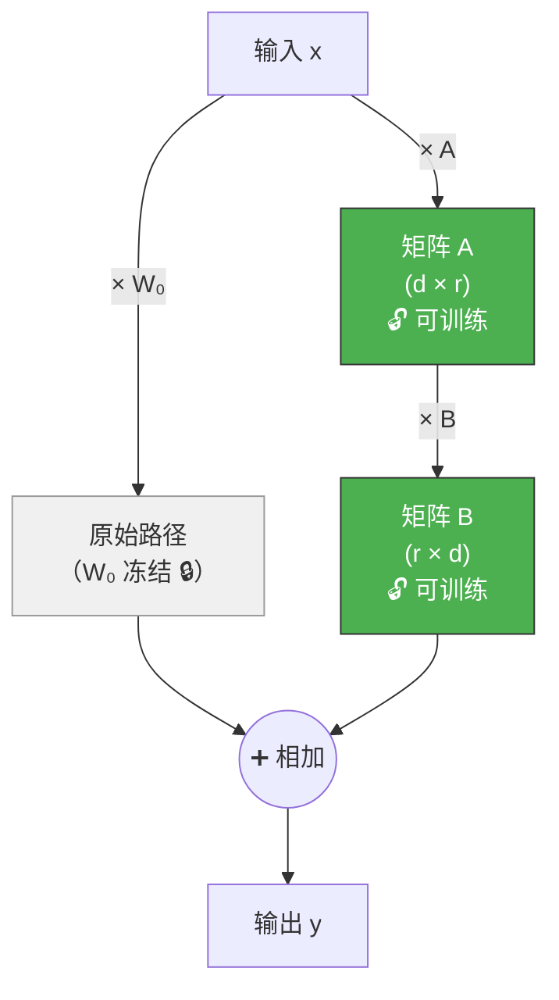
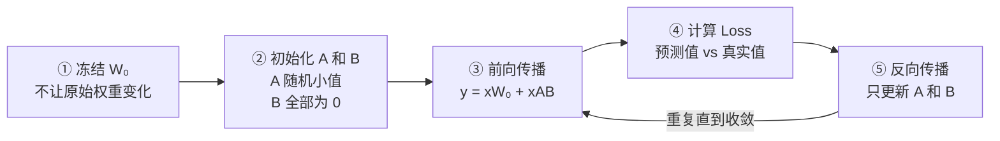
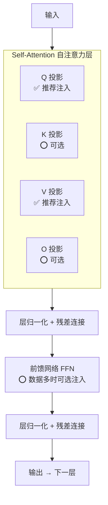
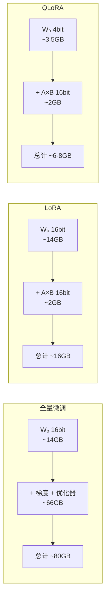

# LoRA 原理详解（Low-Rank Adaptation）

## 1. LoRA 解决什么问题？

在[上一篇文档](./1-微调技术详解.md)中，我们知道了微调是让预训练模型适应特定任务的过程。但全量微调有一个巨大的问题：

> 一个 7B 参数的模型，全量微调需要更新 **70 亿个参数**，至少需要 **80GB 显存**——这是普通开发者根本无法承受的。

LoRA 的出现就是为了解决这个问题：**用不到 1% 的参数，达到接近全量微调的效果。**

听起来很神奇，对吧？要理解 LoRA 是怎么做到的，我们需要一步步来。

---

## 2. 前置知识：模型里的"权重矩阵"是什么？

### 神经网络本质 = 一堆矩阵乘法

大语言模型（如 GPT、Qwen）的核心就是一层又一层的**矩阵运算**。

你可以把每一层想象成一个"加工车间"：

```
┌───────────────────────────────────────┐
│             一个神经网络层              │
│                                       │
│  输入数字 → × 权重矩阵 W → 输出数字   │
│  （原材料）   （加工规则）   （成品）    │
└───────────────────────────────────────┘
```

- **输入**：一组数字（代表文字的含义）
- **权重矩阵 W**：一张巨大的数字表格，就是这个层的"加工规则"
- **输出**：加工后的数字，传给下一层继续处理

### 具体有多大？

```
一个 7B 模型中：
- 有几十个这样的层
- 每个层有多个权重矩阵
- 每个矩阵大小约 4096 × 4096（约 1677 万个数字）
- 所有矩阵加起来 → 70 亿个参数
```

> **类比**：如果把模型的参数比作一本书，那这本书有 **700 万页**，每页 1000 个字。

---

## 3. 微调到底在做什么？

### 微调 = 调整权重矩阵里的数字

当我们微调模型时，本质上就是在调整这些权重矩阵里的数字。

```
W_new = W₀ + ΔW

W₀  = 原始预训练权重（"出厂设置"）
ΔW  = 变化量（"需要做的调整"）
W_new = 微调后的新权重（"定制版本"）
```

### 全量微调的问题：代价太大

```
一个层的 ΔW 大小 = 4096 × 4096 = 16,777,216 个参数（约 1677 万）
几十层加起来 → 需要更新和存储的参数量 = 数十亿
再加上梯度和优化器状态 → 显存需求是模型本身的 3~4 倍
```

> **生活化比喻**：你想修改一本 500 页的手册，全量微调的做法是**把整本书重新抄一遍**——只为了改其中几页的内容。太浪费了！

那有没有办法只记录"要改的部分"呢？这就是 LoRA 的思路。

---

## 4. LoRA 的核心洞察（最关键的一步）

### 发现：ΔW 不是随机的，而是很有规律的

研究人员发现了一个关键现象：

> **模型在适应新任务时，权重的变化量 ΔW 并不是杂乱无章的，而是非常有"规律"的——它的信息量远远小于它的体积。**

用数学的话说，ΔW 是**低秩（Low-Rank）**的。

### "低秩"到底什么意思？用一个例子来看

假设微调后，某一层的理想变化量 ΔW 是下面这个 4×4 矩阵（16 个数字）：

```
ΔW =
    ┌─────────────────────────┐
    │   2      4      6     8 │  ← 第1行
    │   1      2      3     4 │  ← 第2行
    │   3      6      9    12 │  ← 第3行
    │  0.5     1     1.5    2 │  ← 第4行
    └─────────────────────────┘
```

仔细观察，你会发现每一行都遵循**同一个模式**：

```
第1行 = 1.0  × [2, 4, 6, 8]
第2行 = 0.5  × [2, 4, 6, 8]
第3行 = 1.5  × [2, 4, 6, 8]
第4行 = 0.25 × [2, 4, 6, 8]
```

**每一行都是 [2, 4, 6, 8] 这个模式乘以不同的系数！**

这意味着，整个 4×4 的矩阵（16 个数字）可以被**两个小向量**完整表示：

```
    A（列向量）          B（行向量）

    ┌──────┐
    │ 1.0  │
    │ 0.5  │     ×     [2, 4, 6, 8]
    │ 1.5  │
    │ 0.25 │
    └──────┘

    4 个数字       ×     4 个数字    =   4×4 的矩阵

    共 8 个数字     就表示了     16 个数字的矩阵
    节省了 50%！
```

> **比喻**：就像图片压缩。一张有规律的渐变色图片可以用很少的数据描述；一张随机噪声图片则需要记录每一个像素。ΔW 就像那张有规律的图片——它可以被大幅"压缩"。

### 在真实模型中节省多少？

上面是 4×4 的玩具例子，在真实模型中效果更惊人：

```
d = 4096（实际模型维度），r = 8（LoRA 的秩）

全量微调的 ΔW：4096 × 4096 = 16,777,216 个参数

LoRA 的 A + B：4096 × 8 + 8 × 4096 = 65,536 个参数

┌──────────────────────────────────────────────────┐
│          节省了 99.6% 的参数！                      │
│                                                    │
│  16,777,216（全量）→ 65,536（LoRA）                │
│  相当于 256 倍的压缩                                │
└──────────────────────────────────────────────────┘
```

---

## 5. LoRA 是怎么工作的？

现在我们知道了 ΔW 可以用两个小矩阵 A × B 来近似。那在实际训练中，LoRA 是怎么运作的？

### 计算流程图



计算公式：

```
y = x × W₀  +  x × A × B
    ─────       ──────────
    原始路径     LoRA 路径
    (冻结不动)   (只训练这部分)
```

模型同时走两条路：
1. **原始路径**：输入经过原始权重 W₀（冻结不动，占大头）
2. **LoRA 路径**：输入经过两个小矩阵 A 和 B（可训练，参数极少）
3. 两条路的输出**相加**，得到最终结果

### 用具体数字走一遍（r=1 的极简例子）

假设 d=4，r=1：

```
Step 1：原始权重（冻结）

    W₀（4×4）=
    ┌────────────────┐
    │  1   2   3   4 │
    │  5   6   7   8 │
    │  9  10  11  12 │
    │ 13  14  15  16 │
    └────────────────┘


Step 2：LoRA 学到的两个小矩阵

    A（4×1）=         B（1×4）=
    ┌──────┐          ┌─────────────┐
    │ 1.0  │          │ 2  4  6  8  │
    │ 0.5  │          └─────────────┘
    │ 1.5  │
    │ 0.25 │
    └──────┘


Step 3：A × B = ΔW

    ΔW（4×4）=
    ┌──────────────────────┐
    │  2     4     6     8 │
    │  1     2     3     4 │
    │  3     6     9    12 │
    │  0.5   1    1.5    2 │
    └──────────────────────┘


Step 4：最终权重 = W₀ + ΔW

    W_new（4×4）=
    ┌──────────────────────────┐
    │   3     6     9     12   │
    │   6     8    10     12   │
    │  12    16    20     24   │
    │  13.5  15   16.5    18   │
    └──────────────────────────┘
```

> 只用了 **8 个可训练参数**（A 的 4 个 + B 的 4 个），就完成了对 **16 个参数**的权重调整。

---

## 6. 训练和推理的完整过程

### 训练阶段



**为什么 B 初始化为全零？**

```
训练开始时：A × B = A × 0 = 0

所以：y = x × W₀ + 0 = x × W₀

这意味着 LoRA 刚开始时，模型的行为和原始模型完全一样！
然后在训练过程中，A 和 B 会逐渐被优化，模型慢慢适应新任务。

这是一个非常聪明的设计——从原始模型出发，而不是从随机状态开始。
```

### 推理阶段（部署时）

训练完成后，把 LoRA 权重**合并**回原模型：

```
W_final = W₀ + A × B

合并之后的效果：
┌─────────────────────────────────────────┐
│  ✅ 模型和普通模型完全一样，没有额外结构   │
│  ✅ 推理速度零损失                        │
│  ✅ 用户完全感知不到这是 LoRA 微调的       │
└─────────────────────────────────────────┘
```

> **这就是 LoRA 最优雅的地方：训练时省显存，推理时零开销。**

### 完整对比

```
┌──────────────────────────────────────────────────────┐
│                     全量微调                           │
│                                                        │
│  训练：更新 W₀ 全部参数（70 亿个）                      │
│  显存：80GB+                                           │
│  推理：正常速度                                         │
│  设备：A100 / H100 等高端 GPU                           │
├──────────────────────────────────────────────────────┤
│                      LoRA                              │
│                                                        │
│  训练：只更新 A 和 B（不到 1% 的参数）                   │
│  显存：~16GB                                           │
│  推理：合并后和全量微调一样快                             │
│  设备：RTX 4090 等消费级 GPU                            │
├──────────────────────────────────────────────────────┤
│                     QLoRA                              │
│                                                        │
│  训练：LoRA + 原始权重用 4bit 存储                      │
│  显存：~6-8GB                                          │
│  推理：合并后和全量微调一样快                             │
│  设备：RTX 3060 / 4060 等入门级 GPU                     │
└──────────────────────────────────────────────────────┘
```

---

## 7. LoRA 注入在 Transformer 的哪里？

一个 Transformer 层中有多个权重矩阵，LoRA **不需要注入到每一个**，只选关键位置即可。

### Transformer 层结构



### 注入策略

| 注入位置 | 说明 | 推荐程度 |
|----------|------|---------|
| `q_proj`（Q 投影） | 查询矩阵，影响"关注什么" | ✅ 必选 |
| `v_proj`（V 投影） | 值矩阵，影响"提取什么信息" | ✅ 必选 |
| `k_proj`（K 投影） | 键矩阵 | ⭕ 加上效果更好 |
| `o_proj`（输出投影） | 输出矩阵 | ⭕ 可选 |
| `gate_proj` / `up_proj` | FFN 层 | ⭕ 大数据集时加上 |

> **常用配置**：`target_modules: ["q_proj", "v_proj"]` 就足以应对大多数任务。想效果更好可以扩展为 `["q_proj", "v_proj", "k_proj", "o_proj"]`。

---

## 8. LoRA 关键参数详解

### rank（r）—— 控制 LoRA 的"容量"

rank 就是矩阵 A 和 B 中间那个"瓶颈"的大小。

```
r 越大 → A 和 B 越大 → 能表达的变化越丰富 → 但参数也越多

具体例子（d = 4096）：
┌──────┬──────────────────┬───────────┐
│  r   │  LoRA 参数量      │  占全量 %  │
├──────┼──────────────────┼───────────┤
│  4   │  32,768           │  0.2%     │
│  8   │  65,536           │  0.4%     │
│  16  │  131,072          │  0.8%     │
│  64  │  524,288          │  3.1%     │
│ 256  │  2,097,152        │  12.5%    │
└──────┴──────────────────┴───────────┘

推荐：
- 数据 < 1 万条，任务简单 → r = 8 或 16
- 数据 > 1 万条，任务复杂 → r = 32 或 64
- r 不是越大越好，过大容易过拟合且浪费资源
```

### alpha —— 缩放系数

alpha 控制 LoRA 路径对最终输出的"影响力度"：

```
实际公式：y = x × W₀ + (alpha / r) × x × A × B
                        ──────────
                        这个就是缩放因子

alpha = 32, r = 16 → 缩放 = 2.0（LoRA 影响较大）
alpha = 16, r = 16 → 缩放 = 1.0（LoRA 影响适中）
alpha =  8, r = 16 → 缩放 = 0.5（LoRA 影响较小）

经验法则：alpha 通常设为 rank 的 2 倍
```

### dropout —— 防止过拟合

```
训练时随机"关闭" LoRA 中一部分连接，防止模型过度记忆训练数据

推荐值：0.05 ~ 0.1
数据越少 → 过拟合风险越高 → dropout 可以适当增大到 0.1
```

### 参数速查表

| 参数 | 含义 | 推荐值 | 怎么调 |
|------|------|--------|--------|
| `rank` | LoRA 的容量大小 | 8 ~ 64 | 先从 16 开始，效果不好再增大 |
| `alpha` | 缩放系数 | rank × 2 | 一般不需要单独调 |
| `dropout` | 防过拟合 | 0.05 ~ 0.1 | 数据少时增大 |
| `target_modules` | 注入到哪些层 | `q_proj, v_proj` | 想效果更好就加更多层 |

---

## 9. QLoRA：让普通显卡也能微调大模型

QLoRA = LoRA + 量化，在 LoRA 的基础上更进一步。

### 核心思路

LoRA 解决了"训练参数太多"的问题，但 W₀（原始冻结权重）仍然占大量显存。QLoRA 的想法很直接：

> W₀ 反正冻结不训练，那就用低精度存储，节省显存。

```
正常存储 W₀：每个参数占 16 bit → 7B 模型需要 ~14GB 显存
4-bit 存储 W₀：每个参数占 4 bit → 7B 模型只需 ~3.5GB 显存

节省了 10GB+ 的显存！
```

### 显存对比



| 方案 | 显存需求（7B 模型） | 适用显卡 |
|------|---------------------|---------|
| 全量微调 | ~80GB | A100 80GB |
| LoRA | ~16GB | RTX 4090 24GB |
| QLoRA | ~6-8GB | RTX 3060 12GB / RTX 4060 8GB |

> QLoRA 让普通开发者用一张千元级显卡就能微调 7B 模型，是目前性价比最高的方案。

---

## 10. 总结

### LoRA 一句话原理

```
微调时权重的变化量 ΔW 是有规律的（低秩），
可以用两个小矩阵 A × B 来近似表示，
从而把需要训练的参数从数十亿降到几十万。
```

### 为什么 LoRA 这么受欢迎？

| 优势 | 说明 |
|------|------|
| **省显存** | 只训练不到 1% 的参数，消费级 GPU 可用 |
| **效果好** | 在大多数任务上接近全量微调 |
| **推理零开销** | 合并后和原始模型一模一样，速度不变 |
| **可叠加** | 同一个基座模型 + 不同 LoRA 适配器 = 不同能力（类似手机壳） |
| **防遗忘** | 原始权重冻结不变，保留了预训练学到的知识 |

### 一个比喻总结

```
预训练模型 = 一本百科全书（内容丰富但不针对你的需求）

全量微调 = 把整本百科全书重新编写一遍（效果好，但成本极高）

LoRA = 在百科全书的边上贴便签纸（成本极低，效果接近重写）

QLoRA = 把百科全书缩印成口袋版 + 贴便签纸（更省空间）
```

---

> 📖 前置阅读：[1-微调技术详解](./1-微调技术详解.md) — 微调的整体概念和分类
> 📖 下一步：[2-微调实战指南](./2-微调实战指南.md) — 手把手教你用 LoRA 微调模型

---

_本文档持续更新，最后更新：2026年3月_
