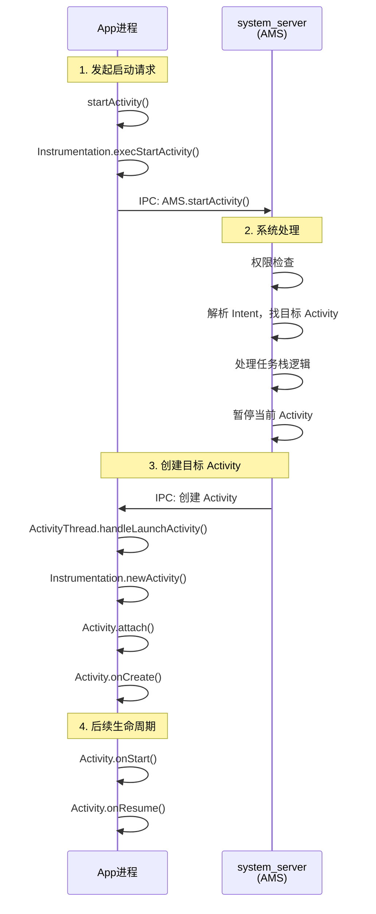
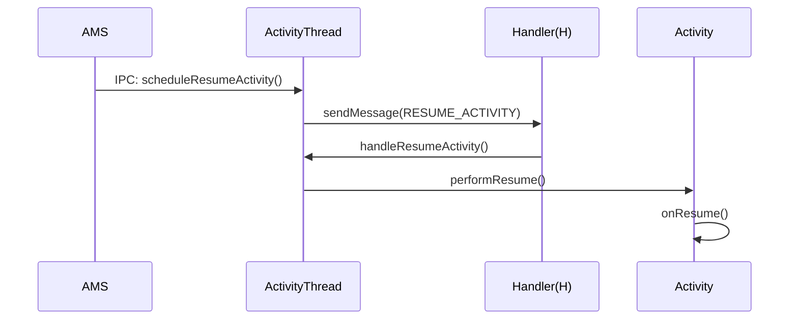

# Activity 源码篇

## 设计哲学

### 为什么 Activity 要如此复杂？

Activity 的设计看起来很复杂——启动一个 Activity 要经过十几个类、跨越多个进程，为什么要这样设计？

```
┌─────────────────────────────────────────────────────────────────┐
│                   Activity 设计的核心考量                        │
├─────────────────────────────────────────────────────────────────┤
│                                                                 │
│   1. 安全性                                                     │
│      • Activity 启动必须经过系统验证（权限、存在性）               │
│      • 跨应用调用需要系统协调                                     │
│                                                                 │
│   2. 资源管理                                                    │
│      • 系统需要统一管理所有应用的 Activity                        │
│      • 内存不足时系统需要能杀死后台 Activity                      │
│                                                                 │
│   3. 生命周期一致性                                              │
│      • 所有 Activity 的生命周期由系统统一调度                     │
│      • 保证在配置变更、低内存等场景下行为一致                      │
│                                                                 │
│   4. 任务管理                                                    │
│      • 最近任务列表需要系统级管理                                 │
│      • 任务栈跨应用也需要协调                                     │
│                                                                 │
└─────────────────────────────────────────────────────────────────┘
```

### 核心设计思想

**1. 客户端-服务端架构**

```
App 进程（客户端）              system_server 进程（服务端）
┌──────────────────┐           ┌──────────────────┐
│                  │           │                  │
│   ActivityThread │ ──Binder─→│  AMS             │
│                  │ ←─Binder──│  (Activity       │
│   Activity       │           │   Manager        │
│                  │           │   Service)       │
└──────────────────┘           └──────────────────┘

所有 Activity 的启动、生命周期调度都要经过 AMS
```

**2. 分层职责**

| 层级 | 类 | 职责 |
|-----|---|-----|
| 应用层 | Activity | 开发者接触的 API |
| 框架层 | ActivityThread | App 主线程管理，生命周期执行 |
| 框架层 | Instrumentation | Activity 创建和生命周期的实际执行者 |
| 系统服务层 | ActivityManagerService | Activity 全局管理、调度 |
| 系统服务层 | ActivityTaskManagerService | Activity 任务栈管理（Android 10+） |

## Activity 启动流程

### 一句话总结

startActivity() 调用后，经过 IPC 到 AMS，AMS 处理任务栈逻辑后，再 IPC 回 App 进程创建 Activity 并执行生命周期。

### 核心流程图



### 关键流程详解

#### 阶段一：发起启动请求

```kotlin
// 1. 从 Activity.startActivity 开始
// Activity.java
public void startActivity(Intent intent) {
    startActivityForResult(intent, -1);  // -1 表示不需要结果
}

// 2. 最终调用 Instrumentation
// Instrumentation 是 Activity 和系统交互的"中间人"
public ActivityResult execStartActivity(
    Context who,
    IBinder contextThread,
    Intent intent,
    // ...
) {
    // 通过 Binder 调用 AMS
    ActivityTaskManager.getService().startActivity(
        whoThread,
        intent,
        // ...
    );
}
```

#### 阶段二：AMS 处理

```kotlin
// ActivityTaskManagerService.java (Android 10+)
// 或 ActivityManagerService.java (Android 10 以下)
public int startActivity(/* 参数省略 */) {
    // 1. 权限检查
    // 2. 解析 Intent，找到目标 ActivityInfo
    // 3. 检查目标 Activity 是否存在、是否 exported
    // 4. 处理启动模式，决定在哪个任务栈启动
    // 5. 如果需要，先暂停当前 Activity
    // 6. 通知目标进程启动 Activity（如果进程不存在，先创建进程）
}
```

**任务栈处理核心逻辑**：

```
输入：Intent + 启动模式 + 当前任务栈状态
输出：目标 Activity 应该放在哪个任务栈的哪个位置

处理逻辑：
1. standard：直接压入当前任务栈
2. singleTop：检查栈顶，是则复用，否则新建
3. singleTask：检查是否有匹配 taskAffinity 的任务
   - 有 → 找栈内实例，清除上方，复用
   - 无 → 创建新任务栈
4. singleInstance：找全局唯一实例或创建独占任务栈
```

#### 阶段三：App 进程处理

```kotlin
// ActivityThread.java - App 的主线程类
// 收到 AMS 的启动请求后

private void handleLaunchActivity(ActivityClientRecord r) {
    // 1. 创建 Activity 实例
    Activity activity = performLaunchActivity(r);
    
    // 2. 执行 onResume
    handleResumeActivity(r.token, /* ... */);
}

private Activity performLaunchActivity(ActivityClientRecord r) {
    // 1. 创建 Activity 对象
    Activity activity = mInstrumentation.newActivity(
        cl, component.getClassName(), r.intent
    );
    
    // 2. 创建 Application（如果还没创建）
    Application app = r.packageInfo.makeApplication(false, mInstrumentation);
    
    // 3. 创建 Context
    ContextImpl appContext = createBaseContextForActivity(r);
    
    // 4. attach：绑定 Context、Window 等
    activity.attach(
        appContext, this, getInstrumentation(),
        r.token, r.ident, app, r.intent,
        r.activityInfo, title, r.parent,
        // ...
    );
    
    // 5. 执行 onCreate
    mInstrumentation.callActivityOnCreate(activity, r.state);
    
    return activity;
}
```

### 启动涉及的关键类

| 类名 | 进程 | 职责 |
|-----|------|-----|
| Activity | App | 开发者接触的类，生命周期回调 |
| Instrumentation | App | Activity 创建和生命周期的实际执行者 |
| ActivityThread | App | App 主线程管理，消息循环 |
| ActivityClientRecord | App | Activity 在客户端的数据结构 |
| ActivityTaskManagerService | system_server | Activity 任务管理（Android 10+） |
| ActivityManagerService | system_server | 应用进程管理、旧版 Activity 管理 |
| ActivityRecord | system_server | Activity 在服务端的数据结构 |
| TaskRecord | system_server | 任务栈的数据结构 |
| ActivityStack | system_server | 任务栈的管理者 |

## 生命周期分发机制

### 一句话总结

AMS 通过 Binder 调用 ActivityThread 的方法，ActivityThread 通过 Handler 在主线程执行生命周期回调。

### 核心流程



### TransactionExecutor（Android 9+）

Android 9 引入了 `ClientTransaction` 机制，统一了生命周期调度：

```kotlin
// 旧方式（Android 9 以前）：每个生命周期一个单独的方法
// scheduleResumeActivity()
// schedulePauseActivity()
// ...

// 新方式（Android 9+）：统一的事务机制
public class ClientTransaction {
    // 生命周期状态的回调列表
    private List<ClientTransactionItem> mActivityCallbacks;
    
    // 最终要达到的生命周期状态
    private ActivityLifecycleItem mLifecycleStateRequest;
}

// 执行器
class TransactionExecutor {
    public void execute(ClientTransaction transaction) {
        // 1. 先执行回调（如 onNewIntent）
        executeCallbacks(transaction);
        
        // 2. 再执行生命周期状态变更
        executeLifecycleState(transaction);
    }
    
    private void executeLifecycleState(ClientTransaction transaction) {
        // 计算从当前状态到目标状态需要执行的生命周期方法
        // 例如：从 RESUMED 到 STOPPED
        // 需要执行：onPause → onStop
        cycleToPath(r, lifecycleItem.getTargetState());
    }
}
```

### 状态机设计

```
┌─────────────────────────────────────────────────────────────────┐
│              Activity 生命周期状态机                             │
├─────────────────────────────────────────────────────────────────┤
│                                                                 │
│                    ┌─────────────────┐                          │
│                    │   INITIALIZING  │ (0)                      │
│                    └────────┬────────┘                          │
│                             │ onCreate                          │
│                             ▼                                   │
│                    ┌─────────────────┐                          │
│                    │    CREATED      │ (1)                      │
│                    └────────┬────────┘                          │
│                             │ onStart                           │
│                             ▼                                   │
│                    ┌─────────────────┐                          │
│                    │    STARTED      │ (2)                      │
│                    └────────┬────────┘                          │
│                             │ onResume                          │
│                             ▼                                   │
│                    ┌─────────────────┐                          │
│                    │    RESUMED      │ (3)                      │
│                    └────────┬────────┘                          │
│                             │ onPause                           │
│                             ▼                                   │
│                    ┌─────────────────┐                          │
│                    │    STARTED      │ (2)                      │
│                    └────────┬────────┘                          │
│                             │ onStop                            │
│                             ▼                                   │
│                    ┌─────────────────┐                          │
│                    │    CREATED      │ (1)                      │
│                    └────────┬────────┘                          │
│                             │ onDestroy                         │
│                             ▼                                   │
│                    ┌─────────────────┐                          │
│                    │   DESTROYED     │ (0)                      │
│                    └─────────────────┘                          │
│                                                                 │
│   状态转换时，TransactionExecutor 会计算路径并依次执行           │
│   例如：RESUMED → CREATED 需要执行 onPause → onStop             │
│                                                                 │
└─────────────────────────────────────────────────────────────────┘
```

## Activity 与 Window 的关系

### 一句话总结

Activity 持有 PhoneWindow，PhoneWindow 持有 DecorView，DecorView 是 View 树的根。

### 架构关系

```
┌─────────────────────────────────────────────────────────────────┐
│                   Activity - Window - View 关系                  │
├─────────────────────────────────────────────────────────────────┤
│                                                                 │
│   Activity                                                      │
│      │                                                          │
│      └──► PhoneWindow (mWindow)                                 │
│              │                                                  │
│              └──► DecorView (mDecor)                            │
│                      │                                          │
│                      ├── 标题栏 (可选)                          │
│                      │                                          │
│                      └── ContentParent (android.R.id.content)   │
│                              │                                  │
│                              └── 你的布局 (setContentView)      │
│                                                                 │
└─────────────────────────────────────────────────────────────────┘
```

### setContentView 流程

```kotlin
// Activity.setContentView
public void setContentView(int layoutResID) {
    // 委托给 Window
    getWindow().setContentView(layoutResID);
}

// PhoneWindow.setContentView
public void setContentView(int layoutResID) {
    // 1. 如果 DecorView 还没创建，先创建
    if (mContentParent == null) {
        installDecor();
    }
    
    // 2. 把你的布局 inflate 并添加到 ContentParent
    mLayoutInflater.inflate(layoutResID, mContentParent);
}

private void installDecor() {
    // 创建 DecorView
    mDecor = generateDecor(-1);
    
    // 根据 theme 选择基础布局（有无标题栏等）
    // 并找到 ContentParent（id 是 android.R.id.content）
    mContentParent = generateLayout(mDecor);
}
```

### 为什么这样设计？

**职责分离**：

| 组件 | 职责 |
|-----|------|
| Activity | 生命周期管理、业务逻辑 |
| Window | 窗口策略（如窗口属性、动画） |
| DecorView | View 层级管理、事件分发起点 |

**好处**：
1. Dialog 可以复用 Window 的逻辑，不需要 Activity
2. 多窗口模式下更容易管理
3. 窗口动画等与 Activity 逻辑解耦

## AMS 核心原理

### AMS 的职责

```
┌─────────────────────────────────────────────────────────────────┐
│                    AMS 核心职责                                  │
├─────────────────────────────────────────────────────────────────┤
│                                                                 │
│   1. Activity 生命周期管理                                       │
│      • 调度 Activity 的启动、暂停、停止、销毁                    │
│      • 处理配置变更                                              │
│                                                                 │
│   2. 任务栈管理                                                  │
│      • 管理所有应用的任务栈                                      │
│      • 处理启动模式逻辑                                          │
│      • 最近任务列表                                              │
│                                                                 │
│   3. 进程管理                                                    │
│      • 应用进程的启动和销毁                                      │
│      • 低内存时杀进程的优先级判断                                 │
│      • 进程优先级：前台 > 可见 > 服务 > 缓存 > 空                │
│                                                                 │
│   4. 权限检查                                                    │
│      • 启动 Activity 的权限验证                                  │
│      • exported 属性检查                                         │
│                                                                 │
└─────────────────────────────────────────────────────────────────┘
```

### ActivityRecord 和 TaskRecord

```kotlin
// ActivityRecord：一个 Activity 实例在 AMS 中的表示
class ActivityRecord {
    // 唯一标识
    IBinder appToken;
    
    // Activity 信息
    ActivityInfo info;
    Intent intent;
    
    // 状态
    ActivityState mState;
    
    // 所属任务
    TaskRecord task;
    
    // 对应的应用进程
    ProcessRecord app;
}

// TaskRecord：一个任务栈在 AMS 中的表示
class TaskRecord {
    // 任务 ID
    int taskId;
    
    // 任务亲和性
    String affinity;
    
    // 栈中的 Activity 列表
    ArrayList<ActivityRecord> mActivities;
    
    // 所属的 ActivityStack
    ActivityStack mStack;
}
```

### 低内存时的回收策略

```
┌─────────────────────────────────────────────────────────────────┐
│                    进程优先级（从高到低）                         │
├─────────────────────────────────────────────────────────────────┤
│                                                                 │
│   Foreground Process（前台进程）                                │
│   • 有正在交互的 Activity（RESUMED）                            │
│   • 有正在执行 onReceive 的 BroadcastReceiver                   │
│   • 有正在执行生命周期方法的 Service                             │
│                                                                 │
│   Visible Process（可见进程）                                   │
│   • 有可见但非前台的 Activity（如被对话框覆盖）                   │
│   • 有绑定到可见 Activity 的 Service                            │
│                                                                 │
│   Service Process（服务进程）                                   │
│   • 有正在运行的 Service                                        │
│                                                                 │
│   Cached Process（缓存进程）                                    │
│   • 没有活跃组件的进程                                          │
│   • 保留是为了快速恢复                                          │
│   • 内存不足时首先被杀                                          │
│                                                                 │
│   ───────────────────────────────────────────────────────────   │
│   内存不足时，从下往上杀，尽量保证前台体验                        │
│                                                                 │
└─────────────────────────────────────────────────────────────────┘
```

## 源码中的设计亮点

### 1. Token 机制

Activity 和 AMS 之间通过 Token（IBinder）通信，而不是直接持有引用：

```kotlin
// 为什么用 Token？
// 1. 跨进程：Binder 可以跨进程传递
// 2. 安全：不暴露 Activity 的直接引用
// 3. 唯一标识：可以唯一确定一个 Activity 实例

// Activity.attach() 中
final void attach(Context context, ActivityThread aThread,
        Instrumentation instr, IBinder token, /* ... */) {
    
    // 保存 token，用于和 AMS 通信
    mToken = token;
    
    // 创建 Window 时也传入 token
    mWindow = new PhoneWindow(this, window, activityConfigCallback);
    mWindow.setCallback(this);
}
```

### 2. 事务批处理（ClientTransaction）

```kotlin
// 好处：
// 1. 减少 IPC 次数：多个操作合并成一次事务
// 2. 保证原子性：要么全成功，要么全失败
// 3. 更灵活：可以组合任意生命周期状态

// 示例：启动 Activity 的事务
ClientTransaction transaction = ClientTransaction.obtain(
    app.getThread(),  // IApplicationThread
    r.appToken        // Activity 的 token
);

// 添加回调：先执行 LaunchActivityItem
transaction.addCallback(LaunchActivityItem.obtain(/* ... */));

// 设置最终状态：最后要到 RESUMED
transaction.setLifecycleStateRequest(ResumeActivityItem.obtain(/* ... */));

// 发送事务
mService.getLifecycleManager().scheduleTransaction(transaction);
```

### 3. ActivityThread.H 的消息设计

```kotlin
// ActivityThread 内部类 H 是一个 Handler
// 它负责处理所有来自 AMS 的调度消息

class H extends Handler {
    public static final int BIND_APPLICATION = 110;
    public static final int EXIT_APPLICATION = 111;
    public static final int RECEIVER = 113;
    public static final int CREATE_SERVICE = 114;
    public static final int EXECUTE_TRANSACTION = 159;  // Android 9+ 新增
    // ...
    
    public void handleMessage(Message msg) {
        switch (msg.what) {
            case EXECUTE_TRANSACTION:
                // 执行生命周期事务
                final ClientTransaction transaction = (ClientTransaction) msg.obj;
                mTransactionExecutor.execute(transaction);
                break;
            // ...
        }
    }
}

// 设计亮点：
// 1. 所有调度都通过 Handler，保证在主线程执行
// 2. 消息队列天然排序，保证执行顺序
// 3. 可以通过 removeMessages 取消未执行的操作
```

### 4. Instrumentation 的代理模式

```kotlin
// Instrumentation 作为 Activity 操作的代理
// 好处：
// 1. 统一入口：所有 Activity 创建、生命周期都经过这里
// 2. 易于测试：可以替换 Instrumentation 进行 UI 测试
// 3. 解耦：Activity 不直接与系统交互

public class Instrumentation {
    
    // 创建 Activity
    public Activity newActivity(ClassLoader cl, String className, Intent intent) {
        // 通过反射创建 Activity 实例
        return (Activity) cl.loadClass(className).newInstance();
    }
    
    // 执行 onCreate
    public void callActivityOnCreate(Activity activity, Bundle savedState) {
        activity.performCreate(savedState);
    }
    
    // 执行 onResume
    public void callActivityOnResume(Activity activity) {
        activity.onResume();
    }
    
    // UI 测试框架（如 Espresso）通过替换这个类来拦截操作
}
```

## 延伸思考

### 如果让你设计 Activity 系统，你会怎么做？

**问题拆解**：

```
1. 如何管理多个应用的 Activity？
   → 需要一个中央服务（AMS）

2. 如何保证 Activity 生命周期的一致性？
   → 由系统统一调度，不是 App 自己控制

3. 如何实现跨应用启动？
   → Intent 机制 + 系统服务协调

4. 如何处理低内存？
   → 进程优先级 + 状态保存恢复

5. 如何保证安全？
   → 权限检查 + exported 控制
```

**关键设计决策**：

| 决策点 | Android 的选择 | 为什么 |
|-------|--------------|-------|
| 集中 vs 分布式管理 | 集中（AMS） | 更容易做全局优化和资源管理 |
| 同步 vs 异步调度 | 异步（Handler） | 避免阻塞调用方 |
| 状态管理 | Bundle 序列化 | 跨进程兼容，支持进程死亡恢复 |
| 跨进程通信 | Binder | 高效、安全、支持身份验证 |

### 为什么 Activity 启动这么慢？

```
分析：
┌───────────────────────────────────────────────────────────┐
│ 启动一个 Activity 至少涉及：                              │
│                                                           │
│ 1. IPC 通信（App → AMS → App）：~10ms                     │
│ 2. 权限检查、Intent 解析：~5ms                            │
│ 3. 任务栈处理：~2ms                                       │
│ 4. Activity 对象创建 + attach：~5ms                       │
│ 5. setContentView + 布局 inflate：~50-200ms（取决于复杂度）│
│ 6. View measure/layout/draw：~16-100ms                   │
│                                                           │
│ 总计：100-300ms 是正常的                                  │
└───────────────────────────────────────────────────────────┘

优化方向：
1. 减少布局复杂度（减少 inflate 时间）
2. 延迟非必要初始化
3. 使用 ViewStub 懒加载
4. 考虑使用 Fragment 替代部分 Activity（避免 IPC）
```

## 面试检验

### 源码题

**Q1: Activity 的启动流程是怎样的？涉及哪些关键类？**

> **答案**：
> 1. `Activity.startActivity()` → `Instrumentation.execStartActivity()`
> 2. 通过 Binder IPC 调用 `AMS.startActivity()`
> 3. AMS 处理权限检查、Intent 解析、任务栈逻辑
> 4. AMS 通过 Binder 回调 `ActivityThread.handleLaunchActivity()`
> 5. `Instrumentation.newActivity()` 创建 Activity 实例
> 6. `Activity.attach()` 绑定 Context、Window
> 7. `Instrumentation.callActivityOnCreate()` 执行 onCreate
> 
> **关键类**：Activity、Instrumentation、ActivityThread、AMS、ClientTransaction

**Q2: AMS（ActivityManagerService）的作用是什么？**

> **答案**：AMS 是 Android 系统的核心服务，运行在 system_server 进程中，职责包括：
> - Activity 生命周期的调度和管理
> - 任务栈的管理（处理启动模式、TaskAffinity）
> - 应用进程的启动和管理
> - 低内存时的进程回收决策
> - 最近任务列表的维护
> 
> Android 10 后，Activity 相关逻辑分离到 ActivityTaskManagerService。

**Q3: Activity 的生命周期是如何被分发的？**

> **答案**：
> 1. AMS 决定 Activity 应该进入什么状态
> 2. 通过 `ClientTransaction` 封装生命周期状态请求
> 3. 通过 Binder IPC 发送到 App 进程的 `ActivityThread`
> 4. `ActivityThread.H`（Handler）收到消息
> 5. `TransactionExecutor` 执行事务，计算状态转换路径
> 6. 依次调用 `Instrumentation` 的生命周期方法
> 7. 最终执行到 Activity 的 onXxx 回调

**Q4: 为什么 Activity 的创建要经过 Instrumentation？**

> **答案**：Instrumentation 是代理模式的应用：
> - **统一入口**：所有 Activity 的创建和生命周期调用都经过这里
> - **易于测试**：UI 测试框架（如 Espresso）可以替换 Instrumentation 来拦截和控制 Activity
> - **解耦**：Activity 不需要直接与系统服务交互
> - **扩展性**：可以在这里添加监控、日志等逻辑

**Q5: Activity 和 Window、DecorView 的关系是什么？**

> **答案**：
> - **Activity** 持有 **PhoneWindow**（Window 的实现类）
> - **PhoneWindow** 持有 **DecorView**（根 View）
> - **DecorView** 包含标题栏（可选）和 **ContentParent**
> - 调用 `setContentView` 时，布局会被添加到 ContentParent 中
> 
> 这样设计是为了职责分离：Activity 管理生命周期，Window 管理窗口策略，DecorView 管理 View 层级。

---

_本篇完成了 Activity 源码层面的分析，理解这些原理有助于解决复杂的启动、生命周期问题，也是大厂面试的高频考点。_
