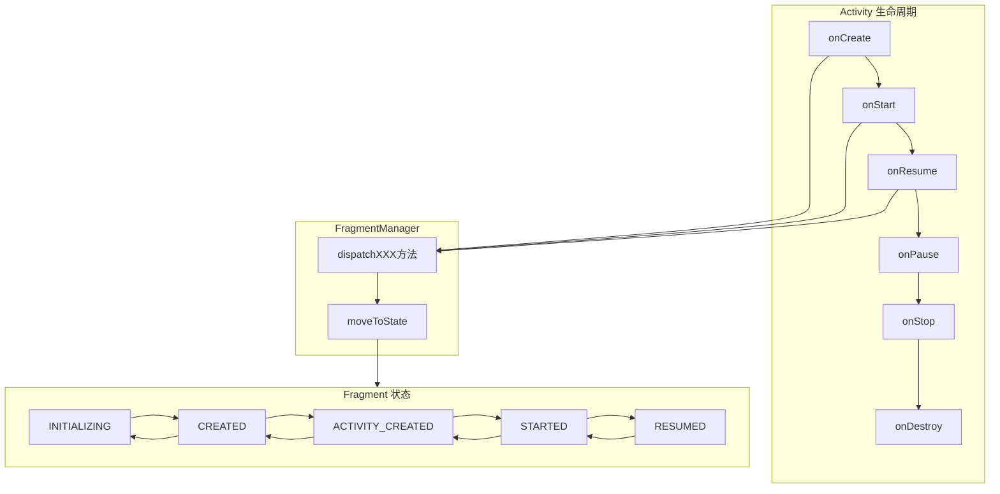
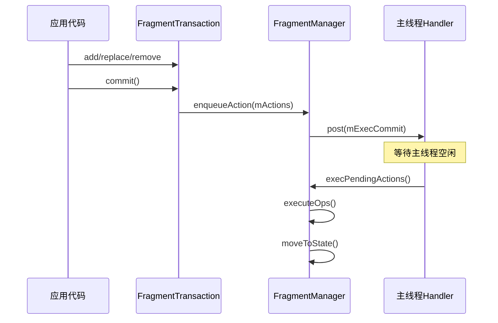

# Fragment 源码篇

## 核心原理概述

Fragment 的源码主要涉及三个核心问题：
1. **生命周期如何分发**：Fragment 的生命周期是如何与 Activity 联动的？
2. **事务如何执行**：commit() 到底做了什么？为什么是异步的？
3. **状态如何保存恢复**：配置变更后 Fragment 是如何恢复的？

## 生命周期分发机制

### 一句话总结

Fragment 的生命周期不是自己管理的，而是由 FragmentManager 根据 Activity 的生命周期状态来**驱动**的。FragmentManager 维护了 Fragment 应该处于的目标状态，通过 `moveToState()` 方法把 Fragment 从当前状态迁移到目标状态。

### 设计哲学

**为什么 Fragment 不能自己管理生命周期？**

想象 Fragment 是员工，Activity 是公司。员工（Fragment）不能自己决定什么时候上班、下班，而是要听公司（Activity）的安排。公司开门（Activity onCreate），员工才能进来；公司关门（Activity onDestroy），员工必须离开。

这种设计的好处：
1. **一致性**：所有 Fragment 的生命周期与 Activity 保持同步
2. **可控性**：系统可以统一管理资源
3. **简化性**：开发者不用关心 Fragment 何时应该进入哪个状态

### 核心流程图



### 关键源码分析

**FragmentManager 状态常量**：

```java
// Fragment 的5种状态（源码中是int常量）
static final int INITIALIZING = -1;    // Fragment 刚创建，还没 attach
static final int ATTACHED = 0;         // 已 attach，还没 create
static final int CREATED = 1;          // onCreate 已调用
static final int VIEW_CREATED = 2;     // onCreateView 已调用
static final int AWAITING_EXIT_EFFECTS = 3;  // 等待退出动画
static final int ACTIVITY_CREATED = 4; // onActivityCreated 已调用（已废弃）
static final int STARTED = 5;          // onStart 已调用
static final int AWAITING_ENTER_EFFECTS = 6; // 等待进入动画
static final int RESUMED = 7;          // onResume 已调用
```

**moveToState 核心逻辑**（简化版）：

```java
// 这是 FragmentManager 中最核心的方法
// 负责把 Fragment 从当前状态迁移到目标状态
void moveToState(Fragment f, int newState) {
    // 当前状态
    int curState = f.mState;
    
    if (newState > curState) {
        // 向前推进状态（如 CREATED → STARTED）
        switch (curState) {
            case INITIALIZING:
                f.performAttach();      // → onAttach
                // fall through
            case ATTACHED:
                f.performCreate();      // → onCreate
                // fall through  
            case CREATED:
                f.performCreateView();  // → onCreateView
                f.performViewCreated(); // → onViewCreated
                // fall through
            case VIEW_CREATED:
                f.performActivityCreated(); // → onActivityCreated（已废弃）
                // fall through
            case ACTIVITY_CREATED:
                f.performStart();       // → onStart
                // fall through
            case STARTED:
                f.performResume();      // → onResume
                break;
        }
    } else if (newState < curState) {
        // 向后回退状态（如 RESUMED → STOPPED）
        switch (curState) {
            case RESUMED:
                f.performPause();       // → onPause
                // fall through
            case STARTED:
                f.performStop();        // → onStop
                // fall through
            case ACTIVITY_CREATED:
                f.performDestroyView(); // → onDestroyView
                // fall through
            case CREATED:
                f.performDestroy();     // → onDestroy
                // fall through
            case ATTACHED:
                f.performDetach();      // → onDetach
                break;
        }
    }
    
    f.mState = newState;
}
```

**Activity 如何触发 Fragment 状态变化**：

```java
// FragmentActivity 中
@Override
protected void onCreate(Bundle savedInstanceState) {
    super.onCreate(savedInstanceState);
    // 触发 Fragment 的 onCreate
    mFragments.dispatchCreate();
}

@Override
protected void onStart() {
    super.onStart();
    // 触发 Fragment 的 onStart
    mFragments.dispatchStart();
}

// FragmentManager 中
void dispatchStart() {
    // 设置目标状态为 STARTED
    mStateSaved = false;
    // 遍历所有 Fragment，调用 moveToState
    dispatchStateChange(Fragment.STARTED);
}

private void dispatchStateChange(int nextState) {
    // 更新 Fragment 状态
    moveToState(nextState, false);
}
```

### 设计亮点

1. **状态机模式**：Fragment 生命周期用状态机实现，状态转换逻辑清晰
2. **统一管理**：FragmentManager 集中管理所有 Fragment，便于协调
3. **懒惰迁移**：只有真正需要时才迁移状态，避免不必要的开销
4. **fallthrough 技巧**：switch-case 利用 fallthrough 实现连续状态迁移

## Fragment 事务原理

### 一句话总结

Fragment 事务是**异步执行**的，commit() 只是把事务加入队列，真正的执行发生在主线程空闲时。这样设计是为了支持事务批量处理和动画执行。

### 事务执行流程



### commit 系列方法对比

```java
// commit() - 异步执行，onSaveInstanceState 后调用会崩溃
public int commit() {
    return commitInternal(false);  // allowStateLoss = false
}

// commitAllowingStateLoss() - 异步执行，允许状态丢失
public int commitAllowingStateLoss() {
    return commitInternal(true);   // allowStateLoss = true
}

// commitNow() - 同步执行，不能添加到 BackStack
public void commitNow() {
    disallowAddToBackStack();      // 禁止加入返回栈
    mManager.execSingleAction(this, false);  // 同步执行
}

// commitNowAllowingStateLoss() - 同步执行，允许状态丢失
public void commitNowAllowingStateLoss() {
    disallowAddToBackStack();
    mManager.execSingleAction(this, true);
}
```

**为什么 commitNow 不能添加到 BackStack？**

BackStack 需要保证事务的顺序性。如果允许 commitNow 添加到 BackStack，可能导致：
- 事务 A（async，加入 BackStack）
- 事务 B（commitNow，加入 BackStack）
- 事务 A 实际在 B 之后执行

这会破坏 BackStack 的顺序，导致 popBackStack 时行为混乱。

### 核心源码分析

**FragmentTransaction.commit()**：

```java
int commitInternal(boolean allowStateLoss) {
    if (mCommitted) {
        throw new IllegalStateException("commit already called");
    }
    mCommitted = true;
    
    if (mAddToBackStack) {
        // 分配 BackStack 索引
        mIndex = mManager.allocBackStackIndex();
    }
    
    // 关键：把事务加入队列
    mManager.enqueueAction(this, allowStateLoss);
    return mIndex;
}
```

**FragmentManager.enqueueAction()**：

```java
void enqueueAction(OpGenerator action, boolean allowStateLoss) {
    if (!allowStateLoss) {
        // 检查是否已经 onSaveInstanceState
        if (mStateSaved) {
            throw new IllegalStateException(
                "Can not perform this action after onSaveInstanceState");
        }
    }
    
    synchronized (mPendingActions) {
        // 加入待执行队列
        mPendingActions.add(action);
        // 调度执行（post 到主线程）
        scheduleCommit();
    }
}

void scheduleCommit() {
    synchronized (mPendingActions) {
        if (mPendingActions.size() == 1) {
            // 只 post 一次，避免重复调度
            mHost.getHandler().post(mExecCommit);
        }
    }
}

// Handler 回调
Runnable mExecCommit = new Runnable() {
    @Override
    public void run() {
        execPendingActions(true);
    }
};
```

**为什么要异步执行？**

1. **批量处理**：多个 commit() 可以合并执行，减少开销
2. **动画支持**：给动画执行留出时间
3. **避免重入**：防止在 Fragment 回调中再次触发事务执行
4. **UI 流畅性**：不阻塞当前代码执行

### 设计亮点

1. **生产者-消费者模式**：commit 是生产者，Handler 是消费者
2. **合并执行**：多个事务可以一次性执行
3. **状态检查**：通过 allowStateLoss 参数灵活控制
4. **同步选项**：commitNow 提供了同步执行的能力

## 状态保存与恢复

### 一句话总结

Fragment 的状态保存分为两部分：**Fragment 自身的状态**（如 arguments、是否 hidden）和 **View 的状态**（如 EditText 的内容）。恢复时 FragmentManager 根据保存的信息重建 Fragment 实例。

### 保存恢复流程

```
┌────────────────────────────────────────────────────────────┐
│                Fragment 状态保存与恢复                      │
├────────────────────────────────────────────────────────────┤
│                                                            │
│   保存流程（Activity.onSaveInstanceState 触发）：           │
│   ┌──────────────────┐                                     │
│   │FragmentManager   │                                     │
│   │.saveAllState()   │                                     │
│   └────────┬─────────┘                                     │
│            │                                               │
│   ┌────────▼─────────┐   ┌──────────────────┐             │
│   │ 保存 Fragment    │   │ 保存 View 状态    │             │
│   │ • mWho（唯一ID） │   │ • 遍历所有有ID的View│            │
│   │ • mArguments    │   │ • 调用 saveHierarchyState│       │
│   │ • mHidden       │   └──────────────────┘             │
│   │ • mRetainInstance│                                    │
│   │ • mBackStackNesting│                                  │
│   └──────────────────┘                                     │
│            │                                               │
│            ▼                                               │
│   写入 outState Bundle（key = "android:support:fragments"）│
│                                                            │
│   ─────────────────────────────────────────────────────    │
│                                                            │
│   恢复流程（Activity.onCreate 触发）：                       │
│   ┌──────────────────┐                                     │
│   │FragmentManager   │                                     │
│   │.restoreSaveState │                                     │
│   └────────┬─────────┘                                     │
│            │                                               │
│   ┌────────▼─────────┐                                     │
│   │ 反射创建 Fragment │  ← 使用无参构造函数                  │
│   │ 恢复 arguments   │                                     │
│   │ 恢复其他状态     │                                     │
│   └────────┬─────────┘                                     │
│            │                                               │
│            ▼                                               │
│   Fragment 重新走一遍生命周期                               │
│   onCreateView 后恢复 View 状态                            │
│                                                            │
└────────────────────────────────────────────────────────────┘
```

### 核心源码分析

**保存状态 - FragmentManager.saveAllState()**：

```java
Parcelable saveAllState() {
    // 1. 确保所有事务都已执行
    execPendingActions(true);
    
    // 2. 保存所有活跃 Fragment 的状态
    ArrayList<FragmentState> active = new ArrayList<>();
    for (Fragment f : mFragmentStore.getActiveFragments()) {
        if (f != null) {
            // 保存单个 Fragment 的状态
            FragmentState fs = new FragmentState(f);
            active.add(fs);
            
            // 触发 Fragment.onSaveInstanceState
            if (f.mState > Fragment.INITIALIZING) {
                Bundle savedState = new Bundle();
                f.performSaveInstanceState(savedState);
                fs.mSavedFragmentState = savedState;
            }
        }
    }
    
    // 3. 保存返回栈
    ArrayList<BackStackState> backStack = null;
    if (mBackStack != null) {
        int size = mBackStack.size();
        if (size > 0) {
            backStack = new ArrayList<>(size);
            for (int i = 0; i < size; i++) {
                BackStackState bss = new BackStackState(mBackStack.get(i));
                backStack.add(bss);
            }
        }
    }
    
    // 4. 打包返回
    FragmentManagerState fms = new FragmentManagerState();
    fms.mActive = active;
    fms.mAdded = added;
    fms.mBackStack = backStack;
    return fms;
}
```

**FragmentState 数据结构**：

```java
// 保存 Fragment 状态的类
final class FragmentState implements Parcelable {
    final String mClassName;         // Fragment 类名，用于反射创建
    final String mWho;               // 唯一标识
    final Bundle mArguments;         // 传入的参数
    Bundle mSavedFragmentState;      // Fragment.onSaveInstanceState 保存的数据
    final boolean mHidden;           // 是否隐藏
    
    // 恢复时通过反射创建 Fragment
    Fragment instantiate(...) {
        // 使用类名反射创建实例（无参构造函数）
        Fragment f = fragmentFactory.instantiate(classLoader, mClassName);
        // 恢复参数
        f.setArguments(mArguments);
        // 恢复其他状态...
        return f;
    }
}
```

**恢复状态 - FragmentManager.restoreSaveState()**：

```java
void restoreSaveState(Parcelable state) {
    FragmentManagerState fms = (FragmentManagerState) state;
    
    // 1. 重建所有 Fragment
    for (FragmentState fs : fms.mActive) {
        // 反射创建 Fragment 实例
        Fragment f = fs.instantiate(mHost.getContext().getClassLoader(),
                                    getFragmentFactory());
        // 设置状态
        f.mSavedFragmentState = fs.mSavedFragmentState;
        // 添加到管理
        mFragmentStore.makeActive(f);
    }
    
    // 2. 恢复 added 列表
    mFragmentStore.restoreAddedFragments(fms.mAdded);
    
    // 3. 恢复返回栈
    if (fms.mBackStack != null) {
        mBackStack = new ArrayList<>(fms.mBackStack.size());
        for (BackStackState bss : fms.mBackStack) {
            BackStackRecord bse = bss.instantiate(this);
            mBackStack.add(bse);
        }
    }
}
```

### 为什么构造函数必须无参？

```java
// FragmentState.instantiate() 中
Fragment f = fragmentFactory.instantiate(classLoader, mClassName);

// 默认的 FragmentFactory
public Fragment instantiate(ClassLoader classLoader, String className) {
    // 使用 Class.newInstance()，需要无参构造函数
    Class<? extends Fragment> clazz = loadClass(classLoader, className);
    return clazz.newInstance();  // 调用无参构造函数
}
```

如果 Fragment 没有无参构造函数，`clazz.newInstance()` 会抛出异常。

### 设计亮点

1. **轻量化保存**：只保存必要的元数据，不保存整个 Fragment 对象
2. **分层设计**：Fragment 状态和 View 状态分开保存
3. **工厂模式**：FragmentFactory 支持自定义创建逻辑
4. **幂等恢复**：无论恢复多少次，结果一致

## setMaxLifecycle 原理

### 一句话总结

`setMaxLifecycle()` 通过设置 Fragment 的最大生命周期状态，让 FragmentManager 在 `moveToState()` 时不会超过这个限制。这是 ViewPager2 实现懒加载的核心机制。

### 源码分析

```java
// FragmentTransaction 中
public FragmentTransaction setMaxLifecycle(Fragment fragment, Lifecycle.State state) {
    addOp(new Op(OP_SET_MAX_LIFECYCLE, fragment, state));
    return this;
}

// 执行时
void executeOps() {
    for (int opNum = 0; opNum < numOps; opNum++) {
        final Op op = ops.get(opNum);
        switch (op.mCmd) {
            case OP_SET_MAX_LIFECYCLE:
                // 设置 Fragment 的最大生命周期
                mManager.setMaxLifecycle(op.mFragment, op.mCurrentMaxState);
                break;
        }
    }
}

// FragmentManager 中
void setMaxLifecycle(Fragment f, Lifecycle.State state) {
    // 记录最大状态
    f.mMaxState = state;
    // 重新计算状态并迁移
    moveToState(f);
}

// moveToState 中会检查
void moveToState(Fragment f, int newState) {
    // 目标状态不能超过 maxState
    newState = Math.min(newState, f.mMaxState.ordinal());
    // 然后正常迁移...
}
```

### ViewPager2 如何使用

```java
// FragmentStateAdapter 中
void placeFragmentInViewHolder(FragmentViewHolder holder) {
    Fragment fragment = ...;
    
    // 当前显示的 Fragment 可以到 RESUMED
    // 不显示的 Fragment 最多到 STARTED
    Lifecycle.State state = shouldDelayFragmentTransitions() 
        ? Lifecycle.State.STARTED 
        : Lifecycle.State.RESUMED;
    
    mFragmentManager.beginTransaction()
        .setMaxLifecycle(fragment, state)
        .commit();
}
```

## 深度问题与思考

### Q1: Fragment 的 mWho 字段有什么用？

`mWho` 是 Fragment 的唯一标识，格式通常是 UUID。它的作用：
1. **状态恢复**：通过 mWho 匹配保存的状态和恢复的 Fragment
2. **ViewModel 存储**：ViewModel 是按 mWho 存储的
3. **避免重复**：防止同一个 Fragment 被多次添加

### Q2: 为什么 commitNow 不能加入 BackStack？

```
事务执行顺序问题：
timeline: ─────────────────────────────────►
commit(A)   commitNow(B)   A实际执行
   │            │              │
   ▼            ▼              ▼
加入队列     立即执行      从队列取出执行

如果 B 加入 BackStack，顺序就变成 B → A
但用户期望的是 A → B
```

### Q3: Fragment 与 ViewModel 的生命周期关系？

```
┌────────────────────────────────────────────────────────────┐
│                                                            │
│   配置变更时：                                              │
│                                                            │
│   Fragment                    ViewModel                    │
│   ─────────                   ─────────                    │
│   onDestroy() ←──────────────┤        │                    │
│                              │ 存活    │                    │
│   onCreate() ←───────────────┤        │                    │
│                              │        │                    │
│                                                            │
│   ★ ViewModel 存储在 ViewModelStore 中                      │
│   ★ ViewModelStore 在配置变更时被保留                       │
│   ★ Fragment 重建后通过相同的 mWho 获取到同一个 ViewModel    │
│                                                            │
└────────────────────────────────────────────────────────────┘
```

### Q4: 如果让你设计 Fragment，你会怎么做？

可以思考的方向：
1. **简化生命周期**：Compose 只有 `remember` 和 `DisposableEffect`
2. **声明式 API**：避免命令式的 add/replace/remove
3. **状态管理**：内置状态保存，不需要手动 onSaveInstanceState
4. **更好的类型安全**：参数传递使用泛型，而不是 Bundle

## 源码阅读指南

### 核心类

| 类名 | 作用 | 源码位置 |
|-----|------|---------|
| Fragment | Fragment 基类 | androidx.fragment.app |
| FragmentManager | 管理所有 Fragment | androidx.fragment.app |
| FragmentTransaction | 事务操作 | androidx.fragment.app |
| BackStackRecord | 事务的实现类 | androidx.fragment.app |
| FragmentStateManager | 单个 Fragment 的状态管理 | androidx.fragment.app |
| FragmentStore | Fragment 的存储 | androidx.fragment.app |

### 阅读顺序建议

1. **Fragment.java** - 了解 Fragment 的基本结构和生命周期方法
2. **FragmentManager.java** - 重点看 `moveToState()`、`execPendingActions()`
3. **BackStackRecord.java** - 了解事务如何记录和执行
4. **FragmentStateManager.java** - 了解单个 Fragment 的状态管理

### 调试技巧

```kotlin
// 开启 Fragment 调试日志
FragmentManager.enableDebugLogging(true)

// 自定义 FragmentLifecycleCallbacks 观察所有 Fragment
supportFragmentManager.registerFragmentLifecycleCallbacks(
    object : FragmentManager.FragmentLifecycleCallbacks() {
        override fun onFragmentCreated(fm: FragmentManager, f: Fragment, savedInstanceState: Bundle?) {
            Log.d("FragmentDebug", "${f::class.simpleName} created")
        }
        // 其他回调...
    },
    true  // recursive，包括子 FragmentManager
)
```

## 面试检验

### 源码题

**Q1: Fragment 的生命周期是如何与 Activity 联动的？**

> **答案**：
> Activity 的生命周期方法（如 onCreate、onStart）会调用 FragmentManager 的 dispatchXXX 方法，FragmentManager 设置目标状态后，调用 `moveToState()` 把所有 Fragment 迁移到目标状态。
> 
> 核心机制：
> 1. Activity 触发 → FragmentManager.dispatchCreate()
> 2. FragmentManager 设置目标状态 → Fragment.CREATED
> 3. 遍历所有 Fragment → moveToState(fragment, CREATED)
> 4. moveToState 内部调用 → fragment.performCreate() → onAttach/onCreate

**Q2: commit() 为什么是异步的？commitNow() 为什么不能加入 BackStack？**

> **答案**：
> **commit 异步原因**：
> 1. 支持批量处理多个事务，减少开销
> 2. 给动画执行留出时间
> 3. 避免在 Fragment 回调中重入
> 
> **commitNow 不能加 BackStack 原因**：
> BackStack 需要保证事务的执行顺序。如果允许 commitNow 加入 BackStack，异步的 commit 会在 commitNow 之后执行，但在 BackStack 中的顺序却相反，导致 popBackStack 时行为不一致。

**Q3: Fragment 状态保存时保存了哪些内容？为什么构造函数必须无参？**

> **答案**：
> **保存的内容**：
> - mClassName：类名，用于反射创建
> - mWho：唯一标识
> - mArguments：传入的参数
> - mSavedFragmentState：onSaveInstanceState 保存的数据
> - mHidden：是否隐藏
> - BackStack 信息
> 
> **无参构造函数原因**：
> 恢复时使用 `Class.newInstance()` 反射创建 Fragment 实例，这个方法只能调用无参构造函数。如果用有参构造函数传参，恢复时参数会丢失。应该使用 arguments（Bundle）传参。

**Q4: setMaxLifecycle 的原理是什么？ViewPager2 如何利用它实现懒加载？**

> **答案**：
> **原理**：
> `setMaxLifecycle()` 设置 Fragment 的最大生命周期状态，存储在 `fragment.mMaxState`。`moveToState()` 在迁移状态时会检查这个限制，不会超过 mMaxState。
> 
> **ViewPager2 实现**：
> FragmentStateAdapter 在显示 Fragment 时设置 maxLifecycle 为 RESUMED，不显示的设置为 STARTED。因此不可见的 Fragment 最多到 onStart，不会调用 onResume。开发者只需在 onResume 中加载数据即可实现懒加载。

**Q5: 从源码角度，如何理解 Fragment 的 View 生命周期与 Fragment 生命周期的差异？**

> **答案**：
> Fragment 的 mState 和 View 的存在是分开管理的：
> 
> 1. Fragment 状态：INITIALIZING → CREATED → VIEW_CREATED → STARTED → RESUMED → ...
> 2. View 创建：在 VIEW_CREATED 状态时创建（onCreateView）
> 3. View 销毁：可以在 Fragment 还活着时销毁（onDestroyView）
> 
> 典型场景：ViewPager 中的 Fragment，切换时 View 可能被销毁，但 Fragment 实例保留。返回时重新创建 View（再次调用 onCreateView），但 Fragment 不会重新 onCreate。
> 
> 这就是为什么要在 onDestroyView 中清理 View 引用，以及为什么要使用 viewLifecycleOwner 而不是 Fragment 本身来观察 LiveData。

---

_本篇完成了 Fragment 的源码分析，建议结合实际调试加深理解。_

---

_最后更新：2026-01-20_
