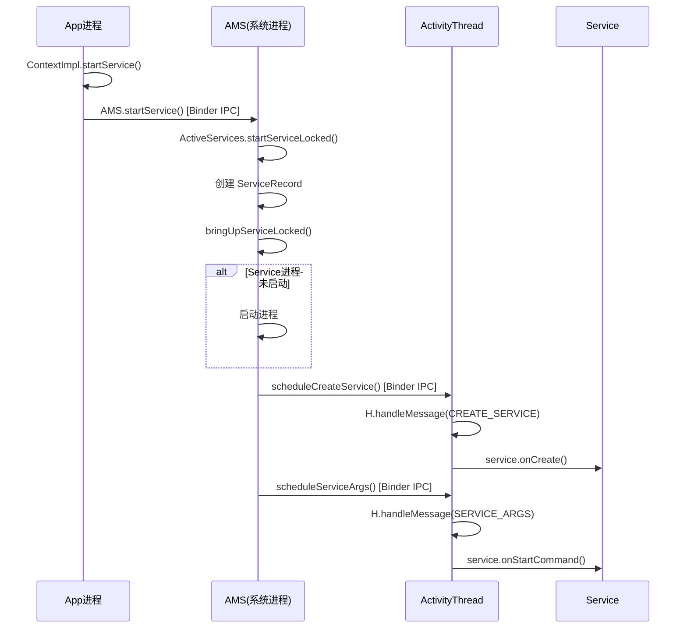
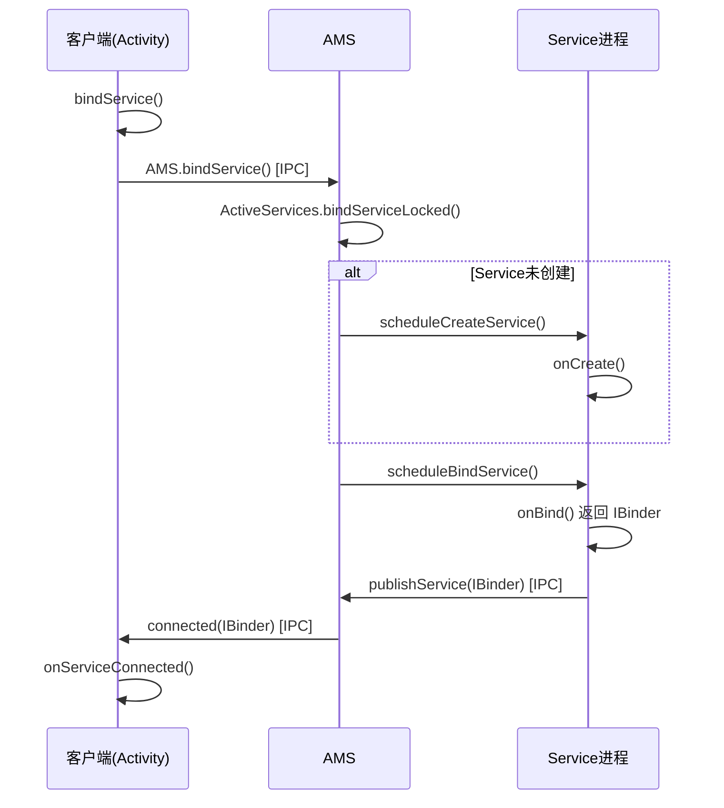
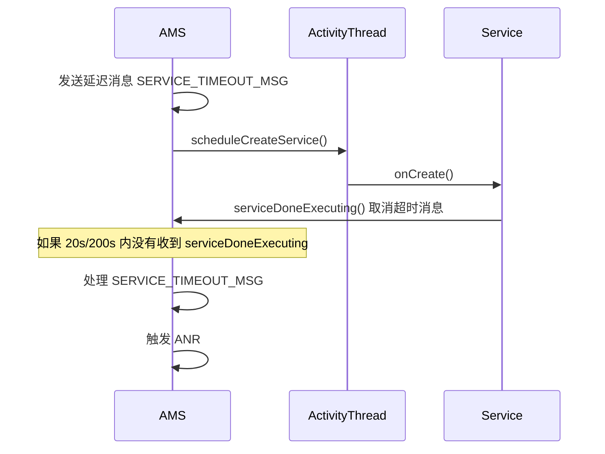

# Service 源码篇

## 一、Service 启动流程全景图

### 1.1 一句话总结

**startService 流程**：App 进程 → AMS（系统进程）→ App 进程，一来一回完成 Service 的创建和启动。

> **大白话**：你去餐厅点菜（startService），服务员把订单交给后厨经理（AMS），后厨经理安排厨师做菜（创建 Service），做好后再告诉服务员上菜（回调生命周期）。

### 1.2 核心类关系

```
┌─────────────────────────────────────────────────────────────────┐
│                    Service 启动涉及的核心类                       │
├─────────────────────────────────────────────────────────────────┤
│                                                                 │
│  App 进程                          System Server 进程            │
│  ┌─────────────────────┐          ┌─────────────────────┐       │
│  │    ContextImpl      │          │        AMS          │       │
│  │  (Context实现类)     │   IPC    │ (ActivityManager    │       │
│  │    startService()   │ ──────►  │      Service)       │       │
│  └─────────────────────┘          │                     │       │
│                                   │  - 调度Service生命周期 │       │
│  ┌─────────────────────┐          │  - 管理Service状态   │       │
│  │  ActivityThread     │          └─────────────────────┘       │
│  │  (主线程调度器)       │                   │                   │
│  │                     │ ◄─────────────────┘                   │
│  │  - H (Handler)      │                                        │
│  │  - handleCreateService()                                     │
│  │  - handleServiceArgs()                                       │
│  └─────────────────────┘                                        │
│           │                                                     │
│           ▼                                                     │
│  ┌─────────────────────┐                                        │
│  │      Service        │                                        │
│  │    (你的服务类)       │                                        │
│  │  - onCreate()       │                                        │
│  │  - onStartCommand() │                                        │
│  └─────────────────────┘                                        │
│                                                                 │
└─────────────────────────────────────────────────────────────────┘
```

## 二、startService 流程分析

### 2.1 完整流程图



### 2.2 关键源码分析

#### 第一步：ContextImpl.startService()

```java
// ContextImpl.java
@Override
public ComponentName startService(Intent service) {
    // 检查是否是后台启动（Android 8.0+）
    warnIfCallingFromSystemProcess();
    return startServiceCommon(service, false, mUser);
}

private ComponentName startServiceCommon(Intent service, boolean requireForeground,
        UserHandle user) {
    // 验证 Intent
    validateServiceIntent(service);
    
    // 通过 Binder 调用 AMS
    ComponentName cn = ActivityManager.getService().startService(
            mMainThread.getApplicationThread(),  // IApplicationThread，用于回调
            service,                              // Intent
            service.resolveTypeIfNeeded(getContentResolver()),
            requireForeground,                    // 是否前台服务
            getOpPackageName(),
            user.getIdentifier());
    
    // 处理返回结果...
    return cn;
}
```

> **设计亮点**：通过 `IApplicationThread` 接口，AMS 可以回调 App 进程，实现双向通信。

#### 第二步：AMS.startService()

```java
// ActivityManagerService.java
@Override
public ComponentName startService(IApplicationThread caller, Intent service,
        String resolvedType, boolean requireForeground, String callingPackage,
        int userId) {
    // 权限检查
    enforceNotIsolatedCaller("startService");
    
    // Android 8.0+ 后台启动检查
    if (requireForeground) {
        // 前台服务启动
    } else {
        // 检查是否允许后台启动
        if (appInfo.targetSdkVersion >= Build.VERSION_CODES.O) {
            // 后台启动限制检查
        }
    }
    
    // 委托给 ActiveServices 处理
    ComponentName res = mServices.startServiceLocked(caller, service, ...);
    return res;
}
```

#### 第三步：ActiveServices.startServiceLocked()

这是 Service 调度的核心类：

```java
// ActiveServices.java
ComponentName startServiceLocked(IApplicationThread caller, Intent service, ...) {
    // 1. 查找或创建 ServiceRecord
    ServiceLookupResult res = retrieveServiceLocked(service, ...);
    ServiceRecord r = res.record;
    
    // 2. 检查是否需要创建新 Service
    if (r.app == null || r.app.thread == null) {
        // Service 未启动，需要创建
        bringUpServiceLocked(r, ...);
    }
    
    // 3. 发送 SERVICE_ARGS 消息
    sendServiceArgsLocked(r, ...);
    
    return r.name;
}
```

> **关键数据结构**：`ServiceRecord` 记录了 Service 的所有信息，类似 Activity 的 `ActivityRecord`。

#### 第四步：回到 App 进程

```java
// ActivityThread.java
private class ApplicationThread extends IApplicationThread.Stub {
    
    // AMS 回调：创建 Service
    public void scheduleCreateService(IBinder token, ServiceInfo info, ...) {
        // 封装成 Message 发送到主线程
        sendMessage(H.CREATE_SERVICE, new CreateServiceData(token, info));
    }
    
    // AMS 回调：执行 onStartCommand
    public void scheduleServiceArgs(IBinder token, ...) {
        sendMessage(H.SERVICE_ARGS, new ServiceArgsData(token, startId, intent));
    }
}

// Handler H 处理消息
class H extends Handler {
    public void handleMessage(Message msg) {
        switch (msg.what) {
            case CREATE_SERVICE:
                handleCreateService((CreateServiceData) msg.obj);
                break;
            case SERVICE_ARGS:
                handleServiceArgs((ServiceArgsData) msg.obj);
                break;
        }
    }
}
```

#### 第五步：创建 Service 实例

```java
// ActivityThread.java
private void handleCreateService(CreateServiceData data) {
    // 1. 获取 LoadedApk
    LoadedApk packageInfo = getPackageInfoNoCheck(data.info.applicationInfo, ...);
    
    // 2. 通过反射创建 Service 实例
    Service service = packageInfo.getAppFactory()
            .instantiateService(cl, data.info.name, data.intent);
    
    // 3. 创建 ContextImpl 并 attach
    ContextImpl context = ContextImpl.createAppContext(this, packageInfo);
    service.attach(context, this, data.info.name, data.token, app, ...);
    
    // 4. 调用 onCreate()
    service.onCreate();
    
    // 5. 缓存 Service 实例
    mServices.put(data.token, service);
    
    // 6. 通知 AMS 创建完成
    ActivityManager.getService().serviceDoneExecuting(data.token, ...);
}
```

## 三、bindService 流程分析

### 3.1 绑定流程图



### 3.2 关键源码

**客户端调用 bindService：**

```java
// ContextImpl.java
@Override
public boolean bindService(Intent service, ServiceConnection conn, int flags) {
    return bindServiceCommon(service, conn, flags, ...);
}

private boolean bindServiceCommon(Intent service, ServiceConnection conn, int flags, ...) {
    // 将 ServiceConnection 包装成 IServiceConnection（用于跨进程回调）
    IServiceConnection sd = mPackageInfo.getServiceDispatcher(
            conn, getOuterContext(), mMainThread.getHandler(), flags);
    
    // 调用 AMS
    int res = ActivityManager.getService().bindService(
            mMainThread.getApplicationThread(),
            getActivityToken(),
            service,
            service.resolveTypeIfNeeded(getContentResolver()),
            sd,  // IServiceConnection，用于回调
            flags,
            ...);
    return res != 0;
}
```

**Service 返回 Binder：**

```java
// ActivityThread.java
private void handleBindService(BindServiceData data) {
    Service s = mServices.get(data.token);
    if (s != null) {
        // 调用 Service.onBind() 获取 IBinder
        IBinder binder = s.onBind(data.intent);
        
        // 将 Binder 发布到 AMS，AMS 再回调给客户端
        ActivityManager.getService().publishService(
                data.token, data.intent, binder);
    }
}
```

### 3.3 ServiceConnection 的跨进程回调

```
┌─────────────────────────────────────────────────────────────────┐
│                ServiceConnection 跨进程回调原理                   │
├─────────────────────────────────────────────────────────────────┤
│                                                                 │
│  客户端进程                                     Service进程       │
│  ┌─────────────────┐                      ┌─────────────────┐   │
│  │ServiceConnection│                      │    Service      │   │
│  │  (Java对象)      │                      │                 │   │
│  └────────┬────────┘                      └────────┬────────┘   │
│           │                                        │            │
│           ▼                                        ▼            │
│  ┌─────────────────┐                      ┌─────────────────┐   │
│  │IServiceConnection│                      │    IBinder      │   │
│  │  (Binder代理)    │                      │  (onBind返回)   │   │
│  └────────┬────────┘                      └────────┬────────┘   │
│           │                                        │            │
│           └──────────────┐    ┌────────────────────┘            │
│                          ▼    ▼                                 │
│                    ┌─────────────────┐                          │
│                    │      AMS        │                          │
│                    │  (中转站)        │                          │
│                    └─────────────────┘                          │
│                                                                 │
│  AMS 收到 IBinder 后，通过 IServiceConnection 回调客户端          │
│                                                                 │
└─────────────────────────────────────────────────────────────────┘
```

## 四、Service ANR 机制

### 4.1 ANR 超时时间

| 场景 | 超时时间 | 定义位置 |
|-----|---------|---------|
| 前台 Service | 20 秒 | `ActiveServices.SERVICE_TIMEOUT` |
| 后台 Service | 200 秒 | `ActiveServices.SERVICE_BACKGROUND_TIMEOUT` |

### 4.2 ANR 检测原理



**关键源码：**

```java
// ActiveServices.java
void scheduleServiceTimeoutLocked(ProcessRecord proc) {
    if (proc.executingServices.size() == 0 || proc.thread == null) {
        return;
    }
    
    // 计算超时时间
    long now = SystemClock.uptimeMillis();
    long timeout = now + (proc.execServicesFg 
            ? SERVICE_TIMEOUT     // 前台 20s
            : SERVICE_BACKGROUND_TIMEOUT);  // 后台 200s
    
    // 发送延迟消息
    Message msg = mAm.mHandler.obtainMessage(
            ActivityManagerService.SERVICE_TIMEOUT_MSG, proc);
    mAm.mHandler.sendMessageAtTime(msg, timeout);
}

// 处理超时
void serviceTimeout(ProcessRecord proc) {
    // 收集 ANR 信息
    StringBuilder builder = new StringBuilder(128);
    builder.append("executing service ");
    // ...
    
    // 触发 ANR
    mAm.mAppErrors.appNotResponding(proc, null, null, false, 
            "executing service " + name);
}
```

### 4.3 如何避免 Service ANR？

1. **不在主线程执行耗时操作**：开启子线程处理
2. **及时调用 `startForeground()`**：前台服务启动后 5 秒内必须调用
3. **使用协程/线程池**：管理异步任务

## 五、进程优先级与 Service

### 5.1 进程优先级（OOM_ADJ）

```
┌─────────────────────────────────────────────────────────────────┐
│                    进程优先级（OOM_ADJ 值越小优先级越高）          │
├─────────────────────────────────────────────────────────────────┤
│                                                                 │
│  OOM_ADJ 值      进程类型              说明                      │
│  ─────────────────────────────────────────────────────          │
│    -1000        Native 进程          系统关键进程，不会被杀        │
│     -900        SYSTEM_ADJ          system_server               │
│     -800        PERSISTENT_PROC_ADJ 常驻进程（如电话、蓝牙）      │
│        0        FOREGROUND_APP_ADJ  前台进程（Activity/前台Service）│
│      100        VISIBLE_APP_ADJ     可见进程                     │
│      200        PERCEPTIBLE_APP_ADJ 可感知进程（后台播放音乐）     │
│      300        BACKUP_APP_ADJ      备份进程                     │
│      500        HEAVY_WEIGHT_APP_ADJ 重量级后台进程               │
│      700        SERVICE_ADJ         普通 Service 进程            │
│      800        HOME_APP_ADJ        Launcher                    │
│      900        PREVIOUS_APP_ADJ    上一个应用                   │
│      999        CACHED_APP_MIN_ADJ  缓存进程（最容易被杀）         │
│                                                                 │
└─────────────────────────────────────────────────────────────────┘
```

### 5.2 Service 对进程优先级的影响

| Service 状态 | OOM_ADJ | 说明 |
|-------------|---------|------|
| 前台 Service | 0 (FOREGROUND) | 最高优先级 |
| 绑定 Service（绑定者在前台） | 100~200 | 跟随绑定者 |
| 普通 Service | 500~700 | 中等优先级 |
| 无 Service | 900+ | 容易被杀 |

### 5.3 前台服务如何提升优先级？

```java
// ActiveServices.java
void updateServiceForegroundLocked(ProcessRecord proc) {
    // 遍历进程中的所有 Service
    for (int i = 0; i < proc.numberOfRunningServices(); i++) {
        ServiceRecord sr = proc.getRunningServiceAt(i);
        if (sr.isForeground) {
            // 有前台 Service，提升优先级
            proc.setHasForegroundServices(true, ...);
            break;
        }
    }
}
```

## 六、设计亮点与借鉴

### 6.1 AMS 的职责分离

```
┌─────────────────────────────────────────────────────────────────┐
│                    AMS 职责分离设计                              │
├─────────────────────────────────────────────────────────────────┤
│                                                                 │
│  ┌─────────────────────────────────────────────────────────┐    │
│  │             ActivityManagerService (AMS)                 │    │
│  │                    ┌──────────────────────────────┐     │    │
│  │                    │   核心调度逻辑               │     │    │
│  │                    └──────────────────────────────┘     │    │
│  │          ┌─────────────┼────────────┐                   │    │
│  │          │             │            │                   │    │
│  │          ▼             ▼            ▼                   │    │
│  │  ┌──────────────┐ ┌──────────────┐ ┌──────────────┐    │    │
│  │  │ActiveServices│ │ActivityStack │ │BroadcastQueue│    │    │
│  │  │ (Service调度)│ │ (Activity栈) │ │ (广播队列)    │    │    │
│  │  └──────────────┘ └──────────────┘ └──────────────┘    │    │
│  └─────────────────────────────────────────────────────────┘    │
│                                                                 │
│  借鉴点：复杂系统通过委托模式分解职责，提高可维护性                │
│                                                                 │
└─────────────────────────────────────────────────────────────────┘
```

### 6.2 双向 Binder 通信

```java
// App 进程持有 AMS 的代理
IActivityManager ams = ActivityManager.getService();

// AMS 持有 App 进程的代理
IApplicationThread appThread = ...;
```

> **借鉴点**：跨进程通信时，通过双向代理实现双工通信。

### 6.3 ServiceRecord 的状态管理

```java
// ServiceRecord.java
final class ServiceRecord extends Binder {
    final ComponentName name;         // Service 名称
    final Intent.FilterComparison intent;  // Intent
    ProcessRecord app;                // 所属进程
    boolean isForeground;             // 是否前台
    int startRequested;               // startService 次数
    ArrayList<IntentBindRecord> bindings;  // 绑定信息
    
    // 状态管理
    boolean executeFg;                // 是否前台执行
    long lastActivity;                // 最后活跃时间
}
```

> **借鉴点**：通过 Record 类集中管理组件状态，便于查询和更新。

## 七、面试检验

### 源码级问题

**Q1：Service 的启动流程是怎样的？涉及哪些关键类？**

> **答案**：
> 1. **ContextImpl.startService()**：入口，将调用通过 Binder 发送给 AMS
> 2. **AMS.startService()**：权限检查、后台启动检查
> 3. **ActiveServices.startServiceLocked()**：创建 ServiceRecord，调度启动
> 4. **ActivityThread.handleCreateService()**：反射创建 Service 实例，调用 onCreate()
> 5. **ActivityThread.handleServiceArgs()**：调用 onStartCommand()
> 
> **核心设计**：App 进程和 system_server 进程通过 Binder 双向通信，AMS 作为中心调度器。

**Q2：bindService 是如何实现跨进程通信的？**

> **答案**：
> 1. 客户端调用 `bindService()`，将 ServiceConnection 包装成 IServiceConnection（Binder 代理）
> 2. AMS 收到请求后，让 Service 所在进程执行 `onBind()`
> 3. Service 返回 IBinder，通过 `publishService()` 发送给 AMS
> 4. AMS 通过 IServiceConnection 回调客户端的 `onServiceConnected()`
> 
> **本质**：AMS 作为中转站，完成 IBinder 的跨进程传递。

**Q3：Service 的 ANR 是如何触发的？超时时间是多少？**

> **答案**：
> 1. **触发机制**：AMS 在调度 Service 时会发送延迟消息，如果超时前没有收到 `serviceDoneExecuting()` 回调，就触发 ANR
> 2. **超时时间**：
>    - 前台 Service：20 秒
>    - 后台 Service：200 秒
> 3. **避免 ANR**：不在主线程执行耗时操作，及时调用 startForeground()

**Q4：前台 Service 是如何提升进程优先级的？**

> **答案**：
> 1. 调用 `startForeground()` 时，AMS 会更新进程的 OOM_ADJ 值
> 2. 有前台 Service 的进程会被标记为 FOREGROUND_APP_ADJ（值为 0）
> 3. 这是仅次于 system_server 的优先级，几乎不会被系统杀死
> 
> **原理**：通过 `setHasForegroundServices()` 通知系统，更新进程优先级。

**Q5：如果让你设计 Service 组件，你会怎么做？**

> **思考方向**：
> 1. **生命周期管理**：需要明确的状态机（创建、运行、停止）
> 2. **进程间通信**：需要跨进程调用机制（Binder）
> 3. **资源调度**：需要与系统协商资源（优先级、电量）
> 4. **安全机制**：权限控制、后台限制
> 5. **可观测性**：日志、监控、ANR 检测
> 
> **借鉴 Android 的设计**：
> - 中心化调度（AMS）
> - Record 模式管理状态（ServiceRecord）
> - 双向 Binder 通信
> - 超时机制防止卡死

---

_最后更新：2026-01-20_
