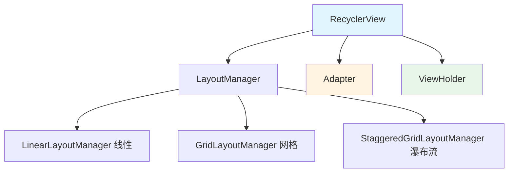
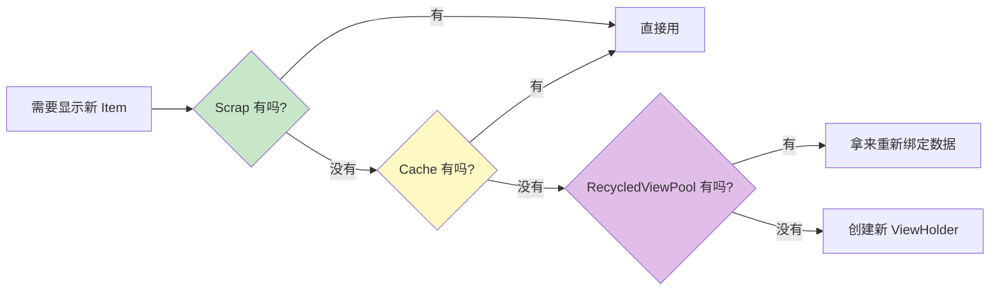

# RecyclerView 基础篇

> 适合人群：Android 初学者、准备初/中级面试
> 目标：掌握 RecyclerView 的基本使用和核心概念

## 什么是 RecyclerView？

### 定义

RecyclerView 是 Android Jetpack 提供的高级列表组件，用于高效展示大量数据。它通过**视图复用机制**极大地提升了列表滚动的性能。

### 通俗理解

想象一个剧院有 1000 个观众，但只有 10 个座位。如何让所有人都能看到演出？

**RecyclerView 的方案**：只建 10 个座位，观众轮流入座。前面的观众看完后离开，后面的观众坐到同一个座位上。

- **座位** = ViewHolder（视图持有者）
- **观众** = 数据项
- **轮流入座** = 视图复用机制

## 核心组成部分



| 组件 | 作用 | 一句话理解 |
|-----|------|-----------|
| **RecyclerView** | 主容器 | 舞台 |
| **Adapter** | 数据适配器 | 导演，决定每个座位上坐谁 |
| **ViewHolder** | 视图持有者 | 座位，持有视图引用 |
| **LayoutManager** | 布局管理器 | 座位排列方式（一排、多排、瀑布） |

## 基本使用：三步走

### 第 1 步：定义数据类

```kotlin
data class User(
    val id: Int,
    val name: String,
    val email: String
)
```

### 第 2 步：创建 Adapter + ViewHolder

```kotlin
class UserAdapter(
    private var users: List<User>,
    private val onItemClick: (User) -> Unit
) : RecyclerView.Adapter<UserAdapter.UserViewHolder>() {

    // ViewHolder：持有视图引用，避免重复 findViewById
    class UserViewHolder(itemView: View) : RecyclerView.ViewHolder(itemView) {
        val tvName: TextView = itemView.findViewById(R.id.tvName)
        val tvEmail: TextView = itemView.findViewById(R.id.tvEmail)
    }

    // 创建 ViewHolder（只在没有可复用的时候才调用）
    override fun onCreateViewHolder(parent: ViewGroup, viewType: Int): UserViewHolder {
        val view = LayoutInflater.from(parent.context)
            .inflate(R.layout.item_user, parent, false)
        return UserViewHolder(view)
    }

    // 绑定数据（每次 Item 进入屏幕都会调用）
    override fun onBindViewHolder(holder: UserViewHolder, position: Int) {
        val user = users[position]
        holder.tvName.text = user.name
        holder.tvEmail.text = user.email
        holder.itemView.setOnClickListener { onItemClick(user) }
    }

    override fun getItemCount(): Int = users.size
}
```

### 第 3 步：在 Activity 中使用

```kotlin
class MainActivity : AppCompatActivity() {
    override fun onCreate(savedInstanceState: Bundle?) {
        super.onCreate(savedInstanceState)
        setContentView(R.layout.activity_main)

        val recyclerView = findViewById<RecyclerView>(R.id.recyclerView)

        // 必须设置 LayoutManager
        recyclerView.layoutManager = LinearLayoutManager(this)

        // 设置 Adapter
        recyclerView.adapter = UserAdapter(getUserList()) { user ->
            Toast.makeText(this, "点击了 ${user.name}", Toast.LENGTH_SHORT).show()
        }
    }
}
```

## 布局管理器对比

| LayoutManager | 效果 | 使用场景 |
|--------------|------|---------|
| `LinearLayoutManager` | 线性列表 | 聊天、设置页 |
| `GridLayoutManager` | 网格布局 | 商品列表、相册 |
| `StaggeredGridLayoutManager` | 瀑布流 | 图片墙、Pinterest |

```kotlin
// 线性布局（垂直）
recyclerView.layoutManager = LinearLayoutManager(context)

// 线性布局（水平）
recyclerView.layoutManager = LinearLayoutManager(context, LinearLayoutManager.HORIZONTAL, false)

// 网格布局（2 列）
recyclerView.layoutManager = GridLayoutManager(context, 2)

// 瀑布流（2 列）
recyclerView.layoutManager = StaggeredGridLayoutManager(2, StaggeredGridLayoutManager.VERTICAL)
```

## 回收复用机制（白话版）

### 为什么 RecyclerView 快？

因为它有一个**"座位回收站"**系统：

```
当你往下滑动列表时：
1. 屏幕上方滑出去的 Item → 被回收到"回收站"
2. 屏幕下方需要新 Item → 先去"回收站"找有没有空座位
3. 有空座位 → 直接拿来用，换个人坐上去（换数据）
4. 没空座位 → 才去造一个新座位
```

### 四级缓存简介

| 缓存级别 | 白话解释 | 是否需要重新绑定数据 |
|---------|---------|-------------------|
| **Scrap** | 刚滑出去的座位，人还没走远，可能马上滑回来 | ❌ 不需要 |
| **Cache** | 最近滑出去的 2 个座位，数据还在 | ❌ 不需要 |
| **ViewCacheExtension** | 你自己设置的 VIP 回收站 | 看你怎么设置 |
| **RecycledViewPool** | 公共回收站，座位还在但人走了 | ✅ 需要换人（重新绑定） |



**一句话总结**：能复用就复用，实在没有才创建新的。

## 推荐写法：ListAdapter + DiffUtil

### 为什么推荐？

自动计算数据差异，只刷新变化的 Item，性能更好。

```kotlin
class UserListAdapter(
    private val onItemClick: (User) -> Unit
) : ListAdapter<User, UserListAdapter.UserViewHolder>(USER_DIFF) {

    class UserViewHolder(itemView: View) : RecyclerView.ViewHolder(itemView) {
        val tvName: TextView = itemView.findViewById(R.id.tvName)
        val tvEmail: TextView = itemView.findViewById(R.id.tvEmail)
    }

    override fun onCreateViewHolder(parent: ViewGroup, viewType: Int): UserViewHolder {
        val view = LayoutInflater.from(parent.context)
            .inflate(R.layout.item_user, parent, false)
        return UserViewHolder(view)
    }

    override fun onBindViewHolder(holder: UserViewHolder, position: Int) {
        val user = getItem(position)
        holder.tvName.text = user.name
        holder.tvEmail.text = user.email
        holder.itemView.setOnClickListener { onItemClick(user) }
    }

    companion object {
        // 告诉 RecyclerView 如何判断两个 Item 是否相同
        private val USER_DIFF = object : DiffUtil.ItemCallback<User>() {
            // 是否是同一个 Item（通常比较 ID）
            override fun areItemsTheSame(oldItem: User, newItem: User) =
                oldItem.id == newItem.id
            // 内容是否相同（决定是否需要刷新）
            override fun areContentsTheSame(oldItem: User, newItem: User) =
                oldItem == newItem
        }
    }
}

// 使用方式
adapter.submitList(newUserList) // 自动计算差异，局部刷新
```

## 多类型 Item

```kotlin
// 定义不同类型
sealed class ListItem {
    data class Header(val title: String) : ListItem()
    data class UserItem(val user: User) : ListItem()
}

class MultiTypeAdapter : ListAdapter<ListItem, RecyclerView.ViewHolder>(DIFF) {

    companion object {
        private const val TYPE_HEADER = 0
        private const val TYPE_USER = 1
    }

    override fun getItemViewType(position: Int): Int {
        return when (getItem(position)) {
            is ListItem.Header -> TYPE_HEADER
            is ListItem.UserItem -> TYPE_USER
        }
    }

    override fun onCreateViewHolder(parent: ViewGroup, viewType: Int): RecyclerView.ViewHolder {
        return when (viewType) {
            TYPE_HEADER -> HeaderViewHolder(/* inflate header layout */)
            else -> UserViewHolder(/* inflate user layout */)
        }
    }

    override fun onBindViewHolder(holder: RecyclerView.ViewHolder, position: Int) {
        when (val item = getItem(position)) {
            is ListItem.Header -> (holder as HeaderViewHolder).bind(item)
            is ListItem.UserItem -> (holder as UserViewHolder).bind(item.user)
        }
    }
}
```

## 基础性能优化

| 优化项 | 做法 | 效果 |
|-------|-----|------|
| **setHasFixedSize(true)** | Item 高度固定时设置 | 避免重复测量 |
| **使用 ListAdapter** | 替代普通 Adapter | 自动局部刷新 |
| **ViewBinding** | 替代 findViewById | 类型安全 + 性能提升 |
| **避免在 onBindViewHolder 创建对象** | 监听器放到 ViewHolder 里 | 减少内存分配 |

### 监听器正确写法

```kotlin
// ✅ 正确：监听器在 ViewHolder 中设置一次
class UserViewHolder(itemView: View) : RecyclerView.ViewHolder(itemView) {
    private var currentUser: User? = null

    init {
        itemView.setOnClickListener {
            currentUser?.let { /* 处理点击 */ }
        }
    }

    fun bind(user: User) {
        currentUser = user
        // 绑定数据...
    }
}

// ❌ 错误：每次 bind 都创建新监听器
override fun onBindViewHolder(holder: UserViewHolder, position: Int) {
    holder.itemView.setOnClickListener { /* 每次都创建新对象 */ }
}
```

## 常见问题速查

| 问题 | 解决方案 |
|-----|---------|
| 列表不显示 | 检查是否设置了 LayoutManager |
| 数据更新不显示 | 用 `submitList()` 或 `notifyDataSetChanged()` |
| Item 点击无响应 | 在 ViewHolder 中设置点击监听 |
| 滚动卡顿 | 检查 `onBindViewHolder` 是否有耗时操作 |

## 总结

### 核心三件套

```
RecyclerView + Adapter + ViewHolder = 完整的列表
```

### 开发口诀

```
复用机制是核心，ViewHolder 要缓存
DiffUtil 局部刷，避免全量 notify
```

### 推荐开发模式

```kotlin
// 现代 Android 开发推荐写法
class ModernAdapter : ListAdapter<Item, ViewHolder>(DIFF_CALLBACK) {

    override fun onCreateViewHolder(parent: ViewGroup, viewType: Int): ViewHolder {
        val binding = ItemBinding.inflate(LayoutInflater.from(parent.context), parent, false)
        return ViewHolder(binding)
    }

    override fun onBindViewHolder(holder: ViewHolder, position: Int) {
        holder.bind(getItem(position))
    }
}
```

---

**下一篇**：[进阶篇](2-进阶篇.md) - 深入缓存机制、局部刷新、ItemDecoration 等

---
_本文档将持续更新_
