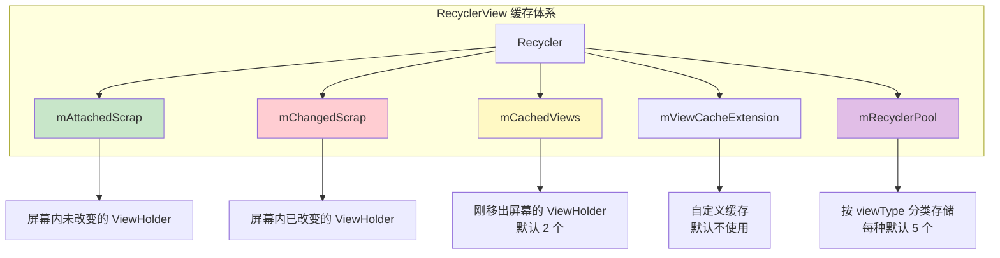

# RecyclerView 进阶篇

> 适合人群：有 RecyclerView 使用经验、准备高级面试
> 目标：深入理解缓存机制、掌握高级用法、能进行性能调优

## 四级缓存机制深入

### 缓存结构全景图



### 各级缓存详解

#### 第一级：Scrap（mAttachedScrap + mChangedScrap）

```kotlin
// 源码位置：RecyclerView.Recycler
ArrayList<ViewHolder> mAttachedScrap = new ArrayList<>();
ArrayList<ViewHolder> mChangedScrap = null;
```

| 类型 | 存储内容 | 触发场景 |
|-----|---------|---------|
| **mAttachedScrap** | 屏幕内未改变的 ViewHolder | `notifyItemMoved()`、布局重新计算 |
| **mChangedScrap** | 屏幕内已改变的 ViewHolder | `notifyItemChanged()` |

> **💡 "未改变"与"已改变"的区别**
>
> 这里的"改变"指的是 **ViewHolder 绑定的数据是否发生了变化**，而不是 ViewHolder 本身或位置：
>
> - **mAttachedScrap（未改变）**：数据没变，只是需要重新布局
>   - 例如：`notifyItemMoved(2, 5)` — Item 换了位置，但内容不变
>   - 例如：屏幕旋转导致 `requestLayout()` — Item 重新摆放，数据不变
>   - 复用时**直接使用**，不需要调用 `onBindViewHolder()`
>
> - **mChangedScrap（已改变）**：数据发生了变化
>   - 例如：`notifyItemChanged(3)` — 用户点赞，点赞数从 100 变成 101
>   - 复用时**需要重新绑定数据**，会调用 `onBindViewHolder()`
>
> 形象理解：想象教室里的学生在考试，**mAttachedScrap** 是学生换座位（人没变），**mChangedScrap** 是学生改了答案（内容变了）。

**特点**：
- 仅在 layout 过程中临时存储
- mAttachedScrap 复用时**不需要**重新绑定，mChangedScrap **需要**重新绑定
- layout 结束后会清空或转移到其他缓存

#### 第二级：Cache（mCachedViews）

```kotlin
// 源码位置：RecyclerView.Recycler
final ArrayList<ViewHolder> mCachedViews = new ArrayList<>();
int mViewCacheMax = DEFAULT_CACHE_SIZE; // 默认值 = 2
```

**特点**：
- 默认缓存 **2 个** ViewHolder
- 按**位置（position）**匹配
- 复用时**不需要**重新绑定数据
- 适用于来回滑动的场景

> **💡 mCachedViews 的工作原理**
>
> **存入时机**：当 Item 滑出屏幕时，会先尝试存入 mCachedViews
>
> **匹配规则**：按 **position** 精确匹配（不是按 viewType）
> - 假设 position=5 的 Item 被缓存了
> - 只有再次需要 position=5 的 Item 时才能命中
> - 如果需要 position=6，即使 viewType 相同也不会命中
>
> **为什么不需要重新绑定？**
> - 因为是按 position 匹配，数据肯定是对应的
> - 直接拿来用，省去 `onBindViewHolder` 的开销
>
> **典型场景**：用户上下来回滑动
> ```
> 向下滑动：position 0,1 滑出屏幕 → 存入 mCachedViews
> 向上滑动：需要 position 0,1 → 从 mCachedViews 取出，直接使用
> ```

**修改缓存大小**：

```kotlin
// 增大缓存，适合用户频繁来回滑动的场景
recyclerView.setItemViewCacheSize(4)

// 获取当前缓存大小
val cacheSize = recyclerView.itemViewCacheSize
```

**什么时候调整 Cache 大小？**

| 场景 | 建议值 | 原因 |
|-----|-------|------|
| 普通列表 | 2（默认） | 足够应对一般滑动 |
| 用户频繁来回滑动 | 4-5 | 减少重新绑定次数 |
| 大 Item（占满屏幕） | 1 | 一次只显示一个，缓存多了浪费 |
| 内存紧张 | 1-2 | 减少内存占用 |

> **⚠️ 注意**：mCachedViews 满了之后，最老的 ViewHolder 会被移到 RecycledViewPool

#### 第三级：ViewCacheExtension（自定义缓存）

```kotlin
// 源码位置：RecyclerView.Recycler
private ViewCacheExtension mViewCacheExtension;

// 自定义实现
abstract class ViewCacheExtension {
    abstract fun getViewForPositionAndType(
        recycler: Recycler,
        position: Int,
        type: Int
    ): View?
}
```

**使用场景**：
- 某些 Item 需要特殊缓存策略
- 如：广告位、固定 Header、Banner 轮播图

> **💡 为什么需要 ViewCacheExtension？**
>
> 默认缓存机制是"通用"的，但有些场景需要"特殊对待"：
> - **广告位**：广告 View 创建成本高（需要加载 SDK），希望一直缓存不释放
> - **固定 Header**：某些位置的 Item 永远不变，不需要走常规缓存流程
> - **复杂 Item**：某些 Item 初始化耗时，希望自己控制缓存策略

**工作原理**：

```
查找 ViewHolder 流程：
Scrap → CachedViews → 【ViewCacheExtension】 → RecycledViewPool → 创建新的
                              ↑
                     在这里拦截，返回自己缓存的 View
```

**完整实现示例：广告位缓存**

```kotlin
/**
 * 广告位自定义缓存
 * 场景：列表中每隔 10 个 Item 插入一个广告，广告 View 创建成本高
 */
class AdViewCacheExtension : RecyclerView.ViewCacheExtension() {

    companion object {
        const val VIEW_TYPE_AD = 100  // 广告的 viewType
    }

    // 自己维护的缓存池：position -> View
    private val adViewCache = SparseArray<View>()

    /**
     * 核心方法：根据 position 和 type 返回缓存的 View
     *
     * @param recycler RecyclerView 的 Recycler 对象
     * @param position 需要的 Item 位置
     * @param type     viewType
     * @return 缓存的 View，返回 null 则继续走下一级缓存（RecycledViewPool）
     */
    override fun getViewForPositionAndType(
        recycler: RecyclerView.Recycler,
        position: Int,
        type: Int
    ): View? {
        // 【关键】只处理广告类型
        // 其他类型返回 null → 系统会继续去 RecycledViewPool 中查找
        if (type != VIEW_TYPE_AD) {
            return null  // ← 返回 null，继续走下一级缓存
        }

        // 从自己的缓存中查找
        // 如果缓存中没有（get 返回 null），也会继续走下一级缓存
        return adViewCache.get(position)  // ← 找到返回 View，没找到返回 null
    }

    /**
     * 添加广告 View 到缓存
     * 在 Adapter.onBindViewHolder 中调用
     */
    fun cacheAdView(position: Int, view: View) {
        adViewCache.put(position, view)
    }

    /**
     * 移除指定位置的缓存
     */
    fun removeCache(position: Int) {
        adViewCache.remove(position)
    }

    /**
     * 清空所有缓存
     */
    fun clearCache() {
        adViewCache.clear()
    }
}
```

**在 Adapter 中使用**：

```kotlin
class FeedAdapter(
    private val adCacheExtension: AdViewCacheExtension
) : RecyclerView.Adapter<RecyclerView.ViewHolder>() {

    companion object {
        const val VIEW_TYPE_NORMAL = 0
    }

    private val feedList = mutableListOf<FeedItem>()
    private val adDataMap = mutableMapOf<Int, AdData>()  // 广告数据缓存

    override fun getItemViewType(position: Int): Int {
        // 每 10 个 Item 显示一个广告
        return if (position % 10 == 9) {
            AdViewCacheExtension.VIEW_TYPE_AD
        } else {
            VIEW_TYPE_NORMAL
        }
    }

    override fun onCreateViewHolder(parent: ViewGroup, viewType: Int): RecyclerView.ViewHolder {
        return when (viewType) {
            AdViewCacheExtension.VIEW_TYPE_AD -> {
                // 广告 ViewHolder（创建成本高）
                val adView = AdSdk.createAdView(parent.context)  // 假设这是 SDK 方法
                AdViewHolder(adView)
            }
            else -> {
                val view = LayoutInflater.from(parent.context)
                    .inflate(R.layout.item_feed, parent, false)
                NormalViewHolder(view)
            }
        }
    }

    override fun onBindViewHolder(holder: RecyclerView.ViewHolder, position: Int) {
        when (holder) {
            is AdViewHolder -> {
                // 绑定广告数据
                val adData = adDataMap[position] ?: AdData("广告标题", "https://ad.com/image.jpg")
                holder.bind(adData)
                // 缓存广告 View，下次直接复用
                adCacheExtension.cacheAdView(position, holder.itemView)
            }
            is NormalViewHolder -> {
                holder.bind(feedList[position])
            }
        }
    }

    override fun getItemCount(): Int = feedList.size

    fun submitList(list: List<FeedItem>) {
        feedList.clear()
        feedList.addAll(list)
        notifyDataSetChanged()
    }

    // ========== ViewHolder 定义 ==========

    /** 普通内容的 ViewHolder */
    class NormalViewHolder(itemView: View) : RecyclerView.ViewHolder(itemView) {
        private val tvTitle: TextView = itemView.findViewById(R.id.tvTitle)
        private val tvContent: TextView = itemView.findViewById(R.id.tvContent)
        private val ivImage: ImageView = itemView.findViewById(R.id.ivImage)

        fun bind(item: FeedItem) {
            tvTitle.text = item.title
            tvContent.text = item.content
            Glide.with(itemView).load(item.imageUrl).into(ivImage)
        }
    }

    /** 广告的 ViewHolder */
    class AdViewHolder(itemView: View) : RecyclerView.ViewHolder(itemView) {
        private val tvAdTitle: TextView = itemView.findViewById(R.id.tvAdTitle)
        private val ivAdImage: ImageView = itemView.findViewById(R.id.ivAdImage)
        private val btnAdAction: Button = itemView.findViewById(R.id.btnAdAction)

        fun bind(adData: AdData) {
            tvAdTitle.text = adData.title
            Glide.with(itemView).load(adData.imageUrl).into(ivAdImage)
            btnAdAction.setOnClickListener {
                // 处理广告点击
            }
        }
    }
}

// 数据类
data class FeedItem(val title: String, val content: String, val imageUrl: String)
data class AdData(val title: String, val imageUrl: String)
```

**设置到 RecyclerView**：

```kotlin
// 创建自定义缓存扩展
val adCacheExtension = AdViewCacheExtension()

// 设置到 RecyclerView
recyclerView.setViewCacheExtension(adCacheExtension)

// 创建 Adapter 并传入缓存扩展
val adapter = FeedAdapter(adCacheExtension)
recyclerView.adapter = adapter

// 页面销毁时清理缓存
override fun onDestroy() {
    super.onDestroy()
    adCacheExtension.clearCache()
}
```

> **⚠️ 使用 ViewCacheExtension 的注意事项**
>
> 1. **返回的 View 必须已经绑定过数据**：ViewCacheExtension 返回的 View 不会再调用 `onBindViewHolder`
> 2. **需要自己管理缓存的生命周期**：添加、移除、清空都要自己处理
> 3. **返回 null 会继续走下一级缓存**：不需要处理的 viewType 直接返回 null
> 4. **很少使用**：大多数场景默认缓存机制够用，只有特殊需求才使用
> 5. **注意内存泄漏**：缓存的 View 持有 Context，页面销毁时要清理

#### 第四级：RecycledViewPool

```kotlin
// 源码位置：RecyclerView.RecycledViewPool
public static class RecycledViewPool {
    private static final int DEFAULT_MAX_SCRAP = 5;

    // 按 viewType 分类存储
    SparseArray<ScrapData> mScrap = new SparseArray<>();

    static class ScrapData {
        ArrayList<ViewHolder> mScrapHeap = new ArrayList<>();
        int mMaxScrap = DEFAULT_MAX_SCRAP;  // 每种类型最多 5 个
    }
}
```

**特点**：
- 按 **viewType** 分类存储
- 每种类型默认最多 **5 个**
- 复用时**需要**重新绑定数据（因为只匹配 viewType，不匹配 position）
- **可以跨 RecyclerView 共享**

> **💡 RecycledViewPool 与 mCachedViews 的区别**
>
> | 对比项 | mCachedViews | RecycledViewPool |
> |-------|-------------|------------------|
> | 匹配方式 | 按 **position** | 按 **viewType** |
> | 是否重新绑定 | 不需要 | 需要 |
> | 能否跨 RecyclerView | 不能 | **能** |
> | 存入时机 | Item 刚滑出屏幕 | mCachedViews 满了溢出 |
>
> **形象理解**：
> - mCachedViews 像"快递暂存柜"：按地址（position）存放，取回时直接用
> - RecycledViewPool 像"二手市场"：按类型（viewType）分类，拿到后需要"翻新"（重新绑定）

**修改缓存数量**：

```kotlin
// 获取 RecycledViewPool
val pool = recyclerView.recycledViewPool

// 设置某种 viewType 的最大缓存数量
pool.setMaxRecycledViews(VIEW_TYPE_NORMAL, 10)  // 普通类型缓存 10 个
pool.setMaxRecycledViews(VIEW_TYPE_IMAGE, 5)    // 图片类型缓存 5 个

// 获取当前缓存数量
val count = pool.getRecycledViewCount(VIEW_TYPE_NORMAL)
```

**多 RecyclerView 共享 Pool（重要优化）**：

```kotlin
// 场景：ViewPager2 + 多个 RecyclerView 页面
// 问题：每个页面的 RecyclerView 单独缓存，切换页面时创建大量新 ViewHolder
// 解决：共享 RecycledViewPool

class MainActivity : AppCompatActivity() {

    // 创建共享的 Pool
    private val sharedPool = RecyclerView.RecycledViewPool().apply {
        // 预设缓存数量（因为多个 RecyclerView 共用，需要更大）
        setMaxRecycledViews(VIEW_TYPE_NORMAL, 20)
        setMaxRecycledViews(VIEW_TYPE_IMAGE, 10)
    }

    override fun onCreate(savedInstanceState: Bundle?) {
        super.onCreate(savedInstanceState)

        // ViewPager2 的 Adapter
        viewPager.adapter = object : FragmentStateAdapter(this) {
            override fun createFragment(position: Int): Fragment {
                return ListFragment.newInstance(position, sharedPool)
            }
            override fun getItemCount() = 5
        }
    }
}

class ListFragment : Fragment() {

    companion object {
        fun newInstance(position: Int, pool: RecyclerView.RecycledViewPool): ListFragment {
            return ListFragment().apply {
                this.sharedPool = pool
            }
        }
    }

    private var sharedPool: RecyclerView.RecycledViewPool? = null

    override fun onViewCreated(view: View, savedInstanceState: Bundle?) {
        super.onViewCreated(view, savedInstanceState)

        recyclerView.apply {
            // 使用共享的 Pool
            sharedPool?.let { setRecycledViewPool(it) }

            layoutManager = LinearLayoutManager(context)
            adapter = MyAdapter()
        }
    }
}
```

**预热 RecycledViewPool（高级优化）**：

```kotlin
/**
 * 在列表显示前预先创建 ViewHolder，避免首次滚动卡顿
 * 适用场景：Item 创建成本高、首帧性能敏感
 */
fun prefillRecycledViewPool(
    recyclerView: RecyclerView,
    adapter: RecyclerView.Adapter<*>,
    viewType: Int,
    count: Int
) {
    val pool = recyclerView.recycledViewPool

    // 在子线程创建 ViewHolder
    repeat(count) {
        val holder = adapter.createViewHolder(recyclerView, viewType)
        pool.putRecycledView(holder)
    }
}

// 使用示例（在 onCreate 中异步预热）
lifecycleScope.launch(Dispatchers.Default) {
    prefillRecycledViewPool(recyclerView, adapter, VIEW_TYPE_NORMAL, 10)
}
```

> **⚠️ RecycledViewPool 使用注意事项**
>
> 1. **共享 Pool 时 viewType 必须一致**：多个 RecyclerView 的 Adapter 使用相同的 viewType 定义
> 2. **合理设置缓存数量**：太小导致频繁创建，太大浪费内存
> 3. **预热要在子线程**：createViewHolder 可能耗时，避免阻塞主线程
> 4. **Pool 满了会丢弃**：超出最大数量的 ViewHolder 会被直接丢弃（GC 回收）

### 缓存查找流程（源码级）

```kotlin
// 简化版源码流程
fun tryGetViewHolderForPositionByDeadline(position: Int): ViewHolder? {
    // 1. 从 mChangedScrap 查找（如果是 pre-layout）
    holder = getChangedScrapViewForPosition(position)

    // 2. 从 mAttachedScrap 和 mCachedViews 按 position 查找
    holder = getScrapOrHiddenOrCachedHolderForPosition(position)

    // 3. 从 mAttachedScrap 和 mCachedViews 按 id 查找（如果有 stable id）
    holder = getScrapOrCachedViewForId(id)

    // 4. 从 ViewCacheExtension 查找
    holder = mViewCacheExtension?.getViewForPositionAndType(position, type)

    // 5. 从 RecycledViewPool 查找
    holder = getRecycledViewPool().getRecycledView(type)

    // 6. 都没有，创建新的
    holder = mAdapter.createViewHolder(parent, type)

    return holder
}
```

### 缓存数量配置建议

| 场景 | Cache 大小 | Pool 大小 | 原因 |
|-----|-----------|----------|------|
| 普通列表 | 2（默认） | 5（默认） | 足够应对正常滑动 |
| 快速滑动列表 | 4-5 | 10-15 | 减少 create 次数 |
| ViewPager + RecyclerView | 2 | 共享 Pool，每种 10+ | 页面切换时复用 |
| 复杂 Item（多 viewType） | 2 | 每种 3-5 | 避免内存浪费 |

## 局部刷新与 Payload 机制

### 刷新方法对比

| 方法 | 效果 | 性能 |
|-----|------|------|
| `notifyDataSetChanged()` | 全量刷新 | ❌ 最差 |
| `notifyItemChanged(pos)` | 刷新单个 Item | ⚠️ 整个 Item 重绘 |
| `notifyItemChanged(pos, payload)` | 局部刷新 | ✅ 最优 |
| `submitList()` (ListAdapter) | 自动 Diff | ✅ 推荐 |

### Payload 机制详解

**什么是 Payload？**

Payload 是一个标记，告诉 Adapter "这个 Item 的哪部分变了"，从而只更新变化的部分。

```kotlin
// 定义 Payload 常量
object Payloads {
    const val UPDATE_LIKE_COUNT = "like_count"
    const val UPDATE_AVATAR = "avatar"
}

// 触发局部刷新
adapter.notifyItemChanged(position, Payloads.UPDATE_LIKE_COUNT)
```

**Adapter 中处理 Payload：**

```kotlin
class PostAdapter : ListAdapter<Post, PostViewHolder>(DIFF) {

    // 完整绑定（无 payload 或 payload 为空时调用）
    override fun onBindViewHolder(holder: PostViewHolder, position: Int) {
        holder.bindFull(getItem(position))
    }

    // 局部绑定（有 payload 时调用）
    override fun onBindViewHolder(
        holder: PostViewHolder,
        position: Int,
        payloads: MutableList<Any>
    ) {
        if (payloads.isEmpty()) {
            // 没有 payload，执行完整绑定
            onBindViewHolder(holder, position)
            return
        }

        // 有 payload，执行局部绑定
        val post = getItem(position)
        payloads.forEach { payload ->
            when (payload) {
                Payloads.UPDATE_LIKE_COUNT -> holder.updateLikeCount(post.likeCount)
                Payloads.UPDATE_AVATAR -> holder.updateAvatar(post.avatarUrl)
            }
        }
    }
}

class PostViewHolder(private val binding: ItemPostBinding) : RecyclerView.ViewHolder(binding.root) {

    fun bindFull(post: Post) {
        binding.tvTitle.text = post.title
        binding.tvContent.text = post.content
        binding.tvLikeCount.text = post.likeCount.toString()
        // 加载头像...
    }

    fun updateLikeCount(count: Int) {
        binding.tvLikeCount.text = count.toString()
    }

    fun updateAvatar(url: String) {
        // 只更新头像
    }
}
```

### DiffUtil 与 Payload 结合

```kotlin
private val DIFF = object : DiffUtil.ItemCallback<Post>() {
    override fun areItemsTheSame(oldItem: Post, newItem: Post) =
        oldItem.id == newItem.id

    override fun areContentsTheSame(oldItem: Post, newItem: Post) =
        oldItem == newItem

    // 返回 payload，告诉 Adapter 具体哪里变了
    override fun getChangePayload(oldItem: Post, newItem: Post): Any? {
        val payloads = mutableListOf<String>()

        if (oldItem.likeCount != newItem.likeCount) {
            payloads.add(Payloads.UPDATE_LIKE_COUNT)
        }
        if (oldItem.avatarUrl != newItem.avatarUrl) {
            payloads.add(Payloads.UPDATE_AVATAR)
        }

        return if (payloads.isNotEmpty()) payloads else null
    }
}
```

## ItemDecoration 详解

### 什么是 ItemDecoration？

ItemDecoration 用于给 Item 添加装饰（分割线、间距、背景等），**不修改 Item 布局本身**。

### 核心方法

```kotlin
abstract class ItemDecoration {
    // 1. 设置 Item 的偏移量（留出装饰空间）
    open fun getItemOffsets(
        outRect: Rect,           // 输出：上下左右偏移量
        view: View,              // 当前 Item
        parent: RecyclerView,    // RecyclerView
        state: RecyclerView.State
    ) {}

    // 2. 在 Item 下方绘制（先绘制，会被 Item 遮挡）
    open fun onDraw(
        c: Canvas,
        parent: RecyclerView,
        state: RecyclerView.State
    ) {}

    // 3. 在 Item 上方绘制（后绘制，会遮挡 Item）
    open fun onDrawOver(
        c: Canvas,
        parent: RecyclerView,
        state: RecyclerView.State
    ) {}
}
```

### 绘制顺序

```
1. onDraw()      → 绘制装饰背景
2. Item 绘制     → 绘制列表项
3. onDrawOver()  → 绘制装饰前景（如悬浮 Header）
```

### 实战：自定义分割线

```kotlin
class DividerDecoration(
    private val dividerHeight: Int = 1.dp,
    private val dividerColor: Int = Color.LTGRAY,
    private val marginStart: Int = 0,
    private val marginEnd: Int = 0
) : RecyclerView.ItemDecoration() {

    private val paint = Paint().apply {
        color = dividerColor
        style = Paint.Style.FILL
    }

    override fun getItemOffsets(
        outRect: Rect,
        view: View,
        parent: RecyclerView,
        state: RecyclerView.State
    ) {
        val position = parent.getChildAdapterPosition(view)
        // 最后一个 Item 不加分割线
        if (position < state.itemCount - 1) {
            outRect.bottom = dividerHeight
        }
    }

    override fun onDraw(c: Canvas, parent: RecyclerView, state: RecyclerView.State) {
        val left = parent.paddingLeft + marginStart
        val right = parent.width - parent.paddingRight - marginEnd

        for (i in 0 until parent.childCount - 1) {
            val child = parent.getChildAt(i)
            val params = child.layoutParams as RecyclerView.LayoutParams
            val top = child.bottom + params.bottomMargin
            val bottom = top + dividerHeight

            c.drawRect(left.toFloat(), top.toFloat(), right.toFloat(), bottom.toFloat(), paint)
        }
    }
}

// 使用
recyclerView.addItemDecoration(DividerDecoration(
    dividerHeight = 1.dp,
    dividerColor = Color.parseColor("#E0E0E0"),
    marginStart = 16.dp
))
```

### 实战：悬浮吸顶 Header

> **💡 什么是悬浮吸顶？**
>
> 常见于通讯录、城市选择列表：分组的标题（如 "A"、"B"、"C"）会在滑动时"吸附"在顶部，直到下一个分组出现才被"推走"。

**实现思路**：

```
1. 在 onDrawOver 中绘制 Header（始终在 Item 上方）
2. 根据当前可见的第一个 Item 确定要显示的 Header
3. 当下一个分组的 Header 即将到达顶部时，实现"推动"效果
```

**完整实现**：

```kotlin
/**
 * 悬浮吸顶 Header 装饰器
 * 使用方式：recyclerView.addItemDecoration(StickyHeaderDecoration(adapter))
 */
class StickyHeaderDecoration(
    private val adapter: StickyHeaderAdapter
) : RecyclerView.ItemDecoration() {

    /**
     * Adapter 需要实现此接口
     */
    interface StickyHeaderAdapter {
        /** 获取总 Item 数量 */
        val itemCount: Int

        /**
         * 获取指定位置的分组 ID
         * 同一分组的 Item 返回相同的 ID
         */
        fun getHeaderId(position: Int): Long

        /** 创建 Header 的 ViewHolder */
        fun onCreateHeaderViewHolder(parent: RecyclerView): RecyclerView.ViewHolder

        /** 绑定 Header 数据 */
        fun onBindHeaderViewHolder(holder: RecyclerView.ViewHolder, position: Int)
    }

    private var headerView: View? = null
    private var currentHeaderId: Long = -1

    override fun onDrawOver(c: Canvas, parent: RecyclerView, state: RecyclerView.State) {
        // 获取第一个可见的 Item
        val topChild = parent.getChildAt(0) ?: return
        val topPosition = parent.getChildAdapterPosition(topChild)
        if (topPosition == RecyclerView.NO_POSITION) return

        // 获取当前位置对应的 Header ID
        val headerId = adapter.getHeaderId(topPosition)

        // 如果 Header 变了，重新创建
        if (headerId != currentHeaderId) {
            currentHeaderId = headerId
            val holder = adapter.onCreateHeaderViewHolder(parent)
            adapter.onBindHeaderViewHolder(holder, topPosition)
            headerView = holder.itemView
            measureAndLayoutHeader(parent, headerView!!)
        }

        headerView?.let { header ->
            // 计算 Header 的 Y 偏移（实现推动效果）
            val nextHeaderPosition = findNextHeaderPosition(topPosition)
            val offsetY = if (nextHeaderPosition != -1) {
                val nextChild = parent.findViewHolderForAdapterPosition(nextHeaderPosition)?.itemView
                nextChild?.let {
                    val nextHeaderTop = it.top
                    if (nextHeaderTop < header.height) {
                        // 下一个 Header 要把当前的"推上去"
                        (nextHeaderTop - header.height).toFloat()
                    } else 0f
                } ?: 0f
            } else 0f

            // 绘制 Header
            c.save()
            c.translate(0f, offsetY)
            header.draw(c)
            c.restore()
        }
    }

    private fun measureAndLayoutHeader(parent: RecyclerView, header: View) {
        val widthSpec = View.MeasureSpec.makeMeasureSpec(parent.width, View.MeasureSpec.EXACTLY)
        val heightSpec = View.MeasureSpec.makeMeasureSpec(0, View.MeasureSpec.UNSPECIFIED)
        header.measure(widthSpec, heightSpec)
        header.layout(0, 0, header.measuredWidth, header.measuredHeight)
    }

    /** 查找下一个不同分组的位置 */
    private fun findNextHeaderPosition(currentPosition: Int): Int {
        val currentHeaderId = adapter.getHeaderId(currentPosition)
        for (i in currentPosition + 1 until adapter.itemCount) {
            if (adapter.getHeaderId(i) != currentHeaderId) {
                return i
            }
        }
        return -1
    }
}
```

**使用示例：城市列表**

```kotlin
// 数据类
data class City(
    val name: String,
    val pinyin: String  // 拼音首字母用于分组
)

// Adapter 实现 StickyHeaderAdapter 接口
class CityAdapter : RecyclerView.Adapter<CityAdapter.CityViewHolder>(),
    StickyHeaderDecoration.StickyHeaderAdapter {

    private val cities = mutableListOf<City>()

    // ========== StickyHeaderAdapter 实现 ==========

    override val itemCount: Int
        get() = cities.size

    override fun getHeaderId(position: Int): Long {
        // 用拼音首字母的 ASCII 码作为分组 ID
        // 例如：'A' -> 65, 'B' -> 66
        return cities[position].pinyin.first().code.toLong()
    }

    override fun onCreateHeaderViewHolder(parent: RecyclerView): RecyclerView.ViewHolder {
        val view = LayoutInflater.from(parent.context)
            .inflate(R.layout.item_city_header, parent, false)
        return HeaderViewHolder(view)
    }

    override fun onBindHeaderViewHolder(holder: RecyclerView.ViewHolder, position: Int) {
        (holder as HeaderViewHolder).bind(cities[position].pinyin.first().toString())
    }

    // ========== 普通 Adapter 方法 ==========

    override fun onCreateViewHolder(parent: ViewGroup, viewType: Int): CityViewHolder {
        val view = LayoutInflater.from(parent.context)
            .inflate(R.layout.item_city, parent, false)
        return CityViewHolder(view)
    }

    override fun onBindViewHolder(holder: CityViewHolder, position: Int) {
        holder.bind(cities[position])
    }

    override fun getItemCount() = cities.size

    fun submitList(list: List<City>) {
        cities.clear()
        cities.addAll(list.sortedBy { it.pinyin })  // 按拼音排序
        notifyDataSetChanged()
    }

    // ViewHolder
    class CityViewHolder(view: View) : RecyclerView.ViewHolder(view) {
        private val tvName: TextView = view.findViewById(R.id.tvName)
        fun bind(city: City) {
            tvName.text = city.name
        }
    }

    class HeaderViewHolder(view: View) : RecyclerView.ViewHolder(view) {
        private val tvHeader: TextView = view.findViewById(R.id.tvHeader)
        fun bind(letter: String) {
            tvHeader.text = letter
        }
    }
}
```

**Activity 中使用**：

```kotlin
class CityListActivity : AppCompatActivity() {

    override fun onCreate(savedInstanceState: Bundle?) {
        super.onCreate(savedInstanceState)
        setContentView(R.layout.activity_city_list)

        val adapter = CityAdapter()

        recyclerView.apply {
            layoutManager = LinearLayoutManager(this@CityListActivity)
            this.adapter = adapter

            // 添加吸顶效果
            addItemDecoration(StickyHeaderDecoration(adapter))
        }

        // 加载数据
        adapter.submitList(listOf(
            City("北京", "B"),
            City("上海", "S"),
            City("广州", "G"),
            City("深圳", "S"),
            City("杭州", "H"),
            City("安庆", "A"),
            City("鞍山", "A"),
            // ...更多城市
        ))
    }
}
```

**Header 布局文件** (`item_city_header.xml`)：

```xml
<?xml version="1.0" encoding="utf-8"?>
<TextView xmlns:android="http://schemas.android.com/apk/res/android"
    android:id="@+id/tvHeader"
    android:layout_width="match_parent"
    android:layout_height="40dp"
    android:background="#F5F5F5"
    android:gravity="center_vertical"
    android:paddingStart="16dp"
    android:textColor="#666666"
    android:textSize="14sp"
    android:textStyle="bold" />
```

> **⚠️ 注意事项**
>
> 1. **Header 是"画"上去的**：不是真正的 View，不能响应点击事件
> 2. **需要 Adapter 配合**：Adapter 必须实现 `StickyHeaderAdapter` 接口
> 3. **数据需要排序**：同一分组的 Item 必须连续排列
> 4. **性能考虑**：每次滚动都会调用 `onDrawOver`，Header 创建应该轻量

## ItemAnimator 详解

### 默认动画

RecyclerView 默认使用 `DefaultItemAnimator`，提供以下动画：

| 操作 | 动画效果 |
|-----|---------|
| `notifyItemInserted()` | 淡入 + 下移 |
| `notifyItemRemoved()` | 淡出 + 上移 |
| `notifyItemChanged()` | 交叉淡化 |
| `notifyItemMoved()` | 位移动画 |

### ItemAnimator 工作原理

> **💡 动画执行流程**
>
> ```
> notify 方法调用
>        ↓
> RecyclerView 记录 Item 的旧状态（位置、透明度等）
>        ↓
> 重新布局，计算 Item 新状态
>        ↓
> ItemAnimator 根据新旧状态执行动画
>        ↓
> 动画完成，回调通知
> ```

**核心方法**：

```kotlin
abstract class ItemAnimator {
    // 记录 Item 移除前的状态
    abstract fun recordPreLayoutInformation(...): ItemHolderInfo

    // 记录 Item 布局后的状态
    abstract fun recordPostLayoutInformation(...): ItemHolderInfo

    // 执行添加动画
    abstract fun animateAdd(holder: ViewHolder): Boolean

    // 执行移除动画
    abstract fun animateRemove(holder: ViewHolder): Boolean

    // 执行移动动画
    abstract fun animateMove(holder: ViewHolder, fromX: Int, fromY: Int, toX: Int, toY: Int): Boolean

    // 执行改变动画
    abstract fun animateChange(oldHolder: ViewHolder, newHolder: ViewHolder, ...): Boolean

    // 执行所有待处理的动画
    abstract fun runPendingAnimations()
}
```

### 禁用动画

```kotlin
// 禁用所有动画
recyclerView.itemAnimator = null

// 禁用 change 动画（保留其他）— 常用优化手段
(recyclerView.itemAnimator as? DefaultItemAnimator)?.supportsChangeAnimations = false
```

> **💡 为什么要禁用 change 动画？**
>
> `notifyItemChanged()` 的默认动画是"交叉淡化"：创建一个新 ViewHolder，新旧 ViewHolder 同时存在并做透明度动画。
>
> 问题：
> 1. **图片闪烁**：图片会先变透明再显示，视觉效果差
> 2. **性能消耗**：需要额外创建 ViewHolder
>
> 禁用后，直接更新内容，不执行动画。

### 自定义动画时长

```kotlin
recyclerView.itemAnimator?.apply {
    addDuration = 300
    removeDuration = 300
    moveDuration = 300
    changeDuration = 300
}
```

### 自定义 ItemAnimator 示例

**场景**：Item 添加时从左侧滑入，移除时向右滑出

```kotlin
/**
 * 左右滑动动画
 * 添加：从左侧滑入
 * 移除：向右侧滑出
 */
class SlideItemAnimator : DefaultItemAnimator() {

    init {
        addDuration = 300
        removeDuration = 300
    }

    // ========== 添加动画 ==========

    override fun animateAdd(holder: RecyclerView.ViewHolder): Boolean {
        // 设置初始状态：在屏幕左侧
        holder.itemView.translationX = -holder.itemView.width.toFloat()
        holder.itemView.alpha = 0f

        // 加入待执行列表
        mPendingAdditions.add(holder)
        return true
    }

    override fun animateAddImpl(holder: RecyclerView.ViewHolder) {
        val view = holder.itemView
        val animation = view.animate()

        animation
            .translationX(0f)  // 滑动到正常位置
            .alpha(1f)
            .setDuration(addDuration)
            .setInterpolator(DecelerateInterpolator())
            .setListener(object : AnimatorListenerAdapter() {
                override fun onAnimationStart(animator: Animator) {
                    dispatchAddStarting(holder)
                }

                override fun onAnimationEnd(animator: Animator) {
                    animation.setListener(null)
                    dispatchAddFinished(holder)
                    // 清理状态
                    view.translationX = 0f
                    view.alpha = 1f
                }

                override fun onAnimationCancel(animator: Animator) {
                    view.translationX = 0f
                    view.alpha = 1f
                }
            })
            .start()
    }

    // ========== 移除动画 ==========

    override fun animateRemove(holder: RecyclerView.ViewHolder): Boolean {
        mPendingRemovals.add(holder)
        return true
    }

    override fun animateRemoveImpl(holder: RecyclerView.ViewHolder) {
        val view = holder.itemView
        val animation = view.animate()

        animation
            .translationX(view.width.toFloat())  // 滑动到右侧
            .alpha(0f)
            .setDuration(removeDuration)
            .setInterpolator(AccelerateInterpolator())
            .setListener(object : AnimatorListenerAdapter() {
                override fun onAnimationStart(animator: Animator) {
                    dispatchRemoveStarting(holder)
                }

                override fun onAnimationEnd(animator: Animator) {
                    animation.setListener(null)
                    dispatchRemoveFinished(holder)
                    // 重置状态（ViewHolder 会被复用）
                    view.translationX = 0f
                    view.alpha = 1f
                }

                override fun onAnimationCancel(animator: Animator) {
                    view.translationX = 0f
                    view.alpha = 1f
                }
            })
            .start()
    }

    // 保存待执行的动画
    private val mPendingAdditions = ArrayList<RecyclerView.ViewHolder>()
    private val mPendingRemovals = ArrayList<RecyclerView.ViewHolder>()

    override fun runPendingAnimations() {
        val additionsPending = mPendingAdditions.isNotEmpty()
        val removalsPending = mPendingRemovals.isNotEmpty()

        if (!additionsPending && !removalsPending) return

        // 先执行移除动画
        mPendingRemovals.forEach { animateRemoveImpl(it) }
        mPendingRemovals.clear()

        // 再执行添加动画（稍微延迟，让移除先完成）
        if (additionsPending) {
            val additions = ArrayList(mPendingAdditions)
            mPendingAdditions.clear()

            additions.forEach { holder ->
                holder.itemView.postDelayed({
                    animateAddImpl(holder)
                }, removeDuration / 2)
            }
        }
    }

    override fun endAnimation(item: RecyclerView.ViewHolder) {
        item.itemView.animate().cancel()
        item.itemView.translationX = 0f
        item.itemView.alpha = 1f
        super.endAnimation(item)
    }

    override fun endAnimations() {
        mPendingAdditions.clear()
        mPendingRemovals.clear()
        super.endAnimations()
    }
}
```

**使用方式**：

```kotlin
recyclerView.itemAnimator = SlideItemAnimator()
```

### 使用第三方动画库（推荐）

自定义 ItemAnimator 比较复杂，推荐使用成熟的第三方库：

**recyclerview-animators**：

```groovy
// build.gradle
implementation 'jp.wasabeef:recyclerview-animators:4.0.2'
```

```kotlin
// 使用内置动画
recyclerView.itemAnimator = SlideInLeftAnimator()      // 从左滑入
recyclerView.itemAnimator = FadeInAnimator()           // 淡入
recyclerView.itemAnimator = ScaleInAnimator()          // 缩放
recyclerView.itemAnimator = FlipInTopXAnimator()       // 翻转
recyclerView.itemAnimator = LandingAnimator()          // 降落效果

// 配置时长
recyclerView.itemAnimator?.apply {
    addDuration = 500
    removeDuration = 500
}
```

> **⚠️ ItemAnimator 注意事项**
>
> 1. **动画结束要重置状态**：ViewHolder 会被复用，不重置会影响下一个 Item
> 2. **调用 dispatch 方法**：`dispatchAddStarting/Finished` 等方法必须调用，否则动画状态错乱
> 3. **性能考虑**：复杂动画会影响滚动流畅度，特别是快速滚动时
> 4. **与 DiffUtil 配合**：使用 `submitList()` 会自动触发对应的动画

## SnapHelper 详解

### 什么是 SnapHelper？

SnapHelper 用于控制滑动停止时的对齐方式，常用于实现**分页效果**或**居中对齐**。

### 内置实现

| SnapHelper | 效果 | 使用场景 |
|-----------|------|---------|
| `LinearSnapHelper` | 居中对齐 | 横向滑动选择器 |
| `PagerSnapHelper` | 一次滑动一页 | 类似 ViewPager |

```kotlin
// 居中对齐
LinearSnapHelper().attachToRecyclerView(recyclerView)

// 分页效果
PagerSnapHelper().attachToRecyclerView(recyclerView)
```

### 自定义 SnapHelper

```kotlin
class StartSnapHelper : LinearSnapHelper() {

    override fun calculateDistanceToFinalSnap(
        layoutManager: RecyclerView.LayoutManager,
        targetView: View
    ): IntArray {
        val out = IntArray(2)
        if (layoutManager.canScrollHorizontally()) {
            out[0] = targetView.left - layoutManager.paddingLeft
        }
        if (layoutManager.canScrollVertically()) {
            out[1] = targetView.top - layoutManager.paddingTop
        }
        return out
    }

    override fun findSnapView(layoutManager: RecyclerView.LayoutManager): View? {
        if (layoutManager is LinearLayoutManager) {
            return layoutManager.findViewByPosition(
                layoutManager.findFirstVisibleItemPosition()
            )
        }
        return null
    }
}
```

## ConcatAdapter（多 Adapter 组合）

### 使用场景

- 列表有 Header/Footer
- 不同部分由不同团队维护
- 复用已有 Adapter

### 基本用法

```kotlin
// 添加依赖
implementation "androidx.recyclerview:recyclerview:1.2.0+"

// 组合多个 Adapter
val headerAdapter = HeaderAdapter()
val contentAdapter = ContentAdapter()
val footerAdapter = FooterAdapter()

val concatAdapter = ConcatAdapter(headerAdapter, contentAdapter, footerAdapter)
recyclerView.adapter = concatAdapter
```

### 配置选项

```kotlin
val config = ConcatAdapter.Config.Builder()
    .setIsolateViewTypes(true)  // 隔离 viewType，避免冲突
    .setStableIdMode(ConcatAdapter.Config.StableIdMode.NO_STABLE_IDS)
    .build()

val concatAdapter = ConcatAdapter(config, headerAdapter, contentAdapter)
```

## 性能优化进阶

### 1. Prefetch 预取机制

> **💡 什么是 Prefetch？**
>
> 预取机制是 Android 5.0+ 引入的优化，利用 **UI 线程空闲时间** 提前创建和绑定即将显示的 ViewHolder，避免滑动时卡顿。

**工作原理**：

```
用户滑动 RecyclerView
        ↓
GapWorker 预测即将显示的 Item 位置
        ↓
在 UI 线程空闲时（VSync 后的空闲期）
        ↓
提前执行 createViewHolder + bindViewHolder
        ↓
滑动到该位置时，ViewHolder 已经准备好了
```

**时序图**：

```
帧 N：                    帧 N+1：
├─ 渲染当前帧             ├─ 渲染当前帧
├─ 【空闲时间】           ├─ 【空闲时间】
│   └─ 预取下一个 Item    │   └─ 预取下下个 Item
└─ VSync                  └─ VSync

滑动时：Item 已经预取好，直接显示，不卡顿
```

**配置选项**：

```kotlin
(recyclerView.layoutManager as LinearLayoutManager).apply {
    // 开启预取（默认已开启）
    isItemPrefetchEnabled = true
}

// 针对嵌套 RecyclerView 的预取优化
(innerRecyclerView.layoutManager as LinearLayoutManager).apply {
    // 设置初始预取数量（嵌套场景重要！）
    initialPrefetchItemCount = 4
}
```

> **⚠️ initialPrefetchItemCount 的作用**
>
> 在嵌套 RecyclerView 场景（如横向列表嵌套在纵向列表中），内层 RecyclerView 第一次显示时需要同时创建多个 ViewHolder。
>
> `initialPrefetchItemCount` 告诉预取系统："这个内层 RecyclerView 首次显示需要 N 个 Item"，从而提前预取。
>
> ```kotlin
> // 假设内层横向列表一屏显示 3.5 个 Item
> innerLayoutManager.initialPrefetchItemCount = 4  // 预取 4 个
> ```

### 2. 共享 RecycledViewPool

（已在缓存部分详细说明，这里补充最佳实践）

```kotlin
// ✅ 最佳实践：在 Fragment/Activity 级别创建共享 Pool
class MainActivity : AppCompatActivity() {

    // 共享 Pool 作为成员变量
    val sharedPool = RecyclerView.RecycledViewPool().apply {
        setMaxRecycledViews(VIEW_TYPE_NORMAL, 15)
        setMaxRecycledViews(VIEW_TYPE_IMAGE, 10)
    }
}

// 各个 Fragment 中使用
class ListFragment : Fragment() {
    override fun onViewCreated(view: View, savedInstanceState: Bundle?) {
        recyclerView.setRecycledViewPool((activity as MainActivity).sharedPool)
    }
}
```

### 3. 避免嵌套滑动冲突

**场景**：纵向 RecyclerView 中嵌套横向 RecyclerView

```kotlin
// 方案 1：禁用内层嵌套滑动
innerRecyclerView.isNestedScrollingEnabled = false

// 方案 2：设置固定高度（如果内容高度确定）
innerRecyclerView.layoutParams.height = 200.dp

// 方案 3：使用 RecyclerView.setHasFixedSize(true)
innerRecyclerView.setHasFixedSize(true)  // 告诉 RV Item 大小固定，减少测量
```

### 4. 大图列表优化

```kotlin
// 滑动时暂停图片加载，停止时恢复
recyclerView.addOnScrollListener(object : RecyclerView.OnScrollListener() {
    override fun onScrollStateChanged(recyclerView: RecyclerView, newState: Int) {
        when (newState) {
            RecyclerView.SCROLL_STATE_IDLE -> {
                // 停止滑动，恢复加载
                Glide.with(context).resumeRequests()
            }
            RecyclerView.SCROLL_STATE_DRAGGING,
            RecyclerView.SCROLL_STATE_SETTLING -> {
                // 滑动中，暂停加载
                Glide.with(context).pauseRequests()
            }
        }
    }
})

// 回收时取消加载，避免资源浪费
override fun onViewRecycled(holder: ViewHolder) {
    Glide.with(holder.itemView).clear(holder.imageView)
}
```

### 5. setHasStableIds 优化

```kotlin
class MyAdapter : RecyclerView.Adapter<MyViewHolder>() {

    init {
        // 开启 stable ids
        setHasStableIds(true)
    }

    override fun getItemId(position: Int): Long {
        // 返回唯一且稳定的 ID（如数据库主键）
        return dataList[position].id
    }
}
```

> **💡 setHasStableIds 的作用**
>
> 1. **更精确的动画**：系统能追踪每个 Item 的移动，动画更准确
> 2. **减少不必要的绑定**：如果 Item 只是位置变了，可以跳过绑定
> 3. **与 DiffUtil 配合**：更高效的 Diff 计算

### 6. onBindViewHolder 优化

```kotlin
override fun onBindViewHolder(holder: ViewHolder, position: Int) {
    val item = getItem(position)

    // ❌ 避免：每次绑定都创建新对象
    holder.itemView.setOnClickListener {
        onClick(item)
    }

    // ✅ 推荐：复用 Listener
    holder.itemView.setOnClickListener(holder.clickListener)
    holder.clickListener.item = item
}

// 在 ViewHolder 中复用 Listener
class ViewHolder(view: View) : RecyclerView.ViewHolder(view) {
    val clickListener = ReusableClickListener()

    class ReusableClickListener : View.OnClickListener {
        var item: Item? = null
        override fun onClick(v: View) {
            item?.let { /* 处理点击 */ }
        }
    }
}
```

### 7. 布局优化

```kotlin
// ❌ 避免：深层嵌套布局
<LinearLayout>
    <RelativeLayout>
        <ConstraintLayout>
            <TextView />
        </ConstraintLayout>
    </RelativeLayout>
</LinearLayout>

// ✅ 推荐：扁平化布局
<ConstraintLayout>
    <TextView />
    <ImageView />
</ConstraintLayout>
```

**测量优化**：

```kotlin
// 如果 Item 高度固定
recyclerView.setHasFixedSize(true)

// 如果多个 Item 高度相同，可以在 xml 中指定固定高度
android:layout_height="80dp"  // 而不是 wrap_content
```

### 8. 数据处理优化

```kotlin
// ❌ 避免：在主线程处理数据
fun loadData() {
    val data = fetchDataFromNetwork()  // 阻塞主线程！
    val processed = processData(data)   // 还是阻塞！
    adapter.submitList(processed)
}

// ✅ 推荐：异步处理
fun loadData() {
    viewModelScope.launch {
        val data = withContext(Dispatchers.IO) {
            fetchDataFromNetwork()
        }
        val processed = withContext(Dispatchers.Default) {
            processData(data)  // CPU 密集型操作
        }
        adapter.submitList(processed)  // 主线程提交
    }
}
```

### 性能优化检查清单

| 优化项 | 说明 | 优先级 |
|-------|------|-------|
| 使用 DiffUtil/ListAdapter | 避免 `notifyDataSetChanged()` | ⭐⭐⭐ |
| 禁用 change 动画 | 避免图片闪烁和额外开销 | ⭐⭐⭐ |
| 扁平化布局 | 减少测量时间 | ⭐⭐⭐ |
| setHasFixedSize(true) | 减少测量次数 | ⭐⭐ |
| 图片加载优化 | 滑动暂停、回收取消 | ⭐⭐ |
| 共享 RecycledViewPool | 多 RecyclerView 场景 | ⭐⭐ |
| 预取配置 | 嵌套 RecyclerView 场景 | ⭐⭐ |
| setHasStableIds | 有唯一 ID 时使用 | ⭐ |
| 复用 ClickListener | 减少对象创建 | ⭐ |

## 常见问题深入

### 图片错位问题

**原因**：异步加载 + 视图复用，旧请求的图片加载到了新 Item 上。

**解决方案**：

```kotlin
override fun onBindViewHolder(holder: ViewHolder, position: Int) {
    // 方案 1：设置 tag 校验
    holder.imageView.tag = position
    loadImage(url) { bitmap ->
        if (holder.imageView.tag == position) {
            holder.imageView.setImageBitmap(bitmap)
        }
    }

    // 方案 2：使用 Glide（自动处理）
    Glide.with(holder.itemView)
        .load(url)
        .into(holder.imageView)
}

override fun onViewRecycled(holder: ViewHolder) {
    // 回收时清除
    Glide.with(holder.itemView).clear(holder.imageView)
}
```

### IndexOutOfBoundsException

**原因**：数据源和 Adapter 不同步。

**解决方案**：

```kotlin
// ❌ 错误：直接修改数据源
dataList.removeAt(0)
adapter.notifyItemRemoved(0)

// ✅ 正确：使用 ListAdapter
adapter.submitList(newList.toList()) // 注意：必须是新 List 对象
```

## 总结

### 进阶知识点清单

| 知识点 | 掌握程度 |
|-------|---------|
| 四级缓存机制 | 理解原理 + 会配置 |
| Payload 局部刷新 | 会使用 + 结合 DiffUtil |
| ItemDecoration | 会自定义分割线和吸顶 |
| ItemAnimator | 会配置和禁用 |
| SnapHelper | 会使用内置 + 简单自定义 |
| ConcatAdapter | 会组合多 Adapter |
| 性能优化 | 预取、共享 Pool、图片优化 |

---

**上一篇**：[基础篇](1-基础篇.md)
**下一篇**：[源码篇](3-源码篇.md) - 绘制流程、LayoutManager 原理、嵌套滑动机制

---
_本文档将持续更新_
