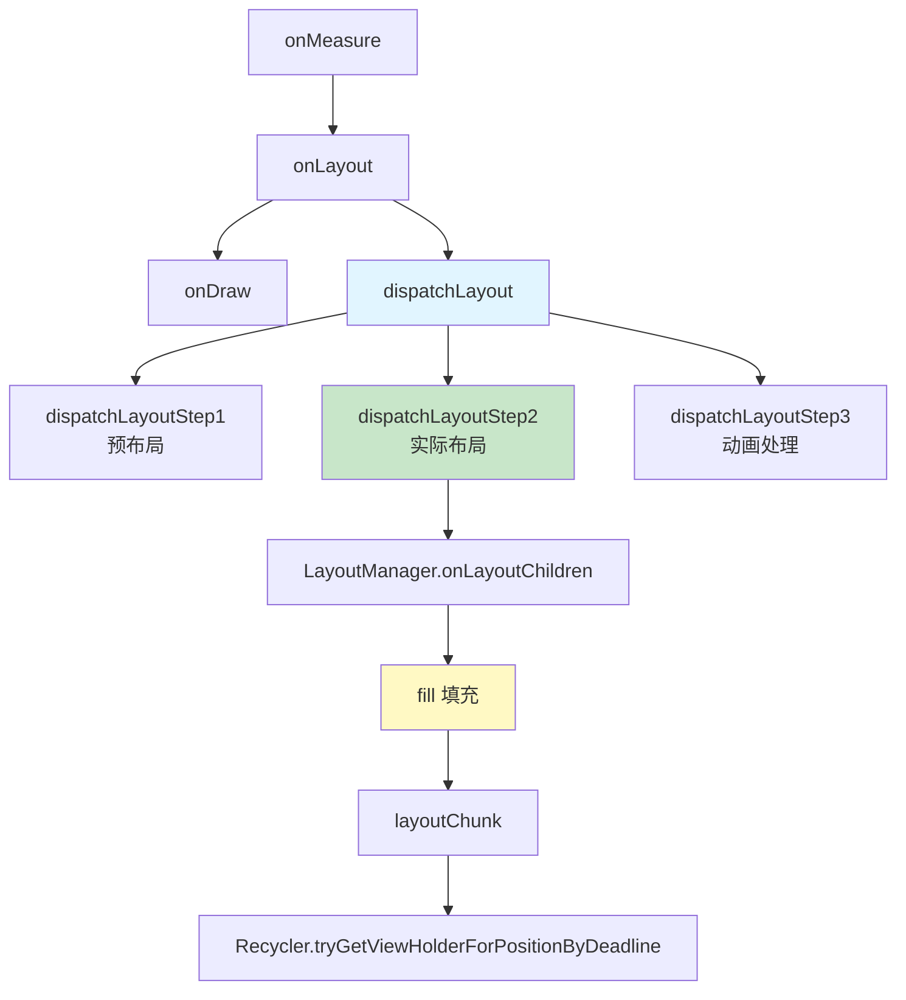
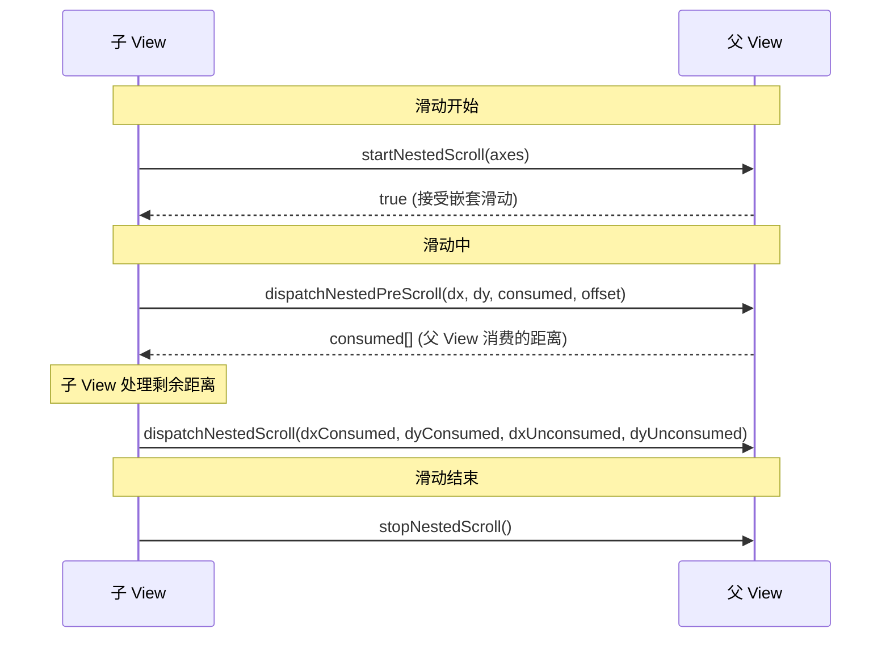
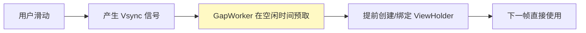

# RecyclerView 源码篇

> 适合人群：准备 Android 专家级面试、想深入理解原理
> 目标：掌握绘制流程、LayoutManager 原理、嵌套滑动机制

## RecyclerView 绘制流程

### 整体流程概览



### onMeasure 阶段

```java
// RecyclerView.onMeasure()
@Override
protected void onMeasure(int widthSpec, int heightSpec) {
    if (mLayout == null) {
        // 没有 LayoutManager，使用默认测量
        defaultOnMeasure(widthSpec, heightSpec);
        return;
    }
    
    if (mLayout.isAutoMeasureEnabled()) {
        // 自动测量模式（大多数情况）
        final int widthMode = MeasureSpec.getMode(widthSpec);
        final int heightMode = MeasureSpec.getMode(heightSpec);
        
        // 先让 LayoutManager 测量
        mLayout.onMeasure(mRecycler, mState, widthSpec, heightSpec);
        
        // 如果是 EXACTLY 模式，直接返回
        if (widthMode == MeasureSpec.EXACTLY && heightMode == MeasureSpec.EXACTLY) {
            return;
        }
        
        // 否则需要先布局子 View 来确定大小
        dispatchLayoutStep1();  // 预布局
        dispatchLayoutStep2();  // 实际布局
        
        // 根据子 View 确定最终大小
        mLayout.setMeasuredDimensionFromChildren(widthSpec, heightSpec);
    } else {
        // 自定义测量模式
        mLayout.onMeasure(mRecycler, mState, widthSpec, heightSpec);
    }
}
```

**关键点**：
- `setHasFixedSize(true)` 的作用在这里体现：如果尺寸固定，数据变化时不需要重新 measure

### onLayout 阶段

```java
// RecyclerView.onLayout()
@Override
protected void onLayout(boolean changed, int l, int t, int r, int b) {
    dispatchLayout();
    mFirstLayoutComplete = true;
}

void dispatchLayout() {
    // Step 1: 预布局（记录动画前状态）
    if (mState.mLayoutStep == State.STEP_START) {
        dispatchLayoutStep1();
    }
    
    // Step 2: 实际布局
    dispatchLayoutStep2();
    
    // Step 3: 动画处理
    dispatchLayoutStep3();
}
```

### dispatchLayoutStep1：预布局

```java
private void dispatchLayoutStep1() {
    // 1. 处理 Adapter 更新
    processAdapterUpdatesAndSetAnimationFlags();
    
    // 2. 保存动画前的 ViewHolder 状态
    if (mState.mRunSimpleAnimations) {
        for (int i = 0; i < mChildHelper.getChildCount(); i++) {
            final ViewHolder holder = getChildViewHolderInt(child);
            // 记录位置信息用于动画
            mViewInfoStore.addToPreLayout(holder, animationInfo);
        }
    }
    
    // 3. 如果需要预布局（有动画），执行预布局
    if (mState.mRunPredictiveAnimations) {
        mLayout.onLayoutChildren(mRecycler, mState);
    }
}
```

### dispatchLayoutStep2：实际布局（核心）

```java
private void dispatchLayoutStep2() {
    // 1. 清除 Scrap
    mAdapterHelper.consumeUpdatesInOnePass();
    mState.mItemCount = mAdapter.getItemCount();
    
    // 2. 调用 LayoutManager 进行布局
    mLayout.onLayoutChildren(mRecycler, mState);
    
    // 3. 标记布局完成
    mState.mLayoutStep = State.STEP_ANIMATIONS;
}
```

### dispatchLayoutStep3：动画处理

```java
private void dispatchLayoutStep3() {
    // 1. 记录动画后的状态
    if (mState.mRunSimpleAnimations) {
        for (int i = mChildHelper.getChildCount() - 1; i >= 0; i--) {
            // 记录布局后的位置
            mViewInfoStore.addToPostLayout(holder, animationInfo);
        }
        
        // 2. 触发动画
        mViewInfoStore.process(mViewInfoProcessCallback);
    }
    
    // 3. 清理
    mLayout.removeAndRecycleScrapInt(mRecycler);
    mState.mLayoutStep = State.STEP_START;
}
```

## LayoutManager 核心原理

### LinearLayoutManager.onLayoutChildren

```java
// LinearLayoutManager.onLayoutChildren() 简化版
@Override
public void onLayoutChildren(RecyclerView.Recycler recycler, RecyclerView.State state) {
    // 1. 确定布局方向和锚点
    final int anchorPosition = findAnchorPosition();
    final int anchorOffset = findAnchorOffset();
    
    // 2. 回收所有子 View 到 Scrap
    detachAndScrapAttachedViews(recycler);
    
    // 3. 从锚点向两端填充
    if (mAnchorInfo.mLayoutFromEnd) {
        // 从下往上布局
        fill(recycler, mLayoutState, state, false);  // 向上填充
        fill(recycler, mLayoutState, state, false);  // 向下填充
    } else {
        // 从上往下布局
        fill(recycler, mLayoutState, state, false);  // 向下填充
        fill(recycler, mLayoutState, state, false);  // 向上填充
    }
    
    // 4. 回收多余的 View
    recycleViewsFromEnd(recycler, scrollingOffset);
}
```

### fill 方法：填充核心

```java
// LinearLayoutManager.fill() 简化版
int fill(RecyclerView.Recycler recycler, LayoutState layoutState, 
         RecyclerView.State state, boolean stopOnFocusable) {
    
    final int start = layoutState.mAvailable;  // 可用空间
    int remainingSpace = layoutState.mAvailable;
    
    // 循环填充，直到空间用完或没有更多 Item
    while (remainingSpace > 0 && layoutState.hasMore(state)) {
        // 布局单个 Item
        layoutChunk(recycler, state, layoutState, layoutChunkResult);
        
        // 更新剩余空间
        remainingSpace -= layoutChunkResult.mConsumed;
        layoutState.mAvailable -= layoutChunkResult.mConsumed;
        
        // 更新偏移量
        layoutState.mOffset += layoutChunkResult.mConsumed * layoutState.mLayoutDirection;
    }
    
    return start - layoutState.mAvailable;  // 返回消耗的空间
}
```

### layoutChunk：布局单个 Item

```java
void layoutChunk(RecyclerView.Recycler recycler, RecyclerView.State state,
                 LayoutState layoutState, LayoutChunkResult result) {
    
    // 1. 获取 ViewHolder（核心：缓存复用）
    View view = layoutState.next(recycler);
    if (view == null) {
        result.mFinished = true;
        return;
    }
    
    // 2. 添加到 RecyclerView
    if (layoutState.mScrapList == null) {
        addView(view);
    } else {
        addDisappearingView(view);
    }
    
    // 3. 测量子 View
    measureChildWithMargins(view, 0, 0);
    result.mConsumed = mOrientationHelper.getDecoratedMeasurement(view);
    
    // 4. 布局子 View（确定位置）
    int left, top, right, bottom;
    // 计算四个边的位置...
    layoutDecoratedWithMargins(view, left, top, right, bottom);
}
```

### 获取 ViewHolder 的完整流程

```java
// Recycler.tryGetViewHolderForPositionByDeadline() 简化版
ViewHolder tryGetViewHolderForPositionByDeadline(int position, boolean dryRun, long deadlineNs) {
    ViewHolder holder = null;
    
    // 1. 从 mChangedScrap 获取（预布局阶段）
    if (mState.isPreLayout()) {
        holder = getChangedScrapViewForPosition(position);
    }
    
    // 2. 从 mAttachedScrap 或 mCachedViews 按 position 获取
    if (holder == null) {
        holder = getScrapOrHiddenOrCachedHolderForPosition(position, dryRun);
    }
    
    // 3. 如果有 stable id，按 id 获取
    if (holder == null && mAdapter.hasStableIds()) {
        holder = getScrapOrCachedViewForId(mAdapter.getItemId(position), type, dryRun);
    }
    
    // 4. 从 ViewCacheExtension 获取
    if (holder == null && mViewCacheExtension != null) {
        View view = mViewCacheExtension.getViewForPositionAndType(this, position, type);
        if (view != null) {
            holder = getChildViewHolder(view);
        }
    }
    
    // 5. 从 RecycledViewPool 获取
    if (holder == null) {
        holder = getRecycledViewPool().getRecycledView(type);
        if (holder != null) {
            holder.resetInternal();  // 重置状态
        }
    }
    
    // 6. 创建新的 ViewHolder
    if (holder == null) {
        holder = mAdapter.createViewHolder(RecyclerView.this, type);
    }
    
    // 7. 绑定数据（如果需要）
    if (!holder.isBound() || holder.needsUpdate() || holder.isInvalid()) {
        mAdapter.bindViewHolder(holder, position);
    }
    
    return holder;
}
```

## 自定义 LayoutManager

### 基本结构

```kotlin
class CustomLayoutManager : RecyclerView.LayoutManager() {

    // 1. 必须实现：生成默认 LayoutParams
    override fun generateDefaultLayoutParams(): RecyclerView.LayoutParams {
        return RecyclerView.LayoutParams(
            ViewGroup.LayoutParams.WRAP_CONTENT,
            ViewGroup.LayoutParams.WRAP_CONTENT
        )
    }

    // 2. 核心：布局子 View
    override fun onLayoutChildren(recycler: RecyclerView.Recycler, state: RecyclerView.State) {
        // 实现布局逻辑
    }

    // 3. 是否支持滚动
    override fun canScrollVertically(): Boolean = true
    override fun canScrollHorizontally(): Boolean = false

    // 4. 处理滚动
    override fun scrollVerticallyBy(
        dy: Int,
        recycler: RecyclerView.Recycler,
        state: RecyclerView.State
    ): Int {
        // 实现滚动逻辑
        return dy
    }
}
```

### 实战：环形 LayoutManager

```kotlin
class CircleLayoutManager : RecyclerView.LayoutManager() {

    private var radius = 300  // 圆的半径
    private var anglePerItem = 0.0  // 每个 Item 的角度

    override fun generateDefaultLayoutParams(): RecyclerView.LayoutParams {
        return RecyclerView.LayoutParams(
            ViewGroup.LayoutParams.WRAP_CONTENT,
            ViewGroup.LayoutParams.WRAP_CONTENT
        )
    }

    override fun onLayoutChildren(recycler: RecyclerView.Recycler, state: RecyclerView.State) {
        if (itemCount == 0) {
            detachAndScrapAttachedViews(recycler)
            return
        }

        // 1. 回收所有 View
        detachAndScrapAttachedViews(recycler)

        // 2. 计算每个 Item 的角度
        anglePerItem = 360.0 / itemCount

        // 3. 圆心位置
        val centerX = width / 2
        val centerY = height / 2

        // 4. 布局每个 Item
        for (i in 0 until itemCount) {
            // 获取 View
            val view = recycler.getViewForPosition(i)
            addView(view)

            // 测量
            measureChildWithMargins(view, 0, 0)
            val itemWidth = getDecoratedMeasuredWidth(view)
            val itemHeight = getDecoratedMeasuredHeight(view)

            // 计算位置（圆周上的点）
            val angle = Math.toRadians(anglePerItem * i - 90)  // -90 让第一个在顶部
            val x = centerX + (radius * Math.cos(angle)).toInt() - itemWidth / 2
            val y = centerY + (radius * Math.sin(angle)).toInt() - itemHeight / 2

            // 布局
            layoutDecorated(view, x, y, x + itemWidth, y + itemHeight)

            // 旋转 View（让文字朝向圆心外）
            view.rotation = (anglePerItem * i).toFloat()
        }
    }

    override fun canScrollHorizontally(): Boolean = true

    override fun scrollHorizontallyBy(
        dx: Int,
        recycler: RecyclerView.Recycler,
        state: RecyclerView.State
    ): Int {
        // 旋转所有子 View
        val angleOffset = dx * 0.5  // 滑动距离转角度
        for (i in 0 until childCount) {
            val child = getChildAt(i) ?: continue
            child.rotation += angleOffset.toFloat()
            
            // 重新计算位置
            val newAngle = Math.toRadians(child.rotation.toDouble() - 90)
            val centerX = width / 2
            val centerY = height / 2
            val x = centerX + (radius * Math.cos(newAngle)).toInt() - child.width / 2
            val y = centerY + (radius * Math.sin(newAngle)).toInt() - child.height / 2
            
            child.layout(x, y, x + child.width, y + child.height)
        }
        return dx
    }
}
```

### 实战：画廊效果 LayoutManager

```kotlin
class GalleryLayoutManager : RecyclerView.LayoutManager() {

    private var scrollOffset = 0
    private val itemWidth = 200.dp
    private val itemSpacing = 20.dp
    private val scaleRatio = 0.3f  // 缩放比例

    override fun generateDefaultLayoutParams(): RecyclerView.LayoutParams {
        return RecyclerView.LayoutParams(itemWidth, ViewGroup.LayoutParams.MATCH_PARENT)
    }

    override fun onLayoutChildren(recycler: RecyclerView.Recycler, state: RecyclerView.State) {
        if (itemCount == 0) {
            detachAndScrapAttachedViews(recycler)
            return
        }

        detachAndScrapAttachedViews(recycler)
        layoutItems(recycler, state)
    }

    private fun layoutItems(recycler: RecyclerView.Recycler, state: RecyclerView.State) {
        val centerX = width / 2

        // 计算第一个可见 Item 的位置
        val firstVisiblePosition = (scrollOffset / (itemWidth + itemSpacing)).coerceIn(0, itemCount - 1)
        
        var offsetX = -scrollOffset % (itemWidth + itemSpacing) + centerX - itemWidth / 2

        for (i in firstVisiblePosition until itemCount) {
            if (offsetX > width) break  // 超出屏幕右边界

            val view = recycler.getViewForPosition(i)
            addView(view)
            measureChildWithMargins(view, 0, 0)

            val left = offsetX
            val top = 0
            val right = left + itemWidth
            val bottom = height

            layoutDecorated(view, left, top, right, bottom)

            // 计算缩放和透明度（距离中心越远越小越透明）
            val distanceFromCenter = Math.abs(left + itemWidth / 2 - centerX)
            val scale = 1 - (distanceFromCenter.toFloat() / width) * scaleRatio
            val alpha = 1 - (distanceFromCenter.toFloat() / width) * 0.5f

            view.scaleX = scale
            view.scaleY = scale
            view.alpha = alpha

            offsetX += itemWidth + itemSpacing
        }
    }

    override fun canScrollHorizontally(): Boolean = true

    override fun scrollHorizontallyBy(
        dx: Int,
        recycler: RecyclerView.Recycler,
        state: RecyclerView.State
    ): Int {
        val maxOffset = (itemCount - 1) * (itemWidth + itemSpacing)
        val newOffset = (scrollOffset + dx).coerceIn(0, maxOffset)
        val consumed = newOffset - scrollOffset
        scrollOffset = newOffset

        // 重新布局
        detachAndScrapAttachedViews(recycler)
        layoutItems(recycler, state)

        return consumed
    }
}
```

## 嵌套滑动机制（NestedScrolling）

### 嵌套滑动原理



### 核心接口

```kotlin
// 子 View 实现
interface NestedScrollingChild {
    fun startNestedScroll(axes: Int): Boolean
    fun stopNestedScroll()
    fun dispatchNestedPreScroll(dx: Int, dy: Int, consumed: IntArray?, offsetInWindow: IntArray?): Boolean
    fun dispatchNestedScroll(dxConsumed: Int, dyConsumed: Int, dxUnconsumed: Int, dyUnconsumed: Int, offsetInWindow: IntArray?): Boolean
    fun dispatchNestedFling(velocityX: Float, velocityY: Float, consumed: Boolean): Boolean
}

// 父 View 实现
interface NestedScrollingParent {
    fun onStartNestedScroll(child: View, target: View, axes: Int): Boolean
    fun onNestedScrollAccepted(child: View, target: View, axes: Int)
    fun onStopNestedScroll(target: View)
    fun onNestedPreScroll(target: View, dx: Int, dy: Int, consumed: IntArray)
    fun onNestedScroll(target: View, dxConsumed: Int, dyConsumed: Int, dxUnconsumed: Int, dyUnconsumed: Int)
    fun onNestedFling(target: View, velocityX: Float, velocityY: Float, consumed: Boolean): Boolean
    fun onNestedPreFling(target: View, velocityX: Float, velocityY: Float): Boolean
}
```

### RecyclerView 中的嵌套滑动

```java
// RecyclerView.onTouchEvent() 中的嵌套滑动处理
@Override
public boolean onTouchEvent(MotionEvent e) {
    switch (action) {
        case MotionEvent.ACTION_DOWN:
            // 开始嵌套滑动
            startNestedScroll(nestedScrollAxis, TYPE_TOUCH);
            break;
            
        case MotionEvent.ACTION_MOVE:
            // 1. 先让父 View 处理（Pre-Scroll）
            if (dispatchNestedPreScroll(dx, dy, mScrollConsumed, mScrollOffset, TYPE_TOUCH)) {
                dx -= mScrollConsumed[0];
                dy -= mScrollConsumed[1];
            }
            
            // 2. 自己处理滚动
            if (scrollByInternal(dx, dy)) {
                // 消费了滑动
            }
            
            // 3. 告诉父 View 自己消费了多少（Post-Scroll）
            dispatchNestedScroll(consumedX, consumedY, unconsumedX, unconsumedY, mScrollOffset, TYPE_TOUCH);
            break;
            
        case MotionEvent.ACTION_UP:
            // 停止嵌套滑动
            stopNestedScroll(TYPE_TOUCH);
            break;
    }
}
```

### 实战：CoordinatorLayout + RecyclerView

```kotlin
// 自定义 Behavior 处理嵌套滑动
class HeaderScrollBehavior : CoordinatorLayout.Behavior<View>() {

    override fun onStartNestedScroll(
        coordinatorLayout: CoordinatorLayout,
        child: View,
        directTargetChild: View,
        target: View,
        axes: Int,
        type: Int
    ): Boolean {
        // 只处理垂直滑动
        return axes and ViewCompat.SCROLL_AXIS_VERTICAL != 0
    }

    override fun onNestedPreScroll(
        coordinatorLayout: CoordinatorLayout,
        child: View,  // Header
        target: View,  // RecyclerView
        dx: Int,
        dy: Int,
        consumed: IntArray,
        type: Int
    ) {
        // 向上滑动且 Header 还可以收起
        if (dy > 0 && child.translationY > -child.height) {
            val newTranslationY = (child.translationY - dy).coerceAtLeast(-child.height.toFloat())
            val consumedY = child.translationY - newTranslationY
            child.translationY = newTranslationY
            consumed[1] = consumedY.toInt()
        }
        // 向下滑动且 RecyclerView 已经到顶部
        else if (dy < 0 && !target.canScrollVertically(-1) && child.translationY < 0) {
            val newTranslationY = (child.translationY - dy).coerceAtMost(0f)
            val consumedY = child.translationY - newTranslationY
            child.translationY = newTranslationY
            consumed[1] = consumedY.toInt()
        }
    }
}
```

## Prefetch 预取机制

### 原理



### 源码分析

```java
// GapWorker.java - 预取工作线程
final class GapWorker implements Runnable {
    
    @Override
    public void run() {
        // 在 Choreographer 的 CALLBACK_INPUT 之后执行
        // 利用帧间空闲时间
        
        // 1. 收集所有需要预取的任务
        buildTaskList();
        
        // 2. 按优先级排序
        Collections.sort(mTasks, sTaskComparator);
        
        // 3. 执行预取
        flushTasksWithDeadline(deadlineNs);
    }
    
    private void prefetchPositionWithDeadline(RecyclerView view, int position, long deadlineNs) {
        // 提前获取 ViewHolder（会触发 create 和 bind）
        RecyclerView.ViewHolder holder = 
            recycler.tryGetViewHolderForPositionByDeadline(position, false, deadlineNs);
        
        if (holder != null) {
            if (holder.isBound()) {
                // 已绑定，放入 Cache
                recycler.recycleView(holder.itemView);
            } else {
                // 未绑定，放入 Pool
                recycler.addViewHolderToRecycledViewPool(holder, false);
            }
        }
    }
}
```

### LinearLayoutManager 中的预取

```java
// LinearLayoutManager.collectAdjacentPrefetchPositions()
@Override
public void collectAdjacentPrefetchPositions(int dx, int dy, State state, LayoutPrefetchRegistry registry) {
    // 计算滑动方向
    int delta = (mOrientation == HORIZONTAL) ? dx : dy;
    if (delta == 0) return;
    
    // 确定预取位置
    final int layoutDirection = delta > 0 ? LayoutState.LAYOUT_END : LayoutState.LAYOUT_START;
    final int anchorPos = layoutDirection == LayoutState.LAYOUT_END 
        ? findLastVisibleItemPosition() 
        : findFirstVisibleItemPosition();
    
    // 注册预取任务
    for (int i = 0; i < mPrefetchCount; i++) {
        int prefetchPos = anchorPos + (layoutDirection == LayoutState.LAYOUT_END ? i + 1 : -i - 1);
        if (prefetchPos >= 0 && prefetchPos < state.getItemCount()) {
            registry.addPosition(prefetchPos, 0);
        }
    }
}
```

## RecyclerView vs ListView 源码对比

### 架构对比

| 方面 | ListView | RecyclerView |
|-----|----------|--------------|
| **缓存层级** | 2 级（ActiveViews + ScrapViews） | 4 级（Scrap + Cache + Extension + Pool） |
| **布局方式** | 内置线性布局 | LayoutManager 可插拔 |
| **动画支持** | 无内置支持 | ItemAnimator |
| **装饰支持** | 仅 Divider | ItemDecoration |
| **ViewHolder** | 可选（需手动实现） | 强制使用 |
| **局部刷新** | 不支持 | 支持（notify 系列方法） |

### 缓存机制对比

```java
// ListView 的缓存（AbsListView.RecycleBin）
class RecycleBin {
    private View[] mActiveViews;      // 屏幕上的 View
    private ArrayList<View>[] mScrapViews;  // 回收的 View（按 viewType 分类）
}

// RecyclerView 的缓存（RecyclerView.Recycler）
public final class Recycler {
    final ArrayList<ViewHolder> mAttachedScrap;    // 屏幕内未改变
    ArrayList<ViewHolder> mChangedScrap;           // 屏幕内已改变
    final ArrayList<ViewHolder> mCachedViews;      // 刚移出屏幕（按 position）
    private ViewCacheExtension mViewCacheExtension; // 自定义缓存
    RecycledViewPool mRecyclerPool;                // 公共回收池（按 viewType）
}
```

### 为什么 RecyclerView 更快？

1. **强制 ViewHolder 模式**：避免重复 `findViewById`
2. **多级缓存**：Cache 层按 position 匹配，复用时不需要重新绑定
3. **局部刷新**：`notifyItemChanged` 只刷新单个 Item
4. **Prefetch 预取**：利用帧间空闲时间提前准备 ViewHolder
5. **Payload 机制**：只更新 Item 中变化的部分

## 面试高频问题

### Q1: RecyclerView 的 onLayout 做了什么？

**答案**：
1. `dispatchLayoutStep1`：预布局，记录动画前状态
2. `dispatchLayoutStep2`：调用 LayoutManager.onLayoutChildren 进行实际布局
3. `dispatchLayoutStep3`：处理动画，清理 Scrap

### Q2: fill() 方法的作用是什么？

**答案**：
fill() 是 LinearLayoutManager 中的核心方法，负责循环填充 Item 直到可用空间用完。每次循环调用 layoutChunk 布局单个 Item，并通过 Recycler 获取 ViewHolder。

### Q3: 如何实现一个自定义 LayoutManager？

**答案**：
1. 继承 `RecyclerView.LayoutManager`
2. 实现 `generateDefaultLayoutParams()`
3. 实现 `onLayoutChildren()` 进行布局
4. 实现 `canScrollVertically/Horizontally()` 和 `scrollVerticallyBy/HorizontallyBy()` 处理滚动

### Q4: 嵌套滑动的事件传递顺序？

**答案**：
1. 子 View 调用 `startNestedScroll` 开始嵌套滑动
2. 滑动时先调用 `dispatchNestedPreScroll` 让父 View 优先消费
3. 子 View 处理剩余距离
4. 调用 `dispatchNestedScroll` 告诉父 View 消费情况
5. 结束时调用 `stopNestedScroll`

### Q5: Prefetch 是在哪个阶段执行的？

**答案**：
Prefetch 由 GapWorker 执行，在 Choreographer 的 CALLBACK_INPUT 回调之后、下一帧渲染之前的空闲时间执行。利用帧间空闲时间提前创建和绑定 ViewHolder。

## 总结

### 专家级知识点清单

| 知识点 | 掌握要求 |
|-------|---------|
| 绘制三步流程 | 理解 dispatchLayoutStep 1/2/3 |
| LayoutManager 原理 | 理解 fill/layoutChunk 流程 |
| 自定义 LayoutManager | 能实现环形/画廊效果 |
| 嵌套滑动机制 | 理解 Pre/Post Scroll 流程 |
| Prefetch 原理 | 理解 GapWorker 工作机制 |
| 源码级缓存流程 | 能说出 tryGetViewHolderForPositionByDeadline 流程 |

### 面试准备建议

1. **源码要看关键流程**：不需要逐行背诵，但要理解核心方法的作用
2. **手写自定义 LayoutManager**：面试可能要求现场写简单实现
3. **结合实际场景**：能说出在项目中如何优化 RecyclerView
4. **对比分析**：能说清楚 RecyclerView 相比 ListView 的优势

---

**上一篇**：[进阶篇](2-进阶篇.md)

---
_本文档将持续更新_
