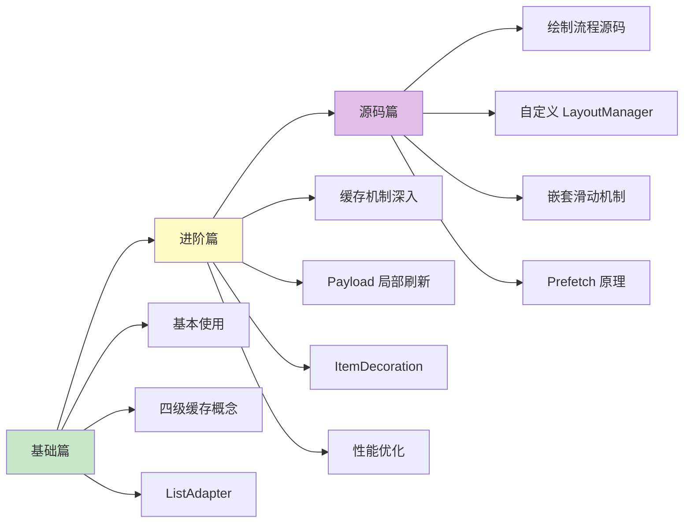

# RecyclerView 知识体系

> 从入门到专家的完整学习路径

## 文档结构

```
RecyclerView/
├── README.md          # 本文件（目录索引）
├── 1-基础篇.md         # 初/中级开发者
├── 2-进阶篇.md         # 高级开发者
└── 3-源码篇.md         # 专家级
```

## 学习路线



## 各篇内容概览

### [1-基础篇](1-基础篇.md)

**适合人群**：Android 初学者、准备初/中级面试

| 知识点 | 内容 |
|-------|------|
| 核心组件 | RecyclerView + Adapter + ViewHolder + LayoutManager |
| 基本使用 | 三步走实现列表 |
| 缓存机制 | 四级缓存白话版解释 |
| 推荐写法 | ListAdapter + DiffUtil |
| 多类型 Item | getItemViewType 实现 |
| 基础优化 | setHasFixedSize、监听器写法 |

### [2-进阶篇](2-进阶篇.md)

**适合人群**：有 RecyclerView 使用经验、准备高级面试

| 知识点 | 内容 |
|-------|------|
| 缓存机制深入 | 各级缓存源码结构、配置建议 |
| Payload 机制 | 局部刷新原理与实现 |
| ItemDecoration | 自定义分割线、悬浮吸顶 Header |
| ItemAnimator | 动画配置与禁用 |
| SnapHelper | 分页效果、居中对齐 |
| ConcatAdapter | 多 Adapter 组合 |
| 性能优化进阶 | Prefetch、共享 Pool、图片优化 |

### [3-源码篇](3-源码篇.md)

**适合人群**：准备 Android 专家级面试、想深入理解原理

| 知识点 | 内容 |
|-------|------|
| 绘制流程 | onMeasure → onLayout → onDraw 源码分析 |
| dispatchLayout | Step1/2/3 详解 |
| LayoutManager 原理 | fill、layoutChunk、获取 ViewHolder 流程 |
| 自定义 LayoutManager | 环形布局、画廊效果实战 |
| 嵌套滑动机制 | NestedScrolling 原理与实战 |
| Prefetch 原理 | GapWorker 工作机制 |
| 源码对比 | RecyclerView vs ListView |
| 面试高频问题 | 5 道专家级面试题 |

## 面试覆盖程度

| 面试级别 | 需要掌握 |
|---------|---------|
| 初级 Android | 基础篇 |
| 中级 Android | 基础篇 + 进阶篇部分 |
| 高级 Android | 基础篇 + 进阶篇 |
| **Android 专家** | 基础篇 + 进阶篇 + 源码篇 |

## 快速查阅

### 常见问题速查

| 问题 | 解决方案 | 所在文档 |
|-----|---------|---------|
| 列表不显示 | 检查 LayoutManager | 基础篇 |
| 数据更新不显示 | submitList() | 基础篇 |
| 滚动卡顿 | 检查 onBindViewHolder | 基础篇 |
| 图片错位 | onViewRecycled 取消加载 | 进阶篇 |
| 快速滑动白屏 | 增大 Pool 缓存 | 进阶篇 |
| 嵌套滑动冲突 | NestedScrolling | 源码篇 |

### 核心代码速查

| 功能 | 代码 | 所在文档 |
|-----|------|---------|
| 修改 Cache 大小 | `setItemViewCacheSize(4)` | 进阶篇 |
| 修改 Pool 大小 | `recycledViewPool.setMaxRecycledViews()` | 进阶篇 |
| 共享 Pool | `setRecycledViewPool(sharedPool)` | 进阶篇 |
| 局部刷新 | `notifyItemChanged(pos, payload)` | 进阶篇 |
| 禁用动画 | `itemAnimator = null` | 进阶篇 |
| 分页效果 | `PagerSnapHelper().attachToRecyclerView()` | 进阶篇 |

---
_本文档将持续更新_
