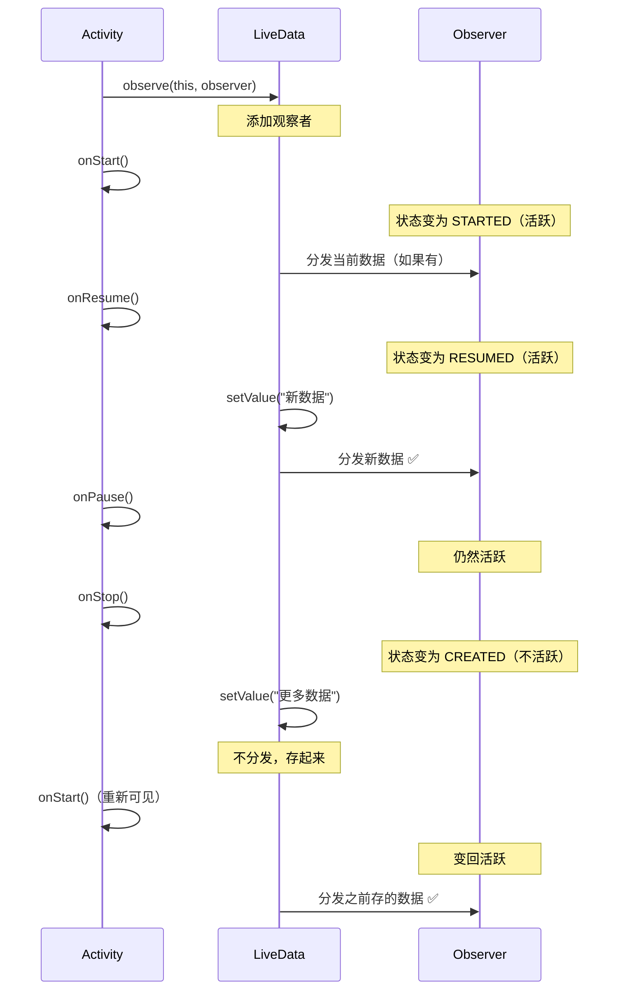

# LiveData 基础篇

## 技术演进：为什么需要 LiveData？

### 痛点一：手动更新 UI 容易出错

在没有 LiveData 之前，数据变化后更新 UI 是这样的：

```kotlin
// 传统方式：回调地狱 + 容易遗漏
class OldActivity : AppCompatActivity() {
    
    private var userName: String = ""
    
    fun loadUserData() {
        api.getUser { user ->
            userName = user.name
            // 问题1：容易忘记更新 UI
            textView.text = userName
            
            // 问题2：Activity 可能已经销毁了
            // 这里可能 crash！
        }
    }
    
    fun updateUserName(name: String) {
        userName = name
        // 又要记得更新 UI...
        textView.text = userName
    }
}
```

问题很多：
- 每次数据变化都要**手动更新 UI**，容易遗漏
- 回调时 Activity 可能已销毁，导致**空指针崩溃**
- 数据和 UI 强耦合，**难以测试**

### 痛点二：生命周期导致的内存泄漏

```kotlin
// 经典的内存泄漏案例
class LeakyActivity : AppCompatActivity() {
    
    override fun onCreate(savedInstanceState: Bundle?) {
        super.onCreate(savedInstanceState)
        
        // 注册监听，但 Activity 销毁时忘记取消注册
        EventBus.register(this) { event ->
            // EventBus 持有 Activity 引用
            // Activity 无法被回收 → 内存泄漏！
            updateUI(event)
        }
    }
    
    // 忘记在 onDestroy 中取消注册...
}
```

### 痛点三：配置变更时数据丢失

屏幕旋转后，Activity 重建，之前加载的数据没了，又要重新请求。用户体验差，浪费流量。

### LiveData 的诞生

2017 年，Google 发布 Architecture Components，LiveData 作为核心组件之一，设计目标是：

> **数据变化时自动通知 UI 更新，同时感知生命周期，避免内存泄漏和崩溃。**

用生活中的例子理解：

- **没有 LiveData**：就像每次外卖送到，你都要自己下楼去取，还可能人不在家（Activity 销毁）外卖没人收。
- **有 LiveData**：就像有个智能快递柜，外卖到了自动放柜子里，你回家（Activity 可见）就能取，不在家也不会丢。

## 核心概念：用大白话说清楚

### 什么是 LiveData？

**一句话定义**：LiveData 是一个**生命周期感知**的、**可观察**的数据持有类。

**大白话理解**：

把 LiveData 想象成一个"智能公告板"📢：
- **可观察**：谁想知道公告更新了，就来"订阅"
- **数据持有**：公告板上始终显示最新内容
- **生命周期感知**：只有在岗（活跃状态）的员工才会收到通知，下班了（不活跃）就不打扰

```
┌─────────────────────────────────────────────────────────────────────────────┐
│                        LiveData 工作原理示意图                               │
├─────────────────────────────────────────────────────────────────────────────┤
│                                                                             │
│                      ┌───────────────────────┐                              │
│                      │       LiveData        │                              │
│                      │    (智能公告板)        │                              │
│                      │                       │                              │
│                      │   value = "新消息"    │                              │
│                      └───────────┬───────────┘                              │
│                                  │                                          │
│                    数据变化时自动通知                                         │
│                                  │                                          │
│         ┌────────────────────────┼────────────────────────┐                 │
│         │                        │                        │                 │
│         ▼                        ▼                        ▼                 │
│  ┌─────────────┐          ┌─────────────┐          ┌─────────────┐         │
│  │  Observer A │          │  Observer B │          │  Observer C │         │
│  │  (Activity) │          │  (Fragment) │          │  (已销毁)    │         │
│  │  状态: RESUMED│          │  状态: STARTED│          │  状态: DESTROYED│      │
│  │  ✅ 收到通知 │          │  ✅ 收到通知 │          │  ❌ 不通知   │         │
│  └─────────────┘          └─────────────┘          └─────────────┘         │
│                                                                             │
│  只有活跃状态（STARTED 或 RESUMED）的观察者才会收到数据更新                    │
│                                                                             │
└─────────────────────────────────────────────────────────────────────────────┘
```

### LiveData 的三大特性

| 特性 | 说明 | 好处 |
|-----|------|-----|
| **生命周期感知** | 只在观察者活跃时分发数据 | 避免崩溃和不必要的更新 |
| **自动取消订阅** | 观察者销毁时自动移除 | 无需手动管理，防止内存泄漏 |
| **数据保持** | 始终持有最新数据 | 新订阅者立即获得最新值 |

### LiveData vs MutableLiveData

这是个常见的困惑点，其实很简单：

```kotlin
// MutableLiveData：可以修改数据
// 用于 ViewModel 内部
private val _userName = MutableLiveData<String>()

// LiveData：只能读取数据
// 暴露给外部，保证单向数据流
val userName: LiveData<String> = _userName
```

**为什么要这样设计？**

就像银行账户：
- `MutableLiveData` 是带转账功能的卡（可读可写）—— 自己用
- `LiveData` 是只能查余额的卡（只读）—— 给别人看

这样设计保证了**数据只能由 ViewModel 修改**，UI 层只负责展示，实现单向数据流。

```
┌─────────────────────────────────────────────────────────────────┐
│                      单向数据流                                  │
├─────────────────────────────────────────────────────────────────┤
│                                                                 │
│   ┌─────────────┐         ┌─────────────┐         ┌──────────┐ │
│   │   用户操作   │ ──────► │  ViewModel  │ ──────► │   UI    │ │
│   │  (点击按钮)  │         │ 修改数据     │         │  更新    │ │
│   └─────────────┘         └─────────────┘         └──────────┘ │
│                                   │                      │      │
│                                   │                      │      │
│                           MutableLiveData           LiveData    │
│                            (可写)                   (只读)      │
│                                                                 │
└─────────────────────────────────────────────────────────────────┘
```

## 基本用法：快速上手

### 1. 添加依赖

```kotlin
// build.gradle.kts (Module)
dependencies {
    // LiveData 核心（通常已包含在 lifecycle-runtime 中）
    implementation("androidx.lifecycle:lifecycle-livedata-ktx:2.7.0")
    
    // ViewModel（LiveData 通常和 ViewModel 配合使用）
    implementation("androidx.lifecycle:lifecycle-viewmodel-ktx:2.7.0")
    
    // Activity/Fragment KTX
    implementation("androidx.activity:activity-ktx:1.8.2")
    implementation("androidx.fragment:fragment-ktx:1.6.2")
}
```

### 2. 在 ViewModel 中创建 LiveData

```kotlin
class UserViewModel : ViewModel() {
    
    // 私有可变 LiveData（内部使用）
    private val _user = MutableLiveData<User>()
    // 公开只读 LiveData（暴露给 UI）
    val user: LiveData<User> = _user
    
    // 加载状态
    private val _loading = MutableLiveData<Boolean>()
    val loading: LiveData<Boolean> = _loading
    
    // 错误信息
    private val _error = MutableLiveData<String?>()
    val error: LiveData<String?> = _error
    
    fun loadUser(userId: String) {
        viewModelScope.launch {
            _loading.value = true  // 开始加载
            _error.value = null    // 清除之前的错误
            
            try {
                val result = userRepository.getUser(userId)
                _user.value = result  // 更新数据
            } catch (e: Exception) {
                _error.value = e.message  // 设置错误信息
            } finally {
                _loading.value = false  // 结束加载
            }
        }
    }
}

// User 数据类
data class User(
    val id: String,
    val name: String,
    val avatar: String
)
```

### 3. 在 Activity 中观察

```kotlin
class UserActivity : AppCompatActivity() {
    
    private val viewModel: UserViewModel by viewModels()
    private lateinit var binding: ActivityUserBinding
    
    override fun onCreate(savedInstanceState: Bundle?) {
        super.onCreate(savedInstanceState)
        binding = ActivityUserBinding.inflate(layoutInflater)
        setContentView(binding.root)
        
        // 观察用户数据
        viewModel.user.observe(this) { user ->
            // 数据变化时自动调用
            binding.textName.text = user.name
            binding.imageAvatar.load(user.avatar)
        }
        
        // 观察加载状态
        viewModel.loading.observe(this) { isLoading ->
            binding.progressBar.isVisible = isLoading
        }
        
        // 观察错误信息
        viewModel.error.observe(this) { errorMsg ->
            errorMsg?.let {
                Toast.makeText(this, it, Toast.LENGTH_SHORT).show()
            }
        }
        
        // 触发加载
        viewModel.loadUser("123")
    }
}
```

### 4. 在 Fragment 中观察（注意！）

```kotlin
class UserFragment : Fragment() {
    
    private val viewModel: UserViewModel by viewModels()
    private var _binding: FragmentUserBinding? = null
    private val binding get() = _binding!!
    
    override fun onCreateView(
        inflater: LayoutInflater, 
        container: ViewGroup?,
        savedInstanceState: Bundle?
    ): View {
        _binding = FragmentUserBinding.inflate(inflater, container, false)
        return binding.root
    }
    
    override fun onViewCreated(view: View, savedInstanceState: Bundle?) {
        super.onViewCreated(view, savedInstanceState)
        
        // ⚠️ 重要：Fragment 中必须使用 viewLifecycleOwner！
        viewModel.user.observe(viewLifecycleOwner) { user ->
            binding.textName.text = user.name
        }
        
        // ❌ 错误做法：使用 this
        // viewModel.user.observe(this) { user -> ... }
        // 会导致重复订阅！
    }
    
    override fun onDestroyView() {
        super.onDestroyView()
        _binding = null
    }
}
```

### 5. setValue vs postValue

这是最常问的问题，务必搞清楚！

```kotlin
class DataViewModel : ViewModel() {
    
    private val _data = MutableLiveData<String>()
    val data: LiveData<String> = _data
    
    // setValue：必须在主线程调用
    fun updateOnMainThread(value: String) {
        // ✅ 正确：在主线程
        _data.value = value
    }
    
    // postValue：可以在任意线程调用
    fun updateFromBackground(value: String) {
        viewModelScope.launch(Dispatchers.IO) {
            // 模拟耗时操作
            delay(1000)
            // ✅ 正确：在 IO 线程使用 postValue
            _data.postValue(value)
        }
    }
    
    // ❌ 错误示范
    fun wrongUsage() {
        viewModelScope.launch(Dispatchers.IO) {
            // ❌ 崩溃！setValue 只能在主线程调用
            // _data.value = "error"
        }
    }
}
```

**对比总结**：

| 方法 | 线程要求 | 执行时机 | 连续调用 |
|-----|---------|---------|---------|
| `setValue()` | **主线程** | 同步立即执行 | 每次都会通知观察者 |
| `postValue()` | 任意线程 | 异步（切到主线程） | 只有最后一次生效 |

**postValue 的"丢值"问题**：

```kotlin
// 连续调用 postValue
_data.postValue("A")
_data.postValue("B")
_data.postValue("C")
// 观察者只会收到 "C"！

// 连续调用 setValue（主线程）
_data.value = "A"  // 观察者收到 "A"
_data.value = "B"  // 观察者收到 "B"
_data.value = "C"  // 观察者收到 "C"
```

**大白话理解**：
- `setValue` 就像即时通讯，消息立刻送达
- `postValue` 就像把消息放进待发送列表，定时发送，中间的消息会被覆盖

## 生命周期感知详解

### 什么是"活跃状态"？

LiveData 只会向**活跃**的观察者分发数据。那什么是活跃？

```kotlin
// 活跃状态 = Lifecycle.State >= STARTED
// 即：STARTED 或 RESUMED 状态

// 对应生命周期方法：
// onStart() 之后 ─────────────► 活跃 ✅
// onResume() ─────────────────► 活跃 ✅
// onPause() ──────────────────► 活跃 ✅（还在 STARTED 状态）
// onStop() 之后 ──────────────► 不活跃 ❌
```



### 自动取消订阅

当 LifecycleOwner 到达 `DESTROYED` 状态时，LiveData 自动移除对应的观察者：

```kotlin
class AutoCleanupActivity : AppCompatActivity() {
    
    override fun onCreate(savedInstanceState: Bundle?) {
        super.onCreate(savedInstanceState)
        
        // 添加观察者
        viewModel.data.observe(this) { data ->
            // ...
        }
        
        // 当 Activity 销毁时：
        // 1. Activity 进入 DESTROYED 状态
        // 2. LiveData 自动移除这个观察者
        // 3. 无需手动调用 removeObserver()
        // 4. 不会内存泄漏！
    }
    
    // 不需要在 onDestroy 中做任何清理！
}
```

## 常见问题与陷阱

### 1. Fragment 中必须用 viewLifecycleOwner

这是最常见的错误，非常重要！

```kotlin
class ProblematicFragment : Fragment() {
    
    override fun onViewCreated(view: View, savedInstanceState: Bundle?) {
        super.onViewCreated(view, savedInstanceState)
        
        // ❌ 错误：使用 this（Fragment 的生命周期）
        viewModel.data.observe(this) { data ->
            binding.text.text = data  // 可能导致重复订阅！
        }
        
        // ✅ 正确：使用 viewLifecycleOwner（View 的生命周期）
        viewModel.data.observe(viewLifecycleOwner) { data ->
            binding.text.text = data
        }
    }
}
```

**为什么会出问题？**

Fragment 的生命周期和 View 的生命周期不一致：

```
┌─────────────────────────────────────────────────────────────────┐
│              Fragment 和 View 的生命周期对比                      │
├─────────────────────────────────────────────────────────────────┤
│                                                                 │
│  场景：Fragment 在返回栈中                                        │
│                                                                 │
│  Fragment 生命周期：                                              │
│  onCreate ──► onCreateView ──► onDestroyView ──► onCreateView   │
│      │                              │                 │         │
│      │         Fragment 还活着！     │                 │         │
│      └──────────────────────────────┘                 │         │
│                                                       │         │
│  View 生命周期：                                                  │
│  创建 ──────────────► 销毁 ──────────────► 重新创建               │
│                                                                 │
│  如果用 this（Fragment）：                                        │
│  - Fragment 还活着，observe 还在                                  │
│  - View 重建后再次 observe                                        │
│  - 结果：同一个 LiveData 被观察两次！                              │
│                                                                 │
│  如果用 viewLifecycleOwner（View）：                              │
│  - View 销毁时，observe 自动移除                                  │
│  - View 重建后重新 observe                                        │
│  - 结果：始终只有一个观察者 ✅                                     │
│                                                                 │
└─────────────────────────────────────────────────────────────────┘
```

### 2. observe 回调中不要做耗时操作

```kotlin
// ❌ 错误：在回调中做耗时操作
viewModel.data.observe(viewLifecycleOwner) { data ->
    // 这会阻塞主线程！
    val processed = heavyProcessing(data)
    binding.text.text = processed
}

// ✅ 正确：耗时操作放在 ViewModel 中
// ViewModel
fun loadData() {
    viewModelScope.launch {
        val raw = repository.getData()
        val processed = withContext(Dispatchers.Default) {
            heavyProcessing(raw)  // 在后台处理
        }
        _data.value = processed  // 处理完再更新
    }
}

// UI 层只做简单展示
viewModel.data.observe(viewLifecycleOwner) { processedData ->
    binding.text.text = processedData
}
```

### 3. LiveData 初始值为 null

```kotlin
// MutableLiveData 默认没有初始值
private val _data = MutableLiveData<String>()

// 第一次 observe 时，如果没有设过值，不会收到回调
viewModel.data.observe(this) { data ->
    // 首次 observe 时不会调用（因为没有值）
}

// 设置初始值的两种方式
// 方式一：构造函数
private val _data = MutableLiveData<String>("初始值")

// 方式二：init 块
private val _data = MutableLiveData<String>()
init {
    _data.value = "初始值"
}
```

### 4. 不要在 LiveData 中存储 View 相关对象

```kotlin
// ❌ 错误：存储 View 引用
class BadViewModel : ViewModel() {
    private val _selectedView = MutableLiveData<View>()  // 内存泄漏！
}

// ❌ 错误：存储 Context
class BadViewModel : ViewModel() {
    private val _context = MutableLiveData<Context>()  // 内存泄漏！
}

// ✅ 正确：存储数据，让 UI 层决定如何展示
class GoodViewModel : ViewModel() {
    private val _selectedItemId = MutableLiveData<String>()
    val selectedItemId: LiveData<String> = _selectedItemId
}
```

### 5. observeForever 需要手动移除

```kotlin
class ServiceExample : Service() {
    
    private val observer = Observer<String> { data ->
        // 处理数据
    }
    
    override fun onCreate() {
        super.onCreate()
        // Service 没有生命周期，使用 observeForever
        viewModel.data.observeForever(observer)
    }
    
    override fun onDestroy() {
        super.onDestroy()
        // ⚠️ 必须手动移除！否则内存泄漏
        viewModel.data.removeObserver(observer)
    }
}
```

## 实际应用场景

### 场景一：表单验证

```kotlin
class LoginViewModel : ViewModel() {
    
    val username = MutableLiveData<String>()
    val password = MutableLiveData<String>()
    
    // 表单是否有效
    val isFormValid: LiveData<Boolean> = MediatorLiveData<Boolean>().apply {
        // 监听用户名变化
        addSource(username) { 
            value = validateForm()
        }
        // 监听密码变化
        addSource(password) { 
            value = validateForm()
        }
    }
    
    private fun validateForm(): Boolean {
        val user = username.value ?: return false
        val pass = password.value ?: return false
        return user.length >= 3 && pass.length >= 6
    }
}

// Activity 中使用
class LoginActivity : AppCompatActivity() {
    
    override fun onCreate(savedInstanceState: Bundle?) {
        super.onCreate(savedInstanceState)
        
        // 双向绑定输入框
        binding.editUsername.doAfterTextChanged {
            viewModel.username.value = it.toString()
        }
        
        binding.editPassword.doAfterTextChanged {
            viewModel.password.value = it.toString()
        }
        
        // 根据表单有效性启用/禁用按钮
        viewModel.isFormValid.observe(this) { isValid ->
            binding.buttonLogin.isEnabled = isValid
        }
    }
}
```

### 场景二：搜索防抖

```kotlin
class SearchViewModel : ViewModel() {
    
    private val _searchQuery = MutableLiveData<String>()
    
    // 搜索结果，带防抖
    val searchResults: LiveData<List<SearchResult>> = _searchQuery
        .debounce(300)  // 需要扩展函数
        .switchMap { query ->
            if (query.isBlank()) {
                liveData { emit(emptyList()) }
            } else {
                liveData {
                    emit(repository.search(query))
                }
            }
        }
    
    fun search(query: String) {
        _searchQuery.value = query
    }
}

// debounce 扩展函数（需要自己实现或使用库）
fun <T> LiveData<T>.debounce(duration: Long): LiveData<T> {
    return MediatorLiveData<T>().apply {
        var job: Job? = null
        addSource(this@debounce) { value ->
            job?.cancel()
            job = MainScope().launch {
                delay(duration)
                this@apply.value = value
            }
        }
    }
}
```

### 场景三：加载状态封装

```kotlin
// 通用的加载状态封装
sealed class Resource<T> {
    class Loading<T> : Resource<T>()
    data class Success<T>(val data: T) : Resource<T>()
    data class Error<T>(val message: String) : Resource<T>()
}

class ArticleViewModel : ViewModel() {
    
    private val _articles = MutableLiveData<Resource<List<Article>>>()
    val articles: LiveData<Resource<List<Article>>> = _articles
    
    fun loadArticles() {
        viewModelScope.launch {
            _articles.value = Resource.Loading()
            
            try {
                val data = repository.getArticles()
                _articles.value = Resource.Success(data)
            } catch (e: Exception) {
                _articles.value = Resource.Error(e.message ?: "未知错误")
            }
        }
    }
}

// UI 层统一处理
viewModel.articles.observe(viewLifecycleOwner) { resource ->
    when (resource) {
        is Resource.Loading -> {
            binding.progressBar.isVisible = true
            binding.errorView.isVisible = false
        }
        is Resource.Success -> {
            binding.progressBar.isVisible = false
            binding.errorView.isVisible = false
            adapter.submitList(resource.data)
        }
        is Resource.Error -> {
            binding.progressBar.isVisible = false
            binding.errorView.isVisible = true
            binding.errorText.text = resource.message
        }
    }
}
```

## 面试检验

### 基础概念题

**Q1：LiveData 是什么？为什么需要它？**

> **答案**：LiveData 是一个生命周期感知的、可观察的数据持有类。它解决了三个问题：
> 1. **手动更新 UI 易出错**：数据变化自动通知观察者更新 UI
> 2. **生命周期导致的崩溃和泄漏**：只在活跃状态分发数据，自动取消订阅
> 3. **配置变更数据丢失**：配合 ViewModel 保存数据
>
> 核心价值是实现了**数据驱动 UI**的响应式编程模式。

**Q2：MutableLiveData 和 LiveData 有什么区别？**

> **答案**：
> - `MutableLiveData` 继承自 `LiveData`，额外暴露了 `setValue()` 和 `postValue()` 方法
> - `LiveData` 只能读取数据，不能修改
>
> 设计意图是**单向数据流**：ViewModel 内部用 MutableLiveData 可读可写，对外暴露 LiveData 只读，保证数据只能由 ViewModel 修改。

**Q3：setValue() 和 postValue() 有什么区别？**

> **答案**：
> | 方法 | 线程要求 | 执行方式 | 连续调用 |
> |-----|---------|---------|---------|
> | setValue | 主线程 | 同步 | 每次都通知 |
> | postValue | 任意线程 | 异步（post 到主线程） | 只有最后一次生效 |
>
> **注意**：连续调用 postValue 会"丢值"，只有最后一个会被分发。在子线程必须用 postValue，主线程推荐用 setValue。

**Q4：为什么 Fragment 中观察 LiveData 要用 viewLifecycleOwner？**

> **答案**：因为 Fragment 的生命周期和 View 的生命周期不一致。Fragment 在返回栈中时，View 会销毁重建，但 Fragment 实例还活着。
>
> - 用 `this`：View 重建后再次 observe，导致重复订阅
> - 用 `viewLifecycleOwner`：View 销毁时自动移除订阅，重建后重新订阅，始终只有一个观察者

**Q5：LiveData 如何实现自动取消订阅？不会内存泄漏吗？**

> **答案**：LiveData 内部会监听 LifecycleOwner 的生命周期。当 LifecycleOwner 进入 `DESTROYED` 状态时，自动调用 `removeObserver()` 移除观察者。
>
> 这依赖于 Lifecycle 组件：
> 1. observe 时，LiveData 创建一个 LifecycleBoundObserver
> 2. 这个包装类同时是 LifecycleObserver，监听生命周期
> 3. 收到 ON_DESTROY 事件时，自动从观察者列表移除
>
> 所以只要使用带生命周期的 observe，就不会泄漏。

---

_下一篇：[2-进阶篇](./2-进阶篇.md) - Transformations、粘性事件、LiveData vs Flow_
