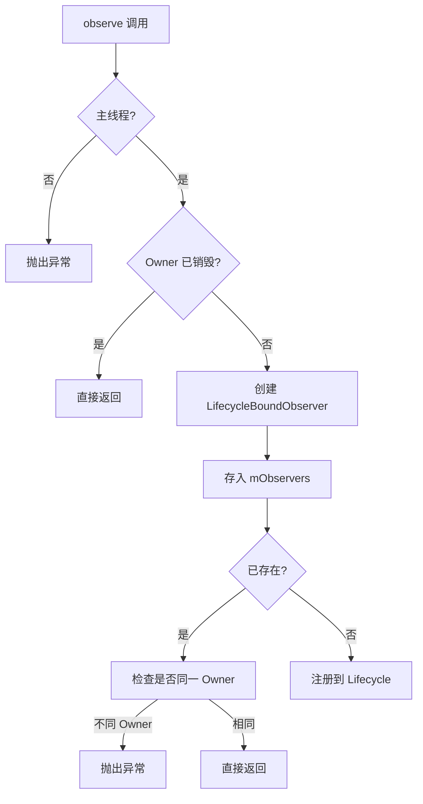
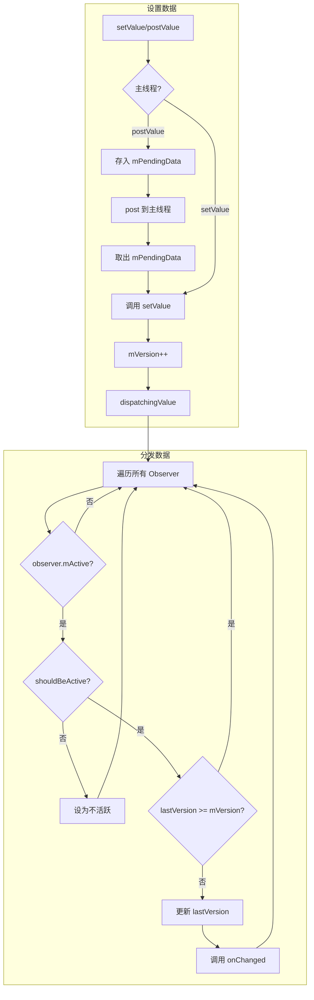
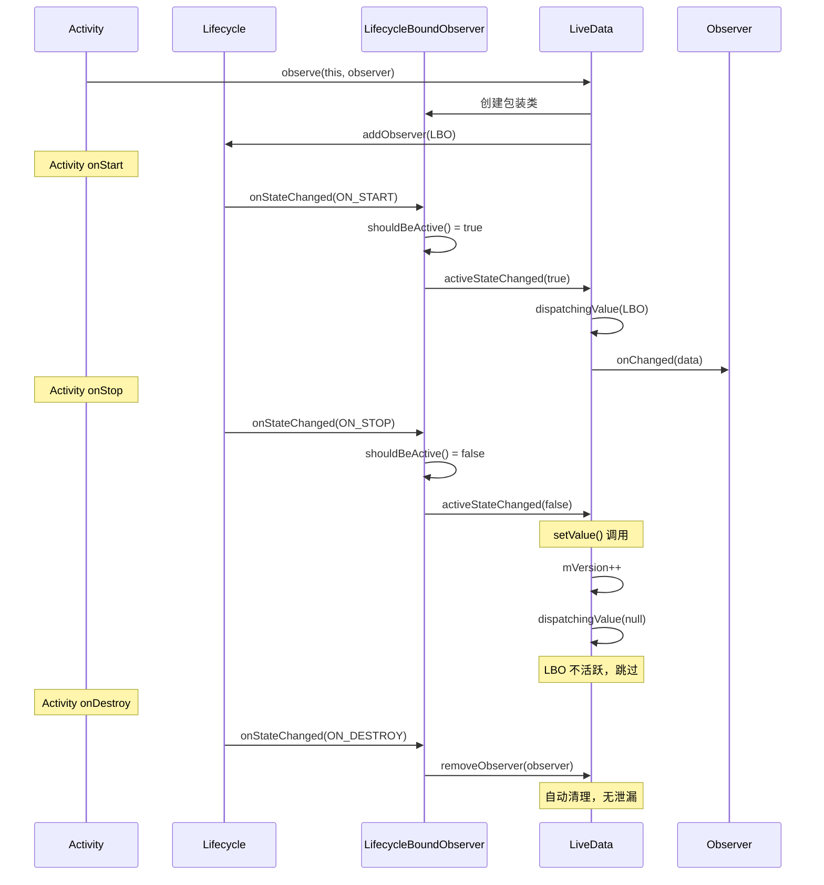

# LiveData 源码篇

## 设计哲学

### 核心设计目标

LiveData 的设计目标可以用一句话概括：

> **让 UI 层能够安全、自动地响应数据变化，不用操心生命周期。**

为了实现这个目标，LiveData 做了几个关键的设计决策：

| 设计决策 | 原因 | 权衡 |
|---------|------|------|
| 生命周期绑定 | 防止内存泄漏和崩溃 | 增加了复杂度 |
| 只在活跃时分发 | 避免无效更新 | 可能"丢"数据 |
| 粘性（新观察者收到最新值） | 保证 UI 状态一致 | 一次性事件需要特殊处理 |
| 只在主线程分发 | 保证线程安全 | postValue 有延迟 |
| 版本控制 | 防止重复分发 | 增加内部复杂度 |

### 整体架构

```
┌─────────────────────────────────────────────────────────────────────────────┐
│                        LiveData 核心架构                                     │
├─────────────────────────────────────────────────────────────────────────────┤
│                                                                             │
│  ┌─────────────────────────────────────────────────────────────────────┐   │
│  │                         LiveData<T>                                  │   │
│  │  ┌─────────────────────────────────────────────────────────────┐    │   │
│  │  │  mData: T               当前数据                              │    │   │
│  │  │  mVersion: int          数据版本号                            │    │   │
│  │  │  mObservers: Map        观察者映射表                          │    │   │
│  │  └─────────────────────────────────────────────────────────────┘    │   │
│  │                                                                      │   │
│  │  核心方法：                                                           │   │
│  │  • observe(owner, observer)  添加生命周期感知的观察者                 │   │
│  │  • observeForever(observer)  添加永久观察者                          │   │
│  │  • setValue(value)           主线程设置值                            │   │
│  │  • postValue(value)          任意线程设置值                          │   │
│  └─────────────────────────────────────────────────────────────────────┘   │
│                                    │                                        │
│                                    │ 包装                                   │
│                                    ▼                                        │
│  ┌─────────────────────────────────────────────────────────────────────┐   │
│  │                    ObserverWrapper (抽象类)                          │   │
│  │  ┌─────────────────────────────────────────────────────────────┐    │   │
│  │  │  mObserver: Observer<T>    原始观察者                         │    │   │
│  │  │  mLastVersion: int         上次接收的版本                      │    │   │
│  │  │  mActive: boolean          是否活跃                           │    │   │
│  │  └─────────────────────────────────────────────────────────────┘    │   │
│  │                                                                      │   │
│  │  两个实现：                                                           │   │
│  │  • LifecycleBoundObserver  生命周期绑定（observe 使用）               │   │
│  │  • AlwaysActiveObserver    永远活跃（observeForever 使用）            │   │
│  └─────────────────────────────────────────────────────────────────────┘   │
│                                                                             │
└─────────────────────────────────────────────────────────────────────────────┘
```

## 核心源码分析

### 1. 数据结构

```java
public abstract class LiveData<T> {
    
    // 当前数据，用 Object 包装以支持 null
    private volatile Object mData;
    
    // 数据版本号，每次 setValue 都会 +1
    // 用于判断观察者是否需要接收新数据
    private int mVersion;
    
    // 观察者映射表：Observer -> ObserverWrapper
    // 使用 SafeIterableMap 支持遍历时修改
    private SafeIterableMap<Observer<? super T>, ObserverWrapper> mObservers =
            new SafeIterableMap<>();
    
    // 当前活跃的观察者数量
    private int mActiveCount = 0;
    
    // postValue 使用的 pending 值
    volatile Object mPendingData = NOT_SET;
    
    // 起始版本号，表示"没有数据"
    static final int START_VERSION = -1;
    
    // 空数据标记
    private static final Object NOT_SET = new Object();
}
```

**设计亮点**：
- `mVersion` 机制：避免重复分发，保证观察者只收到比自己版本新的数据
- `SafeIterableMap`：支持遍历时安全地添加/删除观察者
- `NOT_SET` 标记：区分"没有数据"和"数据为 null"

### 2. observe() 方法

```java
@MainThread
public void observe(@NonNull LifecycleOwner owner, @NonNull Observer<? super T> observer) {
    // 必须在主线程调用
    assertMainThread("observe");
    
    // 如果 LifecycleOwner 已经销毁，直接忽略
    if (owner.getLifecycle().getCurrentState() == DESTROYED) {
        return;
    }
    
    // 创建生命周期绑定的包装类
    // 这是实现生命周期感知的关键！
    LifecycleBoundObserver wrapper = new LifecycleBoundObserver(owner, observer);
    
    // 将包装类存入观察者映射表
    // putIfAbsent：如果已存在返回旧值，不存在返回 null
    ObserverWrapper existing = mObservers.putIfAbsent(observer, wrapper);
    
    // 如果同一个 observer 已经注册到不同的 owner，抛异常
    if (existing != null && !existing.isAttachedTo(owner)) {
        throw new IllegalArgumentException("Cannot add the same observer"
                + " with different lifecycles");
    }
    
    // 已存在，不重复添加
    if (existing != null) {
        return;
    }
    
    // 关键：将包装类注册为 Lifecycle 的观察者
    // 这样当生命周期变化时，包装类会收到通知
    owner.getLifecycle().addObserver(wrapper);
}
```

**核心流程**：



### 3. LifecycleBoundObserver：生命周期感知的秘密

```java
class LifecycleBoundObserver extends ObserverWrapper implements LifecycleEventObserver {
    
    @NonNull
    final LifecycleOwner mOwner;
    
    LifecycleBoundObserver(@NonNull LifecycleOwner owner, Observer<? super T> observer) {
        super(observer);
        mOwner = owner;
    }
    
    @Override
    boolean shouldBeActive() {
        // 关键：只有 STARTED 或 RESUMED 状态才算活跃
        return mOwner.getLifecycle().getCurrentState().isAtLeast(STARTED);
    }
    
    @Override
    public void onStateChanged(@NonNull LifecycleOwner source, @NonNull Lifecycle.Event event) {
        // 收到生命周期事件
        Lifecycle.State currentState = mOwner.getLifecycle().getCurrentState();
        
        // 如果已销毁，自动移除观察者（防止内存泄漏的关键！）
        if (currentState == DESTROYED) {
            removeObserver(mObserver);
            return;
        }
        
        // 更新活跃状态，可能触发数据分发
        Lifecycle.State prevState = null;
        while (prevState != currentState) {
            prevState = currentState;
            activeStateChanged(shouldBeActive());
            currentState = mOwner.getLifecycle().getCurrentState();
        }
    }
    
    @Override
    boolean isAttachedTo(LifecycleOwner owner) {
        return mOwner == owner;
    }
    
    @Override
    void detachObserver() {
        mOwner.getLifecycle().removeObserver(this);
    }
}
```

**设计亮点**：
- 同时实现 `ObserverWrapper` 和 `LifecycleEventObserver`
- 在 `onStateChanged` 中自动移除 DESTROYED 状态的观察者
- `shouldBeActive()` 判断是否应该接收数据

### 4. setValue() 和数据分发

```java
@MainThread
protected void setValue(T value) {
    // 必须在主线程
    assertMainThread("setValue");
    
    // 版本号 +1，这是判断是否需要分发的关键
    mVersion++;
    
    // 保存新数据
    mData = value;
    
    // 通知所有观察者
    dispatchingValue(null);
}

void dispatchingValue(@Nullable ObserverWrapper initiator) {
    // 防止递归分发
    if (mDispatchingValue) {
        mDispatchInvalidated = true;
        return;
    }
    
    mDispatchingValue = true;
    do {
        mDispatchInvalidated = false;
        if (initiator != null) {
            // 只通知特定观察者（observeForever 场景）
            considerNotify(initiator);
            initiator = null;
        } else {
            // 遍历所有观察者
            for (Iterator<Map.Entry<Observer<? super T>, ObserverWrapper>> iterator =
                    mObservers.iteratorWithAdditions(); iterator.hasNext(); ) {
                considerNotify(iterator.next().getValue());
                if (mDispatchInvalidated) {
                    break;
                }
            }
        }
    } while (mDispatchInvalidated);
    mDispatchingValue = false;
}

private void considerNotify(ObserverWrapper observer) {
    // 检查 1：观察者不活跃，跳过
    if (!observer.mActive) {
        return;
    }
    
    // 检查 2：再次确认是否真的活跃（状态可能刚变）
    if (!observer.shouldBeActive()) {
        observer.activeStateChanged(false);
        return;
    }
    
    // 检查 3：版本号检查，防止重复分发
    // 这就是为什么新观察者能收到最新数据（粘性）的原因
    // 新观察者的 mLastVersion 是 START_VERSION (-1)
    // 只要 mVersion > -1，就会分发
    if (observer.mLastVersion >= mVersion) {
        return;
    }
    
    // 更新观察者的版本号
    observer.mLastVersion = mVersion;
    
    // 终于！调用观察者的 onChanged
    observer.mObserver.onChanged((T) mData);
}
```

**版本机制的作用**：

```
┌─────────────────────────────────────────────────────────────────────────────┐
│                          版本机制工作原理                                     │
├─────────────────────────────────────────────────────────────────────────────┤
│                                                                             │
│  时间线 ──────────────────────────────────────────────────────────────────►  │
│                                                                             │
│  LiveData.mVersion:     -1 ───► 0 ───► 1 ───► 2                            │
│                              set("A") set("B") set("C")                     │
│                                                                             │
│  Observer1.mLastVersion: -1 ───► 0 ───► 1 ───► 2                            │
│  收到的数据:                  "A"    "B"    "C"   ✅ 正常                    │
│                                                                             │
│  Observer2（在 set("B") 后订阅）                                              │
│  Observer2.mLastVersion:           -1 ───► 1                                │
│  收到的数据:                           "B"      ✅ 立即收到当前值（粘性）     │
│                                                                             │
│  屏幕旋转后，Observer1 重新订阅                                               │
│  Observer1.mLastVersion:                    -1 ───► 2                       │
│  收到的数据:                                    "C"   ✅ 收到最新值          │
│                                                                             │
│  如果没有版本机制，Observer1 旋转后可能收不到最新数据                          │
│                                                                             │
└─────────────────────────────────────────────────────────────────────────────┘
```

### 5. postValue() 的异步实现

```java
protected void postValue(T value) {
    boolean postTask;
    synchronized (mDataLock) {
        // 检查是否需要 post 任务
        // 如果 mPendingData 已经有值，说明已经 post 过任务了
        postTask = mPendingData == NOT_SET;
        
        // 保存新值（会覆盖之前的值！）
        mPendingData = value;
    }
    
    // 只有第一次 postValue 才会 post 任务
    // 后续的 postValue 只更新 mPendingData
    if (!postTask) {
        return;
    }
    
    // 通过 Handler post 到主线程
    ArchTaskExecutor.getInstance().postToMainThread(mPostValueRunnable);
}

private final Runnable mPostValueRunnable = new Runnable() {
    @Override
    public void run() {
        Object newValue;
        synchronized (mDataLock) {
            // 取出 pending 值
            newValue = mPendingData;
            // 重置为 NOT_SET
            mPendingData = NOT_SET;
        }
        // 调用 setValue
        setValue((T) newValue);
    }
};
```

**为什么连续 postValue 只有最后一个生效？**

```
┌─────────────────────────────────────────────────────────────────────────────┐
│                     postValue 的"丢值"原理                                   │
├─────────────────────────────────────────────────────────────────────────────┤
│                                                                             │
│  子线程                              主线程队列                              │
│  ────────                           ─────────                               │
│                                                                             │
│  postValue("A")                                                             │
│    └─► mPendingData = "A"                                                   │
│    └─► post(runnable) ──────────────► [runnable]                           │
│                                                                             │
│  postValue("B")                                                             │
│    └─► mPendingData = "B"  // 覆盖了 "A"                                   │
│    └─► postTask = false    // 不再 post                                    │
│                                                                             │
│  postValue("C")                                                             │
│    └─► mPendingData = "C"  // 又覆盖了                                     │
│    └─► postTask = false                                                    │
│                                                                             │
│                                     runnable 执行                           │
│                                       └─► setValue("C")  // 只有 C！       │
│                                                                             │
└─────────────────────────────────────────────────────────────────────────────┘
```

### 6. 活跃状态变化时的处理

```java
// ObserverWrapper 中
void activeStateChanged(boolean newActive) {
    // 状态没变，不处理
    if (newActive == mActive) {
        return;
    }
    
    mActive = newActive;
    
    // 更新活跃观察者计数
    changeActiveCounter(mActive ? 1 : -1);
    
    // 关键：如果变成活跃状态，尝试分发数据
    // 这就是为什么 Activity 从后台回来能收到最新数据
    if (mActive) {
        dispatchingValue(this);
    }
}

// LiveData 中
void changeActiveCounter(int change) {
    int previousActiveCount = mActiveCount;
    mActiveCount += change;
    
    // 从无活跃观察者变为有
    if (previousActiveCount == 0 && mActiveCount > 0) {
        onActive();  // 子类可覆写，做一些启动工作
    }
    
    // 从有活跃观察者变为无
    if (previousActiveCount > 0 && mActiveCount == 0) {
        onInactive();  // 子类可覆写，做一些清理工作
    }
}
```

**onActive/onInactive 的应用**：

```kotlin
// 只有在有观察者时才加载数据
class UserLiveData : LiveData<User>() {
    
    private var disposable: Disposable? = null
    
    override fun onActive() {
        // 有观察者了，开始加载
        disposable = api.getUser()
            .subscribe { user ->
                postValue(user)
            }
    }
    
    override fun onInactive() {
        // 没观察者了，停止加载
        disposable?.dispose()
    }
}
```

## 核心流程图

### 完整的数据分发流程



### 生命周期感知流程



## 设计亮点与可借鉴之处

### 1. 版本控制机制

**问题**：如何保证观察者不会收到重复数据，同时新观察者能收到最新数据？

**解决**：每个数据有版本号，每个观察者记录收到的最后版本号，只分发比观察者版本高的数据。

```kotlin
// 借鉴应用：自己实现的事件总线
class VersionedEventBus<T> {
    private var currentVersion = 0
    private val observers = mutableMapOf<Observer<T>, Int>()
    private var data: T? = null
    
    fun post(event: T) {
        currentVersion++
        data = event
        dispatch()
    }
    
    fun observe(observer: Observer<T>) {
        observers[observer] = currentVersion - 1  // 让新观察者能收到当前数据
        dispatch()
    }
    
    private fun dispatch() {
        observers.forEach { (observer, lastVersion) ->
            if (lastVersion < currentVersion && data != null) {
                observers[observer] = currentVersion
                observer.onChanged(data!!)
            }
        }
    }
}
```

### 2. 包装类模式

**问题**：如何在不修改 Observer 接口的前提下，添加生命周期感知功能？

**解决**：用 ObserverWrapper 包装原始 Observer，在包装类中添加额外逻辑。

```kotlin
// 借鉴应用：给回调添加防抖功能
class DebouncedCallback<T>(
    private val original: (T) -> Unit,
    private val delayMs: Long
) {
    private var job: Job? = null
    
    fun invoke(value: T) {
        job?.cancel()
        job = MainScope().launch {
            delay(delayMs)
            original(value)
        }
    }
}

// 使用
val debouncedSearch = DebouncedCallback<String>(
    original = { query -> performSearch(query) },
    delayMs = 300
)
```

### 3. SafeIterableMap

**问题**：遍历观察者列表时，可能有新增/删除操作，普通 Map 会抛 ConcurrentModificationException。

**解决**：使用链表实现的 SafeIterableMap，支持遍历时安全修改。

### 4. 防止递归分发

**问题**：在 onChanged 回调中调用 setValue，会导致递归。

**解决**：使用 mDispatchingValue 和 mDispatchInvalidated 标记，检测递归并重新分发。

```java
// 源码中的处理
void dispatchingValue(ObserverWrapper initiator) {
    if (mDispatchingValue) {
        // 检测到递归，标记需要重新分发
        mDispatchInvalidated = true;
        return;
    }
    mDispatchingValue = true;
    do {
        mDispatchInvalidated = false;
        // ... 分发逻辑
    } while (mDispatchInvalidated);  // 如果有递归，重新分发
    mDispatchingValue = false;
}
```

### 5. 延迟分发（postValue）

**设计思考**：为什么不每次 postValue 都 post 一个任务？

**原因**：减少主线程任务数量，提高性能。多次 postValue 合并为一次 setValue。

**权衡**：中间值会丢失，如果需要每次都分发，应该用 setValue 或 Channel。

## 延伸思考

### 如果让你设计 LiveData，你会怎么做？

这是高级面试常问的开放题。可以从以下角度思考：

**1. 粘性问题**

现在的 LiveData 粘性是强制的。如果重新设计：
- 提供配置项，让用户选择是否需要粘性
- 或者分离 StateFlow（粘性）和 EventFlow（非粘性）

**2. 线程模型**

现在只能在主线程分发。如果重新设计：
- 支持指定分发线程
- 支持 Flow 那样的 flowOn 操作符

**3. 操作符**

现在只有 map 和 switchMap。如果重新设计：
- 添加 filter、combine、debounce 等操作符
- 参考 RxJava 或 Kotlin Flow

**4. 背压**

现在没有背压处理。如果重新设计：
- 添加 buffer、conflate 等策略
- 参考 Flow 的背压处理

**事实上，Kotlin Flow + StateFlow/SharedFlow 就是 LiveData 的"重新设计"版本。**

## 面试检验

### 源码深度题

**Q1：LiveData 的生命周期感知是如何实现的？**

> **答案**：通过 `LifecycleBoundObserver` 实现：
> 1. `observe()` 时创建 `LifecycleBoundObserver`，它同时实现了 `ObserverWrapper` 和 `LifecycleEventObserver`
> 2. 将其注册到 `Lifecycle` 中
> 3. 当生命周期变化时，`onStateChanged()` 被调用
> 4. 如果进入 DESTROYED 状态，自动调用 `removeObserver()` 移除观察者
> 5. 如果变成活跃状态（STARTED/RESUMED），调用 `dispatchingValue()` 分发数据

**Q2：为什么 LiveData 需要 version 机制？**

> **答案**：version 机制有两个作用：
> 1. **防止重复分发**：每次 setValue 版本号 +1，观察者记录上次收到的版本，只接收版本更高的数据
> 2. **支持粘性**：新观察者的 lastVersion 是 -1，必然小于 mVersion（≥0），所以能收到当前数据
>
> 没有 version 机制：
> - 配置变更后观察者重新订阅，可能收不到最新数据
> - 活跃状态变化时可能重复收到数据

**Q3：setValue 和 postValue 内部有什么区别？**

> **答案**：
> | 方面 | setValue | postValue |
> |-----|----------|-----------|
> | 线程 | 必须主线程 | 任意线程 |
> | 执行 | 同步，立即 mVersion++ 并分发 | 异步，通过 Handler post 到主线程 |
> | 连续调用 | 每次都分发 | 只有最后一次生效（mPendingData 被覆盖） |
> | 实现 | 直接调用 dispatchingValue | 先存 mPendingData，post Runnable 调用 setValue |

**Q4：为什么观察者能自动收到最新数据（粘性）？**

> **答案**：两个原因：
> 1. **版本机制**：新观察者的 `mLastVersion = START_VERSION (-1)`，而 LiveData 的 `mVersion ≥ 0`，所以 `considerNotify()` 中 `mLastVersion < mVersion` 成立
> 2. **状态变化触发**：`observe()` 注册到 Lifecycle 后，会收到状态同步事件，进入活跃状态时调用 `dispatchingValue()`
>
> 简单说：新观察者的版本永远落后于 LiveData，所以一定会收到数据。

**Q5：LiveData 的设计有哪些可借鉴之处？**

> **答案**：
> 1. **版本控制**：用版本号防止重复分发，保证一致性
> 2. **包装类模式**：用 ObserverWrapper 添加功能，不修改原接口
> 3. **生命周期绑定**：利用 Lifecycle 实现自动管理
> 4. **SafeIterableMap**：支持遍历时修改的数据结构
> 5. **防递归机制**：检测递归调用，延迟重新分发
> 6. **延迟合并**：postValue 合并多次调用，减少主线程任务

---

_LiveData 系列完结。推荐继续学习：[ViewModel](../ViewModel/README.md) | [Lifecycle](../Lifecycle/README.md)_
