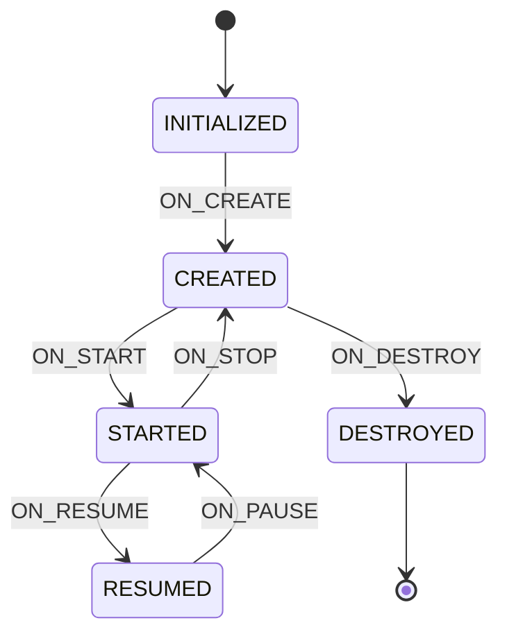

# Lifecycle 基础篇

## 技术演进：为什么需要 Lifecycle？

### 痛点一：生命周期回调变成"垃圾堆"

想象一下，你在 Activity 里接入了定位、视频播放、传感器监听等功能。每个功能都要在生命周期里启动和停止：

```kotlin
// 噩梦般的 Activity 😱
class NightmareActivity : AppCompatActivity() {
    
    override fun onStart() {
        super.onStart()
        locationManager.startUpdates()     // 定位
        videoPlayer.prepare()              // 视频
        sensorManager.registerListener()   // 传感器
        analyticsTracker.onStart()         // 埋点
        // 还有十几个...
    }
    
    override fun onStop() {
        super.onStop()
        locationManager.stopUpdates()
        videoPlayer.release()
        sensorManager.unregisterListener()
        analyticsTracker.onStop()
        // 忘了一个？内存泄漏警告！
    }
}
```

问题：
- **臃肿**：生命周期方法塞满各种逻辑，上千行代码
- **易错**：启动了忘记停止 → 内存泄漏；停止顺序错了 → 崩溃
- **难复用**：定位逻辑写死在 Activity 里，其他页面要用只能复制粘贴

### 痛点二：组件与 Activity 强耦合

```
┌─────────────────────────────────────────────────────────────────┐
│                    没有 Lifecycle 的困境                         │
├─────────────────────────────────────────────────────────────────┤
│                                                                 │
│   ┌──────────────────────────────────────────────────────┐      │
│   │                     Activity                          │      │
│   │  ┌────────────┐  ┌────────────┐  ┌────────────┐      │      │
│   │  │ LocationMgr │  │ VideoPlayer │  │ SensorMgr  │      │      │
│   │  └─────┬──────┘  └─────┬──────┘  └─────┬──────┘      │      │
│   │        │               │               │              │      │
│   │        ▼               ▼               ▼              │      │
│   │   onStart()        onStart()       onStart()          │      │
│   │   onStop()         onStop()        onStop()           │      │
│   │                                                       │      │
│   │   Activity 必须知道每个组件的启停逻辑                   │      │
│   │   组件无法脱离 Activity 独立存在                        │      │
│   └──────────────────────────────────────────────────────┘      │
│                                                                 │
└─────────────────────────────────────────────────────────────────┘
```

### Lifecycle 的诞生

Google 在 2017 年发布 Architecture Components 时，Lifecycle 是第一个推出的组件。它的设计目标：

> **让组件能够自己感知生命周期变化，不再依赖 Activity/Fragment 手动调用。**

用一个生活中的例子来理解：

- **没有 Lifecycle**：就像老板（Activity）每天要亲自通知每个员工"上班了"、"下班了"。员工越多，老板越累，还容易漏通知。
- **有 Lifecycle**：就像公司装了上下班打卡系统（Lifecycle），员工自己看着时间，自动上下班。老板只管业务，不用操心通知。

## 核心概念：用大白话说清楚

### Lifecycle 的四个核心角色

```
┌─────────────────────────────────────────────────────────────────┐
│                   Lifecycle 核心角色关系                         │
├─────────────────────────────────────────────────────────────────┤
│                                                                 │
│  ┌───────────────────┐          ┌───────────────────┐          │
│  │  LifecycleOwner   │          │ LifecycleObserver │          │
│  │   (生命周期拥有者)  │          │   (生命周期观察者)  │          │
│  │                   │          │                   │          │
│  │  • Activity       │ ──────►  │  • 定位组件        │          │
│  │  • Fragment       │  添加观察  │  • 视频播放器      │          │
│  │  • 自定义实现      │          │  • 任意需要感知    │          │
│  │                   │          │    生命周期的组件   │          │
│  └─────────┬─────────┘          └───────────────────┘          │
│            │                                                    │
│            │ 提供                                               │
│            ▼                                                    │
│  ┌───────────────────┐                                          │
│  │     Lifecycle     │                                          │
│  │  (生命周期对象)     │                                          │
│  │                   │                                          │
│  │  • 管理 State     │                                          │
│  │  • 分发 Event     │                                          │
│  │  • 注册/移除观察者 │                                          │
│  └───────────────────┘                                          │
│                                                                 │
└─────────────────────────────────────────────────────────────────┘
```

| 角色 | 作用 | 大白话解释 |
|-----|------|----------|
| **Lifecycle** | 生命周期对象，持有状态，分发事件 | 广播站本身 |
| **LifecycleOwner** | 拥有生命周期的组件（Activity/Fragment） | 广播站的所有者 |
| **LifecycleObserver** | 观察生命周期变化的组件 | 收音机，接收广播 |
| **State & Event** | 状态和事件 | 广播的内容 |

### State（状态）与 Event（事件）

这是理解 Lifecycle 的关键！很多人搞混这两个概念。

**大白话区分**：
- **State（状态）**：是一个"点"——当前处于什么状态
- **Event（事件）**：是一条"线"——从一个状态到另一个状态的过渡

```
┌─────────────────────────────────────────────────────────────────┐
│                    State 与 Event 关系图                         │
├─────────────────────────────────────────────────────────────────┤
│                                                                 │
│  State:     INITIALIZED    CREATED      STARTED      RESUMED   │
│                 ●            ●            ●            ●        │
│                 │            │            │            │        │
│                 │  ON_CREATE │  ON_START  │  ON_RESUME │        │
│                 └────────────┴────────────┴────────────┘        │
│                        Event (向上的箭头)                         │
│                                                                 │
│                 ┌────────────┬────────────┬────────────┐        │
│                 │  ON_DESTROY│  ON_STOP   │  ON_PAUSE  │        │
│                 │            │            │            │        │
│                 ●            ●            ●            ●        │
│  State:     DESTROYED    CREATED      STARTED      RESUMED     │
│                        Event (向下的箭头)                         │
│                                                                 │
└─────────────────────────────────────────────────────────────────┘
```

完整的状态流转图：



**关键理解**：

| 生命周期方法 | 触发的 Event | 变化后的 State |
|------------|-------------|---------------|
| onCreate() | ON_CREATE | CREATED |
| onStart() | ON_START | STARTED |
| onResume() | ON_RESUME | RESUMED |
| onPause() | ON_PAUSE | STARTED |
| onStop() | ON_STOP | CREATED |
| onDestroy() | ON_DESTROY | DESTROYED |

**为什么要分 State 和 Event？**

- **Event** 用于触发动作："当 Activity 启动时，开始定位"
- **State** 用于条件判断："只有当 Activity 至少是 STARTED 状态时，才更新 UI"

LiveData 就是这样工作的：它检查 LifecycleOwner 的 State，只有 `state >= STARTED` 时才分发数据。

## 基本用法：快速上手

### 1. 添加依赖

现代 Android 项目（使用 AppCompat）已经内置了 Lifecycle，通常不需要额外添加。如果需要显式依赖：

```kotlin
// build.gradle.kts (Module)
dependencies {
    // Lifecycle 核心
    implementation("androidx.lifecycle:lifecycle-runtime-ktx:2.7.0")
    
    // 如果需要使用注解方式（不推荐，但老项目可能需要）
    // kapt("androidx.lifecycle:lifecycle-compiler:2.7.0")
}
```

### 2. 实现 LifecycleObserver（推荐方式）

**方式一：DefaultLifecycleObserver（推荐 ✅）**

```kotlin
// 生命周期感知的定位管理器
class LocationTracker(private val context: Context) : DefaultLifecycleObserver {
    
    private var locationManager: LocationManager? = null
    
    override fun onStart(owner: LifecycleOwner) {
        // Activity/Fragment 进入 STARTED 状态时调用
        Log.d("LocationTracker", "开始定位")
        locationManager = context.getSystemService(Context.LOCATION_SERVICE) as LocationManager
        // 开始定位...
    }
    
    override fun onStop(owner: LifecycleOwner) {
        // Activity/Fragment 进入 CREATED 状态时调用（从 STARTED 回退）
        Log.d("LocationTracker", "停止定位")
        locationManager = null
        // 停止定位...
    }
    
    override fun onDestroy(owner: LifecycleOwner) {
        // 彻底清理资源
        Log.d("LocationTracker", "释放资源")
    }
}

// 在 Activity 中使用
class MapActivity : AppCompatActivity() {
    
    private lateinit var locationTracker: LocationTracker
    
    override fun onCreate(savedInstanceState: Bundle?) {
        super.onCreate(savedInstanceState)
        setContentView(R.layout.activity_map)
        
        locationTracker = LocationTracker(this)
        // 添加观察者，从此定位组件自己管理生命周期！
        lifecycle.addObserver(locationTracker)
    }
    // 不需要在 onStart/onStop/onDestroy 里手动调用了！
}
```

**方式二：LifecycleEventObserver（需要更细粒度控制时）**

```kotlin
class AnalyticsTracker : LifecycleEventObserver {
    
    override fun onStateChanged(source: LifecycleOwner, event: Lifecycle.Event) {
        when (event) {
            Lifecycle.Event.ON_CREATE -> trackPageCreate()
            Lifecycle.Event.ON_START -> trackPageShow()
            Lifecycle.Event.ON_RESUME -> trackPageActive()
            Lifecycle.Event.ON_PAUSE -> trackPageInactive()
            Lifecycle.Event.ON_STOP -> trackPageHide()
            Lifecycle.Event.ON_DESTROY -> trackPageDestroy()
            else -> {}
        }
    }
}
```

**方式三：@OnLifecycleEvent 注解（已废弃 ⚠️）**

```kotlin
// ❌ 不推荐：Java 8+ 后可能有兼容性问题，且已标记废弃
class OldStyleObserver : LifecycleObserver {
    
    @OnLifecycleEvent(Lifecycle.Event.ON_START)
    fun onStart() {
        // ...
    }
    
    @OnLifecycleEvent(Lifecycle.Event.ON_STOP)
    fun onStop() {
        // ...
    }
}
```

### 3. 查询当前状态

```kotlin
class SafeComponent(private val lifecycle: Lifecycle) {
    
    fun updateUI() {
        // 检查当前状态，避免在不可见时更新 UI
        if (lifecycle.currentState.isAtLeast(Lifecycle.State.STARTED)) {
            // 安全更新 UI
            doUpdateUI()
        } else {
            // 不在前台，跳过或延迟更新
            Log.d("SafeComponent", "跳过 UI 更新，当前状态: ${lifecycle.currentState}")
        }
    }
}

// 状态比较方法
val state = lifecycle.currentState

// 检查是否至少处于某状态
state.isAtLeast(Lifecycle.State.CREATED)   // >= CREATED
state.isAtLeast(Lifecycle.State.STARTED)   // >= STARTED
state.isAtLeast(Lifecycle.State.RESUMED)   // == RESUMED（最高状态）
```

### 4. 结合协程使用

Lifecycle 与 Kotlin 协程有很好的集成：

```kotlin
class DataLoader : DefaultLifecycleObserver {
    
    private var job: Job? = null
    
    override fun onStart(owner: LifecycleOwner) {
        // 使用 lifecycleScope 启动协程，自动跟随生命周期
        job = owner.lifecycleScope.launch {
            while (isActive) {
                loadData()
                delay(5000) // 每 5 秒加载一次
            }
        }
    }
    
    override fun onStop(owner: LifecycleOwner) {
        job?.cancel() // 手动取消也可以，但 lifecycleScope 会自动处理
    }
}

// 更简洁的方式：使用 repeatOnLifecycle
class ModernActivity : AppCompatActivity() {
    
    override fun onCreate(savedInstanceState: Bundle?) {
        super.onCreate(savedInstanceState)
        
        lifecycleScope.launch {
            // 只在 STARTED 状态时执行，STOPPED 时自动暂停
            repeatOnLifecycle(Lifecycle.State.STARTED) {
                viewModel.uiState.collect { state ->
                    updateUI(state)
                }
            }
        }
    }
}
```

## 实际应用场景

### 场景一：视频播放器自动暂停/恢复

```kotlin
class LifecycleAwarePlayer(
    private val exoPlayer: ExoPlayer
) : DefaultLifecycleObserver {
    
    private var playWhenReady = false
    
    override fun onStart(owner: LifecycleOwner) {
        // 页面可见，恢复播放（如果之前是播放状态）
        if (playWhenReady) {
            exoPlayer.play()
        }
    }
    
    override fun onStop(owner: LifecycleOwner) {
        // 页面不可见，暂停播放并记录状态
        playWhenReady = exoPlayer.isPlaying
        exoPlayer.pause()
    }
    
    override fun onDestroy(owner: LifecycleOwner) {
        exoPlayer.release()
    }
}

// 使用
class VideoActivity : AppCompatActivity() {
    
    private val player by lazy { ExoPlayer.Builder(this).build() }
    
    override fun onCreate(savedInstanceState: Bundle?) {
        super.onCreate(savedInstanceState)
        
        val lifecyclePlayer = LifecycleAwarePlayer(player)
        lifecycle.addObserver(lifecyclePlayer)
        
        // 配置播放器...
    }
}
```

### 场景二：WebSocket 连接管理

```kotlin
class WebSocketManager(
    private val url: String
) : DefaultLifecycleObserver {
    
    private var webSocket: WebSocket? = null
    private val client = OkHttpClient()
    
    override fun onStart(owner: LifecycleOwner) {
        // 建立连接
        val request = Request.Builder().url(url).build()
        webSocket = client.newWebSocket(request, MyWebSocketListener())
    }
    
    override fun onStop(owner: LifecycleOwner) {
        // 断开连接，节省资源
        webSocket?.close(1000, "Activity stopped")
        webSocket = null
    }
    
    fun sendMessage(message: String) {
        webSocket?.send(message)
    }
}
```

### 场景三：传感器监听

```kotlin
class StepCounter(
    private val context: Context
) : DefaultLifecycleObserver, SensorEventListener {
    
    private val sensorManager = context.getSystemService<SensorManager>()
    private val stepSensor = sensorManager?.getDefaultSensor(Sensor.TYPE_STEP_COUNTER)
    
    var steps = 0
        private set
    
    override fun onResume(owner: LifecycleOwner) {
        // 只在页面完全可见时监听
        stepSensor?.let {
            sensorManager?.registerListener(this, it, SensorManager.SENSOR_DELAY_UI)
        }
    }
    
    override fun onPause(owner: LifecycleOwner) {
        sensorManager?.unregisterListener(this)
    }
    
    override fun onSensorChanged(event: SensorEvent) {
        steps = event.values[0].toInt()
    }
    
    override fun onAccuracyChanged(sensor: Sensor?, accuracy: Int) {}
}
```

## 常见问题与陷阱

### 1. Observer 注册时机问题

```kotlin
class MyActivity : AppCompatActivity() {
    
    override fun onCreate(savedInstanceState: Bundle?) {
        super.onCreate(savedInstanceState)
        
        // ✅ 正确：在 super.onCreate() 之后添加
        lifecycle.addObserver(MyObserver())
    }
    
    // ❌ 错误：在构造函数或 init 块中添加
    // init {
    //     lifecycle.addObserver(MyObserver()) // 可能崩溃！
    // }
}
```

### 2. 观察者收到的第一个事件

新添加的观察者会立即收到当前状态对应的事件，让它"追上"当前生命周期：

```kotlin
class MyObserver : DefaultLifecycleObserver {
    override fun onCreate(owner: LifecycleOwner) {
        Log.d("TAG", "onCreate")
    }
    override fun onStart(owner: LifecycleOwner) {
        Log.d("TAG", "onStart")
    }
}

class MyActivity : AppCompatActivity() {
    override fun onResume() {
        super.onResume()
        // 此时 Activity 已经是 RESUMED 状态
        lifecycle.addObserver(MyObserver())
        // 输出：onCreate -> onStart
        // 观察者会依次收到 ON_CREATE 和 ON_START 事件
    }
}
```

### 3. Fragment 的特殊情况

Fragment 有两个生命周期：Fragment 自身的和 View 的！

```kotlin
class MyFragment : Fragment() {
    
    override fun onViewCreated(view: View, savedInstanceState: Bundle?) {
        super.onViewCreated(view, savedInstanceState)
        
        // ✅ 使用 viewLifecycleOwner 监听 View 的生命周期
        viewLifecycleOwner.lifecycle.addObserver(ViewObserver())
        
        // ⚠️ 使用 this 监听 Fragment 的生命周期
        // Fragment 在返回栈中时，View 销毁但 Fragment 还活着
        lifecycle.addObserver(FragmentObserver())
    }
}
```

### 4. 不要手动调用生命周期方法

```kotlin
// ❌ 绝对不要这样做！
class BadActivity : AppCompatActivity() {
    override fun onStart() {
        super.onStart()
        // 试图在 onStart 里触发 onResume 的逻辑
        // 会导致状态不一致！
        onResume()
    }
}
```

### 5. 内存泄漏防范

```kotlin
// ❌ 可能泄漏：匿名内部类持有外部引用
class LeakyActivity : AppCompatActivity() {
    override fun onCreate(savedInstanceState: Bundle?) {
        super.onCreate(savedInstanceState)
        
        lifecycle.addObserver(object : DefaultLifecycleObserver {
            override fun onStart(owner: LifecycleOwner) {
                // 这个匿名类持有 LeakyActivity 的引用
                // 如果 Observer 没被正确移除，Activity 无法回收
            }
        })
    }
}

// ✅ 安全：使用独立类或在 onDestroy 中移除
class SafeActivity : AppCompatActivity() {
    private val observer = MyIndependentObserver()
    
    override fun onCreate(savedInstanceState: Bundle?) {
        super.onCreate(savedInstanceState)
        lifecycle.addObserver(observer)
    }
    
    // 其实 Lifecycle 会自动在 DESTROYED 时移除观察者
    // 但如果你的观察者持有其他资源，显式移除更安全
}
```

## 面试检验

### 基础概念题

**Q1：Lifecycle 是什么？解决了什么问题？**

> **答案**：Lifecycle 是 Jetpack 架构组件的基础，它让组件能够**自动感知** Activity/Fragment 的生命周期变化。主要解决了：
> 1. **生命周期回调臃肿**：各组件自己管理启停，不用塞在 Activity 里
> 2. **易出错**：忘记释放资源导致内存泄漏
> 3. **难复用**：生命周期相关逻辑可以封装成独立组件
> 
> 核心思想是**观察者模式**：Activity 是 LifecycleOwner（被观察者），组件是 LifecycleObserver（观察者）。

**Q2：Lifecycle 中 State 和 Event 有什么区别？**

> **答案**：
> - **State（状态）**：表示当前处于哪个生命周期阶段，是一个"点"。有 5 个值：INITIALIZED、CREATED、STARTED、RESUMED、DESTROYED
> - **Event（事件）**：表示从一个状态转换到另一个状态的过程，是一条"线"。有 7 个值：ON_CREATE、ON_START、ON_RESUME、ON_PAUSE、ON_STOP、ON_DESTROY、ON_ANY
> 
> **联系**：Event 触发 State 变化。比如 ON_START 事件触发后，State 变为 STARTED。

**Q3：LifecycleObserver 有哪几种实现方式？推荐用哪种？**

> **答案**：三种方式：
> 1. **DefaultLifecycleObserver**（推荐 ✅）：接口有默认方法，按需覆写
> 2. **LifecycleEventObserver**：所有事件都通过 onStateChanged 回调，适合需要统一处理的场景
> 3. **@OnLifecycleEvent 注解**（已废弃 ❌）：需要注解处理器，有兼容性问题
> 
> 推荐使用 DefaultLifecycleObserver，代码清晰，类型安全。

**Q4：Lifecycle 能用在自定义 View 中吗？**

> **答案**：可以，但需要手动关联。自定义 View 可以实现 LifecycleObserver，然后在 Activity/Fragment 中将 View 注册为观察者：
> ```kotlin
> class MyCustomView : View, DefaultLifecycleObserver {
>     // ...
> }
> // 在 Activity 中
> lifecycle.addObserver(myCustomView)
> ```
> 也可以通过 `View.findViewTreeLifecycleOwner()` 获取关联的 LifecycleOwner。

**Q5：为什么添加 Observer 后会立即收到事件？**

> **答案**：这是 Lifecycle 的设计特性，叫做"状态同步"。新添加的观察者会依次收到从 INITIALIZED 到当前状态的所有事件，确保它"追上"当前的生命周期状态。比如在 RESUMED 状态添加观察者，它会依次收到 ON_CREATE → ON_START → ON_RESUME。这样设计是为了保证观察者的初始化逻辑能正确执行。

---

_下一篇：[2-进阶篇](./2-进阶篇.md) - 高级特性、ProcessLifecycleOwner、实战技巧_
