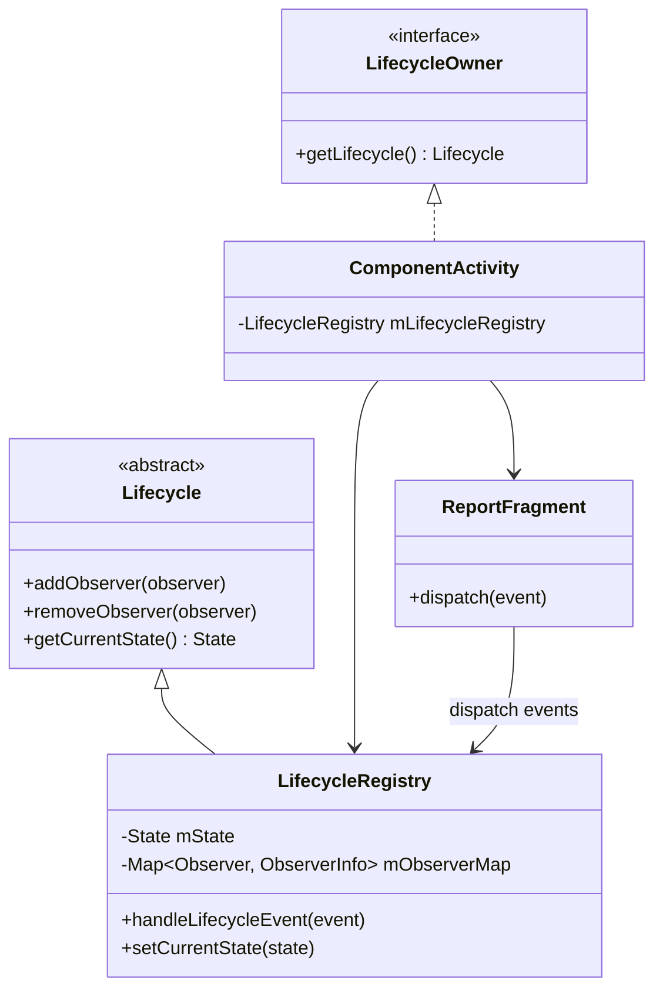
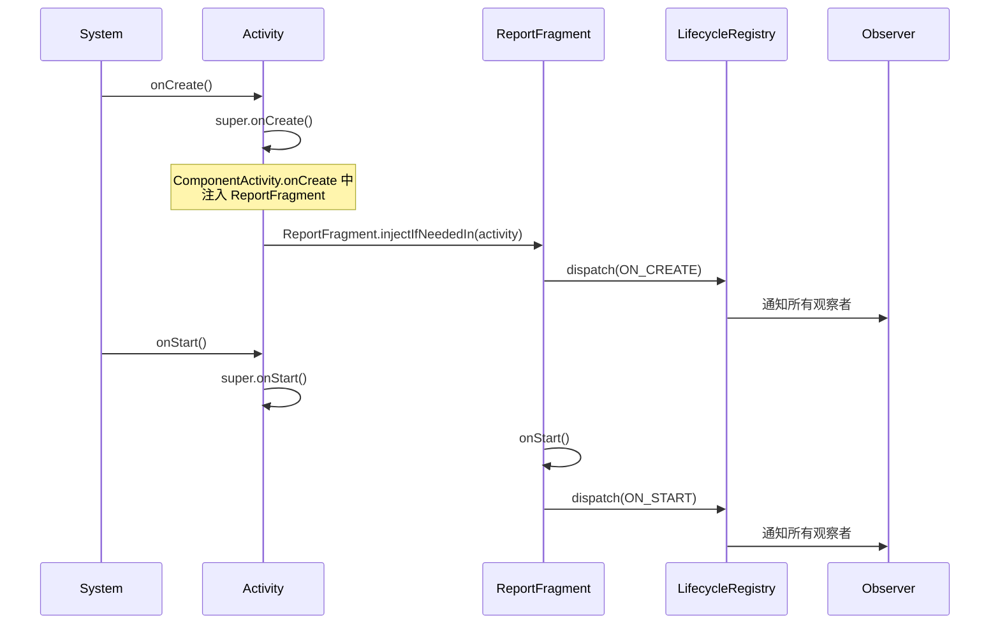
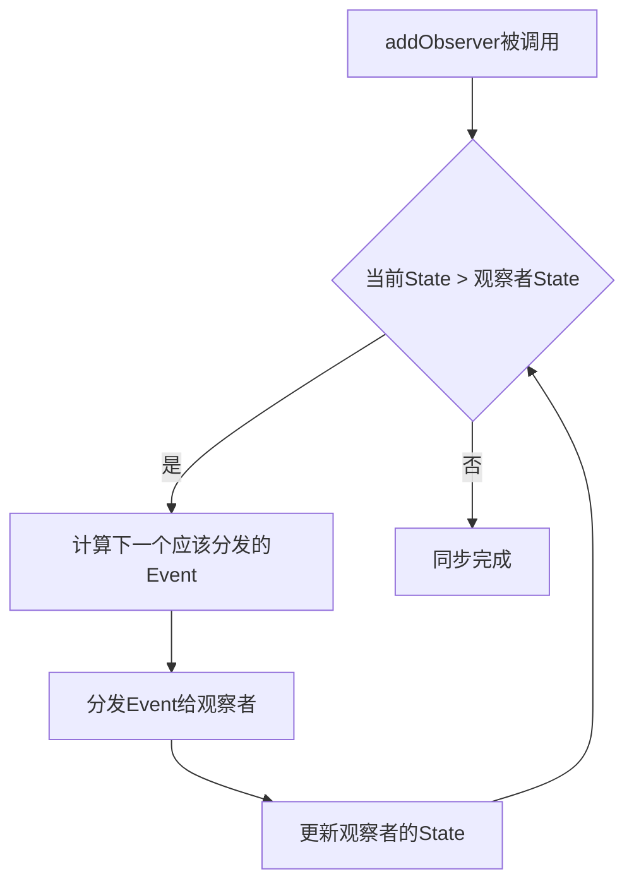
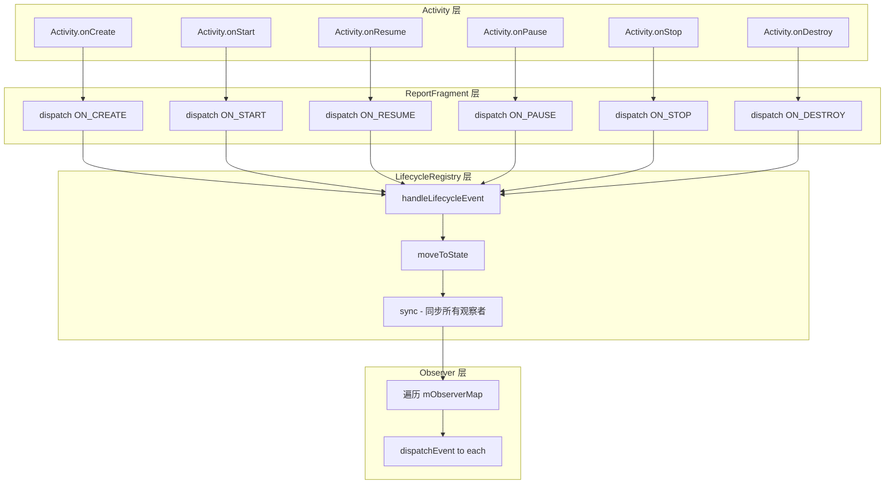
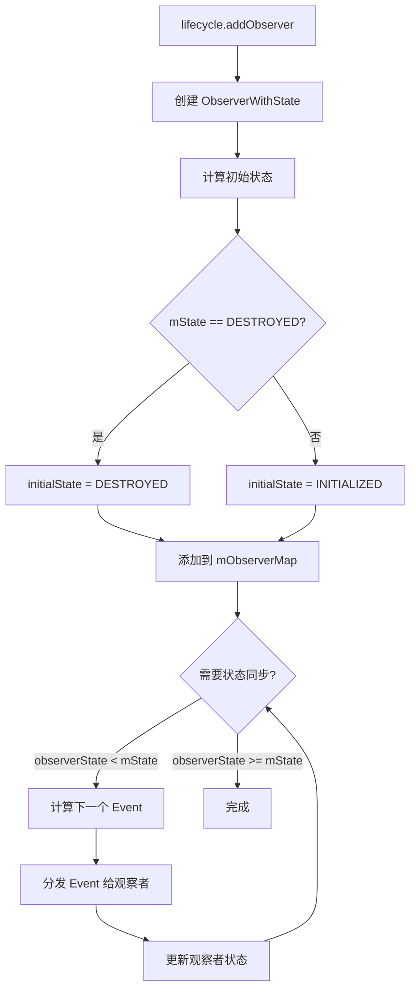

# Lifecycle 源码篇

## 设计哲学

### 为什么选择观察者模式？

Lifecycle 的核心设计是**观察者模式**，这不是偶然选择：

| 设计考量 | 观察者模式的优势 |
|---------|----------------|
| 解耦 | 被观察者（Activity）不需要知道观察者（组件）的具体实现 |
| 扩展性 | 随时添加新的观察者，不修改已有代码 |
| 复用性 | 同一个观察者可以注册到多个生命周期 |
| 单向依赖 | 观察者依赖 Lifecycle，Lifecycle 不依赖观察者 |

**大白话理解**：
就像微信公众号（Activity）发文章，关注者（LifecycleObserver）自动收到推送。公众号不需要记住每个人的电话一个个打过去，关注者也不用天天去刷新看有没有新文章。

### 为什么使用状态机？

Lifecycle 内部是一个**有限状态机（FSM）**：

```
┌─────────────────────────────────────────────────────────────────┐
│                    Lifecycle 状态机设计                          │
├─────────────────────────────────────────────────────────────────┤
│                                                                 │
│  ┌──────────────┐                    ┌──────────────┐           │
│  │ INITIALIZED  │─── ON_CREATE ────►│   CREATED    │           │
│  │   (初始态)   │                    │   (已创建)   │           │
│  └──────────────┘                    └──────┬───────┘           │
│                                             │                   │
│                                      ON_START                   │
│                                             │                   │
│                                             ▼                   │
│                                      ┌──────────────┐           │
│  ┌──────────────┐                    │   STARTED    │           │
│  │  DESTROYED   │◄── ON_DESTROY ────│   (已开始)   │           │
│  │   (已销毁)   │                    └──────┬───────┘           │
│  └──────────────┘                           │                   │
│        ▲                              ON_RESUME                 │
│        │                                    │                   │
│   ON_DESTROY                                ▼                   │
│        │                             ┌──────────────┐           │
│        └─────────────────────────────│   RESUMED    │           │
│                                      │   (已恢复)   │           │
│                                      └──────────────┘           │
│                                                                 │
│  为什么用状态机？                                                 │
│  1. 状态转换规则明确：不能从 INITIALIZED 直接跳到 RESUMED         │
│  2. 可预测性：给定当前状态和事件，下一状态确定                     │
│  3. 便于同步：新观察者可以根据当前状态"追赶"事件                   │
│                                                                 │
└─────────────────────────────────────────────────────────────────┘
```

**状态机带来的好处**：

1. **顺序保证**：不可能出现 onStop 在 onStart 之前调用的情况
2. **状态同步**：新添加的观察者可以根据当前状态补发事件
3. **简化判断**：`state.isAtLeast(STARTED)` 比记录多个 boolean 标志优雅得多

## 核心流程

### 整体架构



### 事件分发流程

**核心问题**：Activity 的生命周期事件是如何传递给 LifecycleRegistry 的？



**为什么使用 ReportFragment？**

这是一个无界面的 Fragment，专门用来接收生命周期回调：

1. **兼容性**：早期 Activity 没有直接提供生命周期回调点
2. **解耦**：生命周期感知逻辑不需要写在 Activity 里
3. **统一**：无论 Activity 是否继承 AppCompatActivity，都能工作

### 状态同步机制

当新观察者添加时，如何让它"追上"当前状态？



**关键源码逻辑**（简化版）：

```kotlin
// LifecycleRegistry 核心逻辑
fun addObserver(observer: LifecycleObserver) {
    // 1. 计算初始状态
    val initialState = if (mState == DESTROYED) DESTROYED else INITIALIZED
    
    // 2. 包装观察者
    val observerInfo = ObserverWithState(observer, initialState)
    mObserverMap.put(observer, observerInfo)
    
    // 3. 状态同步：将观察者状态追赶到当前状态
    while (observerInfo.state < mState) {
        val event = getUpEvent(observerInfo.state)
        observerInfo.dispatchEvent(owner, event)
    }
}

// 获取向上转换的事件
private fun getUpEvent(state: State): Event = when (state) {
    INITIALIZED -> ON_CREATE
    CREATED -> ON_START
    STARTED -> ON_RESUME
    else -> throw IllegalArgumentException()
}
```

### 事件分发的顺序保证

Lifecycle 保证事件分发的顺序性，这是如何实现的？

```
┌─────────────────────────────────────────────────────────────────┐
│                    事件分发顺序保证                               │
├─────────────────────────────────────────────────────────────────┤
│                                                                 │
│  场景：有 3 个观察者 A、B、C（按添加顺序）                         │
│                                                                 │
│  正向事件（ON_START）：                                          │
│  ┌───┐    ┌───┐    ┌───┐                                        │
│  │ A │ -> │ B │ -> │ C │    先添加的先收到                       │
│  └───┘    └───┘    └───┘                                        │
│                                                                 │
│  逆向事件（ON_STOP）：                                           │
│  ┌───┐    ┌───┐    ┌───┐                                        │
│  │ C │ -> │ B │ -> │ A │    后添加的先收到（LIFO）               │
│  └───┘    └───┘    └───┘                                        │
│                                                                 │
│  为什么这样设计？                                                 │
│  → 符合资源管理的嵌套语义                                        │
│  → A 在 onStart 初始化资源，在 onStop 释放                       │
│  → B 可能依赖 A 的资源                                           │
│  → 所以 onStop 时 B 先释放（因为它依赖 A）                        │
│                                                                 │
└─────────────────────────────────────────────────────────────────┘
```

**实现方式**：使用 `SafeIterableMap`，一个支持边遍历边修改的有序 Map。

## 源码洞察

### 亮点一：SafeIterableMap 的设计

Lifecycle 需要在遍历观察者列表时，安全地支持添加/删除操作：

```kotlin
// 问题场景
for (observer in observers) {
    observer.onStart()  // 这里面可能会添加新观察者或移除自己！
}

// 普通 Map/List 会抛 ConcurrentModificationException
// SafeIterableMap 解决了这个问题
```

**SafeIterableMap 的核心思想**：

- 使用链表结构，保持插入顺序
- 每个迭代器记录自己的位置
- 删除节点时，更新所有活跃迭代器的指针
- 不使用 fail-fast，而是 fail-safe

### 亮点二：重入保护

```kotlin
// 场景：在 onStart 回调中触发了状态变化
observer.onStart() {
    // 这里面调用了某个方法，间接导致 handleLifecycleEvent(ON_STOP)
    someMethod()  // → handleLifecycleEvent(ON_STOP)
}

// 问题：当前正在分发 ON_START，又要分发 ON_STOP，会混乱
```

**解决方案**：使用标志位 + 延迟处理

```kotlin
class LifecycleRegistry {
    private var mHandlingEvent = false
    private var mNewEventOccurred = false
    
    fun handleLifecycleEvent(event: Event) {
        if (mHandlingEvent) {
            // 正在处理中，标记有新事件
            mNewEventOccurred = true
            return
        }
        
        mHandlingEvent = true
        sync()  // 分发事件
        mHandlingEvent = false
        
        // 处理完后，检查是否有积压的事件
        if (mNewEventOccurred) {
            mNewEventOccurred = false
            sync()  // 再次同步
        }
    }
}
```

### 亮点三：State.isAtLeast 的巧妙实现

```kotlin
enum class State {
    DESTROYED,
    INITIALIZED, 
    CREATED,
    STARTED,
    RESUMED;
    
    fun isAtLeast(state: State): Boolean {
        return compareTo(state) >= 0  // 利用枚举的自然顺序
    }
}

// 使用时非常直观
if (lifecycle.currentState.isAtLeast(State.STARTED)) {
    // 至少是 STARTED 状态
}
```

**设计亮点**：
- 枚举按声明顺序排列，正好对应状态的"活跃程度"
- DESTROYED 最低，RESUMED 最高
- 一行代码实现状态比较，无需 switch/when

### 亮点四：观察者适配器模式

Lifecycle 支持多种 Observer 实现方式，通过适配器统一处理：

```kotlin
// 内部会根据 Observer 类型创建不同的适配器
when (observer) {
    is LifecycleEventObserver -> {
        // 直接调用 onStateChanged
    }
    is DefaultLifecycleObserver -> {
        // 转换为对应的生命周期方法调用
        FullLifecycleObserverAdapter(observer)
    }
    // 旧的注解方式
    else -> {
        // 通过反射找到 @OnLifecycleEvent 注解的方法
        ReflectiveGenericLifecycleObserver(observer)
    }
}
```

## 核心流程图

### 完整的生命周期事件流



### addObserver 完整流程



## 延伸思考

### 如果让你设计 Lifecycle，你会怎么做？

**现有设计的权衡**：

| 设计选择 | 优点 | 可能的替代方案 |
|---------|------|--------------|
| 使用 Fragment 注入 | 兼容老版本 Activity | 直接在 Activity 基类添加回调 |
| 状态机模型 | 简单可预测 | 事件队列模型 |
| 同步分发 | 保证顺序 | 异步分发（更高性能但顺序难保证） |
| 单 LifecycleOwner | 简单清晰 | 多 Owner 组合（更灵活但复杂） |

**值得思考的改进点**：

1. **异步支持**：当前 Lifecycle 是同步分发，大量观察者可能影响主线程
2. **优先级**：所有观察者平等，某些关键组件可能需要优先通知
3. **条件订阅**：只关心特定状态变化，而非所有事件

### Lifecycle 与 Compose 的融合

Compose 有自己的组合生命周期，但仍然需要与传统 Lifecycle 交互：

```kotlin
@Composable
fun LifecycleAwareComponent() {
    // Compose 的"生命周期"
    DisposableEffect(Unit) {
        // onCompose
        onDispose {
            // onDispose
        }
    }
    
    // 与传统 Lifecycle 桥接
    val lifecycleOwner = LocalLifecycleOwner.current
    DisposableEffect(lifecycleOwner) {
        val observer = LifecycleEventObserver { _, event -> 
            // 处理事件
        }
        lifecycleOwner.lifecycle.addObserver(observer)
        onDispose {
            lifecycleOwner.lifecycle.removeObserver(observer)
        }
    }
}
```

**未来趋势**：Lifecycle 可能会逐渐被 Compose 的 Effect API 取代，但在混合开发和底层架构中仍不可或缺。

## 面试检验

### 源码深度题

**Q1：Lifecycle 的状态是如何分发给观察者的？请描述完整流程。**

> **答案**：
> 1. Activity 生命周期变化时，`ReportFragment` 收到系统回调
> 2. ReportFragment 调用 `LifecycleRegistry.handleLifecycleEvent(event)`
> 3. LifecycleRegistry 根据 event 计算新的 State
> 4. 调用 `sync()` 方法同步所有观察者
> 5. 遍历 `mObserverMap`，对每个观察者：
>    - 比较观察者状态和目标状态
>    - 逐步分发 event 直到状态一致
> 6. 正向事件按添加顺序分发，逆向事件按逆序分发

**Q2：为什么新添加的观察者能收到之前的生命周期事件？**

> **答案**：这是"状态同步"机制。当 `addObserver` 被调用时：
> 1. 新观察者的初始状态是 INITIALIZED
> 2. LifecycleRegistry 会比较观察者状态和当前状态
> 3. 如果观察者状态 < 当前状态，就计算下一个 Event 并分发
> 4. 循环直到观察者状态追上当前状态
> 
> 比如当前是 RESUMED，新观察者会依次收到 ON_CREATE → ON_START → ON_RESUME。

**Q3：Lifecycle 是如何保证事件分发顺序的？为什么逆向事件要逆序分发？**

> **答案**：
> **保证方式**：使用 `SafeIterableMap` 保存观察者，它是一个有序的链表结构。正向事件正序遍历，逆向事件逆序遍历。
> 
> **逆序分发的原因**：符合资源管理的嵌套语义。假设 A 先添加，B 后添加：
> - onStart 时：A 先初始化，B 后初始化（B 可能依赖 A）
> - onStop 时：B 先释放，A 后释放（因为 B 依赖 A，要先释放依赖方）
> 
> 就像穿衣服和脱衣服：先穿内衣后穿外套，脱的时候先脱外套再脱内衣。

**Q4：LifecycleRegistry 如何处理分发过程中的重入问题？**

> **答案**：使用两个标志位：
> - `mHandlingEvent`：标记当前是否正在分发事件
> - `mNewEventOccurred`：标记在分发过程中是否有新事件发生
> 
> 流程：
> 1. 开始分发时设置 `mHandlingEvent = true`
> 2. 如果分发过程中收到新事件，设置 `mNewEventOccurred = true` 并返回（不立即处理）
> 3. 当前分发完成后，检查 `mNewEventOccurred`
> 4. 如果有新事件，重置标志并再次执行 sync
> 
> 这样避免了递归调用导致的栈溢出和状态不一致。

**Q5：为什么使用 ReportFragment 而不是直接在 Activity 里分发事件？**

> **答案**：
> 1. **历史兼容**：早期的 Activity 基类没有提供合适的生命周期回调点
> 2. **解耦**：Lifecycle 库不需要修改 Activity 源码
> 3. **统一入口**：无论用户继承哪个 Activity 基类，都能工作
> 4. **精确时机**：Fragment 的生命周期回调发生在 Activity 回调之后，确保 Activity 自身初始化完成
> 
> 现在 ComponentActivity 直接在自己的生命周期方法里分发事件，ReportFragment 主要用于兼容老版本。

---

_本文档完成。返回 [README](./README.md) 查看学习路线。_
