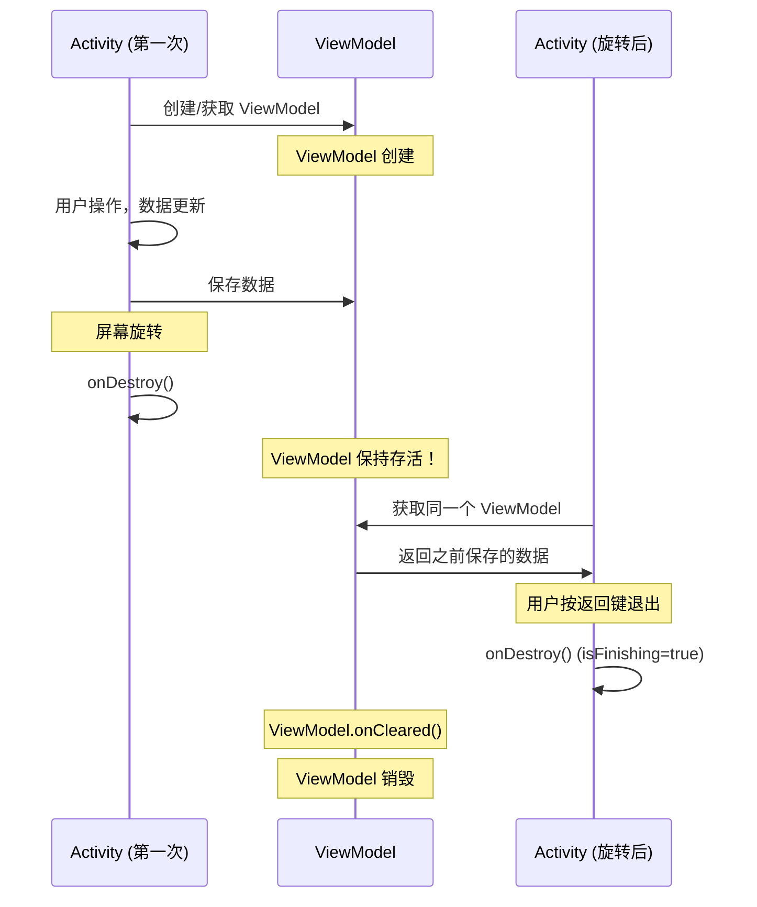

# ViewModel 基础篇

## 技术演进：为什么需要 ViewModel？

### 痛点：配置变更导致数据丢失

想象一下这个场景：用户正在填写一个很长的表单，填了半天，突然旋转了一下手机……表单数据全没了！用户内心：💢

这不是 bug，而是 Android 的"特性"：

```
┌─────────────────────────────────────────────────────────────────┐
│                     没有 ViewModel 的悲剧                        │
├─────────────────────────────────────────────────────────────────┤
│                                                                 │
│  Activity (竖屏)           屏幕旋转          Activity (横屏)     │
│  ┌─────────────┐                            ┌─────────────┐     │
│  │ userData    │   ────────────────────►    │ userData    │     │
│  │ = "张三"    │        onDestroy()         │ = null ❌   │     │
│  │             │        onCreate()          │             │     │
│  └─────────────┘                            └─────────────┘     │
│                                                                 │
│  数据随 Activity 销毁而丢失！用户心态崩了...                      │
└─────────────────────────────────────────────────────────────────┘
```

**为什么会这样？**

- Android 在配置变更（屏幕旋转、语言切换、深色模式等）时，会**销毁并重建** Activity
- Activity 里的成员变量自然就没了

### 传统解决方案的问题

在 ViewModel 出现之前，开发者们想了各种办法：


| 方案                        | 问题                          |
| ------------------------- | --------------------------- |
| `onSaveInstanceState()`   | 只能保存少量数据（<1MB），需要序列化，不适合大对象 |
| `setRetainInstance(true)` | 仅 Fragment 可用，API 已废弃       |
| 静态变量                      | 内存泄漏风险，生命周期难以管理             |
| 持久化存储                     | 性能开销大，杀鸡用牛刀                 |


### ViewModel 的诞生

Google 在 2017 年推出了 Architecture Components，ViewModel 就是其中的核心成员。它的设计目标很简单：

> **让 UI 数据在配置变更时存活下来，同时与 Activity/Fragment 的生命周期解耦。**

## 核心概念：用大白话说清楚

### 什么是 ViewModel？

**一句话定义**：ViewModel 是一个**生命周期感知**的数据容器，专门用来存放 UI 相关的数据。

**大白话理解**：

把 ViewModel 想象成一个"保险箱"🔐：

- Activity 就像你家的房子
- 房子拆了（配置变更），保险箱还在
- 新房子建好后，直接从保险箱取出东西
- 只有当你真正搬走（finish()）时，保险箱才会被清空

```
┌─────────────────────────────────────────────────────────────────┐
│                     使用 ViewModel 的情况                        │
├─────────────────────────────────────────────────────────────────┤
│                                                                 │
│                     ┌─────────────────┐                         │
│                     │    ViewModel    │                         │
│                     │  userData="张三" │  ◄── 保险箱             │
│                     └────────┬────────┘                         │
│                              │                                  │
│         ┌────────────────────┼────────────────────┐             │
│         │                    │                    │             │
│         ▼                    │                    ▼             │
│  Activity (竖屏)           屏幕旋转          Activity (横屏)     │
│  ┌─────────────┐                            ┌─────────────┐     │
│  │ 引用        │   ────────────────────►    │ 引用        │     │
│  │ ViewModel   │        Activity 重建       │ 同一个      │     │
│  │             │        ViewModel 保留      │ ViewModel   │     │
│  └─────────────┘                            └─────────────┘     │
│                                                                 │
│  数据安全保留！用户继续填表 ✅                                    │
└─────────────────────────────────────────────────────────────────┘
```

### ViewModel 的生命周期

这是理解 ViewModel 的关键！




**关键时间点**：


| 事件                        | ViewModel 状态                       |
| ------------------------- | ---------------------------------- |
| Activity 首次创建             | ViewModel 创建（如果不存在）                |
| 配置变更（旋转等）                 | ViewModel **保持存活**                 |
| Activity 正常销毁（finish/返回键） | `onCleared()` 调用，ViewModel 销毁      |
| 进程被杀死                     | ViewModel 销毁（需配合 SavedStateHandle） |


**大白话记忆**：

- 房子拆了重建（配置变更）→ 保险箱还在
- 主人搬走了（finish）→ 保险箱清空

## 基本用法：快速上手

### 1. 添加依赖

```kotlin
// build.gradle.kts (Module)
dependencies {
    // ViewModel 核心
    implementation("androidx.lifecycle:lifecycle-viewmodel-ktx:2.7.0")
    
    // Activity KTX (提供 by viewModels() 委托)
    implementation("androidx.activity:activity-ktx:1.8.2")
    
    // Fragment KTX (提供 by viewModels(), by activityViewModels())
    implementation("androidx.fragment:fragment-ktx:1.6.2")
    
    // LiveData（可选，但常用）
    implementation("androidx.lifecycle:lifecycle-livedata-ktx:2.7.0")
}
```

### 2. 定义 ViewModel

```kotlin
class UserViewModel : ViewModel() {
    
    // 私有可变数据
    private val _userName = MutableLiveData<String>()
    // 对外暴露不可变数据
    val userName: LiveData<String> = _userName
    
    private val _loading = MutableLiveData<Boolean>()
    val loading: LiveData<Boolean> = _loading
    
    // 更新用户名
    fun updateUserName(name: String) {
        _userName.value = name
    }
    
    // 模拟加载用户数据
    fun loadUser() {
        viewModelScope.launch {
            _loading.value = true
            delay(1000)  // 模拟网络请求
            _userName.value = "张三"
            _loading.value = false
        }
    }
    
    // ViewModel 被清理时调用，用于释放资源
    override fun onCleared() {
        super.onCleared()
        Log.d("UserViewModel", "ViewModel is being cleared")
        // 清理资源：取消网络请求、关闭数据库连接等
    }
}
```

### 3. 在 Activity 中使用

```kotlin
class UserActivity : AppCompatActivity() {
    
    // 使用 by viewModels() 委托，懒加载创建 ViewModel
    private val viewModel: UserViewModel by viewModels()
    
    override fun onCreate(savedInstanceState: Bundle?) {
        super.onCreate(savedInstanceState)
        setContentView(R.layout.activity_user)
        
        // 观察数据变化，自动更新 UI
        viewModel.userName.observe(this) { name ->
            binding.textUserName.text = name
        }
        
        viewModel.loading.observe(this) { isLoading ->
            binding.progressBar.isVisible = isLoading
        }
        
        // 触发数据加载
        viewModel.loadUser()
    }
}
```

### 4. 在 Fragment 中使用

```kotlin
class ProfileFragment : Fragment() {
    
    // Fragment 自己的 ViewModel
    private val viewModel: ProfileViewModel by viewModels()
    
    // 与 Activity 共享的 ViewModel
    private val sharedViewModel: SharedViewModel by activityViewModels()
    
    override fun onViewCreated(view: View, savedInstanceState: Bundle?) {
        super.onViewCreated(view, savedInstanceState)
        
        // ⚠️ 重要：在 Fragment 中必须使用 viewLifecycleOwner
        viewModel.profile.observe(viewLifecycleOwner) { profile ->
            binding.textName.text = profile.name
        }
        
        sharedViewModel.selectedItem.observe(viewLifecycleOwner) { item ->
            // 处理共享数据
        }
    }
}
```

### 5. 带构造参数的 ViewModel

很多时候 ViewModel 需要依赖，比如 Repository、初始化参数等：

```kotlin
// 1. 定义带参数的 ViewModel
class ProductViewModel(
    private val productId: String,
    private val repository: ProductRepository
) : ViewModel() {
    
    private val _product = MutableLiveData<Product>()
    val product: LiveData<Product> = _product
    
    init {
        loadProduct()
    }
    
    private fun loadProduct() {
        viewModelScope.launch {
            _product.value = repository.getProduct(productId)
        }
    }
}

// 2. 创建 ViewModelProvider.Factory
class ProductViewModelFactory(
    private val productId: String,
    private val repository: ProductRepository
) : ViewModelProvider.Factory {
    
    override fun <T : ViewModel> create(modelClass: Class<T>): T {
        if (modelClass.isAssignableFrom(ProductViewModel::class.java)) {
            @Suppress("UNCHECKED_CAST")
            return ProductViewModel(productId, repository) as T
        }
        throw IllegalArgumentException("Unknown ViewModel class")
    }
}

// 3. 使用
class ProductActivity : AppCompatActivity() {
    
    private val viewModel: ProductViewModel by viewModels {
        ProductViewModelFactory(
            productId = intent.getStringExtra("product_id") ?: "",
            repository = ProductRepository()
        )
    }
}
```

## ViewModel 作用域

不同的获取方式，决定了 ViewModel 的共享范围：

```
┌─────────────────────────────────────────────────────────────────────────────┐
│                       ViewModel 作用域示意图                                 │
├─────────────────────────────────────────────────────────────────────────────┤
│                                                                             │
│  ┌─────────────────────────────────────────────────────────────────────┐    │
│  │                         Activity 作用域                              │    │
│  │  ┌─────────────────┐                                                │    │
│  │  │ SharedViewModel │  ◄──── by activityViewModels()                │    │
│  │  └─────────────────┘                                                │    │
│  │           │                                                         │    │
│  │           │ 共享                                                    │    │
│  │           │                                                         │    │
│  │  ┌────────┴─────────────────────────────────────┐                   │    │
│  │  │                                              │                   │    │
│  │  ▼                                              ▼                   │    │
│  │  ┌─────────────────────────┐  ┌─────────────────────────┐          │    │
│  │  │    Fragment A 作用域    │  │    Fragment B 作用域    │          │    │
│  │  │  ┌───────────────────┐  │  │  ┌───────────────────┐  │          │    │
│  │  │  │ FragmentAViewModel│  │  │  │ FragmentBViewModel│  │          │    │
│  │  │  └───────────────────┘  │  │  └───────────────────┘  │          │    │
│  │  │   ▲                     │  │   ▲                     │          │    │
│  │  │   │ by viewModels()    │  │   │ by viewModels()    │          │    │
│  │  └───┼─────────────────────┘  └───┼─────────────────────┘          │    │
│  │      │ 独立                       │ 独立                           │    │
│  └──────┴────────────────────────────┴────────────────────────────────┘    │
│                                                                             │
└─────────────────────────────────────────────────────────────────────────────┘
```


| 获取方式                                         | 作用域                  | 使用场景            |
| -------------------------------------------- | -------------------- | --------------- |
| `by viewModels()`                            | 当前 Activity/Fragment | 独享数据            |
| `by activityViewModels()`                    | 所属 Activity          | Fragment 之间共享数据 |
| `by viewModels({ requireParentFragment() })` | 父 Fragment           | 子 Fragment 与父共享 |
| `by navGraphViewModels(R.id.nav_graph)`      | 导航图                  | 导航流程内共享         |


## 常见问题与陷阱

### 1. Fragment 中观察 LiveData 的正确姿势

```kotlin
class MyFragment : Fragment() {
    
    private val viewModel: MyViewModel by viewModels()
    
    override fun onViewCreated(view: View, savedInstanceState: Bundle?) {
        super.onViewCreated(view, savedInstanceState)
        
        // ✅ 正确：使用 viewLifecycleOwner
        viewModel.data.observe(viewLifecycleOwner) { data ->
            // 更新 UI
        }
        
        // ❌ 错误：使用 this
        // Fragment 在返回栈中保留时，视图销毁但 Fragment 存活
        // 会导致重复订阅！
        // viewModel.data.observe(this) { data -> }
    }
}
```

**为什么？**

- Fragment 的生命周期 ≠ Fragment 视图的生命周期
- Fragment 可能在返回栈中保留（视图销毁，Fragment 存活）
- 使用 `viewLifecycleOwner` 确保视图销毁时自动取消订阅

### 2. ViewModel 创建时机

```kotlin
// ❌ 错误：在 onCreate 之前访问
class BadActivity : AppCompatActivity() {
    private val viewModel: MyViewModel by viewModels()
    
    // 这里会崩溃！Activity 还没关联 ViewModelStore
    private val data = viewModel.getData()
}

// ✅ 正确：在 onCreate 或之后访问
class GoodActivity : AppCompatActivity() {
    private val viewModel: MyViewModel by viewModels()
    
    override fun onCreate(savedInstanceState: Bundle?) {
        super.onCreate(savedInstanceState)
        // by viewModels() 是懒加载的，这里首次访问才真正创建
        viewModel.loadData()
    }
}
```

### 3. ViewModel 中不要持有 View 或 Activity 引用

```kotlin
// ❌ 大错特错！内存泄漏 + 空指针
class BadViewModel : ViewModel() {
    lateinit var textView: TextView  // 绝对不要这样！
    lateinit var activity: Activity  // 这也不行！
}

// ✅ 如果需要 Context，使用 AndroidViewModel
class GoodViewModel(application: Application) : AndroidViewModel(application) {
    
    fun doSomething() {
        // 使用 Application Context（不会泄漏）
        val context = getApplication<Application>()
        val prefs = context.getSharedPreferences("prefs", Context.MODE_PRIVATE)
    }
}
```

### 4. ViewModel 数据在进程被杀死后会丢失

ViewModel 只能在配置变更时保留数据，进程被杀死后数据会丢失！

```kotlin
// 使用 SavedStateHandle 解决
class SearchViewModel(
    private val savedStateHandle: SavedStateHandle
) : ViewModel() {
    
    // 自动保存和恢复
    val searchQuery: LiveData<String> = savedStateHandle.getLiveData("query", "")
    
    fun setSearchQuery(query: String) {
        savedStateHandle["query"] = query
    }
}

// 使用时，系统会自动注入 SavedStateHandle
class SearchActivity : AppCompatActivity() {
    // 无需自定义 Factory
    private val viewModel: SearchViewModel by viewModels()
}
```

## 面试检验

### 基础概念题

**Q1：ViewModel 是什么？解决了什么问题？**

> **答案**：ViewModel 是 Jetpack 架构组件，用于以生命周期感知的方式存储和管理 UI 数据。它主要解决了**配置变更（如屏幕旋转）时数据丢失**的问题。ViewModel 的生命周期比 Activity/Fragment 更长，在配置变更时不会被销毁，从而保留数据。

**Q2：ViewModel 的生命周期是怎样的？**

> **答案**：ViewModel 在首次请求时创建，在配置变更时**保持存活**，只有当 Activity 真正销毁（`isFinishing() == true`）时才会调用 `onCleared()` 并销毁。关键判断是 `isChangingConfigurations()`：如果是配置变更导致的销毁，ViewModel 不会被清理。

**Q3：by viewModels() 和 by activityViewModels() 有什么区别？**

> **答案**：
>
> - `by viewModels()`：ViewModel 作用域是当前 Activity/Fragment，各自独立
> - `by activityViewModels()`：ViewModel 作用域是所属 Activity，Fragment 之间共享同一个实例
>
> 典型用途：Fragment A 和 Fragment B 需要共享数据时，都使用 `by activityViewModels()` 获取同一个 ViewModel。

**Q4：为什么 Fragment 中观察 LiveData 要用 viewLifecycleOwner？**

> **答案**：因为 Fragment 的生命周期和视图的生命周期不一致。Fragment 可能在返回栈中保留（视图销毁但 Fragment 存活），此时如果用 Fragment 作为 LifecycleOwner，再次回到前台时会重复订阅，导致重复回调。使用 `viewLifecycleOwner` 可以确保视图销毁时自动取消订阅。

**Q5：ViewModel 中可以持有 Context 吗？**

> **答案**：不能直接持有 Activity/Fragment 的 Context，会导致内存泄漏（ViewModel 生命周期比 Activity 长）。如果需要 Context，应该使用 `AndroidViewModel`，它持有的是 Application Context，不会泄漏。

---

*下一篇：[2-进阶篇](./2-进阶篇.md) - 高级特性、性能优化、实战经验*