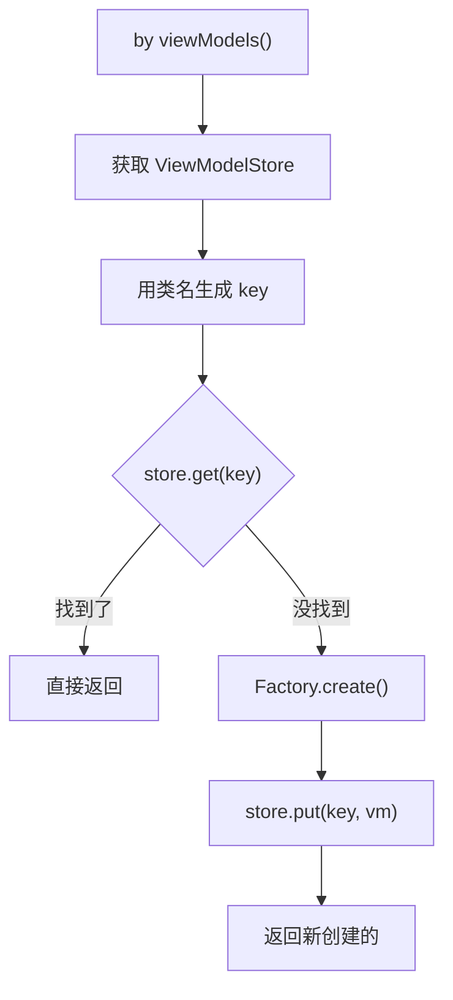
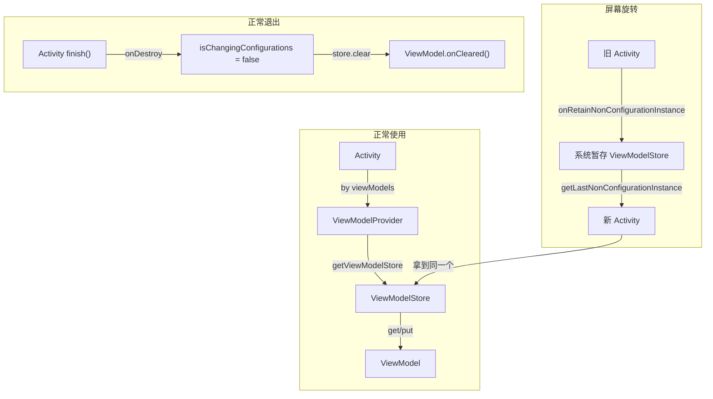

# ViewModel 源码篇

## 设计哲学

### 核心问题：为什么 ViewModel 能在屏幕旋转时存活？

这是理解 ViewModel 的核心！先给出答案，再详细解释：

> **一句话总结**：ViewModel 能在配置变更时存活，是因为它所在的"抽屉"（ViewModelStore）被系统暂时保管了，新 Activity 创建后又拿回了同一个抽屉。

### 先搞清楚一个问题

**问题：AActivity 和 BActivity 都用 `UserViewModel`，为什么它们拿到的不是同一个 ViewModel？**

很多人以为 ViewModel 是全局单例，其实不是！

```
┌─────────────────────────────────────────────────────────────────────────────┐
│                     为什么不同 Activity 的 ViewModel 不共享？                │
├─────────────────────────────────────────────────────────────────────────────┤
│                                                                             │
│   AActivity                              BActivity                          │
│   ┌──────────────────────┐               ┌──────────────────────┐           │
│   │                      │               │                      │           │
│   │   ViewModelStore     │               │   ViewModelStore     │           │
│   │   (A的抽屉)          │               │   (B的抽屉)          │           │
│   │   ┌────────────────┐ │               │   ┌────────────────┐ │           │
│   │   │ key: "UserVM"  │ │               │   │ key: "UserVM"  │ │           │
│   │   │ val: 实例1     │ │               │   │ val: 实例2     │ │           │
│   │   │ data="张三"    │ │               │   │ data="李四"    │ │           │
│   │   └────────────────┘ │               │   └────────────────┘ │           │
│   │                      │               │                      │           │
│   └──────────────────────┘               └──────────────────────┘           │
│                                                                             │
│   虽然 key 都是 "UserViewModel"，但它们在不同的抽屉里！                      │
│   所以是两个完全独立的 ViewModel 实例。                                      │
│                                                                             │
└─────────────────────────────────────────────────────────────────────────────┘
```

**大白话总结**：
- `ViewModelStore` 就是一个 HashMap（可以理解为抽屉）
- key 是 ViewModel 的类名，value 是 ViewModel 实例
- **每个 Activity 有自己独立的 ViewModelStore**
- 所以即使 key 相同，不同 Activity 拿到的也是不同的实例

## 核心源码分析

### 第一步：理解 ViewModelStore（抽屉）

```kotlin
// ViewModelStore 源码超级简单，就是一个 HashMap 的封装
public class ViewModelStore {
    // 就是一个 HashMap，key 是字符串，value 是 ViewModel
    private final HashMap<String, ViewModel> mMap = new HashMap<>();

    // 放入 ViewModel
    final void put(String key, ViewModel viewModel) {
        mMap.put(key, viewModel);
    }

    // 取出 ViewModel
    final ViewModel get(String key) {
        return mMap.get(key);
    }

    // 清空所有 ViewModel（Activity 真正销毁时调用）
    public final void clear() {
        for (ViewModel vm : mMap.values()) {
            vm.onCleared();  // 通知 ViewModel 要被清理了
        }
        mMap.clear();
    }
}
```

**大白话**：ViewModelStore 就是一个装 ViewModel 的容器，没啥复杂的。

### 第二步：ViewModel 是怎么被创建和获取的？

当你写 `by viewModels()` 时，背后发生了什么？



对应的核心源码：

```kotlin
// ViewModelProvider 的核心逻辑（简化版）
public <T extends ViewModel> T get(Class<T> modelClass) {
    // 用类名生成 key
    String key = "androidx.lifecycle.ViewModelProvider.DefaultKey:" 
                 + modelClass.getCanonicalName();
    
    // 先从抽屉里找
    ViewModel viewModel = store.get(key);
    
    if (viewModel != null) {
        // 找到了，直接返回
        // 这就是为什么同一个 Activity 多次获取是同一个实例
        return (T) viewModel;
    }
    
    // 没找到，创建一个新的
    viewModel = factory.create(modelClass);
    
    // 放进抽屉
    store.put(key, viewModel);
    
    return (T) viewModel;
}
```

### 第三步：核心机制 —— 屏幕旋转时 ViewModel 为什么不丢？

这是最核心的部分！Android 系统提供了一对神奇的方法：

| 方法 | 谁调用的 | 什么时候调用 | 干什么用 |
|-----|---------|-------------|---------|
| `onRetainNonConfigurationInstance()` | **Android 系统** | Activity 因配置变更**销毁前** | 让你返回需要保留的对象 |
| `getLastNonConfigurationInstance()` | **你的代码** | 新 Activity **创建后** | 获取之前保留的对象 |

**大白话**：
- 屏幕旋转时，系统会销毁旧 Activity，创建新 Activity
- 销毁前，系统问旧 Activity："有什么东西要保留吗？" → 调用 `onRetainNonConfigurationInstance()`
- 旧 Activity 说："有！我的 ViewModelStore（抽屉）要保留！" → 返回 ViewModelStore
- 系统把这个抽屉暂时存起来
- 新 Activity 创建后，调用 `getLastNonConfigurationInstance()` 拿回这个抽屉
- 所以新 Activity 的抽屉和旧 Activity 是**同一个**，里面的 ViewModel 自然还在！

```
┌─────────────────────────────────────────────────────────────────────────────┐
│                      屏幕旋转时的完整流程（时间线）                           │
├─────────────────────────────────────────────────────────────────────────────┤
│                                                                             │
│  时间 ──────────────────────────────────────────────────────────────────►   │
│                                                                             │
│  ┌─────────┐                                           ┌─────────┐         │
│  │旧Activity│                                           │新Activity│         │
│  └────┬────┘                                           └────┬────┘         │
│       │                                                     │              │
│       │ ① 用户旋转屏幕                                       │              │
│       │                                                     │              │
│       │ ② 系统检测到配置变更，准备销毁旧 Activity             │              │
│       │                                                     │              │
│       │ ③ 系统调用 onRetainNonConfigurationInstance()       │              │
│       │   ┌─────────────────────────────────────────┐       │              │
│       │   │ "有东西要保留吗？"                        │       │              │
│       │   │                                         │       │              │
│       │   │ 旧Activity: "有！我的ViewModelStore！"  │       │              │
│       │   │                                         │       │              │
│       │   │ 返回: { viewModelStore: 抽屉 }          │       │              │
│       │   └─────────────────────────────────────────┘       │              │
│       │                     │                               │              │
│       │                     ▼                               │              │
│       │         ┌─────────────────────┐                     │              │
│       │         │   系统暂存区         │                     │              │
│       │         │  (保管这个抽屉)     │                     │              │
│       │         └─────────────────────┘                     │              │
│       │                     │                               │              │
│       │ ④ 旧 Activity 销毁 (onDestroy)                      │              │
│       │   但是！isChangingConfigurations() == true          │              │
│       │   所以不会清空 ViewModelStore                        │              │
│       ×                     │                               │              │
│                             │                               │              │
│                             │     ⑤ 新 Activity 创建        │              │
│                             │                               │              │
│                             │     ⑥ 新 Activity 需要 ViewModel              │
│                             │        调用 getViewModelStore()               │
│                             │                               │              │
│                             │     ⑦ 内部调用 getLastNonConfigurationInstance()
│                             │        ┌─────────────────────────────────────┐
│                             │        │ "之前有保留什么东西吗？"             │
│                             │        │                                     │
│                             └───────►│ 系统: "有！给你之前那个抽屉！"       │
│                                      │                                     │
│                                      │ 返回: { viewModelStore: 同一个抽屉 }│
│                                      └─────────────────────────────────────┘
│                                                             │              │
│                                      ⑧ 新 Activity 拿到的是同一个抽屉      │
│                                         里面的 ViewModel 还在！            │
│                                                             │              │
│                                                             ▼              │
│                                                      数据完好无损 ✅       │
│                                                                             │
└─────────────────────────────────────────────────────────────────────────────┘
```

### 第四步：ComponentActivity 的实现

```kotlin
// ComponentActivity 的核心实现（简化版，但逻辑完整）
public class ComponentActivity extends Activity {

    // 这个 Activity 的抽屉
    private ViewModelStore mViewModelStore;

    // 获取抽屉（这个方法在你调用 by viewModels() 时会被触发）
    public ViewModelStore getViewModelStore() {
        if (mViewModelStore == null) {
            // 先看看系统有没有帮我们保留之前的抽屉
            NonConfigurationInstances nc = 
                (NonConfigurationInstances) getLastNonConfigurationInstance();
            
            if (nc != null && nc.viewModelStore != null) {
                // 太好了！系统保留了之前的抽屉，直接用！
                mViewModelStore = nc.viewModelStore;
            } else {
                // 没有保留的，创建一个新抽屉
                mViewModelStore = new ViewModelStore();
            }
        }
        return mViewModelStore;
    }

    // 系统在配置变更时会调用这个方法
    // 注意：这个方法是系统调用的！不是你调用的！
    @Override
    public final Object onRetainNonConfigurationInstance() {
        // 把抽屉包装一下返回给系统
        NonConfigurationInstances nci = new NonConfigurationInstances();
        nci.viewModelStore = mViewModelStore;
        return nci;  // 系统会帮我们保管这个
    }

    // Activity 销毁时
    @Override
    protected void onDestroy() {
        super.onDestroy();
        
        // 关键判断！
        if (isChangingConfigurations()) {
            // 是配置变更导致的销毁（比如旋转屏幕）
            // 不清空抽屉！因为待会新 Activity 还要用！
        } else {
            // 是真正的销毁（比如用户按返回键）
            // 清空抽屉，调用所有 ViewModel 的 onCleared()
            if (mViewModelStore != null) {
                mViewModelStore.clear();
            }
        }
    }
}
```

## 整体流程图



## 设计亮点

### 1. 巧用系统机制

Google 没有造轮子，而是利用了 Android 系统已有的 `onRetainNonConfigurationInstance()` 机制。这个 API 从 Android 1.0 就存在，非常稳定。

**可借鉴的点**：解决问题时，先看看有没有现成的机制可以复用，而不是重新发明轮子。

### 2. 单一职责，职责分明

| 类 | 职责 |
|---|------|
| `ViewModel` | 持有数据，业务逻辑 |
| `ViewModelStore` | 存储 ViewModel 实例 |
| `ViewModelProvider` | 创建和获取 ViewModel |
| `ViewModelProvider.Factory` | 负责实例化 ViewModel |

每个类只做一件事，职责清晰。

### 3. 懒加载 + 缓存模式

```kotlin
// by viewModels() 的实现
inline fun <reified VM : ViewModel> ComponentActivity.viewModels(
    noinline factoryProducer: (() -> Factory)? = null
): Lazy<VM> {
    // 返回的是 Lazy，首次访问才真正创建
    return ViewModelLazy(VM::class, { viewModelStore }, factoryProducer)
}
```

- 不用不创建（懒加载）
- 用过一次后缓存起来（避免重复创建）

### 4. 优雅的生命周期管理

```kotlin
override fun onCleared() {
    // 子类可以重写这个方法来清理资源
    // 但不需要关心什么时候调用，框架会在正确的时机调用
}
```

开发者只需要关心"做什么"，不需要关心"什么时候做"。

## 延伸思考

### 如果让你设计 ViewModel，你会怎么做？

**思考点**：
1. 如何让数据在配置变更时存活？
2. 如何处理不同作用域（Activity、Fragment、NavGraph）？
3. 如何处理 ViewModel 的依赖注入？
4. 如何处理进程被杀死的情况？

**Google 的答案**：
1. 利用 `onRetainNonConfigurationInstance()` 机制
2. 通过 `ViewModelStoreOwner` 接口，不同组件提供自己的 ViewModelStore
3. 通过 `ViewModelProvider.Factory`，支持自定义创建逻辑
4. 通过 `SavedStateHandle`，利用 `onSaveInstanceState` 机制

### Fragment 的 ViewModel 是如何实现的？

Fragment 也实现了 `ViewModelStoreOwner` 接口：

```kotlin
public class Fragment implements ViewModelStoreOwner {
    
    private ViewModelStore mViewModelStore;
    
    @Override
    public ViewModelStore getViewModelStore() {
        if (mViewModelStore == null) {
            // Fragment 的 ViewModelStore 存储在 FragmentManager 中
            // 通过 Fragment 的 who（唯一标识）来关联
            mViewModelStore = mFragmentManager.getViewModelStore(this);
        }
        return mViewModelStore;
    }
}
```

**by activityViewModels() 的实现**：

```kotlin
inline fun <reified VM : ViewModel> Fragment.activityViewModels(): Lazy<VM> {
    return ViewModelLazy(
        VM::class,
        { requireActivity().viewModelStore }  // 使用 Activity 的 ViewModelStore
    )
}
```

所以 `activityViewModels()` 能共享，是因为它们用的是**同一个 ViewModelStore**。

## 面试检验

### 源码深度题

**Q1：ViewModel 是如何在配置变更时保留的？请详细说明原理。**

> **答案**：
> 1. 系统在配置变更时，会在销毁旧 Activity 前调用 `onRetainNonConfigurationInstance()` 方法
> 2. ComponentActivity 重写了这个方法，把 ViewModelStore 返回给系统
> 3. 系统把这个对象暂存起来
> 4. 新 Activity 创建后，通过 `getLastNonConfigurationInstance()` 获取之前保存的对象
> 5. 新 Activity 的 `getViewModelStore()` 方法会检查这个对象，如果存在就复用
> 6. 这样新旧 Activity 就共用同一个 ViewModelStore，里面的 ViewModel 自然保留了
> 
> 关键判断：在 `onDestroy()` 中通过 `isChangingConfigurations()` 判断是配置变更还是真正销毁，只有真正销毁时才清空 ViewModelStore。

**Q2：ViewModelStore 是什么？ViewModelProvider 是什么？它们的关系是什么？**

> **答案**：
> - **ViewModelStore**：存储 ViewModel 实例的容器，本质是一个 HashMap
> - **ViewModelProvider**：获取 ViewModel 的入口，负责从 ViewModelStore 中获取或创建 ViewModel
> - **关系**：ViewModelProvider 需要 ViewModelStore 来存储实例，需要 Factory 来创建实例
> 
> 类比：ViewModelStore 是抽屉，ViewModelProvider 是管家，Factory 是工厂。

**Q3：为什么不同 Activity 的同类型 ViewModel 是不同的实例？**

> **答案**：因为每个 Activity 都有自己独立的 ViewModelStore。即使 key（ViewModel 类名）相同，但它们存储在不同的 ViewModelStore 中，所以是不同的实例。这就像两个抽屉里都放了一个叫"钱包"的东西，但它们是两个不同的钱包。

**Q4：by viewModels() 委托是如何实现的？**

> **答案**：
> 1. `by viewModels()` 返回一个 `Lazy<ViewModel>` 对象
> 2. 首次访问时触发 `ViewModelProvider.get()` 方法
> 3. 内部先从 ViewModelStore 查找，找到就返回
> 4. 找不到就通过 Factory 创建，存入 ViewModelStore，然后返回
> 5. 后续访问直接返回缓存的实例
> 
> 这是懒加载 + 缓存模式的应用。

**Q5：onCleared() 什么时候被调用？**

> **答案**：
> - 当 Activity/Fragment **真正销毁**时调用（`isFinishing() == true` 或 `isChangingConfigurations() == false`）
> - 配置变更时**不会调用**
> - 调用时机是在 `onDestroy()` 中，通过 `ViewModelStore.clear()` 遍历所有 ViewModel 调用 `onCleared()`
> 
> 用途：清理资源，如取消网络请求、关闭数据库连接、移除监听器等。

### 思考题

**Q6：如果 ViewModel 需要访问 Context 怎么办？为什么不能直接持有 Activity 引用？**

> **答案**：
> - 不能直接持有 Activity 引用，因为 ViewModel 的生命周期比 Activity 长，会导致内存泄漏
> - 解决方案：使用 `AndroidViewModel`，它持有 Application Context
> - Application Context 的生命周期等于 App 生命周期，不会泄漏
> - 如果需要 Activity Context（如显示 Dialog），应该通过事件通知 UI 层处理

**Q7：SavedStateHandle 是如何实现进程恢复的？**

> **答案**：
> - SavedStateHandle 底层使用 `SavedStateRegistry`
> - 数据最终保存到 Activity 的 `onSaveInstanceState()` Bundle 中
> - 进程恢复时，系统会传递保存的 Bundle 给 `onCreate()`
> - SavedStateHandle 从 Bundle 中恢复数据
> - 所以它有同样的大小限制（约 1MB）

---

## 总结

### 三个核心要点

| 要点 | 说明 |
|-----|------|
| **每个 Activity 有独立的抽屉** | 所以 AActivity 和 BActivity 的 ViewModel 不共享 |
| **抽屉在配置变更时被系统保管** | `onRetainNonConfigurationInstance()` 返回抽屉给系统暂存 |
| **新 Activity 从系统取回同一个抽屉** | `getLastNonConfigurationInstance()` 取回之前的抽屉 |

### 设计启示

1. **善用系统机制**：不要重复造轮子
2. **单一职责**：每个类只做一件事
3. **懒加载 + 缓存**：提升性能
4. **生命周期自动管理**：降低使用者心智负担

---

_上一篇：[2-进阶篇](./2-进阶篇.md) - 高级用法、实战技巧_
_返回目录：[README](./README.md)_
