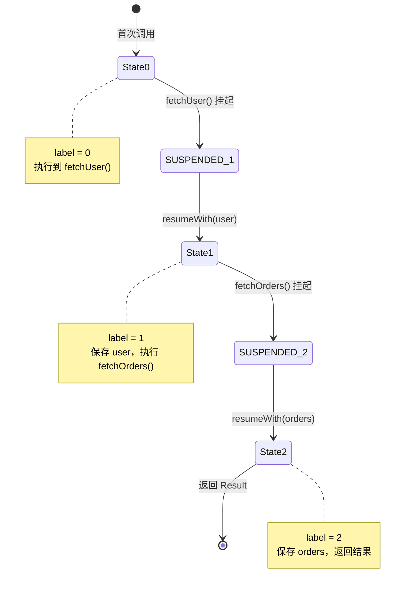

# 协程源码篇

## 设计哲学：为什么协程这样设计？

### 核心挑战

**问题**：如何在不阻塞线程的情况下，让代码"暂停"执行，等待异步结果返回后再继续？

**传统方案的困境**：
- 回调：代码割裂，嵌套地狱
- Future/Promise：链式调用，但逻辑仍不直观
- async/await（JS）：语法糖，运行时支持

**Kotlin 协程的解决方案**：
- **编译时转换**：将 suspend 函数转换成状态机
- **CPS 转换**：Continuation Passing Style，隐式传递续体
- **无运行时魔法**：纯编译器技术，不需要修改 JVM

```
┌─────────────────────────────────────────────────────────────────┐
│                    协程的核心设计理念                             │
├─────────────────────────────────────────────────────────────────┤
│                                                                 │
│  目标：让异步代码像同步代码一样简单                               │
│                                                                 │
│  ┌─────────────────┐       ┌─────────────────┐                  │
│  │  你写的代码      │       │  编译器生成的代码  │                  │
│  │  (同步风格)      │ ──►   │  (状态机)        │                  │
│  └─────────────────┘       └─────────────────┘                  │
│                                                                 │
│  suspend fun getData(): Data {      │  状态机 + Continuation   │
│      val a = fetchA()    // 挂起点1  │  ├─ state 0: 执行到挂起点1│
│      val b = fetchB(a)   // 挂起点2  │  ├─ state 1: 执行到挂起点2│
│      return process(a, b)            │  └─ state 2: 返回结果    │
│  }                                   │                          │
│                                                                 │
│  编译器把「暂停-恢复」转换成「状态切换」                          │
│                                                                 │
└─────────────────────────────────────────────────────────────────┘
```

## 挂起与恢复原理

### 一句话总结

**suspend 函数的本质**：编译器把每个挂起点作为状态分隔，生成一个状态机。挂起时保存状态和上下文，恢复时根据状态继续执行。

### Continuation：协程的"存档点"

`Continuation` 是协程的核心接口，它保存了协程恢复执行所需的一切信息。

```kotlin
// Continuation 接口定义
public interface Continuation<in T> {
    // 协程上下文（包含调度器、Job 等）
    public val context: CoroutineContext
    
    // 恢复协程执行，传入结果
    public fun resumeWith(result: Result<T>)
}

// 扩展函数
public fun <T> Continuation<T>.resume(value: T) = 
    resumeWith(Result.success(value))

public fun <T> Continuation<T>.resumeWithException(exception: Throwable) = 
    resumeWith(Result.failure(exception))
```

**大白话理解**：`Continuation` 就像游戏的存档，记录了你在哪里暂停的、背包里有什么（局部变量）、下一步要做什么。恢复时读取存档继续玩。

### CPS 转换（Continuation Passing Style）

编译器对 suspend 函数进行 CPS 转换，增加一个 `Continuation` 参数。

```kotlin
// 你写的代码
suspend fun fetchUser(): User {
    delay(1000)
    return User("张三")
}

// 编译器转换后（伪代码）
fun fetchUser(continuation: Continuation<User>): Any? {
    // 返回值可能是：
    // 1. COROUTINE_SUSPENDED：表示挂起了
    // 2. 实际结果：表示直接返回，没挂起
}
```

**关键点**：
- suspend 函数多了一个隐藏参数 `Continuation`
- 返回值类型变成 `Any?`
- 如果函数挂起，返回 `COROUTINE_SUSPENDED` 标记

## 状态机实现

### 完整的状态机示例

```kotlin
// 原始代码
suspend fun loadData(): Result {
    val user = fetchUser()      // 挂起点 1
    val orders = fetchOrders(user.id)  // 挂起点 2
    return Result(user, orders)
}

// 编译器生成的状态机（简化版伪代码）
fun loadData(continuation: Continuation<Result>): Any? {
    // 首次调用时创建状态机，恢复时复用
    val sm = continuation as? LoadDataStateMachine 
        ?: LoadDataStateMachine(continuation)
    
    when (sm.label) {
        0 -> {
            // 初始状态：执行到第一个挂起点
            sm.label = 1
            val result = fetchUser(sm)  // 传入状态机作为 continuation
            if (result == COROUTINE_SUSPENDED) {
                return COROUTINE_SUSPENDED  // 挂起，等待 fetchUser 完成
            }
            sm.user = result as User
        }
        1 -> {
            // 恢复执行：fetchUser 完成了
            sm.user = sm.result as User  // 从状态机取出结果
            sm.label = 2
            val result = fetchOrders(sm.user.id, sm)
            if (result == COROUTINE_SUSPENDED) {
                return COROUTINE_SUSPENDED
            }
            sm.orders = result as List<Order>
        }
        2 -> {
            // 恢复执行：fetchOrders 完成了
            sm.orders = sm.result as List<Order>
            // 所有挂起点都完成，返回最终结果
            return Result(sm.user, sm.orders)
        }
    }
}

// 状态机类
class LoadDataStateMachine(
    private val completion: Continuation<Result>
) : Continuation<Any?> {
    
    var label = 0           // 当前状态
    var result: Any? = null // 上一步的结果
    
    // 保存的局部变量
    var user: User? = null
    var orders: List<Order>? = null
    
    override val context = completion.context
    
    override fun resumeWith(result: Result<Any?>) {
        this.result = result.getOrThrow()
        // 恢复执行：调用 loadData 继续执行
        loadData(this)
    }
}
```

### 状态机执行流程图



```
┌─────────────────────────────────────────────────────────────────┐
│                    状态机执行流程详解                             │
├─────────────────────────────────────────────────────────────────┤
│                                                                 │
│  第一次调用 loadData(continuation)                               │
│  ┌──────────────────────────────────────────────────────────┐   │
│  │ label=0 → 执行 fetchUser(sm) → 返回 SUSPENDED            │   │
│  │ 状态机保存在 sm 中，等待 fetchUser 回调                    │   │
│  └──────────────────────────────────────────────────────────┘   │
│                          │                                      │
│                          ▼                                      │
│  fetchUser 完成，调用 sm.resumeWith(user)                        │
│  ┌──────────────────────────────────────────────────────────┐   │
│  │ label=1 → 保存 user → 执行 fetchOrders(sm) → SUSPENDED   │   │
│  │ 状态机继续等待 fetchOrders 回调                            │   │
│  └──────────────────────────────────────────────────────────┘   │
│                          │                                      │
│                          ▼                                      │
│  fetchOrders 完成，调用 sm.resumeWith(orders)                    │
│  ┌──────────────────────────────────────────────────────────┐   │
│  │ label=2 → 保存 orders → 返回 Result(user, orders)        │   │
│  │ 协程执行完毕                                               │   │
│  └──────────────────────────────────────────────────────────┘   │
│                                                                 │
└─────────────────────────────────────────────────────────────────┘
```

### 关键设计亮点

**1. 状态机复用**

```kotlin
// 首次调用：创建新的状态机
val sm = continuation as? LoadDataStateMachine 
    ?: LoadDataStateMachine(continuation)

// 恢复时：复用同一个状态机，只是 label 变了
```

**2. 局部变量提升为成员变量**

```kotlin
// 原始代码中的局部变量
val user = fetchUser()
val orders = fetchOrders(user.id)

// 状态机中变成成员变量，跨挂起点保存
class StateMachine {
    var user: User? = null
    var orders: List<Order>? = null
}
```

**3. COROUTINE_SUSPENDED 标记**

```kotlin
// 如果函数立即返回（没挂起），直接拿结果
// 如果函数挂起了，返回这个标记
internal val COROUTINE_SUSPENDED = CoroutineSingletons.COROUTINE_SUSPENDED
```

## 调度器源码解析

### Dispatchers.Main 实现原理

```kotlin
// Android 中的 Main 调度器
internal class HandlerContext(
    private val handler: Handler,
    private val name: String?
) : HandlerDispatcher() {
    
    override fun dispatch(context: CoroutineContext, block: Runnable) {
        // 通过 Handler 发送到主线程
        handler.post(block)
    }
    
    override fun scheduleResumeAfterDelay(
        timeMillis: Long, 
        continuation: CancellableContinuation<Unit>
    ) {
        // delay() 的实现：通过 Handler.postDelayed
        val runnable = Runnable {
            continuation.resume(Unit)
        }
        handler.postDelayed(runnable, timeMillis)
        
        // 支持取消
        continuation.invokeOnCancellation {
            handler.removeCallbacks(runnable)
        }
    }
}
```

**大白话**：`Dispatchers.Main` 就是对 `Handler` 的封装，把任务 post 到主线程的消息队列。

### Dispatchers.IO 实现原理

```kotlin
// IO 调度器使用线程池
internal object DefaultScheduler : ExperimentalCoroutineDispatcher() {
    // 核心线程数 = CPU 核心数
    // 最大线程数 = max(64, CPU核心数)
    // IO 密集型任务大部分时间在等待，所以可以多开线程
}

// 线程池的工作原理
// 1. 任务来了，先看有没有空闲线程
// 2. 没有空闲线程，创建新线程（不超过最大值）
// 3. 线程空闲一段时间后被回收
```

### withContext 的实现原理

```kotlin
// withContext 简化实现
public suspend fun <T> withContext(
    context: CoroutineContext,
    block: suspend CoroutineScope.() -> T
): T {
    return suspendCoroutineUninterceptedOrReturn { cont ->
        // 创建新的协程，使用新的上下文
        val newContext = cont.context + context
        val coroutine = DispatchedCoroutine(newContext, cont)
        
        // 在新调度器上执行 block
        coroutine.initParentJob()
        block.startCoroutineCancellable(coroutine)
        
        // 获取状态机的当前拦截器
        coroutine.getResult()
    }
}
```

**关键点**：
1. `withContext` 创建新的协程，但复用调用者的 `Job`
2. 执行完后自动恢复到原来的调度器
3. 如果目标调度器和当前相同，不会真正切换

## Flow 原理

### Flow 是冷流

```kotlin
// Flow 的定义
public interface Flow<out T> {
    // 收集方法：只有调用 collect 时才开始执行
    public suspend fun collect(collector: FlowCollector<T>)
}

public interface FlowCollector<in T> {
    // 发射值
    public suspend fun emit(value: T)
}
```

**冷流 vs 热流**：
- **冷流（Flow）**：每次 collect 都从头执行，像播放视频从头放
- **热流（StateFlow）**：一直在发射，collect 加入时接收当前值，像直播

### flow 构建器实现

```kotlin
// flow 构建器
public fun <T> flow(
    block: suspend FlowCollector<T>.() -> Unit
): Flow<T> = object : Flow<T> {
    
    override suspend fun collect(collector: FlowCollector<T>) {
        // 调用 collect 时，执行 block
        collector.block()
    }
}

// 使用示例
val myFlow = flow {
    emit(1)  // 发射 1
    delay(100)
    emit(2)  // 发射 2
}

// 收集时才执行
myFlow.collect { value ->
    println(value)
}
```

### 操作符的实现原理

```kotlin
// map 操作符实现
public fun <T, R> Flow<T>.map(
    transform: suspend (value: T) -> R
): Flow<R> = flow {
    // 收集上游 Flow
    collect { value ->
        // 转换后发射到下游
        emit(transform(value))
    }
}

// filter 操作符实现
public fun <T> Flow<T>.filter(
    predicate: suspend (T) -> Boolean
): Flow<T> = flow {
    collect { value ->
        if (predicate(value)) {
            emit(value)
        }
    }
}
```

**设计亮点**：操作符通过创建新的 Flow 来包装上游，形成链式调用。每个操作符都是一个"中间人"。

```
┌─────────────────────────────────────────────────────────────────┐
│                    Flow 操作符链式调用原理                        │
├─────────────────────────────────────────────────────────────────┤
│                                                                 │
│  flowOf(1, 2, 3)                                                │
│       │                                                         │
│       ▼                                                         │
│  ┌─────────────┐                                                │
│  │ map { x*2 } │  ← 包装原 Flow，转换值后发射                     │
│  └─────────────┘                                                │
│       │                                                         │
│       ▼                                                         │
│  ┌─────────────┐                                                │
│  │ filter {>2} │  ← 包装 map 后的 Flow，过滤后发射                │
│  └─────────────┘                                                │
│       │                                                         │
│       ▼                                                         │
│  ┌─────────────┐                                                │
│  │  collect    │  ← 触发整个链条执行                              │
│  └─────────────┘                                                │
│                                                                 │
│  执行顺序（从下到上触发，从上到下发射）：                          │
│  collect → 触发 filter.collect → 触发 map.collect → 触发原 Flow   │
│  原 Flow emit(1) → map emit(2) → filter 不发射（2 不满足）        │
│  原 Flow emit(2) → map emit(4) → filter emit(4) → collect 接收   │
│                                                                 │
└─────────────────────────────────────────────────────────────────┘
```

### StateFlow 实现原理

```kotlin
// StateFlow 是热流，始终有值
public interface StateFlow<out T> : SharedFlow<T> {
    // 当前值
    public val value: T
}

// MutableStateFlow 实现
internal class StateFlowImpl<T>(
    initialState: Any
) : AbstractSharedFlow<StateFlowSlot>(), MutableStateFlow<T> {
    
    // 原子操作保存当前值
    private val _state = atomic(initialState)
    
    override var value: T
        get() = _state.value as T
        set(value) {
            updateState(value)
        }
    
    private fun updateState(newState: T) {
        val oldState = _state.getAndSet(newState)
        if (oldState != newState) {
            // 值变化了，通知所有订阅者
            notifySubscribers(newState)
        }
    }
}
```

**关键特性**：
1. 始终有值（必须设置初始值）
2. 相同的值不会重复发射（`distinctUntilChanged`）
3. 多个订阅者共享同一个流（热流）

## 核心源码导读

### suspendCoroutine：挂起协程

```kotlin
// 最基础的挂起原语
public suspend inline fun <T> suspendCoroutine(
    crossinline block: (Continuation<T>) -> Unit
): T = suspendCoroutineUninterceptedOrReturn { c ->
    // 拦截 continuation，确保在正确的调度器恢复
    val safe = c.intercepted()
    block(safe)
    // 返回 COROUTINE_SUSPENDED 表示挂起
    COROUTINE_SUSPENDED
}

// 使用示例：将回调 API 转换为 suspend 函数
suspend fun <T> Call<T>.await(): T = suspendCoroutine { continuation ->
    enqueue(object : Callback<T> {
        override fun onResponse(call: Call<T>, response: Response<T>) {
            continuation.resume(response.body()!!)
        }
        override fun onFailure(call: Call<T>, t: Throwable) {
            continuation.resumeWithException(t)
        }
    })
}
```

### suspendCancellableCoroutine：可取消的挂起

```kotlin
// 支持取消的版本
public suspend inline fun <T> suspendCancellableCoroutine(
    crossinline block: (CancellableContinuation<T>) -> Unit
): T = suspendCoroutineUninterceptedOrReturn { uCont ->
    val cancellable = CancellableContinuationImpl(uCont.intercepted())
    
    // 设置取消回调
    block(cancellable)
    
    cancellable.getResult()
}

// 使用示例：支持取消的网络请求
suspend fun <T> Call<T>.awaitCancellable(): T = suspendCancellableCoroutine { cont ->
    cont.invokeOnCancellation {
        // 协程被取消时，取消网络请求
        cancel()
    }
    
    enqueue(object : Callback<T> {
        override fun onResponse(call: Call<T>, response: Response<T>) {
            cont.resume(response.body()!!)
        }
        override fun onFailure(call: Call<T>, t: Throwable) {
            cont.resumeWithException(t)
        }
    })
}
```

### launch 的实现

```kotlin
// launch 简化实现
public fun CoroutineScope.launch(
    context: CoroutineContext = EmptyCoroutineContext,  // 参数1：协程上下文
    start: CoroutineStart = CoroutineStart.DEFAULT,     // 参数2：启动模式
    block: suspend CoroutineScope.() -> Unit            // 参数3：协程体（要执行的代码）
): Job {
    // 合并上下文：父上下文 + 传入的上下文 + 默认调度器（如果没指定）
    val newContext = newCoroutineContext(context)
    
    // 创建协程对象
    val coroutine = StandaloneCoroutine(newContext, active = true)
    
    // 根据启动模式决定如何启动协程
    coroutine.start(start, coroutine, block)
    
    return coroutine
}
```

**三个参数详解**：

| 参数 | 默认值 | 作用 |
|-----|-------|------|
| `context` | `EmptyCoroutineContext` | 协程上下文，可指定调度器、Job、名称等（上文已详解） |
| `start` | `CoroutineStart.DEFAULT` | 启动模式，决定协程何时开始执行 |
| `block` | - | 协程体，就是你要执行的 suspend 代码块 |

### CoroutineStart 启动模式

启动模式决定了协程**何时、如何**开始执行。

```kotlin
public enum class CoroutineStart {
    DEFAULT,    // 立即调度执行
    LAZY,       // 延迟启动，等你手动调用
    ATOMIC,     // 原子启动，不可取消
    UNDISPATCHED // 不调度，在当前线程立即执行
}
```

**四种模式对比**：

| 模式 | 执行时机 | 可否取消启动 | 适用场景 |
|-----|---------|-------------|---------|
| `DEFAULT` | 立即调度到指定线程执行 | 可以 | 绝大多数场景 |
| `LAZY` | 调用 `start()` 或 `join()` 时 | 可以 | 需要手动控制启动时机 |
| `ATOMIC` | 立即调度，但启动前不可取消 | 不可以 | 必须保证执行到第一个挂起点 |
| `UNDISPATCHED` | 在当前线程立即执行到第一个挂起点 | 可以 | 需要快速响应的场景 |

**大白话理解**：
- **DEFAULT**：像发微信，消息发出去了，对方什么时候看取决于调度器
- **LAZY**：像存草稿，你不点发送就不会发出去
- **ATOMIC**：像发紧急邮件，发送过程中不能撤回
- **UNDISPATCHED**：像面对面说话，立刻就开始了，不用等

**代码示例**：

```kotlin
// 1. DEFAULT（默认）：立即调度执行
val job1 = launch {
    println("DEFAULT: 被调度后执行")
}

// 2. LAZY：延迟启动
val job2 = launch(start = CoroutineStart.LAZY) {
    println("LAZY: 手动启动后才执行")
}
// 协程还没执行...
job2.start()  // 现在才开始执行

// 3. ATOMIC：不可取消的启动
val job3 = launch(start = CoroutineStart.ATOMIC) {
    // 这行代码一定会执行，即使协程被立即取消
    println("ATOMIC: 第一个挂起点之前一定执行")
    delay(1000)  // 第一个挂起点，之后可以被取消
    println("之后的代码可能不执行")
}
job3.cancel()  // 取消也无法阻止第一行打印

// 4. UNDISPATCHED：不调度，直接执行
launch(start = CoroutineStart.UNDISPATCHED) {
    // 在调用 launch 的线程上立即执行
    println("UNDISPATCHED: 立即执行，当前线程=${Thread.currentThread().name}")
    delay(1000)  // 挂起后，恢复时才切到指定调度器
    println("恢复后可能在不同线程")
}
```

**DEFAULT vs UNDISPATCHED 的区别**：

```kotlin
// 假设在主线程调用
launch(Dispatchers.IO) {
    // DEFAULT：先调度到 IO 线程，再执行
    println("DEFAULT: ${Thread.currentThread().name}")  // IO 线程
}

launch(Dispatchers.IO, start = CoroutineStart.UNDISPATCHED) {
    // UNDISPATCHED：先在主线程执行到挂起点
    println("UNDISPATCHED 前: ${Thread.currentThread().name}")  // 主线程！
    delay(100)
    // 恢复后才到 IO 线程
    println("UNDISPATCHED 后: ${Thread.currentThread().name}")  // IO 线程
}
```

**为什么需要这些模式？**

设计权衡：
- **DEFAULT**：安全但有调度开销，适合大多数场景
- **LAZY**：省资源，适合"可能不需要执行"的协程
- **ATOMIC**：解决"取消太快导致协程从未执行"的问题
- **UNDISPATCHED**：省调度开销，适合对响应速度敏感的场景

### async 的实现

`async` 和 `launch` 非常相似，区别是 `async` 返回 `Deferred<T>`，可以通过 `await()` 获取结果。

```kotlin
// async 简化实现
public fun <T> CoroutineScope.async(
    context: CoroutineContext = EmptyCoroutineContext,
    start: CoroutineStart = CoroutineStart.DEFAULT,
    block: suspend CoroutineScope.() -> T  // 注意：有返回值 T
): Deferred<T> {
    val newContext = newCoroutineContext(context)
    
    // 关键区别：创建的是 DeferredCoroutine，而不是 StandaloneCoroutine
    val coroutine = DeferredCoroutine<T>(newContext, active = true)
    
    coroutine.start(start, coroutine, block)
    
    return coroutine  // 返回 Deferred，而不是 Job
}
```

**launch vs async 对比**：

| 对比项 | launch | async |
|-------|--------|-------|
| 返回值 | `Job` | `Deferred<T>` |
| 内部协程类 | `StandaloneCoroutine` | `DeferredCoroutine` |
| 获取结果 | 不能 | `await()` |
| 用途 | 执行不需要结果的任务 | 执行需要返回结果的任务 |

### Deferred 与 await() 的实现

```kotlin
// Deferred 是带结果的 Job
public interface Deferred<out T> : Job {
    // 挂起等待结果
    public suspend fun await(): T
    
    // 非挂起获取结果（如果还没完成会抛异常）
    public fun getCompleted(): T
}

// await() 简化实现
internal open class DeferredCoroutine<T>(
    parentContext: CoroutineContext,
    active: Boolean
) : AbstractCoroutine<T>(parentContext, active), Deferred<T> {
    
    override suspend fun await(): T = suspendCancellableCoroutine { cont ->
        // 如果已经完成，直接返回结果
        val state = this.state
        if (state is CompletedExceptionally) {
            cont.resumeWithException(state.cause)
        } else if (state !is Incomplete) {
            cont.resume(state as T)
        } else {
            // 还没完成，注册回调等待
            invokeOnCompletion { cause ->
                if (cause != null) {
                    cont.resumeWithException(cause)
                } else {
                    cont.resume(getCompleted())
                }
            }
        }
    }
}
```

**大白话理解**：
- `launch` 像是派人去干活，不管结果
- `async` 像是派人去买东西，`await()` 就是等人把东西带回来

**await() 的本质**：
1. 如果协程已完成 → 直接返回结果
2. 如果协程还在执行 → 挂起当前协程，等完成后恢复

**使用示例**：

```kotlin
// 并行执行两个网络请求
suspend fun loadData(): Result {
    return coroutineScope {
        // 并行启动
        val userDeferred = async { fetchUser() }
        val ordersDeferred = async { fetchOrders() }
        
        // 等待两个结果（挂起，不阻塞线程）
        val user = userDeferred.await()
        val orders = ordersDeferred.await()
        
        Result(user, orders)
    }
}
```

**为什么需要 async/await？**

没有 `async` 时，两个网络请求只能串行：

```kotlin
// 串行：总耗时 = 1秒 + 1秒 = 2秒
val user = fetchUser()      // 1秒
val orders = fetchOrders()  // 1秒

// 并行：总耗时 = max(1秒, 1秒) = 1秒
val user = async { fetchUser() }
val orders = async { fetchOrders() }
user.await() + orders.await()
```

## 设计亮点总结

### 1. 编译时转换 vs 运行时魔法

**为什么选择编译时转换？**
- 无需修改 JVM，兼容性好
- 性能更好，没有运行时开销
- 调试更友好，堆栈信息清晰

### 2. 状态机模式

**优点**：
- 内存占用小：只需要一个对象保存状态
- 执行效率高：没有线程切换开销
- 可预测性强：状态转换清晰

### 3. 结构化并发

**为什么这样设计？**
- 避免协程泄漏
- 简化生命周期管理
- 异常可追溯

### 4. Continuation 接口设计

**简洁但强大**：
- 只有两个成员：`context` 和 `resumeWith`
- 支持成功和失败两种结果
- 可扩展（如 `CancellableContinuation`）

## 延伸思考

### 如果让你设计协程，你会怎么做？

**考虑点**：
1. 如何实现"暂停"？状态机、Fiber、还是其他方式？
2. 如何处理异常传播？
3. 如何与现有线程模型集成？
4. 如何实现取消？

### Kotlin 协程 vs 其他语言的协程

| 语言 | 实现方式 | 特点 |
|-----|---------|------|
| Kotlin | 编译时状态机 | 无运行时开销，兼容 JVM |
| Go | Goroutine | 运行时调度，M:N 映射 |
| JavaScript | Promise/async-await | 事件循环 + 微任务 |
| Python | Generator | yield 关键字，较原始 |

## 面试检验

### 源码深度题

**Q1：suspend 函数是如何实现挂起和恢复的？**

> **答案**：
> 1. **编译器做 CPS 转换**：给 suspend 函数增加一个 `Continuation` 参数
> 2. **生成状态机**：每个挂起点对应一个状态（label）
> 3. **挂起时**：保存当前状态和局部变量到状态机，返回 `COROUTINE_SUSPENDED`
> 4. **恢复时**：调用 `continuation.resumeWith(result)`，状态机根据 label 继续执行
> 
> 本质上是把"暂停-恢复"转换成了"状态切换"。

**Q2：什么是 CPS（Continuation Passing Style）转换？**

> **答案**：CPS 是一种代码转换技术，把函数的"返回值"变成"传给回调"。
> 
> ```kotlin
> // 原始：直接返回
> suspend fun getUser(): User
> 
> // CPS 转换后：通过 Continuation 回调
> fun getUser(continuation: Continuation<User>): Any?
> ```
> 
> 转换后返回值变成 `Any?`：
> - 返回 `COROUTINE_SUSPENDED` 表示挂起了
> - 返回实际值表示没挂起，直接完成

**Q3：协程是如何实现线程切换的？**

> **答案**：通过 `Dispatcher` 调度器实现。
> 
> 1. 协程恢复时，不是直接执行，而是先经过 `intercepted()` 获取拦截后的 Continuation
> 2. `Dispatcher.dispatch()` 决定在哪个线程执行
> 3. 例如 `Dispatchers.Main` 通过 `Handler.post()` 发送到主线程
> 4. `Dispatchers.IO` 通过线程池执行
> 
> `withContext` 会创建新协程，在目标调度器执行，完成后自动恢复到原调度器。

**Q4：协程的状态机是如何工作的？**

> **答案**：
> 1. 编译器为每个 suspend 函数生成一个状态机类
> 2. 状态机有一个 `label` 字段标记当前执行到哪
> 3. 局部变量被提升为成员变量，跨挂起点保存
> 4. 每次恢复时，根据 `label` 执行对应的代码块，然后更新 `label`
> 
> ```kotlin
> when (label) {
>     0 -> { /* 第一段代码 */ label = 1 }
>     1 -> { /* 第二段代码 */ label = 2 }
>     2 -> { /* 返回结果 */ }
> }
> ```

**Q5：为什么 StateFlow 不会发射相同的值？**

> **答案**：StateFlow 内部在 `setValue` 时会比较新旧值：
> 
> ```kotlin
> private fun updateState(newState: T) {
>     val oldState = _state.getAndSet(newState)
>     if (oldState != newState) {  // 只有值变化才通知
>         notifySubscribers(newState)
>     }
> }
> ```
> 
> 这是 **distinctUntilChanged** 语义，避免不必要的 UI 更新。如果需要发射相同值，使用 `SharedFlow`。

**Q6：suspendCoroutine 和 suspendCancellableCoroutine 有什么区别？**

> **答案**：
> - **suspendCoroutine**：基础版，挂起协程并获取 Continuation
> - **suspendCancellableCoroutine**：可取消版，提供 `invokeOnCancellation` 回调
> 
> 实际开发中应该使用 `suspendCancellableCoroutine`，这样协程取消时可以清理资源（如取消网络请求）。

---

_本系列完结。协程是现代 Android 开发的核心技能，理解其原理能帮助你写出更好的异步代码。_

**推荐阅读**：
- [Kotlin 官方协程文档](https://kotlinlang.org/docs/coroutines-overview.html)
- [Roman Elizarov 的协程设计文章](https://medium.com/@elizarov)
- [Android 协程最佳实践](https://developer.android.com/kotlin/coroutines/coroutines-best-practices)
