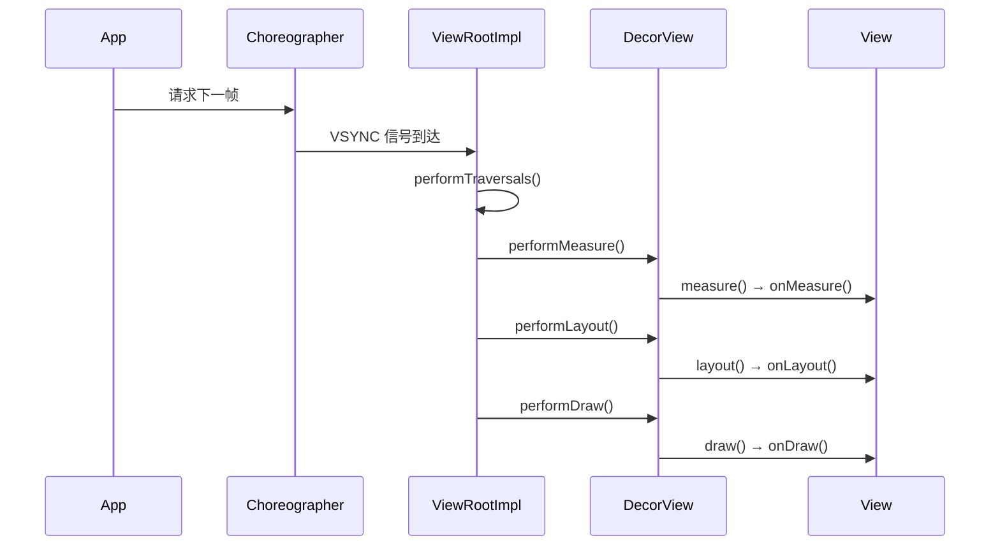
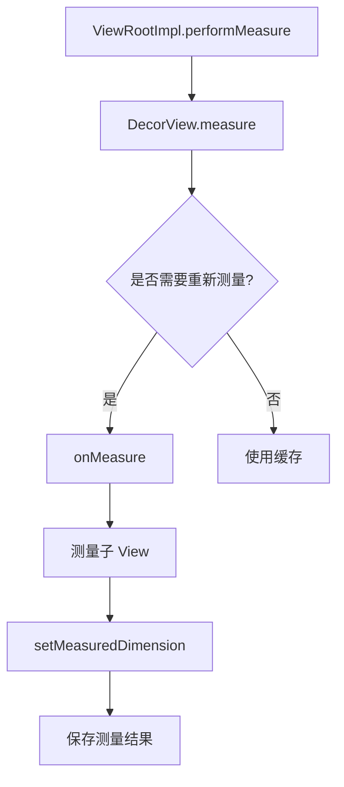
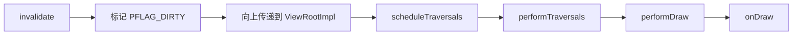
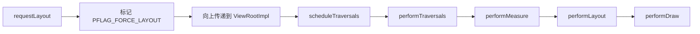

# 自定义 View 源码篇

## 设计哲学：Android 的绘制架构

### 一句话总结

Android 的绘制流程就像**装修房子**：先量尺寸（measure），再规划布局（layout），最后施工（draw）。

### 为什么要分三步？

```
┌────────────────────────────────────────────────────────────────┐
│                        绘制三步曲                               │
├────────────────────────────────────────────────────────────────┤
│                                                                │
│   Measure（测量）                                               │
│   ├── 问题：每个 View 应该占多大空间？                            │
│   ├── 输入：父容器的约束（MeasureSpec）                           │
│   └── 输出：View 的测量宽高（measuredWidth/Height）               │
│                                                                │
│   Layout（布局）                                                │
│   ├── 问题：每个 View 应该放在哪里？                              │
│   ├── 输入：测量结果                                             │
│   └── 输出：View 的位置（left/top/right/bottom）                 │
│                                                                │
│   Draw（绘制）                                                  │
│   ├── 问题：每个 View 长什么样？                                  │
│   ├── 输入：位置和尺寸                                           │
│   └── 输出：屏幕上的像素                                         │
│                                                                │
└────────────────────────────────────────────────────────────────┘
```

**为什么不能合并？**

1. **关注点分离**：每一步只做一件事，代码更清晰
2. **性能优化**：大小没变只需重绘，位置没变只需重新布局
3. **复用**：ViewGroup 可以复用子 View 的测量逻辑

## View 绘制流程源码分析

### 绘制的起点：ViewRootImpl



**关键点**：
- `ViewRootImpl` 是 View 树和 WindowManager 之间的桥梁
- `Choreographer` 负责协调动画、输入和绘制，在 VSYNC 信号到来时触发
- `performTraversals()` 是绘制的总入口

### performTraversals 核心流程

```kotlin
// ViewRootImpl.performTraversals()（简化版）
private fun performTraversals() {
    // 1. 计算窗口大小
    val desiredWindowWidth = ...
    val desiredWindowHeight = ...
    
    // 2. 测量
    if (mFirst || windowShouldResize || ...) {
        // 创建根 MeasureSpec
        val childWidthMeasureSpec = getRootMeasureSpec(desiredWindowWidth, lp.width)
        val childHeightMeasureSpec = getRootMeasureSpec(desiredWindowHeight, lp.height)
        
        performMeasure(childWidthMeasureSpec, childHeightMeasureSpec)
    }
    
    // 3. 布局
    if (didLayout) {
        performLayout(lp, desiredWindowWidth, desiredWindowHeight)
    }
    
    // 4. 绘制
    if (!cancelDraw) {
        performDraw()
    }
}
```

### Measure 流程



**View.measure() 源码**：

```java
// View.measure()
public final void measure(int widthMeasureSpec, int heightMeasureSpec) {
    // 检查是否需要重新测量（优化：避免重复测量）
    boolean needsLayout = ...;
    
    if (needsLayout) {
        // 清除缓存
        mPrivateFlags &= ~PFLAG_MEASURED_DIMENSION_SET;
        
        // 调用 onMeasure（子类重写）
        onMeasure(widthMeasureSpec, heightMeasureSpec);
        
        // 检查是否调用了 setMeasuredDimension
        if ((mPrivateFlags & PFLAG_MEASURED_DIMENSION_SET) == 0) {
            throw new IllegalStateException("onMeasure() did not call setMeasuredDimension()");
        }
    }
    
    // 标记已测量
    mPrivateFlags |= PFLAG_LAYOUT_REQUIRED;
}
```

**设计亮点**：
- `measure` 是 **final** 方法，保证测量流程不被破坏
- 通过标志位判断是否需要重新测量（性能优化）
- 强制检查 `setMeasuredDimension` 是否被调用

### MeasureSpec 的生成

```java
// ViewGroup.getChildMeasureSpec()
// 根据父容器的 MeasureSpec 和子 View 的 LayoutParams 计算子 View 的 MeasureSpec
public static int getChildMeasureSpec(int parentSpec, int padding, int childDimension) {
    int specMode = MeasureSpec.getMode(parentSpec);
    int specSize = MeasureSpec.getSize(parentSpec);
    int size = Math.max(0, specSize - padding);  // 可用空间
    
    int resultSize = 0;
    int resultMode = 0;
    
    switch (specMode) {
        case MeasureSpec.EXACTLY:  // 父容器是精确值
            if (childDimension >= 0) {
                // 子 View 指定了具体大小
                resultSize = childDimension;
                resultMode = MeasureSpec.EXACTLY;
            } else if (childDimension == MATCH_PARENT) {
                // 子 View 想要填满父容器
                resultSize = size;
                resultMode = MeasureSpec.EXACTLY;
            } else if (childDimension == WRAP_CONTENT) {
                // 子 View 想要包裹内容，但不能超过父容器
                resultSize = size;
                resultMode = MeasureSpec.AT_MOST;
            }
            break;
            
        case MeasureSpec.AT_MOST:  // 父容器有最大值限制
            if (childDimension >= 0) {
                resultSize = childDimension;
                resultMode = MeasureSpec.EXACTLY;
            } else if (childDimension == MATCH_PARENT) {
                // 父容器都不确定，子 View 也不能确定
                resultSize = size;
                resultMode = MeasureSpec.AT_MOST;
            } else if (childDimension == WRAP_CONTENT) {
                resultSize = size;
                resultMode = MeasureSpec.AT_MOST;
            }
            break;
            
        case MeasureSpec.UNSPECIFIED:  // 父容器不限制
            if (childDimension >= 0) {
                resultSize = childDimension;
                resultMode = MeasureSpec.EXACTLY;
            } else {
                resultSize = 0;  // 或者 size，取决于实现
                resultMode = MeasureSpec.UNSPECIFIED;
            }
            break;
    }
    
    return MeasureSpec.makeMeasureSpec(resultSize, resultMode);
}
```

**MeasureSpec 生成规则表**：

| 父容器 Mode | 子 View 参数 | 子 View Mode | 子 View Size |
|------------|-------------|-------------|-------------|
| EXACTLY | 具体值 | EXACTLY | 具体值 |
| EXACTLY | match_parent | EXACTLY | 父容器剩余空间 |
| EXACTLY | wrap_content | AT_MOST | 父容器剩余空间 |
| AT_MOST | 具体值 | EXACTLY | 具体值 |
| AT_MOST | match_parent | AT_MOST | 父容器剩余空间 |
| AT_MOST | wrap_content | AT_MOST | 父容器剩余空间 |

### Layout 流程

```java
// View.layout()
public void layout(int l, int t, int r, int b) {
    // 记录旧位置
    int oldL = mLeft, oldT = mTop, oldR = mRight, oldB = mBottom;
    
    // 设置新位置
    boolean changed = setFrame(l, t, r, b);
    
    if (changed || (mPrivateFlags & PFLAG_LAYOUT_REQUIRED) != 0) {
        // 调用 onLayout（ViewGroup 重写来布局子 View）
        onLayout(changed, l, t, r, b);
        
        // 通知监听器
        if (mOnLayoutChangeListeners != null) {
            for (OnLayoutChangeListener listener : mOnLayoutChangeListeners) {
                listener.onLayoutChange(this, l, t, r, b, oldL, oldT, oldR, oldB);
            }
        }
    }
    
    mPrivateFlags &= ~PFLAG_LAYOUT_REQUIRED;
}
```

**View vs ViewGroup**：
- `View.onLayout()`：空实现，View 不需要布局子 View
- `ViewGroup.onLayout()`：抽象方法，必须重写来布局子 View

### Draw 流程

```java
// View.draw()
public void draw(Canvas canvas) {
    // 绘制顺序很重要！
    
    // 1. 绘制背景
    drawBackground(canvas);
    
    // 2. 保存 canvas 层（为了 fading edge）
    int saveCount = canvas.getSaveCount();
    
    // 3. 绘制内容（子类重写 onDraw）
    onDraw(canvas);
    
    // 4. 绘制子 View（ViewGroup 重写 dispatchDraw）
    dispatchDraw(canvas);
    
    // 5. 绘制前景、滚动条等
    onDrawForeground(canvas);
}
```

**绘制顺序图**：

```
           ┌─────────────────────────────────┐
           │        ⑤ Foreground            │  ← 最上层
           │  ┌───────────────────────────┐  │
           │  │      ④ Children          │  │
           │  │  ┌─────────────────────┐  │  │
           │  │  │    ③ Content       │  │  │
           │  │  │   (onDraw)         │  │  │
           │  │  └─────────────────────┘  │  │
           │  └───────────────────────────┘  │
           │        ① Background            │  ← 最下层
           └─────────────────────────────────┘
```

## invalidate vs requestLayout

### invalidate：我需要重绘



**invalidate 不会触发 measure 和 layout**，只会触发 draw。

```java
// View.invalidate()
public void invalidate() {
    invalidate(true);
}

void invalidate(boolean invalidateCache) {
    // 标记需要重绘
    mPrivateFlags |= PFLAG_DIRTY;
    
    // 向上传递
    final ViewParent p = mParent;
    if (p != null) {
        p.invalidateChild(this, null);
    }
}
```

### requestLayout：我的大小/位置可能变了



**requestLayout 会触发完整的 measure → layout → draw 流程**。

```java
// View.requestLayout()
public void requestLayout() {
    // 标记需要重新测量和布局
    mPrivateFlags |= PFLAG_FORCE_LAYOUT;
    mPrivateFlags |= PFLAG_INVALIDATED;
    
    // 向上传递
    if (mParent != null && !mParent.isLayoutRequested()) {
        mParent.requestLayout();
    }
}
```

### 什么时候用哪个？

| 场景 | 使用方法 |
|-----|---------|
| 只是颜色变了 | `invalidate()` |
| 只是内容变了（大小不变） | `invalidate()` |
| 内容变了，大小可能变 | `requestLayout()` |
| 位置需要变化 | `requestLayout()` |
| 动画中每帧更新 | `invalidate()` |

**性能对比**：
- `invalidate()`：轻量，只触发绘制
- `requestLayout()`：重量，触发整个 View 树的测量和布局

## 硬件加速原理

### 软件绘制 vs 硬件绘制

```
软件绘制：
┌─────────────────────────────────────────────────────────┐
│  CPU                                                    │
│  ┌───────────────┐      ┌───────────────┐              │
│  │   Canvas      │ ───→ │    Bitmap     │ ───→ 显示    │
│  │  (Skia 库)    │      │  (内存缓冲区)   │              │
│  └───────────────┘      └───────────────┘              │
└─────────────────────────────────────────────────────────┘

硬件绘制：
┌─────────────────────────────────────────────────────────┐
│  CPU                           GPU                      │
│  ┌───────────────┐      ┌───────────────┐              │
│  │ DisplayList   │ ───→ │   OpenGL ES   │ ───→ 显示    │
│  │ (绘制指令)     │      │   (GPU 渲染)   │              │
│  └───────────────┘      └───────────────┘              │
└─────────────────────────────────────────────────────────┘
```

### DisplayList（RenderNode）

硬件加速的核心是把绘制指令记录下来，由 GPU 执行。

```java
// 硬件加速时，Canvas 实际上是 DisplayListCanvas
// 它不直接绘制，而是记录绘制指令

canvas.drawCircle(100, 100, 50, paint)
// 不是立即画，而是记录："在 (100,100) 画一个半径 50 的圆"

// 然后 GPU 根据这些指令来渲染
```

**好处**：
1. **GPU 并行处理**：GPU 有大量核心，适合并行绘制
2. **增量更新**：只更新变化的 DisplayList
3. **动画优化**：alpha、translationX/Y、rotation 等只需更新矩阵，不用重建 DisplayList

### Layer 类型

```kotlin
// 设置 Layer 类型
view.setLayerType(View.LAYER_TYPE_NONE, null)      // 不使用 Layer
view.setLayerType(View.LAYER_TYPE_SOFTWARE, null)  // 软件 Layer（关闭硬件加速）
view.setLayerType(View.LAYER_TYPE_HARDWARE, null)  // 硬件 Layer
```

**LAYER_TYPE_HARDWARE**：
- 创建一个离屏缓冲区（FBO）
- View 内容渲染到这个缓冲区
- 动画时只需移动/变换这个缓冲区，不用重绘内容
- 适合做动画的 View

**什么时候用硬件 Layer？**
```kotlin
// 在动画开始时启用
view.setLayerType(View.LAYER_TYPE_HARDWARE, null)
view.animate()
    .translationX(100f)
    .withEndAction {
        // 动画结束后关闭（节省内存）
        view.setLayerType(View.LAYER_TYPE_NONE, null)
    }
    .start()
```

## 自定义 ViewGroup

### 与自定义 View 的区别

| 方面 | 自定义 View | 自定义 ViewGroup |
|-----|------------|-----------------|
| `onMeasure` | 测量自己 | 测量自己 + 所有子 View |
| `onLayout` | 通常不需要 | 必须实现，布局子 View |
| `onDraw` | 绑制自己 | 通常不需要（子 View 自己画） |
| 复杂度 | 中等 | 较高 |

### 实战：简单的流式布局

```kotlin
/**
 * 流式布局：子 View 自动换行
 * 
 * 类似于 HTML 中的 inline-block 效果
 */
class FlowLayout @JvmOverloads constructor(
    context: Context,
    attrs: AttributeSet? = null,
    defStyleAttr: Int = 0
) : ViewGroup(context, attrs, defStyleAttr) {

    // 子 View 之间的间距
    var horizontalSpacing = 8.dp.toInt()
    var verticalSpacing = 8.dp.toInt()
    
    // 每一行的 View 列表（用于 layout）
    private val allLines = mutableListOf<List<View>>()
    // 每一行的高度
    private val lineHeights = mutableListOf<Int>()

    override fun onMeasure(widthMeasureSpec: Int, heightMeasureSpec: Int) {
        // 清除上一次的数据
        allLines.clear()
        lineHeights.clear()
        
        val selfWidth = MeasureSpec.getSize(widthMeasureSpec)
        val selfHeight = MeasureSpec.getSize(heightMeasureSpec)
        
        // 最终测量结果
        var parentNeededWidth = 0   // 需要的总宽度
        var parentNeededHeight = 0  // 需要的总高度
        
        // 当前行的数据
        var lineViews = mutableListOf<View>()
        var lineWidth = 0   // 当前行已用宽度
        var lineHeight = 0  // 当前行高度
        
        // 可用宽度（去除 padding）
        val availableWidth = selfWidth - paddingLeft - paddingRight
        
        // 遍历所有子 View
        for (i in 0 until childCount) {
            val child = getChildAt(i)
            
            if (child.visibility == GONE) continue
            
            // 测量子 View
            val childWidthSpec = getChildMeasureSpec(
                widthMeasureSpec,
                paddingLeft + paddingRight,
                child.layoutParams.width
            )
            val childHeightSpec = getChildMeasureSpec(
                heightMeasureSpec,
                paddingTop + paddingBottom,
                child.layoutParams.height
            )
            child.measure(childWidthSpec, childHeightSpec)
            
            // 子 View 的测量宽高
            val childWidth = child.measuredWidth
            val childHeight = child.measuredHeight
            
            // 判断是否需要换行
            if (lineWidth + childWidth + horizontalSpacing > availableWidth && lineViews.isNotEmpty()) {
                // 换行：保存当前行
                allLines.add(lineViews)
                lineHeights.add(lineHeight)
                
                // 更新总高度
                parentNeededHeight += lineHeight + verticalSpacing
                parentNeededWidth = maxOf(parentNeededWidth, lineWidth)
                
                // 重置当前行
                lineViews = mutableListOf()
                lineWidth = 0
                lineHeight = 0
            }
            
            // 添加到当前行
            lineViews.add(child)
            lineWidth += childWidth + horizontalSpacing
            lineHeight = maxOf(lineHeight, childHeight)
        }
        
        // 处理最后一行
        if (lineViews.isNotEmpty()) {
            allLines.add(lineViews)
            lineHeights.add(lineHeight)
            parentNeededHeight += lineHeight
            parentNeededWidth = maxOf(parentNeededWidth, lineWidth)
        }
        
        // 加上 padding
        parentNeededWidth += paddingLeft + paddingRight
        parentNeededHeight += paddingTop + paddingBottom
        
        // 根据 MeasureSpec 决定最终大小
        val widthMode = MeasureSpec.getMode(widthMeasureSpec)
        val heightMode = MeasureSpec.getMode(heightMeasureSpec)
        
        val finalWidth = when (widthMode) {
            MeasureSpec.EXACTLY -> selfWidth
            MeasureSpec.AT_MOST -> minOf(parentNeededWidth, selfWidth)
            else -> parentNeededWidth
        }
        
        val finalHeight = when (heightMode) {
            MeasureSpec.EXACTLY -> selfHeight
            MeasureSpec.AT_MOST -> minOf(parentNeededHeight, selfHeight)
            else -> parentNeededHeight
        }
        
        setMeasuredDimension(finalWidth, finalHeight)
    }

    override fun onLayout(changed: Boolean, l: Int, t: Int, r: Int, b: Int) {
        var curY = paddingTop
        
        // 遍历每一行
        for ((lineIndex, lineViews) in allLines.withIndex()) {
            var curX = paddingLeft
            val lineHeight = lineHeights[lineIndex]
            
            // 布局当前行的每个 View
            for (child in lineViews) {
                // 垂直居中对齐
                val top = curY + (lineHeight - child.measuredHeight) / 2
                
                child.layout(
                    curX,
                    top,
                    curX + child.measuredWidth,
                    top + child.measuredHeight
                )
                
                curX += child.measuredWidth + horizontalSpacing
            }
            
            curY += lineHeight + verticalSpacing
        }
    }
}

// dp 转 px 扩展
private val Int.dp: Float
    get() = this * Resources.getSystem().displayMetrics.density
```

### generateLayoutParams

如果需要支持 margin，需要重写 `generateLayoutParams`：

```kotlin
class FlowLayout : ViewGroup {
    // ...
    
    override fun generateLayoutParams(attrs: AttributeSet): LayoutParams {
        return MarginLayoutParams(context, attrs)
    }
    
    override fun generateDefaultLayoutParams(): LayoutParams {
        return MarginLayoutParams(LayoutParams.WRAP_CONTENT, LayoutParams.WRAP_CONTENT)
    }
    
    override fun generateLayoutParams(p: LayoutParams): LayoutParams {
        return MarginLayoutParams(p)
    }
    
    // 在 onMeasure 中读取 margin
    override fun onMeasure(widthMeasureSpec: Int, heightMeasureSpec: Int) {
        for (i in 0 until childCount) {
            val child = getChildAt(i)
            val lp = child.layoutParams as MarginLayoutParams
            
            // 测量时考虑 margin
            measureChildWithMargins(child, widthMeasureSpec, 0, heightMeasureSpec, 0)
            
            // 计算宽度时加上 margin
            val childWidth = child.measuredWidth + lp.leftMargin + lp.rightMargin
            // ...
        }
    }
}
```

## 深度问题思考

### 1. 为什么 measure 要递归两次？

有时候会看到 `measure` 被调用两次，这是因为：

1. **第一次**：父容器不确定子 View 大小，用 AT_MOST 测量
2. **第二次**：根据所有子 View 的测量结果，确定最终大小后，再用 EXACTLY 测量一次

LinearLayout 设置 `measureWithLargestChild=true` 时就会这样。

### 2. getMeasuredWidth vs getWidth 的区别？

| 方法 | 获取时机 | 含义 |
|-----|---------|------|
| `getMeasuredWidth()` | measure 之后 | 测量宽度（期望大小） |
| `getWidth()` | layout 之后 | 实际宽度（= right - left） |

通常它们相等，但父容器可以在 layout 时忽略测量结果。

### 3. ViewGroup 默认不调用 onDraw？

```java
// ViewGroup 构造函数
private void initViewGroup() {
    // 默认不绘制自己
    setFlags(WILL_NOT_DRAW, DRAW_MASK);
}
```

ViewGroup 默认设置了 `WILL_NOT_DRAW` 标志，因为容器通常只是布局子 View，不需要绘制自己。

如果自定义 ViewGroup 需要绘制，要调用 `setWillNotDraw(false)`。

### 4. 为什么 View.post 能获取正确的宽高？

```kotlin
view.post {
    val width = view.width  // 能获取到正确的值
}
```

**原因**：`post` 的 Runnable 会在消息队列中排队，在 measure/layout 之后执行。

**流程**：
1. `setContentView()` 调用
2. 各种 Message 加入消息队列
3. View 树的 `performTraversals()` 执行
4. **你 post 的 Runnable 执行**（此时 measure/layout 已完成）

## 小结

| 内容 | 要点 |
|-----|------|
| 绘制入口 | ViewRootImpl.performTraversals() |
| 三大流程 | measure → layout → draw |
| measure | 递归测量，父到子，子返回结果 |
| layout | 递归布局，父决定子的位置 |
| draw | 背景 → 内容 → 子View → 前景 |
| invalidate | 只触发 draw |
| requestLayout | 触发 measure → layout → draw |
| 硬件加速 | DisplayList + GPU 渲染 |
| ViewGroup | 需要重写 onMeasure 和 onLayout |

---

## 面试题检验

### Q1：View 的绘制流程是怎样的？从 Activity 的 setContentView 开始说。

**结论**：setContentView → 创建 DecorView → ViewRootImpl 接管 → performTraversals → measure/layout/draw。

**详细流程**：
1. `setContentView()` 把布局添加到 DecorView
2. `ActivityThread.handleResumeActivity()` 中把 DecorView 添加到 WindowManager
3. `WindowManagerGlobal.addView()` 创建 `ViewRootImpl`
4. `ViewRootImpl.setView()` 注册 VSYNC 回调
5. VSYNC 信号到达，`Choreographer` 回调 `ViewRootImpl.performTraversals()`
6. 依次执行 `performMeasure`、`performLayout`、`performDraw`

---

### Q2：invalidate 和 requestLayout 的区别？什么时候用哪个？

**结论**：
- `invalidate`：只重绘，不测量布局
- `requestLayout`：重新测量、布局、绘制

**使用场景**：
- 颜色/内容变化（大小不变）→ `invalidate()`
- 大小/位置变化 → `requestLayout()`
- 动画 → `invalidate()`（性能好）

---

### Q3：getMeasuredWidth 和 getWidth 的区别？为什么有时候不一样？

**结论**：
- `getMeasuredWidth`：测量阶段的结果（期望大小）
- `getWidth`：布局阶段的结果（实际大小）

**不同的情况**：父容器在 `layout()` 时可以不遵守子 View 的测量结果，强行设置不同的大小。

---

### Q4：硬件加速对自定义 View 有什么影响？

**结论**：硬件加速不支持某些绑制操作，可能导致绘制异常。

**不支持的操作**（部分）：
- `Canvas.clipPath()`（API < 18）
- `Paint.setShadowLayer()`（文本外有效）
- 某些 `Xfermode`

**解决方案**：
- 对不支持的 View 单独关闭：`view.setLayerType(LAYER_TYPE_SOFTWARE, null)`
- 或者换用其他实现方式

---

### Q5：为什么 ViewGroup 默认不执行 onDraw？

**结论**：ViewGroup 默认设置了 `WILL_NOT_DRAW` 标志，因为容器通常只布局子 View，不需要绘制自己，这是性能优化。

**如何开启**：调用 `setWillNotDraw(false)` 或设置背景（设置背景会自动清除这个标志）。

---

### Q6：自定义 ViewGroup 需要重写哪些方法？

**结论**：

| 方法 | 是否必须 | 作用 |
|-----|---------|------|
| `onMeasure` | 是 | 测量所有子 View，确定自己大小 |
| `onLayout` | 是 | 确定所有子 View 的位置 |
| `generateLayoutParams` | 视情况 | 支持自定义 LayoutParams |
| `onDraw` | 否 | 如果需要绘制自己 |

---

### Q7：View.post 为什么能获取正确的宽高？

**结论**：因为 `post` 的 Runnable 会排在 `performTraversals` 之后执行。

**原理**：消息队列是 FIFO 的，`post` 的消息会排在已有消息后面。而 `performTraversals` 是通过 `scheduleTraversals` 安排的，它会先执行，然后才轮到你 `post` 的 Runnable。

---

### Q8：如何让 View 在屏幕外绘制？

**结论**：使用 `scrollTo/scrollBy` 或 `setTranslationX/Y` 或 Canvas 变换。

**区别**：
- `scrollTo/scrollBy`：移动 View 的内容，View 本身位置不变
- `setTranslationX/Y`：移动 View 本身
- Canvas 变换：只影响绘制，不影响触摸事件

---

_本文档将持续更新，添加更多相关内容_
