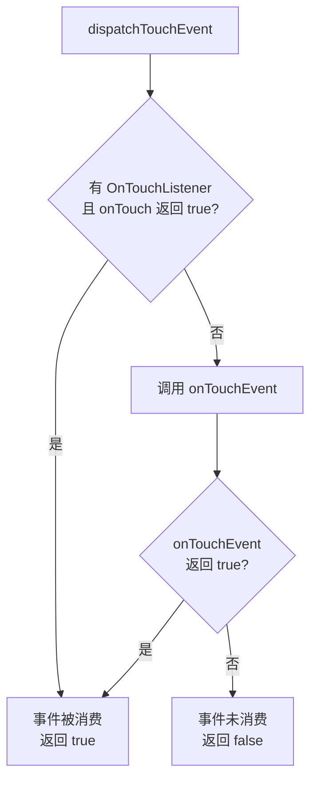
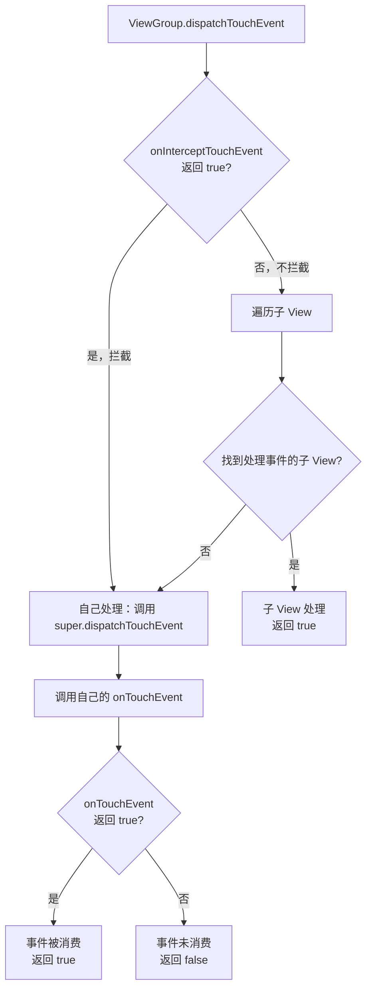

# 事件分发机制 基础篇

## 技术演进：为什么需要事件分发机制？

### 从一个困惑说起

假设你有一个复杂的界面：

```
┌─────────────────────────────────────┐
│  Activity                           │
│  ┌───────────────────────────────┐  │
│  │  ScrollView                   │  │
│  │  ┌─────────────────────────┐  │  │
│  │  │  LinearLayout           │  │  │
│  │  │  ┌───────────────────┐  │  │  │
│  │  │  │  Button            │  │  │  │
│  │  │  │                    │  │  │  │
│  │  │  └───────────────────┘  │  │  │
│  │  └─────────────────────────┘  │  │
│  └───────────────────────────────┘  │
└─────────────────────────────────────┘
```

当你点击 Button 时，这个触摸事件应该给谁处理？
- Activity 说："我是老大，先给我看看"
- ScrollView 说："万一是滑动呢？我得判断"
- Button 说："明明点的是我，应该我处理"

**问题来了**：多个 View 层层嵌套，触摸事件该由谁处理？怎么确定？

### Android 的解决方案

Android 设计了一套**事件分发机制**——就像公司的审批流程：

```
触摸屏幕
    ↓
老板（Activity）先看一眼
    ↓
部门经理（ViewGroup）看看是不是自己的事
    ↓
员工（View）收到并处理
    ↓
如果没人处理，逐级上报
```

这套机制保证了：
1. **有序性**：事件按照 View 树结构有序传递
2. **可控性**：任何一层都可以决定拦截或放行
3. **灵活性**：支持各种复杂的交互场景

## 核心概念

### 1. MotionEvent：触摸事件

用户的每一次触摸都会产生一个 MotionEvent 对象，记录触摸的详细信息。

**核心事件类型**：

| 事件类型 | 触发时机 | 说明 |
|---------|---------|------|
| ACTION_DOWN | 手指按下 | **事件序列的起点**，最重要！ |
| ACTION_MOVE | 手指移动 | 按下后移动，可能产生很多次 |
| ACTION_UP | 手指抬起 | **事件序列的终点** |
| ACTION_CANCEL | 事件被取消 | 父 View 拦截时，子 View 收到此事件 |

**生活类比**：

```
一次完整的触摸 = 一通电话
ACTION_DOWN  = 拿起电话，开始通话
ACTION_MOVE  = 通话中……
ACTION_UP    = 挂断电话
ACTION_CANCEL = 信号中断，被迫挂断
```

**MotionEvent 的核心方法**：

```kotlin
event.action       // 事件类型（DOWN/MOVE/UP）
event.x / event.y  // 相对于当前 View 的坐标
event.rawX / event.rawY  // 相对于屏幕的坐标
event.eventTime    // 事件发生时间
event.downTime     // 按下时的时间（用于计算按压时长）
```

### 2. 事件序列

**一个完整的事件序列**从 ACTION_DOWN 开始，到 ACTION_UP 或 ACTION_CANCEL 结束。

```
事件序列 = DOWN + 若干 MOVE + UP/CANCEL

示例：点击一下
DOWN → UP

示例：滑动一下
DOWN → MOVE → MOVE → MOVE → ... → UP

示例：被父 View 拦截
DOWN → MOVE → CANCEL（剩下的事件不再传给你）
```

> **重要**：ACTION_DOWN 决定了整个事件序列由谁处理。如果 DOWN 时没有 View 消费它，后续的 MOVE、UP 都不会再传给这个 View。

### 3. 三大核心方法

事件分发涉及三个核心方法：

| 方法 | 所属类 | 作用 |
|-----|-------|------|
| `dispatchTouchEvent()` | Activity/ViewGroup/View | 分发事件，决定事件的流向 |
| `onInterceptTouchEvent()` | ViewGroup **专属** | 拦截事件，决定是否由自己处理 |
| `onTouchEvent()` | Activity/ViewGroup/View | 消费事件，实际的处理逻辑 |

**生活类比**：

```
dispatchTouchEvent    = 收发室，负责分发快递
onInterceptTouchEvent = 部门经理，可以截留快递自己处理
onTouchEvent          = 实际拆快递、处理内容的人
```

## 事件分发流程

### View 的事件分发（最简单）

View 是叶子节点，没有子 View，所以它的逻辑最简单：收到事件 → 决定是否消费。



**伪代码理解**：

```kotlin
// View.dispatchTouchEvent 简化逻辑
fun dispatchTouchEvent(event: MotionEvent): Boolean {
    var result = false
    
    // 1. 先问 OnTouchListener
    if (onTouchListener != null && onTouchListener.onTouch(this, event)) {
        result = true  // Listener 说处理了，那就结束
    }
    
    // 2. Listener 不处理，再调 onTouchEvent
    if (!result) {
        result = onTouchEvent(event)
    }
    
    return result
}
```

> **优先级**：OnTouchListener.onTouch() > View.onTouchEvent() > OnClickListener.onClick()

### ViewGroup 的事件分发（核心重点）

ViewGroup 比 View 多了一层"拦截"逻辑：先问自己要不要拦截，不拦截再往下分发。



**伪代码解析**（理解调用关系的关键）：

```kotlin
// ViewGroup 继承自 View
class ViewGroup : View() {
    
    // 重写了 View 的 dispatchTouchEvent
    override fun dispatchTouchEvent(event: MotionEvent): Boolean {
        // 当前已经在 dispatchTouchEvent 方法内部了！
        
        // Step 1: 在内部调用 onInterceptTouchEvent 判断是否拦截
        val intercepted = onInterceptTouchEvent(event)
        
        if (intercepted) {
            // Step 2: 拦截了，调用父类 View 的 dispatchTouchEvent
            // super 指向 View 类，不是递归调用自己
            return super.dispatchTouchEvent(event)
        } else {
            // Step 3: 不拦截，遍历子 View 进行分发
            for (child in children) {
                if (child.dispatchTouchEvent(event)) {
                    return true  // 子 View 消费了事件
                }
            }
            // 没有子 View 消费，自己处理
            return super.dispatchTouchEvent(event)
        }
    }
}

// View 类的 dispatchTouchEvent
class View {
    fun dispatchTouchEvent(event: MotionEvent): Boolean {
        // 这就是 super.dispatchTouchEvent 实际调用的方法
        // 最终会调用 onTouchEvent
        return onTouchEvent(event)
    }
}
```

> **重点理解**：`onInterceptTouchEvent` 是在 `dispatchTouchEvent` **内部**被调用的，拦截后继续执行 `dispatchTouchEvent` 的后续逻辑（调用 `super.dispatchTouchEvent`），而不是重新进入方法。

### 完整的 U 型分发结构

事件从 Activity 开始，一路向下传递，如果没人处理，再一路向上返回。形成一个 **U 型结构**：

```
                    Activity
                       │
                dispatchTouchEvent ──────────────────────┐
                       │                                 │
                       ↓                                 │
                  ViewGroup                              │
                       │                                 │
      onInterceptTouchEvent → 拦截？                      │
          │                    │                         │
          │ 否                 │ 是                      │
          ↓                    │                         │
         View                  │                         │
          │                    │                         │
   dispatchTouchEvent          │                         │
          │                    │                         │
      onTouchEvent ←───────────┘                         │
          │                                              │
          │ 不消费                                       │
          ↓                                              │
    ViewGroup.onTouchEvent                               │
          │                                              │
          │ 不消费                                       │
          ↓                                              │
    Activity.onTouchEvent ←──────────────────────────────┘
```

**大白话总结**：
1. **事件像水流一样从上往下流**（Activity → ViewGroup → View）
2. **每一层都可以"截流"**（拦截/消费事件）
3. **如果到底了还没人要，就逆流而上**（回传给上层的 onTouchEvent）

## 代码示例：观察事件分发

### 自定义 View 打印日志

```kotlin
// 自定义 ViewGroup，用于观察事件分发流程
class MyViewGroup @JvmOverloads constructor(
    context: Context,
    attrs: AttributeSet? = null
) : FrameLayout(context, attrs) {

    override fun dispatchTouchEvent(ev: MotionEvent): Boolean {
        Log.d("Event", "ViewGroup dispatchTouchEvent: ${ev.actionName}")
        return super.dispatchTouchEvent(ev)
    }

    override fun onInterceptTouchEvent(ev: MotionEvent): Boolean {
        Log.d("Event", "ViewGroup onInterceptTouchEvent: ${ev.actionName}")
        return super.onInterceptTouchEvent(ev)
    }

    override fun onTouchEvent(event: MotionEvent): Boolean {
        Log.d("Event", "ViewGroup onTouchEvent: ${event.actionName}")
        return super.onTouchEvent(event)
    }
}

// 自定义 View
class MyView @JvmOverloads constructor(
    context: Context,
    attrs: AttributeSet? = null
) : View(context, attrs) {

    override fun dispatchTouchEvent(ev: MotionEvent): Boolean {
        Log.d("Event", "View dispatchTouchEvent: ${ev.actionName}")
        return super.dispatchTouchEvent(ev)
    }

    override fun onTouchEvent(event: MotionEvent): Boolean {
        Log.d("Event", "View onTouchEvent: ${event.actionName}")
        return super.onTouchEvent(event)
    }
}

// 扩展属性，方便打印事件名称
val MotionEvent.actionName: String
    get() = when (action) {
        MotionEvent.ACTION_DOWN -> "DOWN"
        MotionEvent.ACTION_MOVE -> "MOVE"
        MotionEvent.ACTION_UP -> "UP"
        MotionEvent.ACTION_CANCEL -> "CANCEL"
        else -> "UNKNOWN($action)"
    }
```

### 默认情况下的日志输出

```kotlin
// 点击一下 MyView（MyView 默认不消费事件）
// 输出：
ViewGroup dispatchTouchEvent: DOWN
ViewGroup onInterceptTouchEvent: DOWN
View dispatchTouchEvent: DOWN
View onTouchEvent: DOWN          // View 不消费，返回 false
ViewGroup onTouchEvent: DOWN     // 回传给 ViewGroup

// 注意：因为 DOWN 没人消费，后续的 MOVE、UP 不会再传给这个 View 树
```

### 让 View 消费事件

```kotlin
class MyView : View(context) {
    override fun onTouchEvent(event: MotionEvent): Boolean {
        Log.d("Event", "View onTouchEvent: ${event.actionName}")
        return true  // ← 返回 true，表示消费事件
    }
}

// 点击一下 MyView
// 输出：
ViewGroup dispatchTouchEvent: DOWN
ViewGroup onInterceptTouchEvent: DOWN
View dispatchTouchEvent: DOWN
View onTouchEvent: DOWN          // 消费！

ViewGroup dispatchTouchEvent: MOVE
ViewGroup onInterceptTouchEvent: MOVE
View dispatchTouchEvent: MOVE
View onTouchEvent: MOVE          // 继续收到 MOVE

ViewGroup dispatchTouchEvent: UP
ViewGroup onInterceptTouchEvent: UP
View dispatchTouchEvent: UP
View onTouchEvent: UP            // 收到 UP，完整的事件序列
```

## 常见坑点

### 坑点1：点击事件无响应

**问题现象**：Button 放在自定义 ViewGroup 里，点击没反应。

```kotlin
// ❌ 错误示范
class MyViewGroup : FrameLayout(context) {
    override fun onInterceptTouchEvent(ev: MotionEvent): Boolean {
        return true  // 无脑拦截所有事件
    }
}
```

**原因**：ViewGroup 拦截了所有事件，子 View（Button）收不到事件。

**解决**：只在需要时拦截，比如只拦截滑动：

```kotlin
// ✅ 正确做法
override fun onInterceptTouchEvent(ev: MotionEvent): Boolean {
    // 只有检测到滑动时才拦截
    return when (ev.action) {
        MotionEvent.ACTION_DOWN -> false  // DOWN 不拦截，先让子 View 响应
        MotionEvent.ACTION_MOVE -> {
            // 判断是否是滑动
            val dx = abs(ev.x - lastX)
            val dy = abs(ev.y - lastY)
            dx > touchSlop || dy > touchSlop  // 滑动距离超过阈值才拦截
        }
        else -> false
    }
}
```

### 坑点2：ACTION_DOWN 返回 false 后收不到后续事件

**问题现象**：自定义 View 只能收到 DOWN 事件，MOVE 和 UP 都收不到。

```kotlin
// ❌ 错误示范
override fun onTouchEvent(event: MotionEvent): Boolean {
    when (event.action) {
        MotionEvent.ACTION_DOWN -> {
            Log.d("TAG", "DOWN")  // 能打印
            // 没有返回 true
        }
        MotionEvent.ACTION_MOVE -> {
            Log.d("TAG", "MOVE")  // 永远不会打印！
        }
    }
    return super.onTouchEvent(event)  // View 默认返回 false
}
```

**原因**：ACTION_DOWN 时返回 false，表示"我不要这个事件序列"，系统就不会再把后续事件给你。

**解决**：

```kotlin
// ✅ 正确做法
override fun onTouchEvent(event: MotionEvent): Boolean {
    when (event.action) {
        MotionEvent.ACTION_DOWN -> {
            return true  // 必须返回 true，表示"我要处理这个事件序列"
        }
        MotionEvent.ACTION_MOVE -> {
            // 现在能收到了
        }
        MotionEvent.ACTION_UP -> {
            // 现在也能收到了
        }
    }
    return true
}
```

### 坑点3：clickable 属性的影响

**问题现象**：明明没写任何事件处理代码，View 却消费了事件。

**原因**：`clickable="true"` 或设置了 OnClickListener 会让 View 默认消费事件。

```kotlin
// View.onTouchEvent 的简化逻辑
fun onTouchEvent(event: MotionEvent): Boolean {
    if (isClickable || isLongClickable || isContextClickable) {
        // 处理点击逻辑
        return true  // 消费事件
    }
    return false
}
```

**影响**：

```xml
<!-- 即使不设置点击事件，设置 clickable="true" 也会消费事件 -->
<View
    android:clickable="true"
    ... />
```

### 坑点4：父 View 拦截后，子 View 收到 CANCEL

**问题现象**：子 View 正在处理事件，突然收到 ACTION_CANCEL。

```kotlin
// 场景：子 View 是一个 Button，父 View 是 ScrollView
// 用户按下 Button，然后开始滑动

Button 收到 DOWN → Button 变成按下状态
用户开始滑动
ScrollView 决定拦截（onInterceptTouchEvent 返回 true）
Button 收到 CANCEL → Button 恢复正常状态
后续 MOVE、UP 都给 ScrollView
```

**这是正常的设计**：ACTION_CANCEL 告诉子 View"你被抢走了，记得恢复状态"。

**处理方式**：

```kotlin
override fun onTouchEvent(event: MotionEvent): Boolean {
    when (event.action) {
        MotionEvent.ACTION_DOWN -> {
            // 进入按下状态
            isPressed = true
        }
        MotionEvent.ACTION_CANCEL -> {
            // 被取消，恢复状态
            isPressed = false
        }
        MotionEvent.ACTION_UP -> {
            // 正常抬起
            isPressed = false
            performClick()
        }
    }
    return true
}
```

### 坑点5：onTouch 和 onClick 的优先级

```kotlin
view.setOnTouchListener { v, event ->
    Log.d("TAG", "onTouch: ${event.action}")
    false  // 返回 false，不消费
}

view.setOnClickListener {
    Log.d("TAG", "onClick")
}

// 点击输出：
onTouch: 0 (DOWN)
onTouch: 1 (UP)
onClick
```

如果 onTouch 返回 true：

```kotlin
view.setOnTouchListener { v, event ->
    Log.d("TAG", "onTouch: ${event.action}")
    true  // 返回 true，消费事件
}

// 点击输出：
onTouch: 0 (DOWN)
onTouch: 1 (UP)
// onClick 不会执行！
```

**结论**：
- onTouch 返回 true → 事件被消费 → onTouchEvent 不执行 → onClick 不执行
- onTouch 返回 false → 事件继续传递 → onTouchEvent 执行 → onClick 可能执行

## 小结

| 概念 | 说明 |
|-----|------|
| MotionEvent | 触摸事件对象，包含 DOWN/MOVE/UP/CANCEL |
| 事件序列 | 从 DOWN 开始，到 UP/CANCEL 结束的一系列事件 |
| dispatchTouchEvent | 分发事件，Activity/ViewGroup/View 都有 |
| onInterceptTouchEvent | 拦截事件，ViewGroup **专属** |
| onTouchEvent | 消费事件，实际处理触摸的地方 |

**核心规则**：
1. **DOWN 决定一切**：DOWN 时谁消费，后续事件就给谁
2. **U 型结构**：先下发，无人处理再上报
3. **拦截即接管**：ViewGroup 一旦拦截，子 View 收到 CANCEL

---

## 面试题检验

### Q1：事件分发的三个核心方法是什么？有什么区别？

**结论**：dispatchTouchEvent 负责分发，onInterceptTouchEvent 负责拦截（ViewGroup 专属），onTouchEvent 负责消费。

**流程**：
1. 事件到达 ViewGroup，先调 dispatchTouchEvent
2. dispatchTouchEvent 内部调 onInterceptTouchEvent 决定是否拦截
3. 不拦截 → 传给子 View；拦截 → 自己的 onTouchEvent 处理

---

### Q2：为什么 ACTION_DOWN 特别重要？

**结论**：ACTION_DOWN 决定了整个事件序列由谁处理。

**原理**：
- 如果 DOWN 时某个 View 消费了事件（返回 true），系统会记住它
- 后续的 MOVE、UP 都直接发给这个 View
- 如果 DOWN 时没有 View 消费，后续事件不会再传给这个 View 树

**类比**：ACTION_DOWN 就像"签收快递"，签了字后续的包裹都给你；不签字就没你的份了。

---

### Q3：onTouch 和 onClick 的执行顺序和关系？

**结论**：onTouch 优先于 onClick，且 onTouch 返回 true 会阻止 onClick 执行。

**原理**：
1. dispatchTouchEvent 先调 OnTouchListener.onTouch()
2. onTouch 返回 false 才继续调 onTouchEvent
3. onClick 是在 onTouchEvent 的 ACTION_UP 中触发的

**优先级**：OnTouchListener > onTouchEvent > OnClickListener

---

### Q4：View 的 clickable 属性对事件分发有什么影响？

**结论**：clickable=true 会让 View 默认消费事件（onTouchEvent 返回 true）。

**影响**：
- 设置 OnClickListener 会自动把 clickable 设为 true
- Button 等可点击控件默认 clickable=true
- 普通 View 默认 clickable=false

---

### Q5：子 View 什么时候会收到 ACTION_CANCEL？

**结论**：当父 View 中途拦截事件时，子 View 会收到 CANCEL。

**场景**：
1. 子 View 消费了 DOWN，正在接收后续事件
2. 父 View 的 onInterceptTouchEvent 返回 true，决定拦截
3. 子 View 收到 CANCEL，告诉它"事件被抢走了"
4. 后续事件不再传给子 View

**处理**：在 onTouchEvent 中处理 ACTION_CANCEL，恢复状态。

---

_本文档将持续更新，添加更多相关内容_
