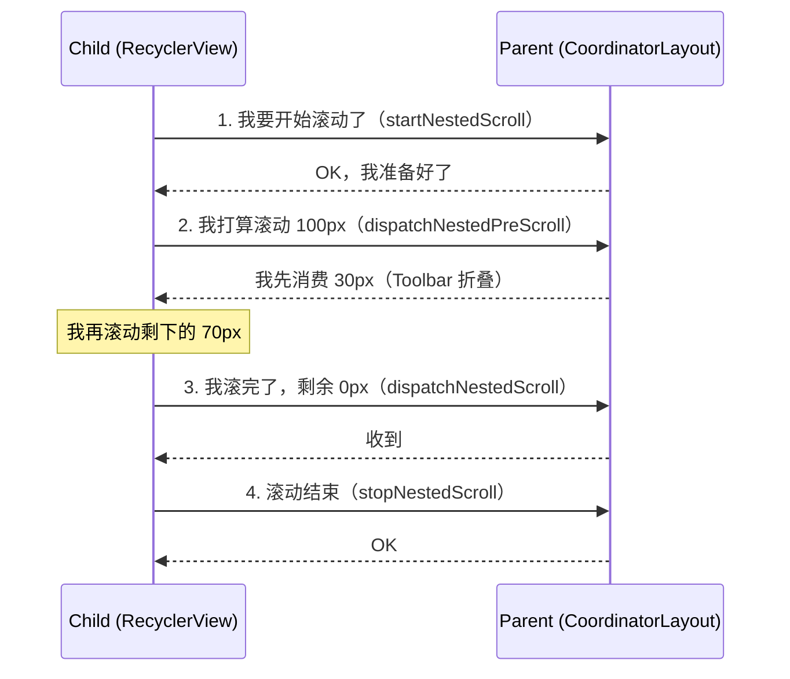

# 事件分发机制 进阶篇

## 滑动冲突：事件分发的终极考验

### 什么是滑动冲突？

当多个可滑动的 View 嵌套在一起时，系统不知道该响应谁的滑动，这就是**滑动冲突**。

**生活类比**：就像两个人同时要开一扇门——一个要往里推，一个要往外拉——门不知道该听谁的。

### 滑动冲突的三种类型

```
┌─────────────────────────────────────────────────────────────┐
│                    滑动冲突的三种类型                        │
├─────────────────────────────────────────────────────────────┤
│                                                             │
│  类型1：同向冲突                                             │
│  ┌─────────────────┐                                        │
│  │ ScrollView (↕)  │  两个都是竖向滑动                       │
│  │ ┌─────────────┐ │                                        │
│  │ │ ListView(↕) │ │                                        │
│  │ └─────────────┘ │                                        │
│  └─────────────────┘                                        │
│                                                             │
│  类型2：异向冲突                                             │
│  ┌─────────────────┐                                        │
│  │ ScrollView (↕)  │  一个竖向，一个横向                     │
│  │ ┌─────────────┐ │                                        │
│  │ │ViewPager(↔) │ │                                        │
│  │ └─────────────┘ │                                        │
│  └─────────────────┘                                        │
│                                                             │
│  类型3：混合冲突                                             │
│  ┌─────────────────┐                                        │
│  │ ScrollView (↕)  │  多层嵌套，同向+异向                    │
│  │ ┌─────────────┐ │                                        │
│  │ │ViewPager(↔) │ │                                        │
│  │ │ ┌─────────┐ │ │                                        │
│  │ │ │List (↕) │ │ │                                        │
│  │ │ └─────────┘ │ │                                        │
│  │ └─────────────┘ │                                        │
│  └─────────────────┘                                        │
│                                                             │
└─────────────────────────────────────────────────────────────┘
```

### 解决思路

无论哪种冲突，解决方案都是一样的：**在合适的时机，让合适的 View 处理事件**。

核心就是两个问题：
1. **谁来判断**：父 View 判断（外部拦截法）还是子 View 判断（内部拦截法）
2. **如何判断**：根据滑动方向、滑动距离、业务逻辑等条件

## 外部拦截法（推荐）

### 核心思想

**父 View 掌控全局**：由父 View 的 `onInterceptTouchEvent` 决定是否拦截事件。

```
父 View 说："我来看看这个事件，是滑动我就处理，是点击就交给你"
```

### 代码模板

```kotlin
/**
 * 外部拦截法模板
 * 在父 View 的 onInterceptTouchEvent 中处理
 */
class OuterInterceptViewGroup @JvmOverloads constructor(
    context: Context,
    attrs: AttributeSet? = null
) : FrameLayout(context, attrs) {

    private var lastX = 0f
    private var lastY = 0f
    // 系统认为的最小滑动距离
    private val touchSlop = ViewConfiguration.get(context).scaledTouchSlop

    override fun onInterceptTouchEvent(ev: MotionEvent): Boolean {
        var intercepted = false
        
        when (ev.action) {
            MotionEvent.ACTION_DOWN -> {
                // DOWN 事件不能拦截，否则子 View 收不到任何事件
                lastX = ev.x
                lastY = ev.y
                intercepted = false
            }
            MotionEvent.ACTION_MOVE -> {
                val dx = ev.x - lastX
                val dy = ev.y - lastY
                
                // 这里是拦截的判断逻辑（根据实际需求修改）
                intercepted = shouldIntercept(dx, dy)
            }
            MotionEvent.ACTION_UP -> {
                // UP 事件不拦截，让子 View 能收到完整事件
                intercepted = false
            }
        }
        
        lastX = ev.x
        lastY = ev.y
        return intercepted
    }

    /**
     * 判断是否需要拦截（根据业务需求实现）
     * 示例：横向滑动距离大于竖向时拦截
     */
    private fun shouldIntercept(dx: Float, dy: Float): Boolean {
        return abs(dx) > abs(dy) && abs(dx) > touchSlop
    }

    override fun onTouchEvent(event: MotionEvent): Boolean {
        // 拦截后在这里处理滑动逻辑
        when (event.action) {
            MotionEvent.ACTION_MOVE -> {
                val dx = event.x - lastX
                // 执行滑动，比如 scrollBy(-dx.toInt(), 0)
            }
        }
        lastX = event.x
        lastY = event.y
        return true
    }
}
```

### 实战：ScrollView + ViewPager 冲突解决

```kotlin
/**
 * 可以内嵌 ViewPager 的 ScrollView
 * 解决异向滑动冲突：竖向滑动给 ScrollView，横向滑动给 ViewPager
 */
class NestedScrollView @JvmOverloads constructor(
    context: Context,
    attrs: AttributeSet? = null
) : ScrollView(context, attrs) {

    private var lastX = 0f
    private var lastY = 0f
    private val touchSlop = ViewConfiguration.get(context).scaledTouchSlop

    override fun onInterceptTouchEvent(ev: MotionEvent): Boolean {
        when (ev.action) {
            MotionEvent.ACTION_DOWN -> {
                lastX = ev.x
                lastY = ev.y
                // 调用 super 确保正常的滚动状态处理
                super.onInterceptTouchEvent(ev)
                return false
            }
            MotionEvent.ACTION_MOVE -> {
                val dx = abs(ev.x - lastX)
                val dy = abs(ev.y - lastY)
                
                // 竖向滑动距离大于横向，且超过最小滑动距离 → 拦截
                if (dy > dx && dy > touchSlop) {
                    return true  // ScrollView 处理竖向滑动
                }
                // 横向滑动 → 不拦截，让 ViewPager 处理
                return false
            }
        }
        return super.onInterceptTouchEvent(ev)
    }
}
```

### 外部拦截法要点

| 事件 | 是否拦截 | 原因 |
|-----|---------|------|
| DOWN | **不能拦截** | 拦截后子 View 收不到任何事件 |
| MOVE | **按条件判断** | 满足父 View 处理条件时拦截 |
| UP | **一般不拦截** | 让子 View 能收到完整事件序列 |

## 内部拦截法

### 核心思想

**子 View 请求自主权**：子 View 通过 `requestDisallowInterceptTouchEvent()` 告诉父 View"别管我的事"。

```
子 View 说："老板，这件事我能处理，您别插手"
```

### 代码模板

**子 View 的处理**：

```kotlin
/**
 * 内部拦截法——子 View 的处理
 */
class InnerInterceptView @JvmOverloads constructor(
    context: Context,
    attrs: AttributeSet? = null
) : View(context, attrs) {

    private var lastX = 0f
    private var lastY = 0f

    override fun dispatchTouchEvent(ev: MotionEvent): Boolean {
        when (ev.action) {
            MotionEvent.ACTION_DOWN -> {
                // DOWN 时告诉父 View：别拦截我
                parent.requestDisallowInterceptTouchEvent(true)
                lastX = ev.x
                lastY = ev.y
            }
            MotionEvent.ACTION_MOVE -> {
                val dx = ev.x - lastX
                val dy = ev.y - lastY
                
                // 如果需要父 View 处理，放开拦截权
                if (shouldParentHandle(dx, dy)) {
                    parent.requestDisallowInterceptTouchEvent(false)
                }
            }
        }
        lastX = ev.x
        lastY = ev.y
        return super.dispatchTouchEvent(ev)
    }

    /**
     * 判断是否应该让父 View 处理
     */
    private fun shouldParentHandle(dx: Float, dy: Float): Boolean {
        // 示例：竖向滑动让父 View 处理
        return abs(dy) > abs(dx)
    }
}
```

**父 View 的配合**（必须！）：

```kotlin
/**
 * 内部拦截法——父 View 的配合
 * 父 View 必须在 DOWN 时不拦截，否则内部拦截法失效
 */
class ParentViewGroup @JvmOverloads constructor(
    context: Context,
    attrs: AttributeSet? = null
) : FrameLayout(context, attrs) {

    override fun onInterceptTouchEvent(ev: MotionEvent): Boolean {
        // DOWN 不拦截，其他事件都拦截（除非子 View 请求不拦截）
        return ev.action != MotionEvent.ACTION_DOWN
    }
}
```

### 两种方法对比

| 对比项 | 外部拦截法 | 内部拦截法 |
|-------|----------|----------|
| **判断位置** | 父 View 的 onInterceptTouchEvent | 子 View 的 dispatchTouchEvent |
| **代码复杂度** | 较简单 | 较复杂（需要父子配合） |
| **灵活性** | 父 View 掌控，适合统一管理 | 子 View 自主，适合子 View 有特殊需求 |
| **推荐程度** | ⭐⭐⭐⭐⭐ 首选 | ⭐⭐⭐ 特殊场景使用 |
| **典型场景** | 自定义 ViewGroup | ViewPager 内部的自定义 View |

## NestedScrolling 嵌套滑动机制

### 为什么需要 NestedScrolling？

传统的事件分发有一个问题：**一旦子 View 消费了事件，父 View 就无法再参与**。

```
场景：RecyclerView 嵌套在 CoordinatorLayout 中

用户向上滑动 RecyclerView
├── RecyclerView 消费事件，开始滚动
├── 但我们希望：先让 Toolbar 折叠，然后 RecyclerView 再滚动
└── 传统事件分发做不到！
```

**NestedScrolling 的解决方案**：让子 View 在消费事件的同时，可以把滚动"分享"给父 View。

### 工作原理



### 核心接口

**子 View 实现** `NestedScrollingChild`：

```kotlin
interface NestedScrollingChild {
    // 开始嵌套滚动
    fun startNestedScroll(axes: Int): Boolean
    
    // 滚动前先问父 View 要不要消费（pre = 预先）
    fun dispatchNestedPreScroll(
        dx: Int, dy: Int,           // 计划滚动的距离
        consumed: IntArray?,        // 父 View 消费的距离（输出参数）
        offsetInWindow: IntArray?   // 窗口偏移量（输出参数）
    ): Boolean
    
    // 滚动后把剩余的给父 View
    fun dispatchNestedScroll(
        dxConsumed: Int, dyConsumed: Int,       // 子 View 已消费的
        dxUnconsumed: Int, dyUnconsumed: Int,   // 子 View 未消费的
        offsetInWindow: IntArray?
    ): Boolean
    
    // 结束嵌套滚动
    fun stopNestedScroll()
}
```

**父 View 实现** `NestedScrollingParent`：

```kotlin
interface NestedScrollingParent {
    // 子 View 开始滚动时调用
    fun onStartNestedScroll(child: View, target: View, axes: Int): Boolean
    
    // 子 View 滚动前，父 View 先消费
    fun onNestedPreScroll(target: View, dx: Int, dy: Int, consumed: IntArray)
    
    // 子 View 滚动后，父 View 处理剩余
    fun onNestedScroll(
        target: View, 
        dxConsumed: Int, dyConsumed: Int,
        dxUnconsumed: Int, dyUnconsumed: Int
    )
    
    // 子 View 停止滚动
    fun onStopNestedScroll(target: View)
}
```

### 实战：简单的嵌套滑动示例

```kotlin
/**
 * 支持嵌套滚动的父 View
 * 当子 View 滚动时，先让自己滚动，滚完了再让子 View 滚
 */
class NestedScrollParent @JvmOverloads constructor(
    context: Context,
    attrs: AttributeSet? = null
) : LinearLayout(context, attrs), NestedScrollingParent2 {

    private val parentHelper = NestedScrollingParentHelper(this)
    private var headerHeight = 0  // 头部可折叠的高度

    override fun onStartNestedScroll(child: View, target: View, axes: Int, type: Int): Boolean {
        // 只处理垂直方向的嵌套滚动
        return axes and ViewCompat.SCROLL_AXIS_VERTICAL != 0
    }

    override fun onNestedPreScroll(target: View, dx: Int, dy: Int, consumed: IntArray, type: Int) {
        // 子 View 滚动前，先看自己要不要消费
        
        // dy > 0 表示向上滑动（手指向上）
        // 如果头部还没完全折叠，先折叠头部
        val canScrollUp = dy > 0 && scrollY < headerHeight
        // dy < 0 表示向下滑动
        // 如果头部已经折叠且子 View 在顶部，先展开头部
        val canScrollDown = dy < 0 && scrollY > 0 && !target.canScrollVertically(-1)
        
        if (canScrollUp || canScrollDown) {
            val consumedY = dy.coerceIn(-scrollY, headerHeight - scrollY)
            scrollBy(0, consumedY)
            consumed[1] = consumedY  // 告诉子 View：我消费了这么多
        }
    }

    override fun onNestedScroll(
        target: View, dxConsumed: Int, dyConsumed: Int,
        dxUnconsumed: Int, dyUnconsumed: Int, type: Int
    ) {
        // 子 View 滚动后，处理剩余的滚动量
        // 这里可以做 overscroll 效果
    }

    // ... 其他方法实现（直接委托给 parentHelper）
}
```

### 系统中使用 NestedScrolling 的组件

| 组件 | 角色 | 说明 |
|-----|------|------|
| RecyclerView | Child | 默认支持嵌套滚动 |
| NestedScrollView | Child + Parent | 既能作为子也能作为父 |
| CoordinatorLayout | Parent | Material Design 的核心组件 |
| SwipeRefreshLayout | Parent | 下拉刷新 |
| AppBarLayout | 配合 CoordinatorLayout | Toolbar 折叠效果 |

## 手势检测 GestureDetector

### 为什么需要 GestureDetector？

直接处理 MotionEvent 太底层了：

```kotlin
// ❌ 手动实现点击检测很麻烦
var downTime = 0L
var downX = 0f
var downY = 0f

override fun onTouchEvent(event: MotionEvent): Boolean {
    when (event.action) {
        ACTION_DOWN -> {
            downTime = System.currentTimeMillis()
            downX = event.x
            downY = event.y
        }
        ACTION_UP -> {
            val dx = abs(event.x - downX)
            val dy = abs(event.y - downY)
            val duration = System.currentTimeMillis() - downTime
            
            // 移动距离小且时间短 = 点击
            if (dx < touchSlop && dy < touchSlop && duration < 500) {
                // 是点击
            }
        }
    }
    return true
}
```

**GestureDetector** 封装了常见手势的检测逻辑，让我们专注于业务。

### 基本用法

```kotlin
class GestureView @JvmOverloads constructor(
    context: Context,
    attrs: AttributeSet? = null
) : View(context, attrs) {

    // 1. 创建手势监听器
    private val gestureListener = object : GestureDetector.SimpleOnGestureListener() {
        
        // 单击（按下后快速抬起）
        override fun onSingleTapUp(e: MotionEvent): Boolean {
            Log.d("Gesture", "单击")
            return true
        }
        
        // 确认的单击（双击检测超时后触发，比 onSingleTapUp 晚）
        override fun onSingleTapConfirmed(e: MotionEvent): Boolean {
            Log.d("Gesture", "确认单击")
            return true
        }
        
        // 双击
        override fun onDoubleTap(e: MotionEvent): Boolean {
            Log.d("Gesture", "双击")
            return true
        }
        
        // 长按
        override fun onLongPress(e: MotionEvent) {
            Log.d("Gesture", "长按")
        }
        
        // 滚动（手指拖动）
        override fun onScroll(
            e1: MotionEvent?,      // DOWN 事件
            e2: MotionEvent,       // 当前 MOVE 事件
            distanceX: Float,      // X 方向滚动距离（上次到这次）
            distanceY: Float       // Y 方向滚动距离
        ): Boolean {
            Log.d("Gesture", "滚动 dx=$distanceX, dy=$distanceY")
            return true
        }
        
        // 快速滑动（fling，手指快速滑动后抬起）
        override fun onFling(
            e1: MotionEvent?,
            e2: MotionEvent,
            velocityX: Float,  // X 方向速度（像素/秒）
            velocityY: Float   // Y 方向速度
        ): Boolean {
            Log.d("Gesture", "快速滑动 vx=$velocityX, vy=$velocityY")
            return true
        }
        
        // 按下（每次触摸都会触发）
        override fun onDown(e: MotionEvent): Boolean {
            Log.d("Gesture", "按下")
            return true  // 必须返回 true，否则后续事件收不到
        }
        
        // 按下后还没抬起（用于显示按压状态）
        override fun onShowPress(e: MotionEvent) {
            Log.d("Gesture", "显示按压")
        }
    }

    // 2. 创建 GestureDetector
    private val gestureDetector = GestureDetector(context, gestureListener)

    // 3. 把事件交给 GestureDetector 处理
    override fun onTouchEvent(event: MotionEvent): Boolean {
        return gestureDetector.onTouchEvent(event)
    }
}
```

### ScaleGestureDetector：缩放手势

```kotlin
class ZoomableView @JvmOverloads constructor(
    context: Context,
    attrs: AttributeSet? = null
) : View(context, attrs) {

    private var scaleFactor = 1f

    // 缩放手势监听
    private val scaleListener = object : ScaleGestureDetector.SimpleOnScaleGestureListener() {
        
        override fun onScale(detector: ScaleGestureDetector): Boolean {
            // detector.scaleFactor: 本次缩放的比例（> 1 放大，< 1 缩小）
            scaleFactor *= detector.scaleFactor
            scaleFactor = scaleFactor.coerceIn(0.5f, 3f)  // 限制缩放范围
            
            invalidate()  // 重绘
            return true
        }
        
        override fun onScaleBegin(detector: ScaleGestureDetector): Boolean {
            Log.d("Scale", "开始缩放")
            return true  // 返回 true 表示接受后续事件
        }
        
        override fun onScaleEnd(detector: ScaleGestureDetector) {
            Log.d("Scale", "结束缩放")
        }
    }

    private val scaleDetector = ScaleGestureDetector(context, scaleListener)

    override fun onTouchEvent(event: MotionEvent): Boolean {
        scaleDetector.onTouchEvent(event)
        return true
    }

    override fun onDraw(canvas: Canvas) {
        super.onDraw(canvas)
        canvas.scale(scaleFactor, scaleFactor, width / 2f, height / 2f)
        // 绘制内容...
    }
}
```

### 组合使用：支持拖拽和缩放

```kotlin
class DragAndZoomView @JvmOverloads constructor(
    context: Context,
    attrs: AttributeSet? = null
) : View(context, attrs) {

    private var translateX = 0f
    private var translateY = 0f
    private var scaleFactor = 1f

    // 拖拽手势
    private val gestureListener = object : GestureDetector.SimpleOnGestureListener() {
        override fun onDown(e: MotionEvent) = true
        
        override fun onScroll(e1: MotionEvent?, e2: MotionEvent, dx: Float, dy: Float): Boolean {
            // distanceX/Y 是"移动的距离"，取反才是"内容应该移动的方向"
            translateX -= dx
            translateY -= dy
            invalidate()
            return true
        }
    }

    // 缩放手势
    private val scaleListener = object : ScaleGestureDetector.SimpleOnScaleGestureListener() {
        override fun onScale(detector: ScaleGestureDetector): Boolean {
            scaleFactor *= detector.scaleFactor
            scaleFactor = scaleFactor.coerceIn(0.5f, 5f)
            invalidate()
            return true
        }
    }

    private val gestureDetector = GestureDetector(context, gestureListener)
    private val scaleDetector = ScaleGestureDetector(context, scaleListener)

    override fun onTouchEvent(event: MotionEvent): Boolean {
        // 两个检测器都处理
        gestureDetector.onTouchEvent(event)
        scaleDetector.onTouchEvent(event)
        return true
    }

    override fun onDraw(canvas: Canvas) {
        super.onDraw(canvas)
        canvas.translate(translateX, translateY)
        canvas.scale(scaleFactor, scaleFactor, width / 2f, height / 2f)
        // 绘制内容...
    }
}
```

## 实战：可拖拽的自定义 View

### 需求分析

实现一个可以在父 View 中自由拖动的 View：

```
┌─────────────────────────────────────┐
│  Parent                             │
│                                     │
│     ┌─────────┐                     │
│     │ DragView│ ←── 可以自由拖动    │
│     └─────────┘                     │
│                                     │
└─────────────────────────────────────┘
```

### 完整实现

```kotlin
/**
 * 可拖拽的 View
 * 支持在父 View 范围内自由拖动，带边界限制
 */
class DraggableView @JvmOverloads constructor(
    context: Context,
    attrs: AttributeSet? = null,
    defStyleAttr: Int = 0
) : View(context, attrs, defStyleAttr) {

    // 上一次触摸的位置（用 rawX/rawY 避免坐标系转换问题）
    private var lastRawX = 0f
    private var lastRawY = 0f
    
    // 是否正在拖拽
    private var isDragging = false
    
    // 判断是否是点击（移动距离小于这个值视为点击）
    private val touchSlop = ViewConfiguration.get(context).scaledTouchSlop

    init {
        // 必须设置为 clickable，否则收不到 MOVE 和 UP 事件
        isClickable = true
    }

    override fun onTouchEvent(event: MotionEvent): Boolean {
        when (event.action) {
            MotionEvent.ACTION_DOWN -> {
                lastRawX = event.rawX
                lastRawY = event.rawY
                isDragging = false
                
                // 请求父 View 不要拦截，让我们能收到完整事件
                parent.requestDisallowInterceptTouchEvent(true)
            }
            
            MotionEvent.ACTION_MOVE -> {
                val dx = event.rawX - lastRawX
                val dy = event.rawY - lastRawY
                
                // 移动距离超过阈值，认为是拖拽
                if (!isDragging && (abs(dx) > touchSlop || abs(dy) > touchSlop)) {
                    isDragging = true
                }
                
                if (isDragging) {
                    // 更新位置
                    updatePosition(dx, dy)
                    
                    lastRawX = event.rawX
                    lastRawY = event.rawY
                }
            }
            
            MotionEvent.ACTION_UP, MotionEvent.ACTION_CANCEL -> {
                // 放开父 View 的拦截限制
                parent.requestDisallowInterceptTouchEvent(false)
                
                if (!isDragging) {
                    // 没有拖拽，视为点击
                    performClick()
                }
                isDragging = false
            }
        }
        return true
    }

    /**
     * 更新 View 的位置，带边界限制
     */
    private fun updatePosition(dx: Float, dy: Float) {
        // 计算新位置
        var newX = x + dx
        var newY = y + dy
        
        // 获取父 View 的边界
        val parent = parent as? ViewGroup ?: return
        val maxX = (parent.width - width).toFloat()
        val maxY = (parent.height - height).toFloat()
        
        // 限制在父 View 范围内
        newX = newX.coerceIn(0f, maxX)
        newY = newY.coerceIn(0f, maxY)
        
        // 应用新位置
        x = newX
        y = newY
    }

    override fun performClick(): Boolean {
        // 调用 super 以支持 OnClickListener 和无障碍服务
        return super.performClick()
    }
}
```

### 使用示例

```xml
<FrameLayout
    android:layout_width="match_parent"
    android:layout_height="match_parent">

    <com.example.DraggableView
        android:id="@+id/draggableView"
        android:layout_width="100dp"
        android:layout_height="100dp"
        android:background="@color/purple_500" />

</FrameLayout>
```

```kotlin
// 添加点击事件
draggableView.setOnClickListener {
    Toast.makeText(this, "点击了！", Toast.LENGTH_SHORT).show()
}
```

## 边界认知：什么时候不该用传统事件分发？

| 场景 | 问题 | 更好的方案 |
|-----|------|----------|
| 复杂嵌套滑动 | 传统分发难以实现"先父后子"的协调 | NestedScrolling 机制 |
| 多指操作 | 事件分发只关注单点，多点处理复杂 | 使用 pointerId 跟踪每个手指 |
| 跨 View 拖拽 | 事件无法在 View 之间传递 | 使用 ViewDragHelper |
| Compose UI | 传统 View 体系不适用 | Compose 的 Modifier.pointerInput |

## 小结

| 方法 | 适用场景 | 复杂度 |
|-----|---------|-------|
| 外部拦截法 | 父 View 主导，统一处理冲突 | ⭐⭐ |
| 内部拦截法 | 子 View 有特殊需求 | ⭐⭐⭐ |
| NestedScrolling | 父子需要协调滑动 | ⭐⭐⭐⭐ |
| GestureDetector | 检测常见手势 | ⭐ |
| ViewDragHelper | 复杂的拖拽场景 | ⭐⭐⭐ |

---

## 面试题检验

### Q1：滑动冲突有哪几种类型？怎么解决？

**结论**：三种类型——同向冲突、异向冲突、混合冲突。解决方案是外部拦截法或内部拦截法。

**原理**：
- **同向冲突**：两个 View 滑动方向相同，如 ScrollView 嵌套 ListView
- **异向冲突**：滑动方向不同，如 ScrollView 嵌套 ViewPager
- **混合冲突**：多层嵌套，同向和异向都有

**解决**：根据业务逻辑判断"该由谁处理"，然后选择外部或内部拦截法实现。

---

### Q2：外部拦截法和内部拦截法的区别？

**结论**：外部拦截法由父 View 在 onInterceptTouchEvent 中判断；内部拦截法由子 View 通过 requestDisallowInterceptTouchEvent 控制。

**对比**：

| 对比项 | 外部拦截法 | 内部拦截法 |
|-------|----------|----------|
| 判断位置 | 父 View | 子 View |
| 核心方法 | onInterceptTouchEvent | requestDisallowInterceptTouchEvent |
| 复杂度 | 简单 | 需要父子配合 |
| 推荐度 | ⭐⭐⭐⭐⭐ | ⭐⭐⭐ |

---

### Q3：requestDisallowInterceptTouchEvent 的作用是什么？

**结论**：告诉父 View"不要拦截我的事件"。

**原理**：
- 调用后，父 View 的 onInterceptTouchEvent 不会被调用
- 只对当前事件序列有效（DOWN 时会重置）
- 可以递归向上传递，影响所有祖先 View

**使用场景**：内部拦截法、子 View 需要完整处理某个事件序列时。

---

### Q4：NestedScrolling 机制解决了什么问题？

**结论**：解决了"子 View 消费事件后，父 View 无法参与"的问题。

**对比**：

| 传统事件分发 | NestedScrolling |
|------------|-----------------|
| 事件只能给一个 View | 滚动可以分享 |
| 子消费后父无法参与 | 父可以预先消费、后续消费 |
| 实现协调效果很难 | 天然支持协调滚动 |

**典型应用**：CoordinatorLayout + AppBarLayout 的折叠效果。

---

### Q5：GestureDetector 的 onDown 方法为什么要返回 true？

**结论**：返回 true 表示"我对这个事件感兴趣"，才能收到后续的 MOVE、UP 事件。

**原理**：
- GestureDetector 内部把事件传给回调
- 如果 onDown 返回 false，后续事件不会传给 GestureDetector
- 这和 View.onTouchEvent 的逻辑一致

---

### Q6：如何实现一个可以在父 View 中自由拖动的 View？

**结论**：在 onTouchEvent 中处理 DOWN/MOVE/UP，记录位置差值并更新 View 的 x/y 属性。

**要点**：
1. ACTION_DOWN 记录初始位置
2. ACTION_MOVE 计算位移并更新位置
3. 使用 rawX/rawY 避免坐标系转换问题
4. 调用 requestDisallowInterceptTouchEvent 防止被拦截
5. 添加边界限制，防止拖出父 View

---

_本文档将持续更新，添加更多相关内容_
