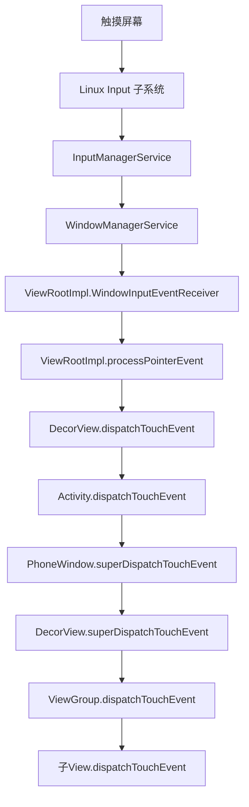
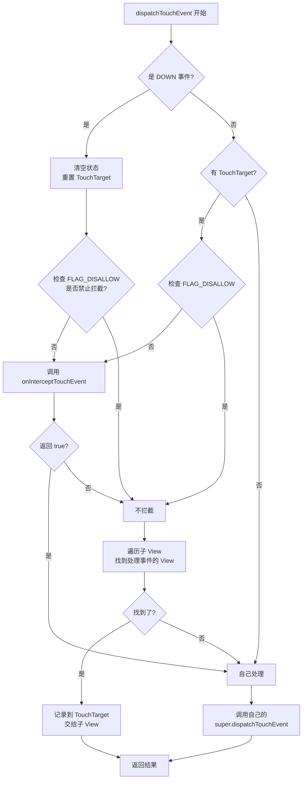

# 事件分发机制 源码篇

## 设计哲学：为什么这样设计？

### 核心设计目标

Android 事件分发机制的设计体现了几个重要的设计原则：

| 设计目标 | 实现方式 | 好处 |
|---------|---------|-----|
| **职责分离** | 分发、拦截、消费三个方法各司其职 | 逻辑清晰，易于扩展 |
| **有序可控** | 按 View 树结构从上到下分发 | 符合 UI 层级直觉 |
| **灵活高效** | 事件序列绑定，减少重复判断 | 性能优化 |
| **向后兼容** | 默认行为合理，不需要特殊处理 | 降低使用门槛 |

### 为什么是 U 型结构？

**设计权衡**：

```
方案1：只向下分发
问题：如果最底层的 View 不处理，事件就丢了

方案2：只向上传递
问题：最上层（Activity）先处理，子 View 没机会

方案3：U 型结构（Android 选择的）
优势：
├── 先给最具体的 View 机会（向下）
├── 处理不了再给父 View（向上）
└── 符合"从具体到抽象"的逻辑
```

**生活类比**：就像公司的审批流程——小事员工自己决定，搞不定再逐级上报。既保证效率，又不遗漏。

## 事件的起点：ViewRootImpl

### 一句话总结

触摸事件从屏幕硬件传来，经过 InputManagerService，通过 ViewRootImpl 进入 View 树。

### 事件流向全景图



### 关键源码：ViewRootImpl

```java
// ViewRootImpl.java
// 事件进入 View 树的入口
private int processPointerEvent(QueuedInputEvent q) {
    final MotionEvent event = (MotionEvent)q.mEvent;
    
    // mView 就是 DecorView，从这里开始分发
    boolean handled = mView.dispatchPointerEvent(event);
    
    return handled ? FINISH_HANDLED : FORWARD;
}

// View.java
// dispatchPointerEvent 内部调用 dispatchTouchEvent
public final boolean dispatchPointerEvent(MotionEvent event) {
    if (event.isTouchEvent()) {
        return dispatchTouchEvent(event);  // 触摸事件走这里
    } else {
        return dispatchGenericMotionEvent(event);  // 其他输入事件
    }
}
```

## Activity 的事件分发

### 一句话总结

Activity 是事件分发的"第一站"，它把事件交给 Window，Window 再交给 DecorView。

### 源码解析

```java
// Activity.java
public boolean dispatchTouchEvent(MotionEvent ev) {
    // 1. 如果是 DOWN 事件，通知 Activity（用于检测用户交互）
    if (ev.getAction() == MotionEvent.ACTION_DOWN) {
        onUserInteraction();  // 空实现，子类可重写
    }
    
    // 2. 把事件交给 Window 处理
    //    getWindow() 返回 PhoneWindow
    //    PhoneWindow 会把事件交给 DecorView
    if (getWindow().superDispatchTouchEvent(ev)) {
        return true;  // 有人处理了，结束
    }
    
    // 3. 没人处理，Activity 自己兜底
    return onTouchEvent(ev);
}

// Activity.onTouchEvent
public boolean onTouchEvent(MotionEvent event) {
    // 如果点击了窗口外部，关闭窗口
    // shouldCloseOnTouch 检查是否点击在 DecorView 外部
    if (mWindow.shouldCloseOnTouch(this, event)) {
        finish();
        return true;
    }
    return false;  // 默认不消费
}
```

**设计亮点**：
- Activity 只是"中转站"，真正的分发逻辑在 ViewGroup
- `onUserInteraction()` 是个巧妙的钩子，可用于检测用户活动（如重置屏幕超时）
- Activity 的 `onTouchEvent` 处理窗口外点击，体现了"兜底"的设计

## ViewGroup 的事件分发（核心重点）

### 一句话总结

ViewGroup 的 `dispatchTouchEvent` 是整个事件分发的核心——它决定是自己处理还是交给子 View。

### 核心流程图



### 关键源码分析

```java
// ViewGroup.java dispatchTouchEvent 精简版
// 完整源码约 250 行，这里提取核心逻辑
public boolean dispatchTouchEvent(MotionEvent ev) {
    boolean handled = false;
    final int action = ev.getAction();
    final int actionMasked = action & MotionEvent.ACTION_MASK;

    // ===== 第一步：DOWN 事件时重置状态 =====
    if (actionMasked == MotionEvent.ACTION_DOWN) {
        // 新的事件序列开始，清空之前的 TouchTarget
        cancelAndClearTouchTargets(ev);
        // 重置 FLAG_DISALLOW_INTERCEPT 标志
        resetTouchState();
    }

    // ===== 第二步：判断是否拦截 =====
    final boolean intercepted;
    if (actionMasked == MotionEvent.ACTION_DOWN || mFirstTouchTarget != null) {
        // 检查子 View 是否禁止父 View 拦截
        final boolean disallowIntercept = (mGroupFlags & FLAG_DISALLOW_INTERCEPT) != 0;
        if (!disallowIntercept) {
            // 没有禁止，调用 onInterceptTouchEvent
            intercepted = onInterceptTouchEvent(ev);
        } else {
            intercepted = false;  // 被禁止了，不能拦截
        }
    } else {
        // 不是 DOWN 且没有 TouchTarget，说明之前没人要这个事件
        // 直接拦截，由自己处理
        intercepted = true;
    }

    // ===== 第三步：不拦截时，寻找目标子 View =====
    if (!intercepted) {
        if (actionMasked == MotionEvent.ACTION_DOWN) {
            // 遍历子 View（从上到下，即 z-order 从高到低）
            for (int i = childrenCount - 1; i >= 0; i--) {
                final View child = children[i];
                
                // 检查触摸点是否在子 View 范围内
                if (!isTransformedTouchPointInView(x, y, child)) {
                    continue;
                }
                
                // 把事件分发给子 View
                if (dispatchTransformedTouchEvent(ev, child)) {
                    // 子 View 消费了事件，记录到 TouchTarget
                    newTouchTarget = addTouchTarget(child, idBitsToAssign);
                    break;  // 找到了，不再继续找
                }
            }
        }
    }

    // ===== 第四步：分发事件 =====
    if (mFirstTouchTarget == null) {
        // 没有 TouchTarget，自己处理
        handled = dispatchTransformedTouchEvent(ev, null);
    } else {
        // 有 TouchTarget，分发给它
        TouchTarget target = mFirstTouchTarget;
        while (target != null) {
            if (intercepted) {
                // 拦截了，给子 View 发 CANCEL
                dispatchTransformedTouchEvent(ev, target.child, ACTION_CANCEL);
            } else {
                // 正常分发
                handled = dispatchTransformedTouchEvent(ev, target.child);
            }
            target = target.next;
        }
    }

    return handled;
}
```

### TouchTarget：事件目标链表

**设计目的**：记住"谁在处理这个事件序列"，避免每次都遍历子 View。

```java
// TouchTarget 是个链表节点
private static final class TouchTarget {
    public View child;        // 目标子 View
    public int pointerIdBits; // 处理的触摸点 ID（支持多点触控）
    public TouchTarget next;  // 下一个节点
}
```

**为什么用链表？** 因为多点触控时，不同的手指可能被不同的子 View 处理。

```
手指1 → 子 View A → TouchTarget 节点1
手指2 → 子 View B → TouchTarget 节点2

TouchTarget 链表：节点1 → 节点2 → null
```

### FLAG_DISALLOW_INTERCEPT：内部拦截法的关键

```java
// ViewGroup.java
public void requestDisallowInterceptTouchEvent(boolean disallowIntercept) {
    if (disallowIntercept) {
        // 设置标志位：禁止拦截
        mGroupFlags |= FLAG_DISALLOW_INTERCEPT;
    } else {
        // 清除标志位：允许拦截
        mGroupFlags &= ~FLAG_DISALLOW_INTERCEPT;
    }
    // 递归向上传递
    if (mParent != null) {
        mParent.requestDisallowInterceptTouchEvent(disallowIntercept);
    }
}
```

**重要细节**：这个标志在 ACTION_DOWN 时会被重置！

```java
// resetTouchState() 中
mGroupFlags &= ~FLAG_DISALLOW_INTERCEPT;
```

所以内部拦截法需要在 DOWN 时就调用，而且父 View 必须在 DOWN 时不拦截。

## View 的事件处理

### 一句话总结

View 的 `dispatchTouchEvent` 决定让谁处理事件：OnTouchListener 还是 onTouchEvent。

### 源码解析

```java
// View.java
public boolean dispatchTouchEvent(MotionEvent event) {
    boolean result = false;

    // 1. 先问 OnTouchListener
    if (mOnTouchListener != null 
            && (mViewFlags & ENABLED_MASK) == ENABLED  // View 是启用状态
            && mOnTouchListener.onTouch(this, event)) {
        result = true;  // Listener 处理了
    }

    // 2. Listener 没处理，再调 onTouchEvent
    if (!result && onTouchEvent(event)) {
        result = true;
    }

    return result;
}
```

### onTouchEvent 的核心逻辑

```java
// View.java onTouchEvent 精简版
public boolean onTouchEvent(MotionEvent event) {
    final int action = event.getAction();
    
    // 可点击性检查
    final boolean clickable = (viewFlags & CLICKABLE) == CLICKABLE
            || (viewFlags & LONG_CLICKABLE) == LONG_CLICKABLE;

    // 即使是 disabled 状态，只要 clickable，也消费事件
    // 只是不执行点击逻辑（这是个容易忽略的细节）
    if ((viewFlags & ENABLED_MASK) == DISABLED) {
        return clickable;  // disabled 但 clickable，返回 true
    }

    if (clickable) {
        switch (action) {
            case MotionEvent.ACTION_DOWN:
                // 开始检测长按
                checkForLongClick(0);
                break;

            case MotionEvent.ACTION_MOVE:
                // 如果移出 View 范围，取消长按检测
                if (!pointInView(x, y, mTouchSlop)) {
                    removeLongPressCallback();
                }
                break;

            case MotionEvent.ACTION_UP:
                // 移除长按检测
                removeLongPressCallback();
                
                if (!mHasPerformedLongPress) {
                    // 没有执行长按，触发点击
                    performClick();
                }
                break;

            case MotionEvent.ACTION_CANCEL:
                // 清除所有状态
                removeLongPressCallback();
                break;
        }
        return true;  // clickable 的 View 消费事件
    }

    return false;
}
```

**设计亮点**：
- **disabled 但消费事件**：防止事件"穿透"到下层
- **长按检测用延迟消息**：通过 Handler postDelayed 实现
- **performClick() 单独方法**：方便无障碍服务调用

## 多点触控的处理

### 设计思想

多点触控时，每个手指都有一个 `pointerId`，系统用它来追踪每个手指的移动。

```
手指1 按下 → pointerId = 0
手指2 按下 → pointerId = 1
手指2 抬起 → pointerId = 1 消失
手指1 还在 → pointerId = 0 还在
```

### 核心事件类型

| 事件 | 含义 |
|-----|------|
| ACTION_DOWN | 第一个手指按下 |
| ACTION_POINTER_DOWN | 后续手指按下 |
| ACTION_MOVE | 任意手指移动 |
| ACTION_POINTER_UP | 非最后一个手指抬起 |
| ACTION_UP | 最后一个手指抬起 |

### 获取多点触控信息

```kotlin
override fun onTouchEvent(event: MotionEvent): Boolean {
    // 获取事件类型（忽略 pointer index）
    val actionMasked = event.actionMasked
    
    // 获取触发事件的 pointer index（只对 POINTER_DOWN/UP 有意义）
    val actionIndex = event.actionIndex
    
    // 获取 pointer id
    val pointerId = event.getPointerId(actionIndex)
    
    // 遍历所有触摸点
    for (i in 0 until event.pointerCount) {
        val id = event.getPointerId(i)
        val x = event.getX(i)
        val y = event.getY(i)
        Log.d("Touch", "Pointer $id at ($x, $y)")
    }
    
    return true
}
```

### ViewGroup 如何分发多点触控

```java
// ViewGroup.dispatchTouchEvent 中的多点触控处理（简化）

// 每个 TouchTarget 记录了它处理的 pointerId
private static final class TouchTarget {
    public int pointerIdBits;  // 位图，记录处理的 pointer ids
}

// POINTER_DOWN 时，可能分配给不同的子 View
if (actionMasked == ACTION_POINTER_DOWN) {
    // 新手指按下，找一个子 View 来处理
    for (int i = childrenCount - 1; i >= 0; i--) {
        if (isTransformedTouchPointInView(x, y, child)) {
            // 可能分配给现有 TouchTarget，也可能创建新的
            newTouchTarget = addTouchTarget(child, newPointerIdBits);
            break;
        }
    }
}
```

## 源码中的设计亮点

### 1. 事件序列绑定

**问题**：如果每次 MOVE 都遍历子 View，性能会很差。

**解决**：ACTION_DOWN 时确定目标，记录到 TouchTarget，后续事件直接发给它。

```java
// DOWN 时遍历找目标
if (actionMasked == ACTION_DOWN) {
    for (child in children) {
        if (dispatchTransformedTouchEvent(ev, child)) {
            addTouchTarget(child);  // 记住
            break;
        }
    }
}

// 后续事件直接发给 TouchTarget
if (mFirstTouchTarget != null) {
    dispatchTransformedTouchEvent(ev, mFirstTouchTarget.child);
}
```

### 2. 坐标变换

**问题**：子 View 的坐标系和父 View 不同（有 scrollX、scrollY、scale、rotation 等变换）。

**解决**：`dispatchTransformedTouchEvent` 方法自动处理坐标变换。

```java
private boolean dispatchTransformedTouchEvent(MotionEvent event, View child) {
    final float offsetX = mScrollX - child.mLeft;
    final float offsetY = mScrollY - child.mTop;
    
    // 偏移事件坐标
    event.offsetLocation(offsetX, offsetY);
    
    // 如果有矩阵变换（旋转、缩放等），还需要逆变换
    if (!child.hasIdentityMatrix()) {
        event.transform(child.getInverseMatrix());
    }
    
    boolean handled = child.dispatchTouchEvent(event);
    
    // 恢复坐标
    event.offsetLocation(-offsetX, -offsetY);
    
    return handled;
}
```

### 3. 临时变量复用

**问题**：事件分发频繁调用，大量创建临时对象会造成 GC 压力。

**解决**：复用临时数组、使用对象池。

```java
// ViewGroup 中的临时数组
private float[] mTempPoint;  // 坐标变换用

// TouchTarget 使用对象池
private static TouchTarget obtain(View child, int pointerIdBits) {
    TouchTarget target = sRecycleBin;  // 从池中取
    if (target == null) {
        target = new TouchTarget();
    } else {
        sRecycleBin = target.next;
    }
    target.child = child;
    target.pointerIdBits = pointerIdBits;
    return target;
}
```

### 4. 分离关注点

**设计**：dispatchTouchEvent、onInterceptTouchEvent、onTouchEvent 三个方法各司其职。

| 方法 | 职责 | 重写场景 |
|-----|------|---------|
| dispatchTouchEvent | 控制事件流向 | 需要完全接管分发逻辑（很少） |
| onInterceptTouchEvent | 决定是否拦截 | 需要根据条件拦截事件（常见） |
| onTouchEvent | 消费事件 | 需要处理触摸交互（常见） |

## 如果让你设计事件分发？

### 设计思考

如果你来设计，可能会这样思考：

**问题1：事件该给谁？**
- 方案 A：先问最底层的 View → 问题：最底层的 View 太"细节"了
- 方案 B：先问最顶层的 View → 问题：顶层难以判断
- **Android 的方案**：从上往下分发，让每层自己决定

**问题2：怎么提高效率？**
- 方案 A：每个事件都遍历 → 太慢
- **Android 的方案**：DOWN 时绑定，后续直达

**问题3：怎么处理冲突？**
- 方案 A：固定规则 → 不灵活
- **Android 的方案**：提供 onInterceptTouchEvent 和 requestDisallowInterceptTouchEvent，让开发者自己决定

### 可借鉴的设计模式

| 模式 | 体现 |
|-----|------|
| 责任链模式 | 事件逐级传递，每层可以选择处理或传递 |
| 策略模式 | onInterceptTouchEvent 可以实现不同的拦截策略 |
| 观察者模式 | OnTouchListener 监听触摸事件 |
| 享元模式 | TouchTarget 对象池、Message 对象池 |

## 小结

| 类 | 核心方法 | 职责 |
|---|---------|-----|
| ViewRootImpl | processPointerEvent | 事件入口 |
| Activity | dispatchTouchEvent | 转发给 Window |
| ViewGroup | dispatchTouchEvent | 分发和拦截 |
| ViewGroup | onInterceptTouchEvent | 判断是否拦截 |
| View | dispatchTouchEvent | 决定 Listener 还是 onTouchEvent |
| View | onTouchEvent | 实际处理触摸 |

---

## 面试题检验

### Q1：ViewGroup 是如何找到事件目标的？

**结论**：在 ACTION_DOWN 时，倒序遍历子 View，找到第一个消费事件的子 View，记录到 TouchTarget。

**原理**：
1. 倒序遍历（从最上层开始）
2. 检查触摸点是否在子 View 范围内
3. 调用 dispatchTransformedTouchEvent 分发给子 View
4. 子 View 返回 true，添加到 TouchTarget 链表
5. 后续事件直接发给 TouchTarget，不再遍历

---

### Q2：为什么 DOWN 事件时会重置 FLAG_DISALLOW_INTERCEPT？

**结论**：为了保证新的事件序列从"干净"的状态开始。

**原理**：
- FLAG_DISALLOW_INTERCEPT 只对当前事件序列有效
- 新序列开始（DOWN 事件），需要重置状态
- 否则上一个序列的设置会影响新序列

**影响**：内部拦截法必须在每个 DOWN 时重新设置。

---

### Q3：requestDisallowInterceptTouchEvent 的原理是什么？

**结论**：设置 FLAG_DISALLOW_INTERCEPT 标志位，阻止 onInterceptTouchEvent 被调用。

**原理**：

```java
// 设置标志位
mGroupFlags |= FLAG_DISALLOW_INTERCEPT;

// dispatchTouchEvent 中检查
if ((mGroupFlags & FLAG_DISALLOW_INTERCEPT) != 0) {
    intercepted = false;  // 不调用 onInterceptTouchEvent
}
```

**注意**：会递归向上传递，影响所有祖先 ViewGroup。

---

### Q4：多点触控时，ViewGroup 如何分发事件给不同的子 View？

**结论**：每个 TouchTarget 记录了 pointerIdBits，表示处理哪些手指的事件。

**原理**：
1. TouchTarget 是链表，可以有多个节点
2. 每个节点记录一个子 View 和它处理的 pointerId
3. MOVE 事件时，根据 pointerId 找到对应的 TouchTarget
4. 分发给对应的子 View

---

### Q5：View.onTouchEvent 中，为什么 disabled 状态也返回 true？

**结论**：防止事件"穿透"，即使 disabled 也要消费事件。

**原理**：

```java
if ((viewFlags & ENABLED_MASK) == DISABLED) {
    return clickable;  // disabled 但 clickable，返回 true
}
```

**场景**：一个 disabled 的 Button 覆盖在另一个 View 上，点击 Button 不应该触发下层 View。

---

### Q6：事件分发机制有哪些可借鉴的设计？

**结论**：

1. **责任链模式**：事件逐级传递，每层可处理或放行
2. **事件序列绑定**：DOWN 时确定目标，后续直达，提高效率
3. **对象池复用**：TouchTarget、Message 都用了对象池
4. **职责分离**：分发、拦截、消费三个方法各司其职
5. **坐标变换封装**：dispatchTransformedTouchEvent 自动处理坐标系转换

---

_本文档将持续更新，添加更多相关内容_
