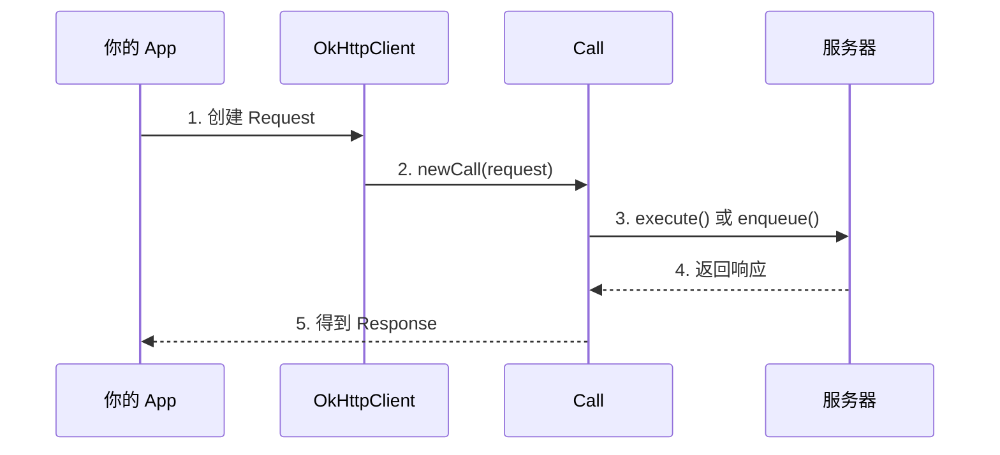

# OkHttp 基础篇

> 让你从"会用"到"用对" —— OkHttp 入门必备知识

## 一、技术演进：为什么需要 OkHttp？

### 1.1 远古时代：HttpURLConnection

在 OkHttp 出现之前，Android 开发者主要用 `HttpURLConnection`：

```kotlin
// HttpURLConnection 的"痛苦"写法
val url = URL("https://api.example.com/data")
val connection = url.openConnection() as HttpURLConnection
try {
    connection.requestMethod = "GET"
    connection.connectTimeout = 10000
    connection.readTimeout = 10000
    
    val responseCode = connection.responseCode
    if (responseCode == HttpURLConnection.HTTP_OK) {
        val inputStream = connection.inputStream
        val reader = BufferedReader(InputStreamReader(inputStream))
        val response = StringBuilder()
        var line: String?
        while (reader.readLine().also { line = it } != null) {
            response.append(line)
        }
        reader.close()
        // 终于拿到数据了...
    }
} finally {
    connection.disconnect()
}
```

**痛点太多了**：
- 代码冗长，一个简单请求要写一堆
- 不支持 HTTP/2
- 连接复用需要自己管理
- 没有自动重试机制
- 异步处理需要自己写线程

### 1.2 OkHttp 的诞生

2013 年，Square 公司开源了 OkHttp，一经推出就成为 Android 网络请求的标配。

**为什么能火？**
- **API 简洁**：几行代码搞定请求
- **性能强悍**：连接池复用、GZIP 压缩、HTTP/2 支持
- **功能完善**：重试、重定向、缓存一条龙
- **可扩展性强**：拦截器机制，想加什么功能就加什么

**重要里程碑**：Android 4.4 之后，`HttpURLConnection` 的底层实现就是 OkHttp！所以你用 HttpURLConnection，其实也在间接用 OkHttp。

## 二、核心概念

### 2.1 四大核心类

| 类名 | 作用 | 生活类比 |
|-----|------|---------|
| `OkHttpClient` | HTTP 客户端，发请求的"主角" | 快递公司 |
| `Request` | 请求信息（URL、方法、Header、Body） | 快递单 |
| `Call` | 一次请求的调用，可执行、可取消 | 一次快递任务 |
| `Response` | 响应信息（状态码、Header、Body） | 收到的包裹 |

### 2.2 工作流程



**用大白话说**：
1. 你填好快递单（Request）
2. 交给快递公司（OkHttpClient）
3. 快递公司派一个快递员（Call）去送
4. 快递员送达后带回签收单（Response）

## 三、GET 请求

### 3.1 同步请求

```kotlin
// 创建客户端（建议全局单例，复用连接池）
val client = OkHttpClient()

// 构建请求
val request = Request.Builder()
    .url("https://api.github.com/users/square")
    .build()

// 发起同步请求（会阻塞当前线程，不能在主线程调用！）
try {
    val response = client.newCall(request).execute()
    if (response.isSuccessful) {
        val body = response.body?.string()
        println("响应数据: $body")
    } else {
        println("请求失败: ${response.code}")
    }
} catch (e: IOException) {
    println("网络异常: ${e.message}")
}
```

**注意**：
- `execute()` 是同步方法，会阻塞线程
- **绝对不能在主线程调用**，否则会 ANR
- 需要自己开子线程或用协程

### 3.2 异步请求（推荐）

```kotlin
val client = OkHttpClient()

val request = Request.Builder()
    .url("https://api.github.com/users/square")
    .build()

// 异步请求，不阻塞当前线程
client.newCall(request).enqueue(object : Callback {
    override fun onFailure(call: Call, e: IOException) {
        // 请求失败（网络异常、超时等）
        // 注意：这里是子线程，不能直接更新 UI！
        println("请求失败: ${e.message}")
    }

    override fun onResponse(call: Call, response: Response) {
        // 请求成功（但可能是 404、500 等错误码）
        // 注意：这里也是子线程！
        if (response.isSuccessful) {
            val body = response.body?.string()
            println("响应数据: $body")
            
            // 如果需要更新 UI，要切回主线程
            // runOnUiThread { textView.text = body }
        } else {
            println("服务器返回错误: ${response.code}")
        }
    }
})
```

**重点提醒**：
- `enqueue()` 是异步方法，立即返回
- 回调方法都在**子线程**执行，更新 UI 要切回主线程
- `response.isSuccessful` 只表示 HTTP 状态码是 2xx

### 3.3 带参数的 GET 请求

```kotlin
// 方式一：手动拼接 URL（不推荐，特殊字符容易出问题）
val url1 = "https://api.example.com/search?keyword=android&page=1"

// 方式二：使用 HttpUrl.Builder（推荐，自动处理编码）
val url2 = HttpUrl.Builder()
    .scheme("https")
    .host("api.example.com")
    .addPathSegment("search")
    .addQueryParameter("keyword", "android 开发")  // 会自动 URL 编码
    .addQueryParameter("page", "1")
    .build()

val request = Request.Builder()
    .url(url2)
    .build()
```

## 四、POST 请求

### 4.1 POST 表单数据

```kotlin
// 构建表单请求体
val formBody = FormBody.Builder()
    .add("username", "zhangsan")
    .add("password", "123456")
    .build()

val request = Request.Builder()
    .url("https://api.example.com/login")
    .post(formBody)  // 自动设置 Content-Type: application/x-www-form-urlencoded
    .build()

client.newCall(request).enqueue(object : Callback {
    override fun onFailure(call: Call, e: IOException) {
        println("登录失败: ${e.message}")
    }

    override fun onResponse(call: Call, response: Response) {
        println("登录响应: ${response.body?.string()}")
    }
})
```

### 4.2 POST JSON 数据

```kotlin
// 定义 JSON 媒体类型
val JSON = "application/json; charset=utf-8".toMediaType()

// JSON 数据
val jsonData = """
    {
        "username": "zhangsan",
        "password": "123456"
    }
""".trimIndent()

// 创建请求体
val requestBody = jsonData.toRequestBody(JSON)

val request = Request.Builder()
    .url("https://api.example.com/login")
    .post(requestBody)
    .build()
```

### 4.3 POST 文件上传

```kotlin
// 上传单个文件
val file = File("/sdcard/photo.jpg")
val requestBody = file.asRequestBody("image/jpeg".toMediaType())

val request = Request.Builder()
    .url("https://api.example.com/upload")
    .post(requestBody)
    .build()
```

### 4.4 Multipart 表单（文件 + 文本混合）

```kotlin
// 构建 Multipart 请求体（既有文件又有普通字段）
val multipartBody = MultipartBody.Builder()
    .setType(MultipartBody.FORM)
    .addFormDataPart("username", "zhangsan")  // 普通字段
    .addFormDataPart("avatar", "photo.jpg",   // 文件字段
        File("/sdcard/photo.jpg").asRequestBody("image/jpeg".toMediaType()))
    .build()

val request = Request.Builder()
    .url("https://api.example.com/register")
    .post(multipartBody)
    .build()
```

## 五、请求配置

### 5.1 添加 Header

```kotlin
val request = Request.Builder()
    .url("https://api.example.com/data")
    .header("Authorization", "Bearer token123")  // 设置 Header（会覆盖同名）
    .addHeader("Accept", "application/json")     // 添加 Header（不会覆盖）
    .build()
```

**header() vs addHeader() 的区别**：
- `header(name, value)`：如果已存在同名 Header，会覆盖
- `addHeader(name, value)`：不会覆盖，允许多个同名 Header

### 5.2 配置超时

```kotlin
val client = OkHttpClient.Builder()
    .connectTimeout(10, TimeUnit.SECONDS)  // 连接超时
    .readTimeout(30, TimeUnit.SECONDS)     // 读取超时
    .writeTimeout(30, TimeUnit.SECONDS)    // 写入超时
    .callTimeout(60, TimeUnit.SECONDS)     // 整个调用超时（包括重试）
    .build()
```

**各种超时的区别**：

| 超时类型 | 含义 | 建议值 |
|---------|------|-------|
| connectTimeout | TCP 连接建立的超时 | 10-15 秒 |
| readTimeout | 读取服务器响应的超时 | 30 秒 |
| writeTimeout | 发送请求数据的超时 | 30 秒 |
| callTimeout | 整个请求过程的总超时 | 60 秒 |

### 5.3 取消请求

```kotlin
val call = client.newCall(request)
call.enqueue(callback)

// 用户点击取消按钮时
call.cancel()

// 检查是否已取消
if (call.isCanceled()) {
    println("请求已被取消")
}
```

**使用场景**：
- 用户离开页面时取消未完成的请求
- 下拉刷新时取消上一次的请求

## 六、Response 响应处理

### 6.1 响应信息

```kotlin
client.newCall(request).enqueue(object : Callback {
    override fun onResponse(call: Call, response: Response) {
        // 状态码
        val code = response.code           // 如 200、404、500
        val message = response.message     // 如 "OK"、"Not Found"
        
        // 是否成功（2xx）
        val isSuccessful = response.isSuccessful
        
        // 响应头
        val contentType = response.header("Content-Type")
        val allHeaders = response.headers
        
        // 响应体（只能读取一次！）
        val bodyString = response.body?.string()
        
        // 响应体的其他读取方式
        // response.body?.bytes()        // 字节数组
        // response.body?.byteStream()   // 输入流
        // response.body?.charStream()   // 字符流
    }
    
    override fun onFailure(call: Call, e: IOException) { }
})
```

### 6.2 注意：响应体只能读取一次！

```kotlin
// ❌ 错误写法
val body1 = response.body?.string()  // 第一次读取 OK
val body2 = response.body?.string()  // 第二次读取会得到空字符串！

// ✅ 正确写法：保存下来复用
val bodyString = response.body?.string()
// 之后都用 bodyString
```

**为什么只能读一次？**
因为 `body` 是流式数据，读取后流就关闭了。这样设计是为了节省内存，避免大文件一次性加载。

## 七、最佳实践

### 7.1 OkHttpClient 全局单例

```kotlin
// ✅ 正确：全局单例，复用连接池和线程池
object HttpClient {
    val instance: OkHttpClient by lazy {
        OkHttpClient.Builder()
            .connectTimeout(15, TimeUnit.SECONDS)
            .readTimeout(30, TimeUnit.SECONDS)
            .writeTimeout(30, TimeUnit.SECONDS)
            .build()
    }
}

// 使用
HttpClient.instance.newCall(request).enqueue(callback)
```

```kotlin
// ❌ 错误：每次都 new，浪费资源
fun request() {
    val client = OkHttpClient()  // 每次都创建新的，连接池无法复用
    client.newCall(request).enqueue(callback)
}
```

### 7.2 及时关闭 Response

```kotlin
// 使用 use 自动关闭（推荐）
response.body?.use { body ->
    val data = body.string()
    // 处理数据
}

// 或者手动关闭
try {
    val data = response.body?.string()
    // 处理数据
} finally {
    response.close()
}
```

### 7.3 结合协程使用

```kotlin
// 封装成挂起函数，配合协程使用更优雅
suspend fun fetchData(url: String): String = withContext(Dispatchers.IO) {
    val request = Request.Builder().url(url).build()
    
    HttpClient.instance.newCall(request).execute().use { response ->
        if (!response.isSuccessful) {
            throw IOException("请求失败: ${response.code}")
        }
        response.body?.string() ?: throw IOException("响应体为空")
    }
}

// 在 ViewModel 中使用
viewModelScope.launch {
    try {
        val data = fetchData("https://api.example.com/data")
        _uiState.value = UiState.Success(data)
    } catch (e: Exception) {
        _uiState.value = UiState.Error(e.message)
    }
}
```

## 八、横向对比

| 特性 | OkHttp | HttpURLConnection | Volley |
|-----|--------|-------------------|--------|
| **API 易用性** | ⭐⭐⭐⭐⭐ | ⭐⭐ | ⭐⭐⭐⭐ |
| **HTTP/2 支持** | ✅ | ❌ | ❌ |
| **连接复用** | 自动 | 手动 | 有限 |
| **拦截器** | 完善 | 无 | 有限 |
| **缓存** | 完善 | 手动 | 有 |
| **文件下载** | 原生支持 | 手动 | 需要额外处理 |
| **适用场景** | 通用 | 简单场景 | 频繁小请求 |

**选择建议**：
- **新项目首选 OkHttp**（或 Retrofit + OkHttp）
- 只是做简单请求，Volley 也不错
- HttpURLConnection 除非有特殊需求，否则不推荐

## 九、常见问题 FAQ

### Q1: 为什么请求回调不在主线程？

**答**：设计如此。网络请求本身在子线程执行，回调也在子线程返回，避免不必要的线程切换开销。如果需要更新 UI，用 `runOnUiThread` 或 `Handler` 切回主线程。

### Q2: 能否复用 Call 对象？

**答**：不能！一个 Call 对象只能 execute() 或 enqueue() **一次**。需要再次请求，要重新 `client.newCall(request)`。

### Q3: response.body?.string() 和 response.body?.bytes() 的区别？

**答**：
- `string()`：将响应体解析为字符串，适合 JSON、HTML 等文本数据
- `bytes()`：返回原始字节数组，适合小型二进制数据
- `byteStream()`：返回输入流，适合大文件下载，边读边处理

## 十、面试题自测

### 基础题（检验是否理解基本概念）

**Q1: OkHttp 的同步请求和异步请求有什么区别？分别在什么场景使用？**

<details>
<summary>查看答案</summary>

**结论**：同步请求阻塞当前线程，异步请求不阻塞。

**原理**：
- `execute()`：在当前线程执行，直到响应返回或超时才继续执行后续代码
- `enqueue()`：将请求加入队列，由 OkHttp 内部线程池执行，通过回调返回结果

**使用场景**：
- 同步请求：已经在子线程中（如协程的 IO 调度器）、需要严格控制执行顺序
- 异步请求：在主线程发起请求、不关心执行顺序

</details>

**Q2: 为什么 OkHttpClient 建议全局单例？**

<details>
<summary>查看答案</summary>

**结论**：单例可以复用连接池和线程池，提升性能。

**原理**：
- OkHttpClient 内部维护了**连接池**（ConnectionPool），复用 TCP 连接可以减少握手开销
- 内部还有**线程池**（Dispatcher），管理异步请求的执行
- 每次 new OkHttpClient() 都会创建新的连接池和线程池，浪费资源且无法复用

**最佳实践**：使用单例或依赖注入（如 Hilt）确保全局只有一个实例。

</details>

**Q3: 如何取消一个正在进行的请求？取消后会有什么影响？**

<details>
<summary>查看答案</summary>

**结论**：调用 `call.cancel()` 取消请求。

**影响**：
- 如果请求还在排队，直接移除
- 如果正在执行，中断连接
- 异步请求的 `onFailure` 会被回调，`e` 是 `IOException`
- 同步请求的 `execute()` 会抛出 `IOException`

**实际应用**：
```kotlin
// Activity 销毁时取消所有请求
override fun onDestroy() {
    super.onDestroy()
    currentCall?.cancel()
}
```

</details>

---

_下一篇：[2-进阶篇](2-进阶篇.md) —— 拦截器、缓存、性能优化_
