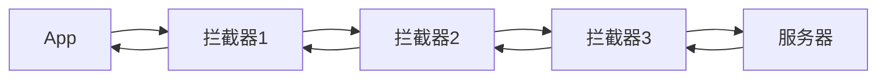
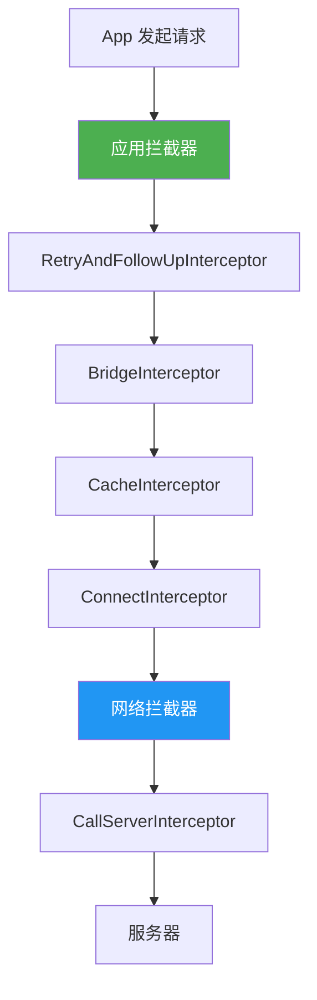

# OkHttp 进阶篇

> 让你从"会用"到"用好" —— 拦截器、缓存、性能优化全攻略

## 一、拦截器机制

### 1.1 什么是拦截器？

**一句话理解**：拦截器就像高速公路上的**收费站**，请求出去要过一道，响应回来又要过一道。你可以在这里检查、修改、记录请求和响应。



### 1.2 拦截器的典型用途

| 用途 | 说明 |
|-----|------|
| 统一添加 Header | Token、User-Agent、版本号 |
| 日志打印 | 记录请求和响应信息 |
| 缓存控制 | 自定义缓存策略 |
| 请求重试 | 失败后自动重试 |
| 数据加解密 | 请求加密、响应解密 |
| 统一错误处理 | 处理 401、403 等错误 |

### 1.3 自定义拦截器

```kotlin
/**
 * 通用 Header 拦截器
 * 自动为所有请求添加公共 Header
 */
class CommonHeaderInterceptor : Interceptor {
    override fun intercept(chain: Interceptor.Chain): Response {
        // 1. 获取原始请求
        val originalRequest = chain.request()

        // 2. 添加公共 Header，构建新请求
        val newRequest = originalRequest.newBuilder()
            .header("Authorization", "Bearer ${TokenManager.getToken()}")
            .header("User-Agent", "MyApp/1.0.0")
            .header("Accept-Language", "zh-CN")
            .build()

        // 3. 继续执行请求链
        return chain.proceed(newRequest)
    }
}

// 使用
val client = OkHttpClient.Builder()
    .addInterceptor(CommonHeaderInterceptor())
    .build()
```

### 1.4 日志拦截器

```kotlin
/**
 * 日志拦截器
 * 打印请求和响应的详细信息
 */
class LoggingInterceptor : Interceptor {
    override fun intercept(chain: Interceptor.Chain): Response {
        val request = chain.request()

        // 请求前打印
        val startTime = System.nanoTime()
        Log.d("OkHttp", "┌──────────────────────────────────")
        Log.d("OkHttp", "│ ${request.method} ${request.url}")
        Log.d("OkHttp", "│ Headers: ${request.headers}")

        // 执行请求
        val response = chain.proceed(request)

        // 响应后打印
        val duration = (System.nanoTime() - startTime) / 1_000_000
        Log.d("OkHttp", "│ Response: ${response.code} (${duration}ms)")
        Log.d("OkHttp", "└──────────────────────────────────")

        return response
    }
}
```

> **推荐**：实际项目建议使用官方的 `HttpLoggingInterceptor`，功能更完善：
> ```kotlin
> val logging = HttpLoggingInterceptor().apply {
>     level = HttpLoggingInterceptor.Level.BODY  // 打印请求体和响应体
> }
> client.addInterceptor(logging)
> ```

### 1.5 应用拦截器 vs 网络拦截器

OkHttp 有两种添加拦截器的方式：

```kotlin
val client = OkHttpClient.Builder()
    .addInterceptor(interceptor1)        // 应用拦截器
    .addNetworkInterceptor(interceptor2) // 网络拦截器
    .build()
```

**它们的区别**：

| 特性 | 应用拦截器 | 网络拦截器 |
|-----|-----------|-----------|
| 添加方式 | `addInterceptor()` | `addNetworkInterceptor()` |
| 执行时机 | 最先执行 | 靠近网络层执行 |
| 能否看到重定向 | ❌ 只看到最终请求 | ✅ 每次请求都会执行 |
| 能否看到重试 | ❌ 只执行一次 | ✅ 每次重试都会执行 |
| 能否访问 Connection | ❌ | ✅ |
| 缓存响应 | ✅ 能拦截 | ❌ 缓存命中时不执行 |

**选择建议**：
- **日志打印**：用应用拦截器（只打印一次，不会因重试打印多次）
- **添加 Header**：用应用拦截器（确保每个请求都有）
- **网络监控**：用网络拦截器（能看到真实网络情况）



## 二、连接池复用

### 2.1 为什么要连接复用？

**建立一次 TCP 连接的代价**：
1. DNS 解析：查询域名对应的 IP
2. TCP 三次握手：建立可靠连接
3. TLS 握手（HTTPS）：协商加密算法

这一套下来，可能要花 **100-500ms**，如果每次请求都重新建连，用户体验会很差。

**连接复用**就像小区门口的快递柜：快递员不用每次都按门铃等你开门，放柜子里你自己取就行。

### 2.2 连接池配置

```kotlin
val client = OkHttpClient.Builder()
    .connectionPool(ConnectionPool(
        maxIdleConnections = 5,  // 最多保持 5 个空闲连接
        keepAliveDuration = 5,   // 空闲连接存活 5 分钟
        TimeUnit.MINUTES
    ))
    .build()
```

**默认值**：
- `maxIdleConnections = 5`
- `keepAliveDuration = 5 分钟`

**什么时候需要调整？**
- 请求服务器比较单一（如只请求自家 API）：可以减少 `maxIdleConnections`
- 请求频繁：可以增加 `keepAliveDuration`

### 2.3 HTTP/2 多路复用

OkHttp 自动支持 HTTP/2 协议，相比 HTTP/1.1 的连接复用更强大：

| 特性 | HTTP/1.1 | HTTP/2 |
|-----|----------|--------|
| 一个连接同时处理 | 1 个请求 | **多个请求** |
| 头部压缩 | ❌ | ✅ HPACK |
| 服务器推送 | ❌ | ✅ |

**简单说**：HTTP/1.1 的连接复用是"排队用"，HTTP/2 是"一起用"。

## 三、缓存策略

### 3.1 HTTP 缓存基础

HTTP 缓存由服务器通过响应头控制：

| Header | 作用 | 示例 |
|--------|-----|------|
| `Cache-Control` | 缓存策略 | `max-age=3600` |
| `ETag` | 资源标识 | `"abc123"` |
| `Last-Modified` | 最后修改时间 | `Wed, 15 Nov 2023 12:00:00 GMT` |
| `Expires` | 过期时间 | `Wed, 15 Nov 2023 13:00:00 GMT` |

### 3.2 OkHttp 缓存配置

```kotlin
// 设置缓存目录和大小
val cacheDir = File(context.cacheDir, "okhttp_cache")
val cacheSize = 10L * 1024 * 1024  // 10 MB

val client = OkHttpClient.Builder()
    .cache(Cache(cacheDir, cacheSize))
    .build()
```

### 3.3 强制使用缓存

```kotlin
// 强制只用缓存（无网络时使用）
val request = Request.Builder()
    .url("https://api.example.com/data")
    .cacheControl(CacheControl.FORCE_CACHE)
    .build()

// 强制不用缓存（获取最新数据）
val request2 = Request.Builder()
    .url("https://api.example.com/data")
    .cacheControl(CacheControl.FORCE_NETWORK)
    .build()

// 自定义缓存策略
val cacheControl = CacheControl.Builder()
    .maxAge(1, TimeUnit.HOURS)    // 最多使用 1 小时内的缓存
    .maxStale(1, TimeUnit.DAYS)   // 过期后最多再用 1 天
    .build()

val request3 = Request.Builder()
    .url("https://api.example.com/data")
    .cacheControl(cacheControl)
    .build()
```

### 3.4 缓存拦截器（强制缓存）

有些服务器不返回缓存头，但我们想强制缓存，可以用拦截器：

```kotlin
/**
 * 强制缓存拦截器
 * 即使服务器没有返回缓存头，也强制缓存响应
 */
class ForceCacheInterceptor : Interceptor {
    override fun intercept(chain: Interceptor.Chain): Response {
        val response = chain.proceed(chain.request())

        // 强制设置缓存头
        return response.newBuilder()
            .removeHeader("Pragma")  // 移除可能干扰缓存的头
            .removeHeader("Cache-Control")
            .header("Cache-Control", "public, max-age=3600")  // 缓存 1 小时
            .build()
    }
}

// 作为网络拦截器添加（这样才能修改服务器返回的响应）
val client = OkHttpClient.Builder()
    .cache(Cache(cacheDir, cacheSize))
    .addNetworkInterceptor(ForceCacheInterceptor())
    .build()
```

## 四、文件上传与下载

### 4.1 带进度的文件上传

```kotlin
/**
 * 带进度监听的 RequestBody
 */
class ProgressRequestBody(
    private val delegate: RequestBody,
    private val listener: (bytesWritten: Long, totalBytes: Long) -> Unit
) : RequestBody() {

    override fun contentType() = delegate.contentType()

    override fun contentLength() = delegate.contentLength()

    override fun writeTo(sink: BufferedSink) {
        val totalBytes = contentLength()
        var bytesWritten = 0L

        // 包装 Sink，拦截写入操作
        val countingSink = object : ForwardingSink(sink) {
            override fun write(source: Buffer, byteCount: Long) {
                super.write(source, byteCount)
                bytesWritten += byteCount
                listener(bytesWritten, totalBytes)
            }
        }

        val bufferedSink = countingSink.buffer()
        delegate.writeTo(bufferedSink)
        bufferedSink.flush()
    }
}

// 使用
val file = File("/sdcard/video.mp4")
val requestBody = file.asRequestBody("video/mp4".toMediaType())

val progressBody = ProgressRequestBody(requestBody) { written, total ->
    val progress = (written * 100 / total).toInt()
    Log.d("Upload", "上传进度: $progress%")
    // 更新 UI（记得切到主线程）
}

val request = Request.Builder()
    .url("https://api.example.com/upload")
    .post(progressBody)
    .build()
```

### 4.2 带进度的文件下载

```kotlin
/**
 * 带进度监听的 ResponseBody
 */
class ProgressResponseBody(
    private val delegate: ResponseBody,
    private val listener: (bytesRead: Long, totalBytes: Long) -> Unit
) : ResponseBody() {

    private var bufferedSource: BufferedSource? = null

    override fun contentType() = delegate.contentType()

    override fun contentLength() = delegate.contentLength()

    override fun source(): BufferedSource {
        if (bufferedSource == null) {
            bufferedSource = createProgressSource(delegate.source()).buffer()
        }
        return bufferedSource!!
    }

    private fun createProgressSource(source: Source): Source {
        return object : ForwardingSource(source) {
            var totalBytesRead = 0L

            override fun read(sink: Buffer, byteCount: Long): Long {
                val bytesRead = super.read(sink, byteCount)
                totalBytesRead += if (bytesRead != -1L) bytesRead else 0
                listener(totalBytesRead, contentLength())
                return bytesRead
            }
        }
    }
}

/**
 * 下载进度拦截器
 */
class DownloadProgressInterceptor(
    private val listener: (bytesRead: Long, totalBytes: Long) -> Unit
) : Interceptor {
    override fun intercept(chain: Interceptor.Chain): Response {
        val response = chain.proceed(chain.request())
        return response.newBuilder()
            .body(ProgressResponseBody(response.body!!, listener))
            .build()
    }
}

// 使用
val client = OkHttpClient.Builder()
    .addNetworkInterceptor(DownloadProgressInterceptor { read, total ->
        val progress = (read * 100 / total).toInt()
        Log.d("Download", "下载进度: $progress%")
    })
    .build()
```

### 4.3 断点续传

```kotlin
/**
 * 断点续传下载
 * @param url 下载地址
 * @param file 保存文件
 * @param startPosition 起始位置（已下载的字节数）
 */
suspend fun downloadWithResume(
    url: String,
    file: File,
    startPosition: Long = 0
) = withContext(Dispatchers.IO) {

    val request = Request.Builder()
        .url(url)
        .header("Range", "bytes=$startPosition-")  // 关键：指定起始位置
        .build()

    client.newCall(request).execute().use { response ->
        // 206 表示部分内容（断点续传成功）
        if (response.code != 206 && response.code != 200) {
            throw IOException("下载失败: ${response.code}")
        }

        // 追加模式写入文件
        val outputStream = FileOutputStream(file, startPosition > 0)
        response.body?.byteStream()?.use { input ->
            input.copyTo(outputStream)
        }
    }
}
```

## 五、Cookie 管理

### 5.1 自动管理 Cookie

```kotlin
/**
 * 内存中的 Cookie 管理器
 * Cookie 会在 App 重启后丢失
 */
class InMemoryCookieJar : CookieJar {
    private val cookieStore = mutableMapOf<String, List<Cookie>>()

    override fun saveFromResponse(url: HttpUrl, cookies: List<Cookie>) {
        // 按域名保存 Cookie
        cookieStore[url.host] = cookies
    }

    override fun loadForRequest(url: HttpUrl): List<Cookie> {
        // 按域名加载 Cookie
        return cookieStore[url.host] ?: emptyList()
    }
}

val client = OkHttpClient.Builder()
    .cookieJar(InMemoryCookieJar())
    .build()
```

### 5.2 持久化 Cookie（使用 SharedPreferences）

```kotlin
/**
 * 持久化 Cookie 管理器
 * Cookie 保存在 SharedPreferences，App 重启后仍然有效
 */
class PersistentCookieJar(context: Context) : CookieJar {

    private val prefs = context.getSharedPreferences("cookies", Context.MODE_PRIVATE)

    override fun saveFromResponse(url: HttpUrl, cookies: List<Cookie>) {
        val cookieStrings = cookies.map { it.toString() }.toSet()
        prefs.edit().putStringSet(url.host, cookieStrings).apply()
    }

    override fun loadForRequest(url: HttpUrl): List<Cookie> {
        val cookieStrings = prefs.getStringSet(url.host, emptySet()) ?: emptySet()
        return cookieStrings.mapNotNull { Cookie.parse(url, it) }
    }

    fun clearAllCookies() {
        prefs.edit().clear().apply()
    }
}
```

## 六、HTTPS 与证书

### 6.1 信任自签名证书（开发环境）

```kotlin
/**
 * 信任所有证书（仅用于开发环境！生产环境绝对不要用！）
 */
fun getUnsafeOkHttpClient(): OkHttpClient {
    val trustAllCerts = arrayOf<TrustManager>(object : X509TrustManager {
        override fun checkClientTrusted(chain: Array<X509Certificate>, authType: String) {}
        override fun checkServerTrusted(chain: Array<X509Certificate>, authType: String) {}
        override fun getAcceptedIssuers(): Array<X509Certificate> = arrayOf()
    })

    val sslContext = SSLContext.getInstance("SSL").apply {
        init(null, trustAllCerts, SecureRandom())
    }

    return OkHttpClient.Builder()
        .sslSocketFactory(sslContext.socketFactory, trustAllCerts[0] as X509TrustManager)
        .hostnameVerifier { _, _ -> true }  // 不验证主机名
        .build()
}
```

> ⚠️ **警告**：上面的代码**绝对不能**在生产环境使用！会导致中间人攻击。

### 6.2 证书锁定（Certificate Pinning）

```kotlin
/**
 * 证书锁定：只信任特定证书，防止中间人攻击
 * 即使攻击者有合法的 CA 签发的证书，也无法通过验证
 */
val certificatePinner = CertificatePinner.Builder()
    .add(
        "api.example.com",
        "sha256/AAAAAAAAAAAAAAAAAAAAAAAAAAAAAAAAAAAAAAAAAAA="  // 证书的 SHA256 指纹
    )
    .build()

val client = OkHttpClient.Builder()
    .certificatePinner(certificatePinner)
    .build()
```

**如何获取证书指纹？**
```bash
# 通过 openssl 获取
openssl s_client -connect api.example.com:443 | openssl x509 -pubkey -noout | openssl pkey -pubin -outform der | openssl dgst -sha256 -binary | openssl enc -base64
```

## 七、请求重试与重定向

### 7.1 自动重试

OkHttp 默认会自动重试某些失败的请求，但你可以配置：

```kotlin
val client = OkHttpClient.Builder()
    .retryOnConnectionFailure(true)  // 默认 true，连接失败时自动重试
    .build()
```

### 7.2 自定义重试拦截器

```kotlin
/**
 * 自定义重试拦截器
 * 支持指定重试次数和重试间隔
 */
class RetryInterceptor(
    private val maxRetries: Int = 3,
    private val retryDelayMs: Long = 1000
) : Interceptor {

    override fun intercept(chain: Interceptor.Chain): Response {
        var request = chain.request()
        var response: Response? = null
        var exception: IOException? = null

        for (attempt in 0..maxRetries) {
            try {
                response = chain.proceed(request)

                // 如果成功（2xx）或者是客户端错误（4xx），不重试
                if (response.isSuccessful || response.code in 400..499) {
                    return response
                }

                // 服务器错误（5xx）可以重试
                response.close()

            } catch (e: IOException) {
                exception = e
                Log.w("Retry", "请求失败，第 ${attempt + 1} 次重试: ${e.message}")
            }

            if (attempt < maxRetries) {
                Thread.sleep(retryDelayMs * (attempt + 1))  // 指数退避
            }
        }

        throw exception ?: IOException("重试 $maxRetries 次后仍然失败")
    }
}
```

### 7.3 重定向控制

```kotlin
val client = OkHttpClient.Builder()
    .followRedirects(true)      // 是否跟随 HTTP 重定向（默认 true）
    .followSslRedirects(true)   // 是否跟随 HTTPS→HTTP 的重定向（默认 true）
    .build()
```

## 八、WebSocket 支持

OkHttp 原生支持 WebSocket，适合实时通讯场景：

```kotlin
val client = OkHttpClient()

val request = Request.Builder()
    .url("wss://echo.websocket.org")
    .build()

val webSocket = client.newWebSocket(request, object : WebSocketListener() {
    override fun onOpen(webSocket: WebSocket, response: Response) {
        Log.d("WebSocket", "连接成功")
        webSocket.send("Hello, WebSocket!")
    }

    override fun onMessage(webSocket: WebSocket, text: String) {
        Log.d("WebSocket", "收到消息: $text")
    }

    override fun onMessage(webSocket: WebSocket, bytes: ByteString) {
        Log.d("WebSocket", "收到二进制消息: ${bytes.hex()}")
    }

    override fun onClosing(webSocket: WebSocket, code: Int, reason: String) {
        Log.d("WebSocket", "连接关闭中: $code $reason")
        webSocket.close(1000, null)
    }

    override fun onFailure(webSocket: WebSocket, t: Throwable, response: Response?) {
        Log.e("WebSocket", "连接失败: ${t.message}")
    }
})

// 发送消息
webSocket.send("Hello!")

// 关闭连接
webSocket.close(1000, "正常关闭")
```

## 九、边界认知：OkHttp 不适合的场景

| 场景 | 问题 | 替代方案 |
|-----|------|---------|
| **复杂 RESTful API** | 需要手动拼装 URL、解析 JSON | **Retrofit**（基于 OkHttp） |
| **图片加载** | 没有内存缓存、不支持变换 | **Glide / Coil** |
| **大文件下载** | 需要自己处理断点、通知 | **DownloadManager** |
| **GraphQL** | 需要自己构建查询语法 | **Apollo Kotlin** |
| **实时双向通讯** | WebSocket 够用，但不如专业库 | **Socket.IO** |

## 十、性能优化清单

| 优化项 | 做法 | 效果 |
|-------|------|------|
| **单例客户端** | 全局只创建一个 OkHttpClient | 复用连接池 |
| **合理配置超时** | 根据业务设置合理超时 | 快速失败 |
| **启用缓存** | 配置 Cache | 减少网络请求 |
| **压缩请求** | 服务端支持的话启用 GZIP | 减少传输量 |
| **使用 HTTP/2** | OkHttp 自动协商 | 多路复用 |
| **预连接** | 提前连接常用服务器 | 减少首次请求延迟 |

```kotlin
// 预连接（提前建立 TCP 连接）
val client = OkHttpClient()
val url = "https://api.example.com".toHttpUrl()

// 预连接，不发送实际请求
client.connectionPool.evictAll()  // 清空旧连接
val request = Request.Builder().url(url).build()
// 在 App 启动时异步执行一次请求，建立连接
```

## 十一、面试题自测

### 进阶题（检验是否有实战能力）

**Q1: 应用拦截器和网络拦截器有什么区别？分别适合什么场景？**

<details>
<summary>查看答案</summary>

**结论**：执行时机和可见范围不同。

| 对比项 | 应用拦截器 | 网络拦截器 |
|-------|-----------|-----------|
| 执行时机 | 最先/最后 | 靠近网络 |
| 重定向/重试 | 只执行一次 | 每次都执行 |
| 缓存命中 | 会执行 | 不执行 |
| 能访问 Connection | 否 | 是 |

**场景选择**：
- 应用拦截器：日志（只打一次）、统一 Header、统一错误处理
- 网络拦截器：网络监控、修改缓存头、真实网络耗时统计

</details>

**Q2: OkHttp 的缓存机制是怎样的？如何强制使用缓存？**

<details>
<summary>查看答案</summary>

**结论**：遵循 HTTP 缓存规范，通过 CacheControl 控制。

**缓存机制**：
1. 配置 Cache 目录和大小
2. 根据响应头（Cache-Control、ETag、Last-Modified）决定是否缓存
3. 请求时先检查缓存，命中则直接返回

**强制使用缓存**：
```kotlin
// 强制缓存（无网络时使用）
request.cacheControl(CacheControl.FORCE_CACHE)

// 强制网络（获取最新）
request.cacheControl(CacheControl.FORCE_NETWORK)
```

**服务器不返回缓存头时**：用网络拦截器强制添加 Cache-Control 响应头。

</details>

**Q3: 如何实现带进度的文件上传/下载？**

<details>
<summary>查看答案</summary>

**结论**：自定义 RequestBody/ResponseBody，重写 writeTo()/source() 方法。

**上传**：继承 RequestBody，在 writeTo() 中包装 Sink，拦截 write() 方法统计已写入字节数。

**下载**：继承 ResponseBody，在 source() 中包装 Source，拦截 read() 方法统计已读取字节数。

**关键点**：
- 回调在子线程，更新 UI 需要切换线程
- 上传用应用拦截器，下载用网络拦截器

</details>

**Q4: 如何实现请求失败后的自动重试？**

<details>
<summary>查看答案</summary>

**结论**：OkHttp 默认有连接失败重试，但可通过拦截器实现更复杂的重试策略。

**实现要点**：
```kotlin
class RetryInterceptor(private val maxRetries: Int) : Interceptor {
    override fun intercept(chain: Chain): Response {
        var exception: IOException? = null
        for (i in 0..maxRetries) {
            try {
                val response = chain.proceed(chain.request())
                if (response.isSuccessful) return response
                response.close()  // 不成功要关闭
            } catch (e: IOException) {
                exception = e
            }
            Thread.sleep(1000L * (i + 1))  // 指数退避
        }
        throw exception ?: IOException("重试失败")
    }
}
```

**注意**：
- 幂等请求（GET）可以安全重试
- 非幂等请求（POST）要谨慎，可能导致重复提交

</details>

**Q5: 如何在 OkHttp 中实现证书锁定（Certificate Pinning）？为什么需要它？**

<details>
<summary>查看答案</summary>

**结论**：使用 CertificatePinner，防止中间人攻击。

**为什么需要**：
- 普通 HTTPS 只验证证书是否由受信 CA 签发
- 如果攻击者获得了某个 CA 的签发能力，可以签发合法证书进行中间人攻击
- 证书锁定只信任特定的证书指纹，即使有合法证书也无法通过

**实现**：
```kotlin
val pinner = CertificatePinner.Builder()
    .add("api.example.com", "sha256/xxx...")
    .build()
client.certificatePinner(pinner)
```

**注意**：证书过期更新时需要同步更新 App 中的指纹，建议配置备用指纹。

</details>

---

_下一篇：[3-源码篇](3-源码篇.md) —— 责任链模式、五大拦截器源码分析_
